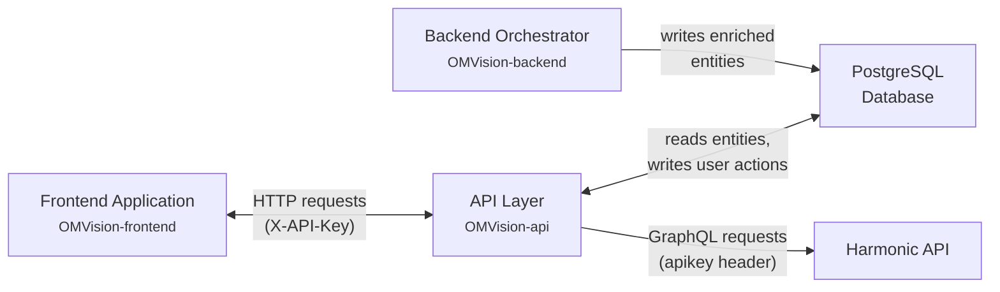
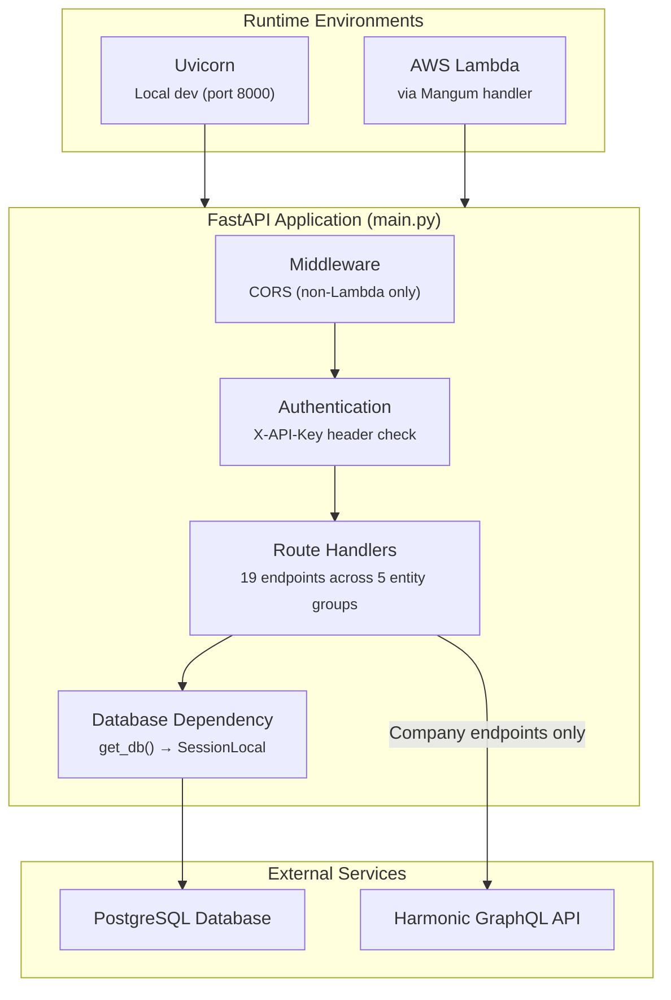
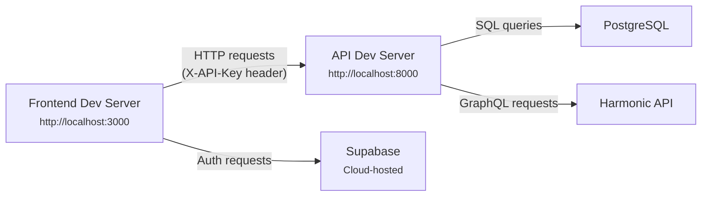
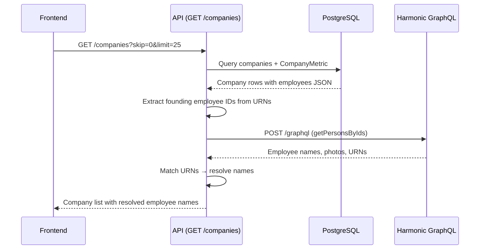
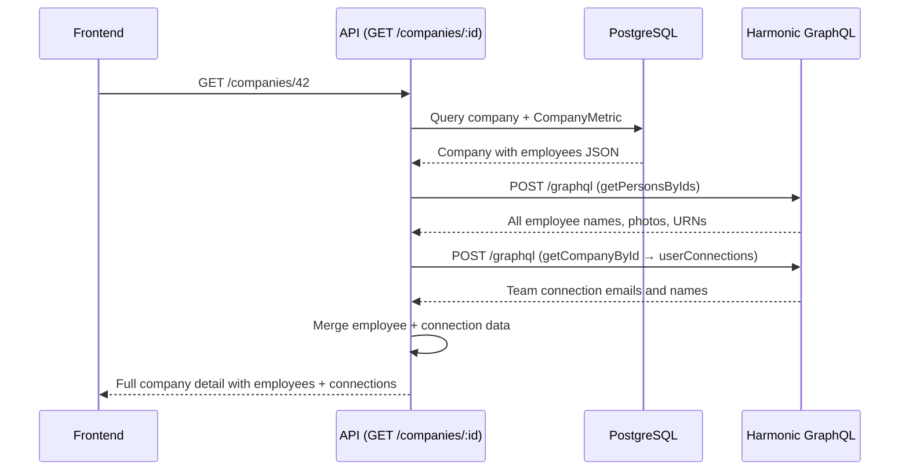
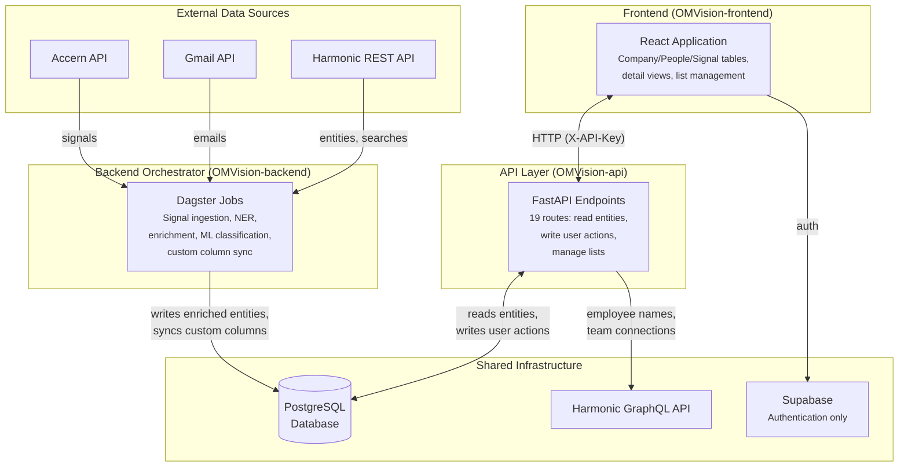
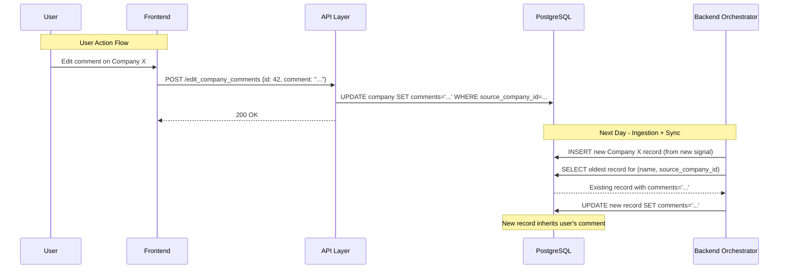

# OMVision API Developer Documentation

## 1. System Overview

The OMVision API is a FastAPI application that serves as the data access layer between the OMVision frontend and the shared PostgreSQL database. It exposes RESTful endpoints for reading deal flow entities (companies, people, signals, searches) and writing user actions (editing comments, changing deal flow stages, hiding entities, managing lists). In addition to database operations, the API makes outbound requests to the Harmonic GraphQL API to enrich company data with employee names and team connections at read time.

This documentation provides technical context for engineers maintaining and extending the API. The following sections introduce the API's role within the broader OMVision ecosystem, its architecture, the components it comprises, and its technology stack. Implementation details are covered in subsequent sections (§2–§7).

---

### 1.1 Purpose & Role in OMVision Ecosystem

OMVision consists of three separate codebases that work together as a system:

1. **Backend Orchestrator** (`OMVision-backend`): A Dagster-based data pipeline that ingests signals from external sources (Accern, Gmail, Harmonic), extracts and enriches company and people entities, applies ML classification, and writes results to a PostgreSQL database. Documented in the Backend Developer Documentation (§1–§8).

2. **API Layer** (`OMVision-api`): This application. A FastAPI service that exposes the PostgreSQL database to the frontend via HTTP endpoints. It handles both read operations (querying companies, people, signals, searches, and lists) and write operations (user-initiated actions like editing comments, changing deal flow stages, hiding entities, and managing list memberships).

3. **Frontend Application** (`OMVision-frontend`): A React single-page application that renders deal flow data for the investment team. It communicates exclusively with the API layer — it does not access the database directly. Documented in the Frontend Developer Documentation (§1–§7).

**How the Three Repositories Connect**

The PostgreSQL database is the integration point between the backend orchestrator and the API. Both connect to the same database instance, but they serve different roles:



The backend orchestrator writes to the database on automated schedules (ingesting signals, extracting entities, enriching data, running ML classification). The API reads from the database to serve entity data to the frontend, and writes back to the database when users perform actions (editing a comment, changing a deal flow stage, hiding an entity, or modifying list memberships). The frontend communicates only with the API over HTTP — it has no direct database access.

The API also makes outbound HTTP requests to the Harmonic GraphQL API (`https://api.harmonic.ai/graphql`) from within the company endpoints to resolve employee names and team connections at read time. This is documented in detail in §6.

**The API's Specific Responsibilities**

The API is responsible for:

- **Serving entity data**: Querying companies, people, signals, and searches from the database with support for pagination, filtering by name, source name, date, and list membership
- **Enriching company data at read time**: Making outbound GraphQL requests to Harmonic to resolve founding employee names (in `GET /companies`) and full employee details plus team connections (in `GET /companies/:id`)
- **Persisting user actions**: Writing comments, deal flow stage changes, and hidden-entity flags back to the database when users interact with the frontend
- **Managing lists**: Creating, deleting, and modifying entity list memberships (adding/removing companies or people from user-created lists)
- **Authenticating requests**: Validating the `X-API-Key` header on every request against a configured API key

The API does **not** perform any data ingestion, entity extraction, NER processing, enrichment from external sources (other than Harmonic employee lookups), or ML classification. Those responsibilities belong entirely to the backend orchestrator.

---

### 1.2 High-Level Architecture

The API follows a standard FastAPI application pattern: a single `main.py` entry point that creates the FastAPI app, registers route modules, configures middleware, and sets up a Mangum handler for AWS Lambda compatibility. Database access is managed through SQLAlchemy with a session-per-request dependency pattern.



**Dual Runtime**

The application is designed to run in two environments:

- **Local development**: The `if __name__ == "__main__"` block at the bottom of `main.py` starts a Uvicorn server on `0.0.0.0:8000`. CORS middleware is enabled with permissive settings (`allow_origins=["*"]`) when the `AWS_LAMBDA_FUNCTION_NAME` environment variable is not set.
- **Production (AWS Lambda)**: The `handler = Mangum(app)` line in `main.py` creates a Mangum adapter that wraps the FastAPI ASGI application for execution as an AWS Lambda function. When running in Lambda, the `is_lambda` flag is `True` (detected via the `AWS_LAMBDA_FUNCTION_NAME` environment variable), and CORS middleware is not applied by the application itself (CORS is handled at the API Gateway or load balancer level in production). The `Dockerfile` in the repository builds an image that runs the application via Uvicorn (`CMD ["uvicorn", "main:app", "--host", "0.0.0.0", "--port", "8000"]`).

**Request Lifecycle**

When the frontend makes a request (for example, `GET /companies?skip=0&limit=25`):

1. The request arrives at the FastAPI application (via Uvicorn locally or Mangum in Lambda)
2. FastAPI's dependency injection system resolves the `get_current_user` dependency, which extracts the `X-API-Key` header and validates it against `settings.api_key` (from `auth.py`). If the key is invalid, a 403 response is returned.
3. The `get_db` dependency creates a SQLAlchemy database session (`SessionLocal()` from `database.py`)
4. The route handler executes: querying the database, optionally making outbound Harmonic API calls, and assembling the response
5. The database session is closed (via the `finally` block in `get_db`)
6. The response is serialized to JSON and returned to the frontend

**Swagger UI**

The root path (`/`) redirects to `/docs`, which serves FastAPI's built-in Swagger UI. The Swagger UI is configured with `displayRequestDuration: True` (set in the `FastAPI()` constructor in `main.py`), which shows the time each request takes to complete.

---

### 1.3 Key Components Summary

The API codebase is organized into a small number of modules, each with a specific responsibility:

**Application Entry Point**

- **`main.py`**: Creates the FastAPI application instance, registers the Mangum Lambda handler, conditionally applies CORS middleware, defines the root redirect to `/docs`, and registers all 19 route handlers from the `routes/` directory.

**Configuration & Infrastructure**

- **`config.py`**: Defines the `Settings` class using `pydantic-settings`, which loads environment variables from a `.env` file. The settings include database connection parameters (`database_hostname`, `database_port`, `database_password`, `database_name`, `database_username`), the API authentication key (`api_key`), and the Harmonic API key (`harmonic_api_key`).
- **`auth.py`**: Defines the `get_current_user` FastAPI dependency, which extracts the `X-API-Key` header using `APIKeyHeader` from `fastapi.security` and compares it against `settings.api_key`. Returns `True` if the key matches, raises `HTTPException(status_code=403)` if not.
- **`database.py`**: Creates the SQLAlchemy engine and `SessionLocal` session factory from the database connection string (constructed from `settings`). Exports the `Base` declarative base class for model definitions and the `get_db` dependency that yields a session per request and closes it after use.

**Data Models**

- **`models.py`**: Defines SQLAlchemy ORM models for all database tables: `Source`, `Search`, `Signal`, `Company`, `CompanyMetric`, `Person`, `List`, `ListEntityAssociation`, and the `person_company_association` many-to-many table. These models map to the same database tables used by the backend orchestrator, but are defined separately in this repository.

**Route Handlers**

Routes are organized into five groups under the `routes/` directory, with each file defining a single `APIRouter` and one endpoint:

| Route Group | Files | Endpoints |
|---|---|---|
| `routes/company/` | `all_company.py`, `company_by_id.py`, `hide_companies.py`, `edit_company_comment.py`, `edit_company_relevance.py` | `GET /companies`, `GET /companies/:id`, `POST /companies/hide`, `POST /edit_company_comments`, `POST /edit_company_relevence` |
| `routes/people/` | `all_people.py`, `people_by_id.py`, `hide_people.py`, `edit_person_comment.py`, `edit_person_relevance.py` | `GET /people`, `GET /peoples/:id`, `POST /peoples/hide`, `POST /edit_person_comments`, `POST /edit_person_relevence` |
| `routes/signals/` | `all_signals.py`, `signal_by_id.py` | `GET /signals`, `GET /signals/:id` |
| `routes/search/` | `all_search.py`, `search_by_id.py` | `GET /searches`, `GET /searches/:id` |
| `routes/list/` | `get_all_lists.py`, `get_all_entities_by_list.py`, `create_list.py`, `delete_list.py`, `modify_entities_in_list.py` | `GET /lists`, `GET /lists/:id/entities`, `POST /lists`, `POST /delete_lists/:id`, `POST /lists/:id/modify` |

**Supporting Files**

- **`Dockerfile`**: Builds a Python 3.11-slim image, installs dependencies from `requirements.txt`, copies the application code, exposes port 8000, and runs the application via Uvicorn.
- **`openapi.json`**: The generated OpenAPI 3.1.0 specification describing all endpoints, request/response schemas, and the API key security scheme.

---

### 1.4 Technology Stack

The API is built with the following technologies, each verified from `pyproject.toml`, source code, and configuration files in the repository.

**Core Framework**

| Technology | Version | Purpose | Source Reference |
|---|---|---|---|
| FastAPI | ^0.112.0 | Web framework for building the REST API | `pyproject.toml` dependencies, `main.py` |
| Uvicorn | ^0.30.5 | ASGI server for local development | `pyproject.toml` dependencies, `main.py`, `Dockerfile` |
| Mangum | ^0.17.0 | ASGI adapter for running FastAPI on AWS Lambda | `pyproject.toml` dependencies, `main.py` |

**Database**

| Technology | Version | Purpose | Source Reference |
|---|---|---|---|
| SQLAlchemy | ^2.0.32 | ORM for database queries and model definitions | `pyproject.toml` dependencies, `database.py`, `models.py` |
| psycopg2-binary | ^2.9.9 | PostgreSQL database driver | `pyproject.toml` dependencies |
| Alembic | ^1.13.2 | Database migration tool | `pyproject.toml` dependencies |

**Data Validation & Configuration**

| Technology | Version | Purpose | Source Reference |
|---|---|---|---|
| Pydantic | ^2.8.2 (with email extras) | Request/response model validation and serialization | `pyproject.toml` dependencies, route handler files |
| pydantic-settings | ^2.4.0 | Environment variable loading via the `Settings` class | `pyproject.toml` dependencies, `config.py` |

**HTTP Client**

| Technology | Version | Purpose | Source Reference |
|---|---|---|---|
| Requests | ^2.32.3 | HTTP client for outbound Harmonic GraphQL API calls | `pyproject.toml` dependencies, `routes/company/all_company.py`, `routes/company/company_by_id.py` |

**Development Tools**

| Technology | Version | Purpose | Source Reference |
|---|---|---|---|
| Black | ^24.8.0 | Code formatting | `pyproject.toml` dependencies, `README.md` |
| Poetry | — | Dependency management and virtual environment | `pyproject.toml`, `poetry.lock`, `README.md` |

**Runtime**

| Technology | Purpose | Source Reference |
|---|---|---|
| Python | ^3.9 | Runtime language | `pyproject.toml` `python = "^3.9"` |
| Docker | Container runtime for production builds | `Dockerfile` (base image: `python:3.11-slim`) |

**Environment Variables**

The API requires the following environment variables, loaded via `pydantic-settings` in `config.py`:

| Variable | Purpose | Source Reference |
|---|---|---|
| `DATABASE_HOSTNAME` | PostgreSQL host address | `config.py` (`Settings` class) |
| `DATABASE_PORT` | PostgreSQL port | `config.py` (`Settings` class) |
| `DATABASE_PASSWORD` | PostgreSQL password | `config.py` (`Settings` class) |
| `DATABASE_NAME` | PostgreSQL database name | `config.py` (`Settings` class) |
| `DATABASE_USERNAME` | PostgreSQL username | `config.py` (`Settings` class) |
| `API_KEY` | Static API key for authenticating frontend requests | `config.py` (`Settings` class), `auth.py` |
| `HARMONIC_API_KEY` | API key for outbound Harmonic GraphQL requests | `config.py` (`Settings` class), `routes/company/all_company.py`, `routes/company/company_by_id.py` |

---


## 2. Development Setup & Configuration

The OMVision API uses Poetry for Python dependency management and a `.env` file for configuration. This section covers the prerequisites for running the application, the required environment variables, how to start the local development server, and the available code formatting tools. Engineers should be able to go from a fresh clone to a running local instance by following the steps in this section.

---

### 2.1 Prerequisites & Environment Setup

#### System Requirements

The API requires Python and Poetry installed on the developer's machine. The `pyproject.toml` specifies `python = "^3.9"` as the minimum version. The `Dockerfile` uses `python:3.11-slim` as its base image, making Python 3.11 the version used in production builds.

**Required Software:**

- **Python**: Version 3.9 or higher (per `pyproject.toml`)
- **Poetry**: Python dependency and virtual environment manager (used for `poetry install` and `poetry run`)
- **Git**: For cloning the repository
- **PostgreSQL**: A running PostgreSQL instance accessible from the developer's machine (either local, Docker-based, or remote — the API connects to it via the environment variables described in §2.2)

#### Repository Setup

The repository README (`README.md`) documents the setup steps:

```bash
git clone <repository-url>
cd <repository-directory>
poetry install
```

The `poetry install` command reads `pyproject.toml` and `poetry.lock`, creates a virtual environment (if one does not already exist), and installs all dependencies into it. The `poetry.lock` file ensures all developers install identical dependency versions.

#### Dependencies

The following dependencies are installed, as specified in `pyproject.toml`:

| Package | Version | Purpose |
|---|---|---|
| `fastapi` | ^0.112.0 | Web framework |
| `uvicorn` | ^0.30.5 | ASGI server for local development |
| `mangum` | ^0.17.0 | ASGI adapter for AWS Lambda |
| `sqlalchemy` | ^2.0.32 | ORM for database queries and model definitions |
| `psycopg2-binary` | ^2.9.9 | PostgreSQL database driver |
| `alembic` | ^1.13.2 | Database migration tool |
| `pydantic` | ^2.8.2 (with email extras) | Request/response model validation |
| `pydantic-settings` | ^2.4.0 | Environment variable loading |
| `requests` | ^2.32.3 | HTTP client for Harmonic API calls |
| `black` | ^24.8.0 | Code formatting |

---

### 2.2 Environment Variables

The API loads configuration from environment variables via the `Settings` class in `config.py`, which uses `pydantic-settings` to read from a `.env` file in the project root.

#### Required Variables

| Variable | Purpose | Used In |
|---|---|---|
| `DATABASE_HOSTNAME` | PostgreSQL host address | `config.py` → `database.py` (connection string) |
| `DATABASE_PORT` | PostgreSQL port number | `config.py` → `database.py` (connection string) |
| `DATABASE_PASSWORD` | PostgreSQL password | `config.py` → `database.py` (connection string) |
| `DATABASE_NAME` | PostgreSQL database name | `config.py` → `database.py` (connection string) |
| `DATABASE_USERNAME` | PostgreSQL username | `config.py` → `database.py` (connection string) |
| `API_KEY` | Static API key for authenticating frontend requests | `config.py` → `auth.py` (`get_current_user`) |
| `HARMONIC_API_KEY` | API key for outbound Harmonic GraphQL requests | `config.py` → `routes/company/all_company.py`, `routes/company/company_by_id.py` |

#### How Variables Are Loaded

The `Settings` class in `config.py` uses `pydantic-settings` with `env_file = ".env"` to automatically load variables from a `.env` file:

```python
class Settings(BaseSettings):
    database_hostname: str
    database_port: str
    database_password: str
    database_name: str
    database_username: str

    api_key: str

    harmonic_api_key: str

    class Config:
        env_file = ".env"


settings = Settings()
```

The `settings` singleton is imported by `database.py` (to construct the connection string), `auth.py` (to validate the API key), and the company route files (to authenticate Harmonic API requests).

#### Connection String Construction

The database connection string is assembled in `database.py` from the individual settings fields:

```python
SQLALCHEMY_DATABASE_URL = f"postgresql://{settings.database_username}:{settings.database_password}@{settings.database_hostname}:{settings.database_port}/{settings.database_name}"
```

#### README vs Actual Requirements

The `README.md` documents only five environment variables (the database credentials):

```
DATABASE_HOSTNAME=
DATABASE_PORT=
DATABASE_PASSWORD=
DATABASE_NAME=
DATABASE_USERNAME=
```

The README does not mention `API_KEY` or `HARMONIC_API_KEY`. Both are required by the `Settings` class in `config.py` — if either is missing, the application will fail to start with a Pydantic validation error. Engineers setting up the project for the first time will need to obtain these values from the team in addition to the database credentials documented in the README.

#### .env File Example

A complete `.env` file for local development:

```bash
DATABASE_HOSTNAME=localhost
DATABASE_PORT=5432
DATABASE_PASSWORD=<password>
DATABASE_NAME=<database-name>
DATABASE_USERNAME=<username>
API_KEY=<api-key-value>
HARMONIC_API_KEY=<harmonic-api-key-value>
```

The `API_KEY` value must match the `VITE_API_KEY` value configured in the frontend's `.env` file, since the frontend sends this key in the `X-API-Key` header on every request and the API validates it in `auth.py`.

The `HARMONIC_API_KEY` value is used to authenticate outbound requests to the Harmonic GraphQL API from the company route handlers.

---

### 2.3 Local Development

#### Starting the Development Server

After installing dependencies and creating a `.env` file, the development server is started with:

```bash
python main.py
```

This executes the `if __name__ == "__main__"` block at the bottom of `main.py`:

```python
if __name__ == "__main__":
    import uvicorn

    uvicorn.run(app, host="0.0.0.0", port=8000)
```

This starts a Uvicorn ASGI server on all network interfaces (`0.0.0.0`) at port `8000`. Once running, the API is accessible at `http://localhost:8000`.

#### Swagger UI

The root path (`/`) redirects to `/docs` (defined by the `read_root` function in `main.py`), which serves FastAPI's built-in Swagger UI. The Swagger UI provides interactive documentation for all endpoints, including the ability to make test requests directly from the browser. The Swagger UI is configured with `displayRequestDuration: True` (set in the `FastAPI()` constructor), which shows the duration of each request.

The OpenAPI specification is also available at `/openapi.json`.

#### CORS Behavior

When running locally (i.e., when the `AWS_LAMBDA_FUNCTION_NAME` environment variable is not set), the application applies CORS middleware with permissive settings (from `main.py`):

```python
is_lambda = os.environ.get("AWS_LAMBDA_FUNCTION_NAME") is not None

if not is_lambda:
    app.add_middleware(
        CORSMiddleware,
        allow_origins=["*"],
        allow_credentials=True,
        allow_methods=["*"],
        allow_headers=["*"],
    )
```

This allows the frontend development server (typically running on `http://localhost:3000`) to make cross-origin requests to the API without CORS errors. When running in production on AWS Lambda, CORS middleware is not applied by the application — it is handled at the infrastructure level.

#### Local Development Workflow

A typical local development setup involves running the API and the frontend side by side:

1. The API server running on `http://localhost:8000`
2. The frontend dev server running on `http://localhost:3000`
3. Both connecting to the same PostgreSQL database

The API must be running for the frontend to display entity data. Without it, the frontend will authenticate via Supabase but all data views will fail to load.



---

### 2.4 Code Formatting

The project uses Black for code formatting, as documented in the README:

```bash
poetry run black .
```

This formats all Python files in the project according to Black's opinionated style. Black is listed as a dependency in `pyproject.toml` (`black = "^24.8.0"`).

The repository does not contain a `pyproject.toml` `[tool.black]` section or a separate Black configuration file, so Black runs with its default settings (88-character line length, default target Python version).

---

### 2.5 Docker Build

The repository includes a `Dockerfile` for building a production-ready container image:

```dockerfile
FROM python:3.11-slim

ENV PYTHONUNBUFFERED=1

WORKDIR /app

COPY requirements.txt .

RUN pip install --no-cache-dir -r requirements.txt

COPY . .

EXPOSE 8000

CMD ["uvicorn", "main:app", "--host", "0.0.0.0", "--port", "8000"]
```

The Dockerfile uses `python:3.11-slim` as the base image, installs dependencies from `requirements.txt` (not `pyproject.toml` / Poetry), copies the application code, exposes port 8000, and starts the application via Uvicorn.

The `ENV PYTHONUNBUFFERED=1` setting ensures Python output is sent directly to the terminal without being buffered, which is useful for real-time log visibility in containerized environments.

The Dockerfile installs from `requirements.txt` rather than using Poetry. This means the `requirements.txt` file must be kept in sync with `pyproject.toml` when dependencies change.

---


## 3. Application Architecture

The OMVision API is organized as a standard FastAPI application with a flat module structure: a single entry point (`main.py`), shared infrastructure modules (`config.py`, `auth.py`, `database.py`, `models.py`), and route handlers organized by entity type under the `routes/` directory. This section describes the project file structure, how the FastAPI application is assembled and configured, how authentication works, how database sessions are managed, and how the API's database layer relates to the backend orchestrator's.

---

### 3.1 Project Structure

```
OMVision-api/
├── main.py                              # FastAPI app, Mangum handler, CORS, router registration
├── config.py                            # Settings class (pydantic-settings, .env loading)
├── auth.py                              # API key authentication dependency
├── database.py                          # SQLAlchemy engine, SessionLocal, get_db dependency
├── models.py                            # SQLAlchemy ORM models for all database tables
├── openapi.json                         # Generated OpenAPI 3.1.0 specification
├── Dockerfile                           # Production container image (python:3.11-slim, uvicorn)
├── pyproject.toml                       # Poetry project metadata and dependencies
├── poetry.lock                          # Locked dependency tree
├── requirements.txt                     # Pip-format dependencies (used by Dockerfile)
├── README.md                            # Setup instructions
│
└── routes/
    ├── company/
    │   ├── all_company.py               # GET /companies (with Harmonic enrichment)
    │   ├── company_by_id.py             # GET /companies/:id (with Harmonic enrichment)
    │   ├── hide_companies.py            # POST /companies/hide
    │   ├── edit_company_comment.py      # POST /edit_company_comments
    │   └── edit_company_relevance.py    # POST /edit_company_relevence
    ├── people/
    │   ├── all_people.py                # GET /people
    │   ├── people_by_id.py             # GET /peoples/:id
    │   ├── hide_people.py               # POST /peoples/hide
    │   ├── edit_person_comment.py       # POST /edit_person_comments
    │   └── edit_person_relevance.py     # POST /edit_person_relevence
    ├── signals/
    │   ├── all_signals.py               # GET /signals
    │   └── signal_by_id.py              # GET /signals/:id
    ├── search/
    │   ├── all_search.py                # GET /searches
    │   └── search_by_id.py              # GET /searches/:id
    └── list/
        ├── get_all_lists.py             # GET /lists
        ├── get_all_entities_by_list.py  # GET /lists/:id/entities
        ├── create_list.py               # POST /lists
        ├── delete_list.py               # POST /delete_lists/:id
        └── modify_entities_in_list.py   # POST /lists/:id/modify
```

Each route file follows a consistent pattern: it defines a `router = APIRouter()` at module scope, declares any Pydantic request/response models as classes, defines a single route handler function decorated with `@router.get()` or `@router.post()`, and uses FastAPI's `Depends()` for dependency injection of the database session and authentication check.

The root-level modules (`config.py`, `auth.py`, `database.py`, `models.py`) are infrastructure shared by all routes. There are no subdirectories for services, repositories, or utilities — business logic (including database queries, Harmonic API calls, and data transformation) is implemented directly within each route handler file.

---

### 3.2 FastAPI Application Setup

The application is assembled in `main.py`. The setup involves four steps: creating the app instance, configuring the Mangum handler, conditionally applying middleware, and registering route handlers.

#### App Initialization

```python
app = FastAPI(swagger_ui_parameters={"displayRequestDuration": True})
handler = Mangum(app)
```

The `FastAPI()` constructor creates the ASGI application with Swagger UI configured to display request durations. The `Mangum(app)` call wraps the app for AWS Lambda execution — the `handler` variable is the Lambda entry point.

#### CORS Middleware

```python
is_lambda = os.environ.get("AWS_LAMBDA_FUNCTION_NAME") is not None

if not is_lambda:
    app.add_middleware(
        CORSMiddleware,
        allow_origins=["*"],
        allow_credentials=True,
        allow_methods=["*"],
        allow_headers=["*"],
    )
```

CORS middleware is only applied when running outside of AWS Lambda (detected by the absence of the `AWS_LAMBDA_FUNCTION_NAME` environment variable). In local development, this allows the frontend dev server (on `localhost:3000`) to make cross-origin requests to the API (on `localhost:8000`). In production, CORS is handled at the infrastructure level, not by the application.

#### Router Registration

All 19 route handlers are registered via `app.include_router()` calls, grouped by entity type. Each call imports a module from the `routes/` directory and registers its `router` object. The routers are registered in the following order (from `main.py`):

1. Company routes (5): `all_company`, `company_by_id`, `hide_companies`, `edit_company_comment`, `edit_company_relevance`
2. People routes (5): `all_people`, `people_by_id`, `hide_people`, `edit_person_comment`, `edit_person_relevance`
3. Signal routes (2): `all_signals`, `signal_by_id`
4. Search routes (2): `all_search`, `search_by_id`
5. List routes (5): `get_all_lists`, `get_all_entities_by_list`, `create_list`, `delete_list`, `modify_entities_in_list`

No route prefixes are applied via `include_router()`. All endpoint paths are defined directly in the route handler decorators (e.g., `@router.get("/companies")`, `@router.post("/companies/hide")`).

#### Root Endpoint

```python
@app.get("/")
def read_root():
    return RedirectResponse(url="/docs")
```

The root path redirects to the Swagger UI documentation page.

---

### 3.3 Authentication

All endpoints (except the root redirect) are protected by API key authentication implemented in `auth.py`:

```python
from fastapi import HTTPException, Security
from fastapi.security.api_key import APIKeyHeader
from config import settings

api_key_header = APIKeyHeader(name="X-API-Key")


def get_current_user(api_key: str = Security(api_key_header)):

    if api_key == settings.api_key:
        return True

    raise HTTPException(status_code=403, detail="Unauthorized")
```

The `APIKeyHeader` security scheme extracts the `X-API-Key` header from incoming requests. The `get_current_user` function compares the extracted value against `settings.api_key` (loaded from the `API_KEY` environment variable via `config.py`). If the values match, the function returns `True`. If they do not match, it raises an `HTTPException` with status code 403.

Every route handler includes `_=Depends(get_current_user)` in its function signature. The underscore variable name indicates the return value is not used — the dependency serves purely as a guard that blocks unauthenticated requests before the handler body executes.

This is a shared-key authentication model, not per-user authentication. Every request from the frontend sends the same API key. The API does not track which user is making a request or apply any per-user authorization logic.

The OpenAPI specification (`openapi.json`) defines this as a security scheme:

```json
"securitySchemes": {
  "APIKeyHeader": {
    "type": "apiKey",
    "in": "header",
    "name": "X-API-Key"
  }
}
```

---

### 3.4 Database Connection

Database access is managed through SQLAlchemy, configured in `database.py`:

```python
from sqlalchemy import create_engine
from sqlalchemy.ext.declarative import declarative_base
from sqlalchemy.orm import sessionmaker
from config import settings

SQLALCHEMY_DATABASE_URL = f"postgresql://{settings.database_username}:{settings.database_password}@{settings.database_hostname}:{settings.database_port}/{settings.database_name}"

engine = create_engine(SQLALCHEMY_DATABASE_URL)

SessionLocal = sessionmaker(autocommit=False, autoflush=False, bind=engine)

Base = declarative_base()


def get_db():
    db = SessionLocal()
    try:
        yield db
    finally:
        db.close()
```

**Connection String**: Assembled from the five database environment variables in `config.py`, producing a standard PostgreSQL connection URL.

**Engine**: Created once at module import time via `create_engine()`. The engine manages a pool of database connections that are reused across requests.

**SessionLocal**: A session factory configured with `autocommit=False` and `autoflush=False`. Each call to `SessionLocal()` creates a new database session.

**Base**: The declarative base class used by all SQLAlchemy models in `models.py`. All ORM model classes inherit from this `Base`.

**get_db Dependency**: A FastAPI dependency that creates a session, yields it to the route handler, and closes it after the handler completes (or raises an exception). This ensures every request gets its own session and that sessions are always cleaned up. Route handlers receive the session via `db: Session = Depends(get_db)` in their function signature.

#### Session-Per-Request Pattern

Every route handler follows the same dependency injection pattern:

```python
@router.post("/edit_company_comments", status_code=status.HTTP_200_OK)
async def edit_company_comments(
    company_data: CompanyCommentUpdate,       # Pydantic request body
    db: Session = Depends(get_db),            # Database session
    _=Depends(get_current_user),              # Authentication guard
):
```

The `db` session is used for all database operations within the handler. Write operations call `db.commit()` on success and `db.rollback()` on failure. The session is automatically closed by the `finally` block in `get_db` after the handler returns.

---

### 3.5 Shared Database with Backend Orchestrator

The API and the backend orchestrator (`OMVision-backend`) both connect to the same PostgreSQL database. This shared database is the integration point between the two applications — the backend orchestrator writes enriched entity data, and the API reads it for the frontend and writes user actions back.

#### Separate Model Definitions

Both repositories define their own SQLAlchemy ORM models that map to the same database tables:

- **API models**: `models.py` in the API repository root. Imports `Base` from `database.py`. Defines `Source`, `Search`, `Signal`, `Company`, `CompanyMetric`, `Person`, `List`, `ListEntityAssociation`, and the `person_company_association` table.
- **Backend models**: `app/db/models.py` in the backend repository. Imports `Base` from `app/db/base.py`. Defines the same table set with the same column names and types.

The two model files define the same tables with the same columns but are maintained independently. They are not shared via a common Python package or code symlink.

#### Schema Coordination

Because both repositories define models for the same database tables, schema changes must be coordinated across both codebases. If a column is added, removed, or renamed in the database (via an Alembic migration in either repository), the corresponding model definition must be updated in both `models.py` files to avoid runtime errors.

The API repository includes Alembic as a dependency (`alembic = "^1.13.2"` in `pyproject.toml`), but the extent of its migration history relative to the backend's was not examined in this documentation.

#### Write Propagation Pattern

A notable architectural pattern in the API is how write operations propagate across duplicate entity records. The backend orchestrator may ingest the same company or person multiple times (from different signals or searches), creating multiple rows in the `company` or `person` table that share the same `source_company_id` or `source_person_id`. When the API writes a user action (editing a comment, changing a deal flow stage, or hiding an entity), it propagates the change to all rows that share the same source identifier.

This propagation logic is implemented differently depending on the entity type and operation:

**Company relevance stage and comments** (`routes/company/edit_company_relevance.py`, `routes/company/edit_company_comment.py`): The handler first looks up the target company by its primary key (`id`), reads its `source_company_id`, then updates all `Company` rows where `source_company_id` matches:

```python
company = db.query(Company).filter(Company.id == company_data.id).first()
source_company_id = company.source_company_id
db.query(Company).filter(Company.source_company_id == source_company_id).update(
    {Company.relevence_stage: company_data.relevence_stage},
    synchronize_session=False,
)
```

**Company hide** (`routes/company/hide_companies.py`): Uses a different propagation key — the company `name` rather than `source_company_id`. The handler looks up the first company by ID, reads its name, then hides all companies with the same name:

```python
company_to_hide = db.query(Company).filter(Company.id == request.ids[0]).first()
db.query(Company).filter(Company.name == company_to_hide.name).update(
    {"is_hidden": True}, synchronize_session=False
)
```

**Person relevance stage and comments** (`routes/people/edit_person_relevance.py`, `routes/people/edit_person_comment.py`): The handler looks up the target person by primary key, reads its `source_person_id`, then updates all `Person` rows where `source_person_id` matches.

**Person hide** (`routes/people/hide_people.py`): Propagates via `source_person_id`. The handler collects all `source_person_id` values from the selected people, then sets `is_hidden = True` on all `Person` rows matching those source IDs.

These propagated writes are later read back by the backend orchestrator's `persist_custom_columns_data` job, which syncs user-edited fields (comments, relevance stages, hidden flags, list memberships) from existing records onto newly ingested entities with matching `source_company_id` or `source_person_id` values.

---


## 4. Data Models

The OMVision API uses two categories of data models: SQLAlchemy ORM models that map to PostgreSQL database tables (`models.py`), and Pydantic models that validate incoming request bodies and serialize outgoing responses (defined inline within each route file). This section documents both categories and explains how the API's model definitions relate to the backend orchestrator's.

---

### 4.1 SQLAlchemy ORM Models

All ORM models are defined in `models.py` at the repository root. They inherit from the `Base` declarative base class exported by `database.py`. The file also defines a custom `utcnow()` SQL function that compiles to `timezone('utc', current_timestamp)` on PostgreSQL, used as the default value for all timestamp columns.

#### Source

**Table name:** `source`

Represents a data source that feeds signals into the system (e.g., Accern, Gmail, Harmonic).

| Column | Type | Constraints | Description |
|---|---|---|---|
| `id` | `Integer` | PK, autoincrement | Primary key |
| `name` | `Text` | — | Source name |
| `description` | `String` | — | Source description |
| `base_url` | `Text` | — | API base URL for the source |
| `channels` | `ARRAY(JSON)` | — | Channel configuration array |
| `created_at` | `DateTime` | NOT NULL, default `utcnow()` | Record creation timestamp |
| `updated_at` | `DateTime` | default `utcnow()`, onupdate `utcnow()` | Last update timestamp |

**Relationships:** One-to-many with `Signal` (via `backref="source"`) and one-to-many with `Search` (via `backref="source"`).

#### Search

**Table name:** `search`

Represents a saved Harmonic search that is monitored for new companies or people.

| Column | Type | Constraints | Description |
|---|---|---|---|
| `id` | `Integer` | PK, autoincrement | Primary key |
| `source_id` | `Integer` | FK → `source.id` | Reference to the data source |
| `name` | `Text` | — | Search name |
| `source_company_ids` | `ARRAY(Text)` | — | Harmonic company IDs from this search |
| `source_people_ids` | `ARRAY(Text)` | — | Harmonic person IDs from this search |
| `created_at` | `DateTime` | NOT NULL, default `utcnow()` | Record creation timestamp |
| `updated_at` | `DateTime` | default `utcnow()`, onupdate `utcnow()` | Last update timestamp |

#### Signal

**Table name:** `signal`

Represents a raw signal ingested from Accern or Gmail.

| Column | Type | Constraints | Description |
|---|---|---|---|
| `id` | `Integer` | PK, autoincrement | Primary key |
| `source_id` | `Integer` | FK → `source.id` | Reference to the data source |
| `source_data` | `JSON` | — | Raw signal content/metadata |
| `name` | `Text` | — | Signal name |
| `ner_tags` | `JSON` | — | Extracted NER entities (person, org, gpe sub-objects) |
| `source_company_ids` | `ARRAY(Text)` | — | Harmonic company IDs found in this signal |
| `source_people_ids` | `ARRAY(Text)` | — | Harmonic person IDs found in this signal |
| `created_at` | `DateTime` | NOT NULL, default `utcnow()` | Record creation timestamp |
| `updated_at` | `DateTime` | default `utcnow()`, onupdate `utcnow()` | Last update timestamp |

#### Company

**Table name:** `company`

Represents a company entity extracted from a signal or discovered via a Harmonic search.

| Column | Type | Constraints | Description |
|---|---|---|---|
| `id` | `Integer` | PK, autoincrement | Primary key |
| `search_id` | `Integer` | — | ID of the search that discovered this company (not a FK) |
| `signal_id` | `Integer` | — | ID of the signal that produced this company (not a FK) |
| `source_company_id` | `Integer` | — | Harmonic company ID. Used to deduplicate and propagate user actions |
| `type` | `Text` | — | Company type |
| `name` | `Text` | — | Company name |
| `name_aliases` | `ARRAY(Text)` | — | Alternative names |
| `legal_name` | `Text` | — | Legal entity name |
| `description` | `Text` | — | Company description |
| `contact` | `JSON` | — | Contact information |
| `founding_date` | `JSON` | — | Founding date data |
| `website_urls` | `JSON` | — | Website URL object |
| `logo_url` | `Text` | — | Logo image URL |
| `ownership_status` | `Text` | — | Ownership status |
| `location` | `JSON` | — | Location data (city, state, country) |
| `tags` | `ARRAY(JSON)` | — | Tag array |
| `socials` | `JSON` | — | Social media profiles |
| `comments` | `Text` | — | User-edited comment (written by API, synced by backend orchestrator) |
| `relevence_stage` | `Text` | — | User-selected deal flow stage (written by API, synced by backend orchestrator) |
| `is_hidden` | `Boolean` | default `False` | Whether the company is hidden from default views |
| `rank` | `Float` | — | ML classification rank (0–3, set by backend orchestrator) |
| `related_companies` | `JSON` | — | Related company data |
| `created_at` | `DateTime` | NOT NULL, default `utcnow()` | Record creation timestamp |
| `updated_at` | `DateTime` | default `utcnow()`, onupdate `utcnow()` | Last update timestamp |

**Relationships:**
- Many-to-many with `Person` via the `person_company_association` join table (`back_populates="companies"`)
- One-to-many with `ListEntityAssociation` via a polymorphic `primaryjoin` that matches `entity_id == Company.id` and `entity_type == 'company'` (`viewonly=True`)

#### CompanyMetric

**Table name:** `company_metric`

Stores firmographic metrics and enrichment data for companies, kept in a separate table from `Company` to isolate volatile, data-heavy fields.

| Column | Type | Constraints | Description |
|---|---|---|---|
| `id` | `Integer` | PK, autoincrement | Primary key |
| `company_id` | `Integer` | FK → `company.id` | Reference to the company |
| `highlights` | `ARRAY(JSON)` | — | Key company highlights |
| `stage` | `Text` | — | Funding stage (Seed, Series A, etc.) |
| `headcount` | `Integer` | — | Number of employees |
| `traction_metrics` | `JSON` | — | Revenue and growth metrics |
| `funding` | `JSON` | — | Funding data including investors and totals |
| `employees` | `JSON` | — | Employee details from Harmonic (used by API for Harmonic GraphQL enrichment) |
| `employee_highlights` | `ARRAY(JSON)` | — | Notable employee backgrounds |
| `investor_urn` | `Text` | — | Harmonic identifier for investors |
| `funding_rounds` | `ARRAY(JSON)` | — | Detailed funding round history |
| `created_at` | `DateTime` | NOT NULL, default `utcnow()` | Record creation timestamp |
| `updated_at` | `DateTime` | default `utcnow()`, onupdate `utcnow()` | Last update timestamp |

#### Person

**Table name:** `person`

Represents a person entity extracted from a signal or discovered via a Harmonic search.

| Column | Type | Constraints | Description |
|---|---|---|---|
| `id` | `Integer` | PK, autoincrement | Primary key |
| `first_name` | `Text` | — | First name |
| `last_name` | `Text` | — | Last name |
| `profile_picture_url` | `Text` | — | Profile picture URL |
| `contact` | `JSON` | — | Contact information |
| `location` | `JSON` | — | Location data |
| `education` | `ARRAY(JSON)` | — | Education history |
| `socials` | `JSON` | — | Social media profiles |
| `experience` | `ARRAY(JSON)` | — | Work experience history |
| `highlights` | `ARRAY(JSON)` | — | Person highlights |
| `linkedin_headline` | `Text` | — | LinkedIn headline text |
| `source_person_id` | `Integer` | — | Harmonic person ID. Used to deduplicate and propagate user actions |
| `search_id` | `Integer` | — | ID of the search that discovered this person (not a FK) |
| `signal_id` | `Integer` | — | ID of the signal that produced this person (not a FK) |
| `awards` | `ARRAY(Text)` | — | Award names |
| `recommendations` | `ARRAY(Text)` | — | Recommendation texts |
| `current_company_urns` | `ARRAY(Text)` | — | Harmonic URNs for current companies |
| `linkedin_profile_visibility_type` | `Text` | — | LinkedIn profile visibility |
| `comments` | `Text` | — | User-edited comment |
| `relevence_stage` | `Text` | — | User-selected deal flow stage |
| `is_hidden` | `Boolean` | default `False` | Whether hidden from default views |
| `last_refreshed_at` | `DateTime` | — | Last data refresh timestamp |
| `last_checked_at` | `DateTime` | — | Last check timestamp |
| `created_at` | `DateTime` | NOT NULL, default `utcnow()` | Record creation timestamp |
| `updated_at` | `DateTime` | default `utcnow()`, onupdate `utcnow()` | Last update timestamp |

**Relationships:**
- Many-to-many with `Company` via the `person_company_association` join table (`back_populates="people"`)
- One-to-many with `ListEntityAssociation` via a polymorphic `primaryjoin` that matches `entity_id == Person.id` and `entity_type == 'person'` (`viewonly=True`)

#### List

**Table name:** `list`

Represents a user-created list for organizing companies or people.

| Column | Type | Constraints | Description |
|---|---|---|---|
| `id` | `Integer` | PK, indexed | Primary key |
| `name` | `String` | indexed | List name |
| `type` | `String` | indexed | Entity type: `"company"` or `"person"` |
| `created_at` | `DateTime` | NOT NULL, default `utcnow()` | Record creation timestamp |
| `updated_at` | `DateTime` | default `utcnow()`, onupdate `utcnow()` | Last update timestamp |

**Relationships:** One-to-many with `ListEntityAssociation` (`back_populates="list"`, `cascade="all, delete-orphan"`).

#### ListEntityAssociation

**Table name:** `list_entity_association`

A polymorphic association table that links lists to either companies or people. The `entity_type` column discriminates which table `entity_id` refers to.

| Column | Type | Constraints | Description |
|---|---|---|---|
| `id` | `Integer` | PK, autoincrement | Primary key |
| `list_id` | `Integer` | FK → `list.id`, NOT NULL | Reference to the list |
| `entity_id` | `Integer` | NOT NULL | ID of the company or person |
| `entity_type` | `String(50)` | NOT NULL | Discriminator: `"company"` or `"person"` |
| `created_at` | `DateTime` | NOT NULL, default `utcnow()` | Record creation timestamp |

**Relationships:**
- Many-to-one with `List` (`back_populates="entities"`)
- Polymorphic relationship with `Company` via `primaryjoin` matching `entity_id == Company.id` and `entity_type == 'company'` (`viewonly=True`)
- Polymorphic relationship with `Person` via `primaryjoin` matching `entity_id == Person.id` and `entity_type == 'person'` (`viewonly=True`)
- `__mapper_args__` configures `polymorphic_on: entity_type`

#### person_company_association

**Table name:** `person_company_association`

A join table for the many-to-many relationship between `Person` and `Company`.

| Column | Type | Constraints |
|---|---|---|
| `person_id` | `Integer` | FK → `person.id` |
| `company_id` | `Integer` | FK → `company.id` |

This table is defined as a `Table` object (not an ORM class) and is referenced by the `secondary` parameter on the `Person.companies` and `Company.people` relationships.

---

### 4.2 Pydantic Request & Response Models

Each route file defines its own Pydantic models for request validation and response serialization. These are not shared across routes — they are scoped to the file where they are used. The following tables document the Pydantic models found in each route group.

#### Company Route Models

Defined in `routes/company/all_company.py`:

| Model | Type | Fields | Used By |
|---|---|---|---|
| `KeyEmployee` | Response (nested) | `person: Optional[str]`, `title: Optional[str]`, `entityUrn: Optional[str]` | `AllCompanyResponse.key_employees` |
| `Investor` | Response (nested) | `name: Optional[str]`, `entity_urn: Optional[str]` | `AllCompanyResponse.investors` |
| `SaveList` | Response (nested) | `id: Optional[int]`, `name: Optional[str]` | `AllCompanyResponse.lists` |
| `AllCompanyResponse` | Response | `id: int`, `name`, `website_urls`, `description`, `location`, `source_name`, `source_text`, `created_at`, `investors`, `most_recent_round`, `most_recent_round_size`, `key_employees`, `comments`, `relevence_stage`, `is_hidden`, `lists`, `added_at`, `rank` | `GET /companies` response model |

Defined in `routes/company/edit_company_relevance.py`:

| Model | Type | Fields | Used By |
|---|---|---|---|
| `CompanyRelevanceUpdate` | Request | `id: int`, `relevence_stage: str` | `POST /edit_company_relevence` request body |

Defined in `routes/company/edit_company_comment.py`:

| Model | Type | Fields | Used By |
|---|---|---|---|
| `CompanyCommentUpdate` | Request | `id: int`, `comment: str` | `POST /edit_company_comments` request body |

Defined in `routes/company/hide_companies.py`:

| Model | Type | Fields | Used By |
|---|---|---|---|
| `HideCompaniesRequest` | Request | `ids: List[int]` | `POST /companies/hide` request body |

#### People Route Models

Defined in `routes/people/edit_person_relevance.py`:

| Model | Type | Fields | Used By |
|---|---|---|---|
| `PersonRelevanceUpdate` | Request | `id: int`, `relevence_stage: str` | `POST /edit_person_relevence` request body |

Defined in `routes/people/edit_person_comment.py`:

| Model | Type | Fields | Used By |
|---|---|---|---|
| `PersonCommentUpdate` | Request | `id: int`, `comment: str` | `POST /edit_person_comments` request body |

Defined in `routes/people/hide_people.py`:

| Model | Type | Fields | Used By |
|---|---|---|---|
| `HidePeopleRequest` | Request | `ids: List[int]` | `POST /peoples/hide` request body |

#### List Route Models

Defined in `routes/list/create_list.py`:

| Model | Type | Fields | Used By |
|---|---|---|---|
| `ListCreateRequest` | Request | `name: str`, `type: Literal["company", "person"]` | `POST /lists` request body |
| `ListResponse` | Response | `id: int`, `name: str`, `type: str` | `POST /lists` response model |

Defined in `routes/list/get_all_lists.py`:

| Model | Type | Fields | Used By |
|---|---|---|---|
| `ListDetailResponse` | Response | `id: int`, `name: str`, `type: str` | `GET /lists` response model |

Defined in `routes/list/modify_entities_in_list.py`:

| Model | Type | Fields | Used By |
|---|---|---|---|
| `ModifyListRequest` | Request | `operation: Literal["add", "remove"]`, `item_ids: List[int]` | `POST /lists/:id/modify` request body |
| `ModifyListResponse` | Response | `message: str`, `already_exists: int` | `POST /lists/:id/modify` response model |

Defined in `routes/list/get_all_entities_by_list.py`:

| Model | Type | Fields | Used By |
|---|---|---|---|
| `CompanyResponse` | Response (nested) | `id: int`, `name: str` | `EntitiesByListResponse.companies` |
| `PersonResponse` | Response (nested) | `id: int`, `first_name: str`, `last_name: str` | `EntitiesByListResponse.people` |
| `EntitiesByListResponse` | Response | `companies: Optional[List[CompanyResponse]]`, `people: Optional[List[PersonResponse]]` | `GET /lists/:id/entities` response model |

All Pydantic response models that map from ORM objects include `class Config: from_attributes = True`, which enables Pydantic to read attributes directly from SQLAlchemy model instances.

---

### 4.3 Relationship to Backend Orchestrator Models

The API's `models.py` and the backend orchestrator's `app/db/models.py` define the same database tables with the same column names and types. They are maintained as separate files in separate repositories.

#### Differences Between the Two Model Files

While the two files are largely identical, there are observable differences:

| Aspect | API (`models.py`) | Backend (`app/db/models.py`) |
|---|---|---|
| Base class import | `from database import Base, engine` | `from app.db.base import Base` |
| `__tablename__` | Explicitly set on every model (e.g., `__tablename__ = "company"`) | Not visible in the code search results (may use Dagster's `DagsterModel` or implicit naming) |
| `Signal.raw_ner_tags` | Not present | Present (`Column(JSON)`) |
| `List.id` column | `Column(Integer, primary_key=True, index=True)` | `Column(Integer, primary_key=True, autoincrement=True)` |
| `List.name` column | `Column(String, index=True)` | `Column(Text, nullable=False)` |
| `List.type` column | `Column(String, index=True)` | `Column(Text, nullable=False)` |
| `List.entities` relationship | Includes `cascade="all, delete-orphan"` | Does not include cascade |

The most notable difference is the `Signal` model: the backend's version includes a `raw_ner_tags` column (`Column(JSON)`) that is not present in the API's version. This column is written by the backend orchestrator during NER processing but is not read by any API endpoint.

#### Coordination Requirements

Because both repositories define models for the same database tables, schema changes must be coordinated. If a new column is added to a table via an Alembic migration in one repository, the corresponding model definition in the other repository must be updated to include that column. Failing to synchronize the models will not necessarily cause an immediate error (SQLAlchemy only accesses columns that are referenced in queries), but it can lead to issues if a query or relationship references a column that exists in one model definition but not the other.

---


## 5. API Endpoints

This section documents every endpoint exposed by the OMVision API, organized by entity group. For each endpoint, the documentation covers the HTTP method and path, query/path/body parameters, the database query logic, any external API calls, the response shape, and error handling. All details are traced to the route handler source code.

---

### 5.1 Company Endpoints

#### 5.1.1 GET /companies

**Source:** `routes/company/all_company.py`
**Response Model:** `List[AllCompanyResponse]`
**Frontend Caller:** `CompanyTable` (`src/components/company-table/page.jsx`)

**Query Parameters:**

| Parameter | Type | Default | Description |
|---|---|---|---|
| `name` | `Optional[str]` | `None` | Filters by company name, legal name, or name aliases (case-insensitive `ILIKE` match) |
| `skip` | `int` | `0` | Pagination offset |
| `limit` | `int` | `10` | Page size |
| `list_id` | `Optional[int]` | `None` | Filters to companies belonging to a specific list |
| `created_at` | `Optional[date]` | `None` | Filters to companies created on this date |
| `source_name` | `Optional[str]` | `None` | Filters by source name (exact match) |

**Query Logic:**

The handler calls `search_companies_by_name()`, which constructs a multi-step query:

1. A **list subquery** aggregates all list memberships for each company into a JSON array using `json_agg(json_build_object("id", ..., "name", ...))`, and retrieves the `added_at` timestamp (the minimum `ListEntityAssociation.created_at` for the list)
2. A **company deduplication subquery** groups companies by `source_company_id`, selects the maximum `id` and `created_at` for each group, and filters out hidden companies (`is_hidden == False` or `is_hidden IS NULL`) and companies with null/zero `source_company_id`
3. The **main query** joins the deduplicated company IDs back to `Company`, then joins `CompanyMetric` (inner join on `company_id`), `Signal` (outer join on `signal_id`), `Source` (outer join via Signal), and the list subquery (outer join on company ID)
4. Results are ordered by `created_at` descending, then `name` ascending
5. Optional filters for `name`, `source_name`, `list_id`, and `created_at` are applied conditionally
6. Pagination is applied via `offset(skip)` and `limit(limit)`

**Harmonic Enrichment:**

After the database query returns, the handler performs read-time enrichment:

1. Iterates through all results and collects employee IDs from the `CompanyMetric.employees` JSON field, filtering for employees with `role_type == "FOUNDER"` or titles matching the `FOUNDING_TITLES` set (founder, co-founder, ceo, coo, cto, chief executive officer, chief operations officer, chief technology officer)
2. Extracts the Harmonic person ID from each employee's `person` entity URN (splitting the string on `:` and taking the last segment as an integer)
3. Makes a single batched GraphQL POST request to `https://api.harmonic.ai/graphql` via `get_all_employees()`, querying `getPersonsByIds` for `fullName`, `profilePictureUrl`, `entityUrn`, and LinkedIn socials
4. Passes the Harmonic response into `parse_company_data()`, which matches each employee's `entityUrn` against the Harmonic response to resolve their full name for display

**Response Transformation:**

The `parse_company_data()` function transforms each database row into the `AllCompanyResponse` shape: flattening the `location` JSON into a comma-separated string, extracting `website_urls.url` from the website JSON object, extracting `investors` and `most_recent_round` / `most_recent_round_size` from the `funding` JSON field, and assembling the `key_employees` array from the Harmonic-enriched founding employee data.

---

#### 5.1.2 GET /companies/{company_id}

**Source:** `routes/company/company_by_id.py`
**Response Model:** `CompanyResponse`
**Frontend Caller:** `CompanyDetailedView` (`src/components/company-detailed-view/index.jsx`)

**Path Parameter:** `company_id: int`

**Query Logic:**

The handler calls `get_company_data()`, which:

1. Creates a **company counts subquery** that groups all companies by name and aggregates their `signal_id` and `search_id` values into arrays (using `array_agg` with null filtering), producing `signal_ids` and `search_ids` counts
2. The main query fetches the `Company` record by ID, outer-joins the counts subquery by company name, and inner-joins `CompanyMetric` by `company_id`
3. Returns the company along with metric fields: `stage`, `headcount`, `traction_metrics`, `funding`, `employees`, `employee_highlights`, `investor_urn`, `funding_rounds`

**Harmonic Enrichment:**

After the database query, the handler makes two outbound Harmonic GraphQL calls:

1. `get_all_employees(person_ids)`: Queries `getPersonsByIds` to resolve all employee names, profile pictures, entity URNs, and LinkedIn URLs. The handler then matches each employee from the database's `employees` JSON against the Harmonic response by `entityUrn` and attaches the title from the database record.
2. `get_all_team_connections(int(company.source_company_id))`: Queries `getCompanyById` → `userConnections` to fetch team connection data (user email and name) for the company.

Both results are assembled into the `CompanyResponse` model, which includes fields from the `Company` table, `CompanyMetric` table, and the Harmonic API (employees and team connections).

---

#### 5.1.3 POST /companies/hide

**Source:** `routes/company/hide_companies.py`
**Request Body:** `HideCompaniesRequest` — `{ ids: List[int] }`
**Frontend Caller:** `CompanyTable` (`src/components/company-table/data-table.jsx`)

**Logic:**

1. Looks up the first company ID in the `ids` array: `db.query(Company).filter(Company.id == request.ids[0]).first()`
2. Reads the company's `name`
3. Updates all `Company` rows where `name` matches to set `is_hidden = True`: `db.query(Company).filter(Company.name == company_to_hide.name).update({"is_hidden": True})`
4. Commits the transaction

**Propagation Key:** Company `name` (not `source_company_id`). All companies with the same name are hidden, regardless of their `source_company_id`.

**Error Handling:** Returns 404 if no company is found with the provided ID, or if no companies match the name. Returns 500 on any exception, with a rollback.

---

#### 5.1.4 POST /edit_company_relevence

**Source:** `routes/company/edit_company_relevance.py`
**Request Body:** `CompanyRelevanceUpdate` — `{ id: int, relevence_stage: str }`
**Frontend Caller:** `RelevenceStageCell` (`src/components/company-table/columns.jsx`)

**Logic:**

1. Looks up the company by primary key: `db.query(Company).filter(Company.id == company_data.id).first()`
2. Reads the company's `source_company_id`
3. Updates all `Company` rows where `source_company_id` matches: `db.query(Company).filter(Company.source_company_id == source_company_id).update({Company.relevence_stage: company_data.relevence_stage})`
4. Commits the transaction

**Propagation Key:** `source_company_id`. All duplicate company records sharing the same Harmonic company ID receive the updated relevance stage.

**Error Handling:** Returns 404 if the company is not found. Returns 500 on `SQLAlchemyError` or any other exception, with a rollback.

---

#### 5.1.5 POST /edit_company_comments

**Source:** `routes/company/edit_company_comment.py`
**Request Body:** `CompanyCommentUpdate` — `{ id: int, comment: str }`
**Frontend Caller:** `CommentCell` (`src/components/company-table/columns.jsx`)

**Logic:** Identical pattern to `edit_company_relevence`: looks up the company by ID, reads `source_company_id`, updates all matching rows with the new `comments` value, commits.

**Propagation Key:** `source_company_id`.

---

### 5.2 People Endpoints

#### 5.2.1 GET /people

**Source:** `routes/people/all_people.py`
**Frontend Caller:** `PersonTable` (`src/components/person-table/page.jsx`)

**Query Parameters:**

| Parameter | Type | Default | Description |
|---|---|---|---|
| `name` | `Optional[str]` | `None` | Filters by first name or last name (case-insensitive `ILIKE` match) |
| `skip` | `int` | `0` | Pagination offset |
| `limit` | `int` | `10` | Page size |
| `list_id` | `Optional[int]` | `None` | Filters to people belonging to a specific list |
| `created_at` | `Optional[date]` | `None` | Filters to people created on this date |
| `source_name` | `Optional[str]` | `None` | Filters by source name (exact match) |

**Query Logic:**

The handler calls `fetch_people()`, which follows a similar pattern to the company list query:

1. A **list subquery** aggregates list memberships per person into a JSON array
2. A **deduplication subquery** groups people by `source_person_id`, selects the maximum `id` for each group, and filters out hidden people
3. The main query joins the deduplicated person IDs to `Person`, outer-joins `Signal` (on `signal_id`), outer-joins `Source` (via Signal), and outer-joins the list subquery
4. Results are ordered by `created_at` descending, then `first_name` ascending
5. Optional filters are applied conditionally
6. The result is manually serialized into a list of dictionaries (not using the ORM response model directly)

**No Harmonic enrichment** is performed at read time for the people list endpoint.

---

#### 5.2.2 GET /peoples/{person_id}

**Source:** `routes/people/people_by_id.py`
**Frontend Caller:** `PeoplesDetailedView` (`src/components/peoples-detailed-view/index.jsx`)

**Path Parameter:** `person_id: int`

**Logic:** A straightforward single-record lookup: `db.query(Person).where(Person.id == person_id).first()`. Returns the full `Person` ORM object directly (SQLAlchemy serializes all columns). Returns 404 if the person is not found.

---

#### 5.2.3 POST /peoples/hide

**Source:** `routes/people/hide_people.py`
**Request Body:** `HidePeopleRequest` — `{ ids: List[int] }`
**Frontend Caller:** `PersonTable` (`src/components/person-table/data-table.jsx`)

**Logic:**

1. Fetches all people matching the provided IDs: `db.query(Person).filter(Person.id.in_(request.ids)).all()`
2. Collects the `source_person_id` values from the fetched records
3. Fetches all `Person` rows matching those `source_person_id` values
4. Sets `is_hidden = True` on both the directly selected people and all people sharing the same `source_person_id` values
5. Commits the transaction

**Propagation Key:** `source_person_id`. All people sharing the same Harmonic person ID are hidden.

---

#### 5.2.4 POST /edit_person_relevence

**Source:** `routes/people/edit_person_relevance.py`
**Request Body:** `PersonRelevanceUpdate` — `{ id: int, relevence_stage: str }`
**Frontend Caller:** `RelevenceStageCell` (`src/components/person-table/columns.jsx`)

**Logic:** Looks up the person by primary key, reads `source_person_id`, updates all `Person` rows where `source_person_id` matches with the new `relevence_stage` value. Commits.

**Propagation Key:** `source_person_id`.

---

#### 5.2.5 POST /edit_person_comments

**Source:** `routes/people/edit_person_comment.py`
**Request Body:** `PersonCommentUpdate` — `{ id: int, comment: str }`
**Frontend Caller:** `CommentCell` (`src/components/person-table/columns.jsx`)

**Logic:** Identical pattern: looks up person by ID, reads `source_person_id`, updates all matching rows with the new `comments` value. Commits.

**Propagation Key:** `source_person_id`.

---

### 5.3 Signal Endpoints

#### 5.3.1 GET /signals

**Source:** `routes/signals/all_signals.py`
**Frontend Caller:** `SignalTable` (`src/components/signal-table/page.jsx`)

**Query Parameters:**

| Parameter | Type | Default | Description |
|---|---|---|---|
| `skip` | `int` | `0` | Pagination offset |
| `limit` | `int` | `50` | Page size |
| `name` | `Optional[str]` | `None` | Filters by signal name (case-insensitive `ILIKE` match) |
| `created_at` | `Optional[date]` | `None` | Filters to signals created on this date |

**Query Logic:** A straightforward query on the `Signal` table ordered by `created_at` descending, with optional name and date filters applied conditionally, and pagination via `offset` and `limit`. Returns the `Signal` ORM objects directly.

---

#### 5.3.2 GET /signals/{signal_id}

**Source:** `routes/signals/signal_by_id.py`
**Frontend Caller:** `SignalDetailedView` (`src/components/signal-detailed-view/index.jsx`)

**Path Parameter:** `signal_id: int`

**Logic:** `db.query(Signal).where(Signal.id == signal_id).first()`. Returns the full `Signal` ORM object. Returns 404 if not found.

---

### 5.4 Search Endpoints

#### 5.4.1 GET /searches

**Source:** `routes/search/all_search.py`
**Frontend Caller:** `SearchTable` (`src/components/search-table/page.jsx`)

**Query Parameters:**

| Parameter | Type | Default | Description |
|---|---|---|---|
| `skip` | `int` | `0` | Pagination offset |
| `limit` | `int` | `50` | Page size |

**Query Logic:** Queries the `Search` table with `offset(skip)` and `limit(limit)`. Returns all `Search` ORM objects. No filtering is supported beyond pagination.

---

#### 5.4.2 GET /searches/{search_id}

**Source:** `routes/search/search_by_id.py`
**Frontend Caller:** Not called by any frontend component found in the codebase (the endpoint exists in the backend but the frontend's `SearchTable` does not link to individual search detail pages).

**Path Parameter:** `search_id: int`

**Logic:** `db.query(Search).where(Search.id == search_id).first()`. Returns the full `Search` ORM object. Returns 404 if not found.

---

### 5.5 List Endpoints

#### 5.5.1 GET /lists

**Source:** `routes/list/get_all_lists.py`
**Response Model:** `Optional[List[ListDetailResponse]]`
**Frontend Caller:** `SaveList` (`src/components/save-list/index.jsx`), `CompanyTable` (`src/components/company-table/page.jsx`)

**Logic:** `db.query(DBList).all()`. Returns all lists as `ListDetailResponse` objects (`id`, `name`, `type`). No filtering or pagination.

---

#### 5.5.2 GET /lists/{list_id}/entities

**Source:** `routes/list/get_all_entities_by_list.py`
**Response Model:** `EntitiesByListResponse`
**Frontend Caller:** Not directly called by any frontend component found in the codebase.

**Path Parameter:** `list_id: int`

**Logic:**

1. Looks up the list by ID
2. Based on the list's `type` field:
   - If `type == "company"`: Queries `Company` joined with `ListEntityAssociation` where `list_id` and `entity_type == "company"` match. Returns the companies in the `companies` field.
   - If `type == "person"`: Queries `Person` joined with `ListEntityAssociation` where `list_id` and `entity_type == "person"` match. Returns the people in the `people` field.
3. Returns 404 if the list is not found. Returns 400 if the list type is invalid.

---

#### 5.5.3 POST /lists

**Source:** `routes/list/create_list.py`
**Request Body:** `ListCreateRequest` — `{ name: str, type: "company" | "person" }`
**Response Model:** `ListResponse`
**Frontend Caller:** `SaveList` (`src/components/save-list/index.jsx`)

**Logic:**

1. Validates that `type` is either `"company"` or `"person"` (returns 400 if not)
2. Checks for an existing list with the same name and type (returns 400 if a duplicate exists)
3. Creates a new `List` record with the provided name, type, and current timestamp
4. Adds to the session, commits, refreshes, and returns the created list

---

#### 5.5.4 POST /delete_lists/{list_id}

**Source:** `routes/list/delete_list.py`
**Response Model:** `DeleteListResponse` — `{ message: str }`
**Frontend Caller:** `SaveList` (`src/components/save-list/index.jsx`)

**Path Parameter:** `list_id: int`

**Logic:**

1. Looks up the list by ID (returns 404 if not found)
2. Deletes all `ListEntityAssociation` rows where `list_id` matches: `db.query(ListEntityAssociation).filter(ListEntityAssociation.list_id == list_id).delete()`
3. Deletes the list itself: `db.delete(db_list)`
4. Commits the transaction

The handler explicitly deletes the associations before the list, rather than relying on the ORM's `cascade="all, delete-orphan"` configuration on the `List.entities` relationship.

---

#### 5.5.5 POST /lists/{list_id}/modify

**Source:** `routes/list/modify_entities_in_list.py`
**Request Body:** `ModifyListRequest` — `{ operation: "add" | "remove", item_ids: List[int] }`
**Response Model:** `ModifyListResponse` — `{ message: str, already_exists: int }`
**Frontend Caller:** `CompanyTable` (`src/components/company-table/data-table.jsx`), `PersonTable` (`src/components/person-table/data-table.jsx`)

**Path Parameter:** `list_id: int`

**Logic:**

1. Looks up the list by ID (returns 404 if not found)
2. Validates that `operation` is `"add"` or `"remove"` (returns 400 if not)
3. Based on the list's `type`:

**For company lists (`type == "company"`):**
- Fetches all companies matching the provided `item_ids`
- For `add`: Checks existing associations to avoid duplicates. For each company not already in the list, creates a new `ListEntityAssociation` with `entity_type = "company"`. Tracks the count of already-existing items in the `already_exists` counter.
- For `remove`: Deletes all `ListEntityAssociation` rows matching the list ID, entity IDs, and `entity_type == "company"`

**For person lists (`type == "person"`):**
- Follows the same pattern as company lists, but queries the `Person` table and uses `entity_type = "person"`

4. Commits the transaction and returns the `ModifyListResponse` with the success message and `already_exists` count

---


## 6. External Integrations

The OMVision API makes outbound HTTP requests to a single external service: the Harmonic GraphQL API. These requests occur at read time within the company route handlers and are used to resolve employee names and team connection data that is not stored in the local database. This section documents the integration in detail, including the authentication mechanism, the GraphQL queries used, which endpoints trigger external calls, and how errors are handled.

---

### 6.1 Harmonic GraphQL API

Harmonic provides a GraphQL API at `https://api.harmonic.ai/graphql` for querying company and person data. The OMVision API calls this endpoint from two route handler files: `routes/company/all_company.py` (the company list endpoint) and `routes/company/company_by_id.py` (the company detail endpoint). No other route handlers make outbound HTTP requests.

#### 6.1.1 Authentication

Both route files authenticate with Harmonic using the `HARMONIC_API_KEY` environment variable (loaded via `config.py` as `settings.harmonic_api_key`). The key is sent in the `apikey` header on every GraphQL request:

```python
headers = {"Content-Type": "application/json", "apikey": settings.harmonic_api_key}
```

#### 6.1.2 HTTP Client

Both route files use the `requests` library (not an async HTTP client) to make synchronous POST requests to the GraphQL endpoint. Each file defines its own `make_harmonic_request()` function — these are separate implementations, not a shared utility.

#### 6.1.3 GraphQL Queries

The API uses three distinct GraphQL queries, each serving a different purpose:

**Query 1: getPersonsByIds** (used in both `all_company.py` and `company_by_id.py`)

```graphql
query Query($getPersonByIdsIds: [Int!]!) {
    getPersonsByIds(ids: $getPersonByIdsIds) {
        fullName
        profilePictureUrl
        entityUrn
        socials {
            linkedin {
                url
            }
        }
    }
}
```

This query accepts an array of Harmonic person IDs and returns the full name, profile picture URL, entity URN, and LinkedIn URL for each person. It is used to resolve employee names for display in the frontend.

**Variables:** `{ "getPersonByIdsIds": [<int>, <int>, ...] }`

**Called from `GET /companies`:** The handler collects Harmonic person IDs from the `CompanyMetric.employees` JSON field for all companies in the current page. It filters employees to include only those with `role_type == "FOUNDER"` or whose title matches one of the `FOUNDING_TITLES` (founder, co-founder, ceo, coo, cto, chief executive officer, chief operations officer, chief technology officer). The person ID is extracted by splitting the employee's `person` entity URN string on `:` and taking the last segment as an integer. All qualifying IDs across all companies on the page are batched into a single GraphQL request.

**Called from `GET /companies/:id`:** The handler collects Harmonic person IDs from all employees in the `CompanyMetric.employees` JSON field (not just founders/C-suite — all employees are included for the detail view). The person IDs are extracted using the same URN-splitting logic.

**Query 2: getCompanyById** (used only in `company_by_id.py`)

```graphql
query Query($getCompanyByIdId: Int!) {
    getCompanyById(id: $getCompanyByIdId) {
        userConnections {
            user {
                email
                name
            }
        }
    }
}
```

This query accepts a single Harmonic company ID and returns the team connections for that company — specifically, the email and name of each connected user. Team connections represent relationships between the company and the OMVC team members within Harmonic's platform.

**Variables:** `{ "getCompanyByIdId": <int> }`

The company ID passed to this query is `int(company.source_company_id)` — the Harmonic company ID stored on the `Company` ORM model.

**Query 3:** There is no third query. The API only uses the two queries described above.

#### 6.1.4 Where Harmonic Calls Are Made

| Endpoint | Route File | Queries Used | Purpose |
|---|---|---|---|
| `GET /companies` | `routes/company/all_company.py` | `getPersonsByIds` | Resolve founding employee names for the company table's "Founding Employees" column |
| `GET /companies/:id` | `routes/company/company_by_id.py` | `getPersonsByIds`, `getCompanyById` | Resolve all employee names and fetch team connections for the company detail page |

No other endpoints (`GET /people`, `GET /signals`, `GET /searches`, or any write endpoint) make outbound HTTP requests.

#### 6.1.5 Data Flow

The following describes how Harmonic data flows through the company list endpoint (`GET /companies`):

1. The database query returns company rows that include the `CompanyMetric.employees` JSON field. This JSON was originally populated by the backend orchestrator during ingestion and contains employee data including Harmonic entity URNs (e.g., `"person": "urn:harmonic:person:12345"`).

2. The API handler iterates through each company's employees and filters for founders/C-suite by checking `role_type` and title. For each qualifying employee, it extracts the integer ID from the entity URN (e.g., `12345` from `"urn:harmonic:person:12345"`).

3. All extracted IDs across all companies in the page are collected into a single array (`all_employee_ids`).

4. If the array is non-empty, a single batched GraphQL request is made to Harmonic's `getPersonsByIds` query.

5. The Harmonic response (an array of person objects with `fullName`, `profilePictureUrl`, `entityUrn`, and `socials`) is passed into `parse_company_data()`.

6. `parse_company_data()` iterates through each company's founding employees and matches their entity URN against the Harmonic response to resolve the employee's `fullName`. The resolved name replaces the entity URN in the `key_employees` array returned to the frontend.



For the company detail endpoint (`GET /companies/:id`), the flow is similar but includes an additional Harmonic call for team connections:



#### 6.1.6 Error Handling

The two route files handle Harmonic API errors differently:

**`routes/company/all_company.py`** raises an `HTTPException` with status code `502 Bad Gateway` if the Harmonic API returns a non-200 status code:

```python
if response.status_code != 200:
    raise HTTPException(
        status_code=status.HTTP_502_BAD_GATEWAY,
        detail=f"Harmonic API request failed with status code {response.status_code}: {response.text}",
    )
```

This means a Harmonic API failure will cause the entire `GET /companies` request to fail with a 502 error returned to the frontend.

**`routes/company/company_by_id.py`** prints an error message to the console but does not raise an exception:

```python
if response.status_code == 200:
    data = response.json()
    return data
else:
    print(f"Query failed with status code {response.status_code}")
    print("Response:", response.text)
```

When Harmonic returns a non-200 status in the detail endpoint, the `make_harmonic_request` function returns `None`. The handler does not check for `None` before accessing the response data (`["data"]["getPersonsByIds"]`), which would result in a `TypeError` that is caught by the handler's outer `except Exception` block and returned as a 500 error.

#### 6.1.7 Relationship to Backend Orchestrator's Harmonic Integration

The API's Harmonic integration is separate from and much simpler than the backend orchestrator's. The backend orchestrator (`OMVision-backend`) uses a full-featured `HarmonicResource` class (`app/resources/harmonic_api.py`) that supports REST API search, pagination, watchlist management, and GraphQL queries across the entire Harmonic API surface. The API repo does not import or use any code from the backend orchestrator — it implements its own lightweight GraphQL client directly in the route handler files using the `requests` library.

The API's Harmonic calls are strictly read-time enrichment: they resolve employee names and team connections that are not stored in the local database. The backend orchestrator's Harmonic integration, by contrast, is used during the ingestion pipeline to search for companies, enrich entity data, manage watchlists, and fetch saved search results.

---


## 7. Cross-Repository Integration

This section describes how the three OMVision repositories work together as a system. It covers the overall three-repository architecture, the shared PostgreSQL database that serves as the integration point, the end-to-end data flows for both automated ingestion and user-initiated actions, and the practical requirements for keeping the repositories synchronized when making changes.

---

### 7.1 Three-Repository Architecture

OMVision consists of three codebases, each with a distinct responsibility:

| Repository | Technology | Responsibility | Runs On |
|---|---|---|---|
| `OMVision-backend` | Python, Dagster, SQLAlchemy | Data ingestion, entity extraction, NER, enrichment, ML classification, custom column sync | AWS ECS (Docker containers) |
| `OMVision-api` | Python, FastAPI, SQLAlchemy | HTTP API layer: serves entity data to frontend, persists user actions, enriches company data via Harmonic GraphQL | AWS Lambda (via Mangum) or Uvicorn |
| `OMVision-frontend` | React, Vite, TypeScript/JSX | Single-page application for the investment team: renders entity tables, detail views, and provides list/comment/stage editing | AWS Amplify (static hosting) |

The three repositories do not share code, import from each other, or depend on each other at the package level. Their integration is purely through runtime communication: the frontend calls the API over HTTP, and both the backend and API connect to the same PostgreSQL database.



---

### 7.2 Database as Integration Point

The PostgreSQL database is the single point of integration between the backend orchestrator and the API. Both applications connect to the same database instance using their own SQLAlchemy engines and session management:

- **Backend orchestrator** uses `DatabaseResource` (`app/resources/db_manager.py`), a Dagster configurable resource that creates a scoped session per job execution
- **API** uses `SessionLocal` (`database.py`), a standard SQLAlchemy session factory with a `get_db` dependency that yields one session per HTTP request

Both applications define their own SQLAlchemy ORM models that map to the same tables (see §4.3 for the differences between the two model files). There is no shared model package — the models are maintained independently in each repository.

#### Tables Used by Each Application

| Table | Written By Backend | Read By Backend | Written By API | Read By API |
|---|---|---|---|---|
| `source` | Yes (upsert_data_sources job) | Yes | No | Yes (via Signal join) |
| `signal` | Yes (signal ingestion jobs) | Yes | No | Yes (list, detail) |
| `search` | Yes (search ingestion jobs) | Yes | No | Yes (list, detail) |
| `company` | Yes (entity extraction jobs) | Yes | Yes (comments, relevance, hide) | Yes (list, detail) |
| `company_metric` | Yes (metric storage jobs) | Yes | No | Yes (joined in company queries) |
| `person` | Yes (entity extraction jobs) | Yes | Yes (comments, relevance, hide) | Yes (list, detail) |
| `list` | No | Yes (custom column sync) | Yes (create, delete) | Yes (list) |
| `list_entity_association` | Yes (custom column sync) | Yes | Yes (add, remove entities) | Yes (joined in company/people queries) |
| `person_company_association` | Yes (entity extraction) | Yes | No | No (not queried by any API endpoint) |

The `company` and `person` tables are the primary bidirectional tables — the backend writes enriched entity data and ML classifications, while the API writes user-initiated actions (comments, deal flow stages, hidden flags). The `list` and `list_entity_association` tables are primarily managed by the API (user creates/deletes lists, adds/removes entities) but are also read by the backend during custom column sync.

---

### 7.3 Data Flow End-to-End

#### Ingestion → Display Flow (Backend → API → Frontend)

This flow describes how data moves from external sources to the user's screen:

1. **Backend orchestrator** runs scheduled Dagster jobs that ingest signals from Accern and Gmail, extract company and person entities via NER, enrich entities via Harmonic's REST API and Google Custom Search, apply ML classification (LightGBM ordinal classifier), and store the results in PostgreSQL (`company`, `person`, `company_metric`, `signal`, `search` tables)

2. **API** receives an HTTP request from the frontend (e.g., `GET /companies?skip=0&limit=25`). It queries the database for companies (joining `company`, `company_metric`, `signal`, `source`, and `list_entity_association` tables), makes outbound Harmonic GraphQL calls to resolve founding employee names, transforms the data into the response shape, and returns it as JSON.

3. **Frontend** receives the JSON response and renders it in the company table using React Query and @tanstack/react-table. The user sees company names, descriptions, predicted relevance (from the ML model), investors, founding employees (from Harmonic), list memberships, and any user-edited comments/stages.

#### User Action → Sync Flow (Frontend → API → Backend)

This flow describes how user actions propagate back through the system:

1. **Frontend** user edits a comment, changes a deal flow stage, hides a company, or adds a company to a list. The frontend sends an HTTP request to the API (e.g., `POST /edit_company_comments` with `{ id: 42, comment: "Met at conference" }`).

2. **API** receives the request and writes the change to PostgreSQL. For comments and relevance stages, the write propagates to all `company` rows sharing the same `source_company_id` (see §3.5). For hide operations, the write propagates via the company `name`. For list operations, a `list_entity_association` row is created or deleted.

3. **Backend orchestrator** runs the `persist_custom_columns_data` job (from `app/jobs/persist_custom_columns_data.py`). This job fetches all companies and people ingested in the past 24 hours, looks up existing records with matching `(name, source_company_id)` or `(first_name, last_name, source_person_id)` combinations, and copies the user-edited fields (`comments`, `relevence_stage`, `is_hidden`, `rank`) and list memberships from the existing records onto the newly ingested ones. This ensures that when the backend ingests a duplicate of a company the user has already annotated, the annotations are carried forward.

The fields synced by `persist_custom_columns_data` for companies are: `rank`, `relevence_stage`, `comments`, `is_hidden`, and `list_id` associations. For people: `relevence_stage`, `comments`, `is_hidden`, and `list_id` associations. The sync only copies values when the existing record has a non-null value and the newly ingested record has a null value for that field — it does not overwrite values that the backend has already set.



---

### 7.4 Model Synchronization

Because the backend and API maintain separate SQLAlchemy model definitions for the same database tables, schema changes require coordination across both repositories. The following table describes the impact of different types of changes:

| Change Type | Backend Action | API Action | Risk if Not Synchronized |
|---|---|---|---|
| Add a new column to a table | Add column to `app/db/models.py`, create Alembic migration | Add column to `models.py` | Low risk if neither app queries the new column before both are updated. Queries that select `*` or use the ORM model directly may fail if the column has a NOT NULL constraint without a default. |
| Remove a column | Remove from `app/db/models.py`, create migration | Remove from `models.py` | The app that still references the removed column will raise `sqlalchemy.exc.NoSuchColumnError` at query time. |
| Rename a column | Update in `app/db/models.py`, create migration | Update in `models.py` | Same as removing — any reference to the old name will error. |
| Add a new table | Add model to `app/db/models.py`, create migration | Add model to `models.py` (if the API needs to query it) | No risk if the API doesn't query the new table. |
| Add a new relationship | Add to `app/db/models.py` | Add to `models.py` (if the API traverses the relationship) | Relationship traversal will fail if the model definition doesn't include it. |
| Modify the Alembic migration chain | Run `alembic upgrade head` in backend | Run `alembic upgrade head` in API (if the API has its own migration chain) | Migration state may diverge between the two repos. |

The backend orchestrator's Alembic migrations are the authoritative source for database schema changes. The API repository includes Alembic as a dependency (`alembic = "^1.13.2"` in `pyproject.toml`) but the relationship between the two repositories' migration histories was not examined in this documentation.

#### Practical Coordination Steps

When making a schema change that affects both repositories:

1. Create the Alembic migration in the backend orchestrator repository
2. Apply the migration to the database (`alembic upgrade head`)
3. Update the `models.py` file in the API repository to match the new schema
4. Deploy the API with the updated models
5. Verify that both applications can query the affected tables without errors

---

