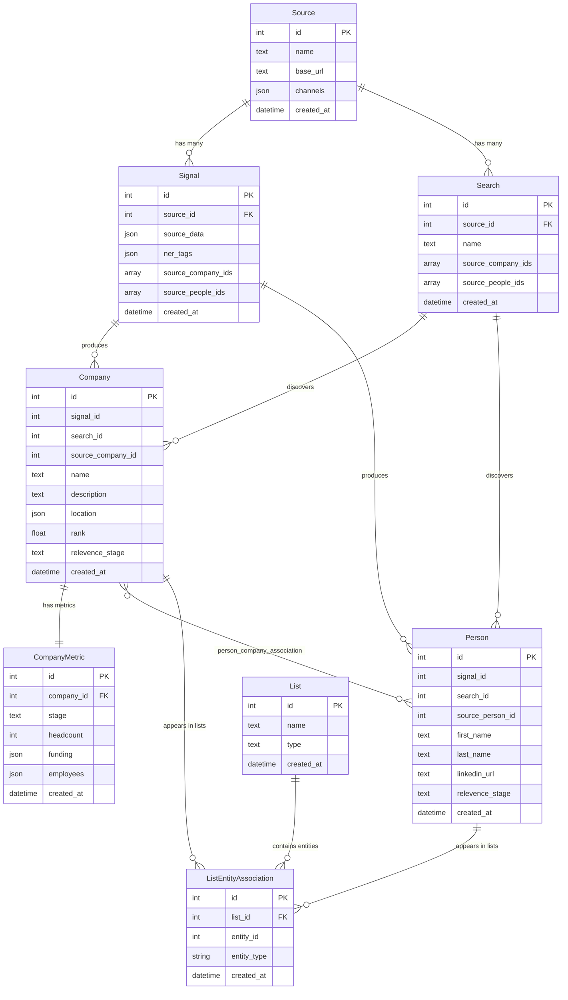

# 4. Data Models & Database

OMVision's data persistence layer relies on a PostgreSQL database managed through SQLAlchemy ORM and versioned with Alembic migrations. The database stores all extracted entities (companies, people, signals), their enrichments, relationships, and user-generated metadata. This section documents the schema design, relationships, migration workflow, and access patterns that ensure data integrity and consistency across the system.

---

## 4.1 Database Schema

OMVision's schema is organized around seven primary tables representing data sources, raw signals, extracted entities, enriched metrics, and user-defined groupings. The schema supports flexible JSON storage for semi-structured data while maintaining referential integrity through foreign keys and association tables.

### Database Location

**Production:** AWS RDS PostgreSQL 14+ instance (see §2.2.2 Infrastructure & Deployment)
**Local Development:** Docker-containerized PostgreSQL or native installation

**Connection Management:** The `SYSTEM_DB_CONN_STRING` environment variable (loaded from `.env` or AWS Secrets Manager) provides the connection URI used by both Alembic migrations and the `DatabaseResource` class.

---

### 4.1.1 Core Entities

OMVision's core schema consists of seven primary tables that capture the complete deal-sourcing workflow from raw signal ingestion through entity extraction and enrichment.

#### Source

**Location:** `app/db/models.py` (lines 40-52)

Represents external data providers (Accern, Gmail, Harmonic) that feed signals into OMVision.

| Column | Type | Description |
|--------|------|-------------|
| `id` | `Integer` (PK) | Auto-incrementing primary key |
| `name` | `Text` | Human-readable source name (e.g., "Accern", "Gmail") |
| `description` | `String` | Brief description of the source's purpose |
| `base_url` | `Text` | API endpoint or base URL for the source |
| `channels` | `ARRAY(JSON)` | Source-specific channels or filters (e.g., Accern themes) |
| `created_at` | `DateTime` | Record creation timestamp (UTC) |
| `updated_at` | `DateTime` | Last modification timestamp (UTC) |

**Relationships:**

- `signals`: One-to-many with `Signal` table (one source can have multiple signals)
- `searches`: One-to-many with `Search` table (one source can have multiple saved searches)

**Typical Data:** This is typically a small table (3-5 rows) representing the active data sources:

- **Accern** (with 3 channels for different deal flow feeds)
- **Gmail** (newsletter monitoring)
- **Harmonic Search** (saved searches from Harmonic)

**Usage:** Pipeline jobs query `Source` by name (e.g., `fetch_source_from_db(source_name="Accern")`) to retrieve the source ID for associating newly ingested signals. Source records are managed through the `upsert_data_sources` job (see §3.7.2).

---

#### Signal

**Location:** `app/db/models.py` (lines 68-79)

Stores raw, unstructured data from external sources before entity extraction. Signals represent news articles, emails, or API responses that mention companies or people.

| Column | Type | Description |
|--------|------|-------------|
| `id` | `Integer` (PK) | Auto-incrementing primary key |
| `source_id` | `Integer` (FK) | References `source.id` |
| `source_data` | `JSON` | Raw payload from the source API (titles, URLs, timestamps) |
| `name` | `Text` | Signal title or subject line |
| `ner_tags` | `JSON` | Extracted named entities (companies, people) after NER processing |
| `raw_ner_tags` | `JSON` | Unfiltered NER output before entity validation |
| `source_company_ids` | `ARRAY(Text)` | External company IDs extracted from the signal (e.g., Harmonic URNs) |
| `source_people_ids` | `ARRAY(Text)` | External people IDs extracted from the signal |
| `created_at` | `DateTime` | Record creation timestamp (UTC) |
| `updated_at` | `DateTime` | Last modification timestamp (UTC) |

**Relationships:**

- `source`: Many-to-one with `Source` table (via `source_id` foreign key)

**Update Pattern:** After initial insertion, signals are updated in bulk to populate `ner_tags` (via `bulk_update_ner_tags`), `source_company_ids` (via `bulk_update_company_ids`), and `source_people_ids` (via `bulk_update_people_ids`) as downstream processing stages complete.

**Lifecycle:**

1. Created with `source_data` and `raw_ner_tags` populated (from NER extraction)
2. Updated with `ner_tags` after entity filtering
3. Updated with `source_company_ids` and `source_people_ids` after enrichment

---

#### Company

**Location:** `app/db/models.py` (lines 82-126)

Represents enriched company entities extracted from signals or imported from Harmonic saved searches. Each row corresponds to a company with firmographic data from Harmonic.

| Column | Type | Description |
|--------|------|-------------|
| `id` | `Integer` (PK) | Auto-incrementing primary key (OMVision's internal company ID) |
| `search_id` | `Integer` | References `search.id` if discovered via Harmonic saved search |
| `signal_id` | `Integer` | References `signal.id` if discovered via Accern/Gmail signal |
| `source_company_id` | `Integer` | Harmonic's company ID (from their API) |
| `type` | `Text` | Company type classification |
| `name` | `Text` | Company name (from Harmonic) |
| `name_aliases` | `ARRAY(Text)` | Alternative names or DBAs |
| `legal_name` | `Text` | Registered legal name |
| `description` | `Text` | Company description/mission |
| `contact` | `JSON` | Contact information (email, phone) |
| `founding_date` | `JSON` | Founding date information |
| `website_urls` | `JSON` | Primary and additional website URLs |
| `logo_url` | `Text` | URL to company logo |
| `ownership_status` | `Text` | Public/Private/Subsidiary status |
| `location` | `JSON` | HQ location (city, state, country) |
| `tags` | `ARRAY(JSON)` | Industry tags and classifications |
| `socials` | `JSON` | Social media links (LinkedIn, Twitter, etc.) |
| `rank` | `Float` | ML-predicted relevance score (0.0-1.0) |
| `related_companies` | `JSON` | Parent companies, subsidiaries, competitors |
| `comments` | `Text` | User-generated notes about the company |
| `relevence_stage` | `Text` | Investment pipeline stage ("In Review", "Passed", "Declined", "Portfolio") |
| `is_hidden` | `Boolean` | Whether company is hidden from UI (default: False) |
| `created_at` | `DateTime` | Record creation timestamp (UTC) |
| `updated_at` | `DateTime` | Last modification timestamp (UTC) |

**Relationships:**

- `people`: Many-to-many with `Person` table via `person_company_association` (employees at company)
- `lists`: One-to-many with `ListEntityAssociation` (company memberships in user-created lists)

**Indexes:**

- Primary key on `id`
- Recommended: Index on `(name, source_company_id)` for deduplication queries (not currently implemented)

---

**Backend Duplicate Handling:**

The Company table **does not have a unique constraint** on `(name, source_company_id)`, which means duplicate rows can exist in the database.

**When Duplicates Occur:**

Duplicates occur when the same company (identified by the same `source_company_id` from Harmonic) is ingested multiple times:

1. **Across Different Days**: A company mentioned in an Accern signal on Monday and again on Friday will be inserted twice
2. **Multiple Signals Same Day**: A company mentioned in 3 different signals on the same day will be inserted 3 times
3. **Cross-Source Mentions**: The same company discovered via Accern and also in a Harmonic saved search

**Example Scenario:**

```sql
-- Monday: "Acme AI" discovered via Accern signal
Row 1: id=100, name="Acme AI", source_company_id=12345, signal_id=50

-- Friday: "Acme AI" mentioned in another Accern signal
Row 2: id=200, name="Acme AI", source_company_id=12345, signal_id=75

-- Same Friday: "Acme AI" also in Harmonic saved search
Row 3: id=201, name="Acme AI", source_company_id=12345, search_id=10
```

All three rows have the **same `source_company_id` (12345)** from Harmonic, representing the same physical company, but exist as separate database records.

**Deduplication Logic (Persistence Workflow Only):**

The system **does not prevent duplicates during insertion**. The `bulk_insert_rows` method (`app/resources/db_manager.py`) performs a simple `session.bulk_save_objects(rowArray)` with no duplicate checking.

However, the `persist_custom_columns_data` job (see §3.2.5) implements deduplication **when syncing user-generated metadata**:

**Code Reference:** `app/resources/db_manager.py` - `fetch_custom_columns_by_company_name_and_source_company_id` method

```python
def fetch_custom_columns_by_company_name_and_source_company_id(
    self, ingested_companies: list[CompanyCustomColumns]
):
    ingested_company_ids = [company.id for company in ingested_companies]

    with self._Session() as session:
        # Build filters for each (name, source_company_id) combination
        filters = [
            and_(
                Company.name == company.name,
                Company.source_company_id == company.source_company_id,
            )
            for company in ingested_companies
        ]

        # Subquery: find the OLDEST (minimum ID) for each combination
        subquery = (
            session.query(
                Company.name,
                Company.source_company_id,
                func.min(Company.id).label("oldest_id"),
            )
            .filter(or_(*filters))
            .group_by(Company.name, Company.source_company_id)
            .subquery()
        )

        # Return only the oldest record for each (name, source_company_id) group
        return (
            session.query(Company)
            .outerjoin(ListEntityAssociation, ListEntityAssociation.entity_id == Company.id)
            .outerjoin(List, List.id == ListEntityAssociation.list_id)
            .join(subquery, Company.id == subquery.c.oldest_id)
            .filter(not_(Company.id.in_(ingested_company_ids)))
            .all()
        )
```

**How Deduplication Works:**

1. **Groups by `(name, source_company_id)`**: All companies with the same name and Harmonic ID are grouped together
2. **Selects Oldest Record**: Uses `func.min(Company.id)` to identify the earliest-created record for each group
3. **Updates Only Oldest**: When custom columns (rank, comments, relevance_stage, etc.) are synced from the frontend, only the oldest record receives the updates

**Result:**

Using the example above:

- **Row 1 (ID=100)**: Receives custom column updates because it's the oldest
- **Row 2 (ID=200)**: Ignored during persistence sync
- **Row 3 (ID=201)**: Ignored during persistence sync

**Frontend Behavior (Unknown):**

The documentation does not currently cover how the frontend (Supabase/React application) handles duplicates when displaying companies to users. This is an area that requires further investigation or clarification from the frontend codebase.

**Design Implications:**

- **Storage**: Duplicate records consume additional database space
- **Performance**: Queries may return multiple rows for the same company unless explicitly deduplicated
- **Data Consistency**: Only the oldest record reflects current user annotations
- **Future Enhancement**: Consider adding a unique constraint on `(name, source_company_id)` or implementing upsert logic during insertion

---

#### Person

**Location:** `app/db/models.py` (lines 129-158)

Represents individuals (founders, executives, employees) extracted from signals or enriched via Harmonic.

| Column | Type | Description |
|--------|------|-------------|
| `id` | `Integer` (PK) | Auto-incrementing primary key |
| `signal_id` | `Integer` | References `signal.id` if discovered via signal |
| `source_person_id` | `Integer` | External person ID (from Harmonic or LinkedIn) |
| `first_name` | `Text` | Person's first name |
| `last_name` | `Text` | Person's last name |
| `location` | `JSON` | Person's location information |
| `linkedin_url` | `Text` | LinkedIn profile URL |
| `title` | `Text` | Current job title |
| `summary` | `Text` | Professional summary or bio |
| `profile_picture_url` | `Text` | URL to profile picture |
| `relevence_stage` | `Text` | Pipeline stage for tracking |
| `comments` | `Text` | User-generated notes |
| `is_hidden` | `Boolean` | Whether person is hidden from UI |
| `created_at` | `DateTime` | Record creation timestamp |
| `updated_at` | `DateTime` | Last modification timestamp |

**Relationships:**

- `companies`: Many-to-many with `Company` table via `person_company_association`
- `lists`: One-to-many with `ListEntityAssociation`

**Duplicate Handling:** Similar to the Company table, people can appear as multiple database rows if discovered across different signals or searches. The `persist_custom_columns_data` job uses `(first_name, last_name, source_person_id)` as a deduplication key, selecting the oldest record (minimum ID) when syncing custom columns from the frontend.

---

#### Search

**Location:** `app/db/models.py` (lines 55-65)

Represents saved searches from Harmonic that are monitored for new companies/people.

| Column | Type | Description |
|--------|------|-------------|
| `id` | `Integer` (PK) | Auto-incrementing primary key |
| `source_id` | `Integer` (FK) | References `source.id` (always Harmonic source) |
| `name` | `Text` | Search name (e.g., "DealFlow - Series A Healthcare") |
| `source_company_ids` | `ARRAY(Text)` | List of Harmonic company IDs from this search |
| `source_people_ids` | `ARRAY(Text)` | List of Harmonic people IDs from this search |
| `created_at` | `DateTime` | Record creation timestamp |
| `updated_at` | `DateTime` | Last modification timestamp |

**Relationships:**

- `source`: Many-to-one with `Source` table

**Usage:** The `ingest_companies_from_searches` job (§3.2.4) fetches saved searches from Harmonic daily and stores new results. The `source_company_ids` array tracks which companies originated from each search for traceability.

---

#### CompanyMetric

**Location:** `app/db/models.py` (lines 119-132)

Stores firmographic metrics and enrichments for companies. This table is separate from `Company` to isolate volatile, data-heavy fields.

| Column | Type | Description |
|--------|------|-------------|
| `id` | `Integer` (PK) | Auto-incrementing primary key (unique to this table) |
| `company_id` | `Integer` (FK) | References `company.id` |
| `stage` | `Text` | Funding stage (Seed, Series A, etc.) |
| `headcount` | `Integer` | Number of employees |
| `traction_metrics` | `JSON` | Revenue, growth metrics |
| `funding` | `JSON` | Total funding information |
| `employees` | `JSON` | Employee details from Harmonic |
| `highlights` | `ARRAY(JSON)` | Key company highlights |
| `employee_highlights` | `ARRAY(JSON)` | Notable employee backgrounds |
| `investor_urn` | `Text` | Harmonic identifier for investors |
| `funding_rounds` | `ARRAY(JSON)` | Detailed funding round history |
| `created_at` | `DateTime` | Record creation timestamp |
| `updated_at` | `DateTime` | Last modification timestamp |

**Relationships:**

- `company`: **One-to-one** with `Company` table (each `CompanyMetric` belongs to exactly one `Company`, and each `Company` has exactly one `CompanyMetric`)

**Insert Logic (No Updates):**

The system uses an **insert-only** pattern for `CompanyMetric` records:

```python
# From app/jobs/ingest_companies_from_signals.py - store_companies_metrics_from_signals_in_db
company_metrics = []
for inserted_company, company in zip(inserted_companies, all_companies):
    company_metrics.append(
        CompanyMetric(
            company_id=inserted_company.id,  # Foreign key to the Company row
            stage=company.stage,
            headcount=company.headcount,
            # ... other metrics
        )
    )
db.bulk_insert_rows(company_metrics)
```

**Key Behavior:**

- **One-to-One Relationship**: Each `Company` row has exactly one `CompanyMetric` row, and each `CompanyMetric` belongs to exactly one `Company` row (verified by database query showing equal counts)
- **No Updates**: There is no code that updates existing `CompanyMetric` records
- **Multiple Metrics Per Physical Company**: Since the `Company` table can have duplicate rows for the same physical company (same `source_company_id` ingested on different days), that physical company will have multiple `CompanyMetric` rows - one for each corresponding `Company` row

**Example:**
```sql
-- Monday: "Acme AI" ingested for the first time
Company:        id=100, name="Acme AI", source_company_id=12345
CompanyMetric:  id=1, company_id=100, headcount=25, stage="Series A"

-- Friday: "Acme AI" ingested again (duplicate Company row created)
Company:        id=200, name="Acme AI", source_company_id=12345
CompanyMetric:  id=2, company_id=200, headcount=30, stage="Series A"
```

**Note on `id` vs `company_id`:**

- `id`: Primary key of the `CompanyMetric` table (auto-incrementing, unique within this table)
- `company_id`: Foreign key pointing to `Company.id`
- These are **always different values**

---

### 4.1.2 Association Tables

OMVision uses two patterns for many-to-many relationships:

#### Standard Many-to-Many: `person_company_association`

**Location:** `app/db/models.py` (lines 32-37)

```python
person_company_association = Table(
    "person_company_association",
    Base.metadata,
    Column("person_id", Integer, ForeignKey("person.id")),
    Column("company_id", Integer, ForeignKey("company.id")),
)
```

This simple junction table links people to companies (employment relationships).

**Usage Example:**
```python
# Query all companies where a person works
person = session.query(Person).filter_by(id=123).first()
companies = person.companies  # Returns list of Company objects

# Query all employees at a company
company = session.query(Company).filter_by(id=456).first()
employees = company.people  # Returns list of Person objects
```

#### Polymorphic Association: `ListEntityAssociation`

**Location:** `app/db/models.py` (lines 174-207)

```python
class ListEntityAssociation(Base):
    id = Column(Integer, primary_key=True, autoincrement=True)
    list_id = Column(Integer, ForeignKey("list.id"), nullable=False)
    entity_id = Column(Integer, nullable=False)
    entity_type = Column(String(50), nullable=False)  # 'company' or 'person'
    created_at = Column(DateTime, default=utcnow(), nullable=False)
```

This table enables **polymorphic relationships**: a single `List` can contain both companies and people. The `entity_type` discriminator column specifies whether `entity_id` references a company or person.

**Usage Example:**
```python
# Add company to list
db.add_company_to_list(company_id=123, list_id=5)

# Add person to list
db.add_person_to_list(person_id=456, list_id=5)

# Query all entities in a list
list_obj = session.query(List).filter_by(id=5).first()
for association in list_obj.entities:
    if association.entity_type == "company":
        print(f"Company: {association.company.name}")
    elif association.entity_type == "person":
        print(f"Person: {association.person.first_name} {association.person.last_name}")
```

---

### 4.1.3 Entity Relationship Diagram



---

## 4.2 Alembic Migrations

OMVision uses Alembic for database schema versioning and migrations. Alembic tracks schema changes as Python scripts, enabling reproducible deployments and rollback capabilities.

### 4.2.1 Migration Configuration

**Location:** `alembic.ini` and `alembic/env.py`

**Key Settings:**

- **Script Location:** `alembic/versions/` (stores migration files)
- **Database URL:** Loaded from `SYSTEM_DB_CONN_STRING` environment variable
- **Target Metadata:** `Base.metadata` from `app/db/base.py`

**Connection Setup (`alembic/env.py`):**
```python
from app.db.base import Base
from app.config import SYSTEM_DB_CONN_STRING

config.set_main_option("sqlalchemy.url", SYSTEM_DB_CONN_STRING)
target_metadata = Base.metadata
```

---

### 4.2.2 Migration History

OMVision's schema evolved through multiple migrations. Below is the complete migration history:

| Revision ID | Description | Key Changes | Created Date |
|-------------|-------------|-------------|--------------|
| `5615fc35a13a` | Phase One Schema | Initial schema with Source, Signal, Company, Person, Search, CompanyMetric, List, ListEntityAssociation tables | Feb 2024 |
| `f4b26d1bc16a` | Add search_id and signal_id to Company | Added nullable foreign keys to link companies to their discovery source | Mar 2024 |
| `ca7d8e50abe2` | Add comments, relevance_stage, is_hidden to Company | User-generated metadata columns for tracking investment pipeline | Apr 2024 |
| `d97ec15c5cb0` | Add comments, relevance_stage, is_hidden to Person | Extended user metadata to people entities | Apr 2024 |
| `4a7c5b73917f` | Add rank to Company | ML-predicted relevance score column | May 2024 |

**Current Schema Version:** `4a7c5b73917f` (as of documentation date)

---

### 4.2.3 Creating New Migrations

When modifying the database schema, follow this workflow:

**1. Update SQLAlchemy Models**

Modify the relevant model in `app/db/models.py`:
```python
# Example: Add a new column
class Company(Base):
    # ... existing columns ...
    new_field = Column(Text, nullable=True)
```

**2. Generate Migration Script**

```bash
alembic revision --autogenerate -m "Add new_field to Company"
```

Alembic compares `Base.metadata` against the current database schema and generates a migration script in `alembic/versions/`.

**3. Review Generated Migration**

**Critical:** Alembic's autogenerate is not perfect. Always review the generated script:

- Check column types match intentions
- Verify nullable constraints
- Add data migrations if needed (e.g., populating new columns with default values)

**Example Generated Migration:**
```python
# alembic/versions/xyz123_add_new_field.py
def upgrade() -> None:
    op.add_column('company', sa.Column('new_field', sa.Text(), nullable=True))

def downgrade() -> None:
    op.drop_column('company', 'new_field')
```

**4. Apply Migration**

```bash
# Local/Dev
alembic upgrade head

# Production (via Dagster job or CI/CD)
alembic upgrade head
```

**5. Commit Migration File**

Add the new migration file to version control:
```bash
git add alembic/versions/xyz123_add_new_field.py
git commit -m "Migration: Add new_field to Company table"
```

---

### 4.2.4 Migration Rollback

Alembic supports rolling back migrations via `downgrade()` functions.

**Rollback to Previous Version:**
```bash
alembic downgrade -1  # Go back one migration
```

**Rollback to Specific Version:**
```bash
alembic downgrade 5615fc35a13a  # Rollback to Phase One schema
```

---

## 4.3 Database Resource Management

OMVision centralizes database access through the `DatabaseResource` class, which manages connection pooling, session lifecycle, and common query patterns.

### 4.3.1 DatabaseResource Class

**Location:** `app/resources/db_manager.py`

The `DatabaseResource` class implements the Dagster `ConfigurableResource` interface, enabling dependency injection of database connections into Dagster jobs and ops.

**Initialization:**
```python
from sqlalchemy import create_engine
from sqlalchemy.orm import scoped_session, sessionmaker

class DatabaseResource(ConfigurableResource):
    conn_string: str = Field(description="Database connection string")
    
    def __init__(self, **kwargs):
        super().__init__(**kwargs)
        self._engine = None
        self._Session = None
    
    def setup_for_execution(self, context) -> None:
        """Initialize engine and session factory when resource is created"""
        self._engine = create_engine(
            self.conn_string,
            pool_size=10,
            max_overflow=20,
            pool_pre_ping=True  # Verify connections before use
        )
        self._Session = scoped_session(
            sessionmaker(bind=self._engine)
        )
```

**Key Features:**

- **Connection Pooling:** SQLAlchemy's connection pool reuses database connections across requests
- **Thread Safety:** `scoped_session` provides thread-local sessions
- **Connection Health Checks:** `pool_pre_ping=True` detects stale connections

---

### 4.3.2 Session Management

The `DatabaseResource` uses context managers to ensure proper session lifecycle:

```python
def fetch_data(self, model, field, value):
    """Example query method with session management"""
    with self._Session() as session:
        results = session.query(model).filter(field == value).all()
        return results
    # Session automatically closed when exiting 'with' block
```

**Session Lifecycle:**

1. **Creation:** `with self._Session()` creates a new session from the pool
2. **Query Execution:** Perform database operations within the context
3. **Commit/Rollback:** Transactions are committed if no exceptions occur
4. **Cleanup:** Session is automatically closed and returned to the pool

**Error Handling:**
```python
with self._Session() as session:
    try:
        # Database operations
        session.commit()
    except Exception as e:
        session.rollback()  # Undo changes on error
        raise e
```

---

### 4.3.3 Common Database Operations

#### Bulk Insert

**Method:** `bulk_insert_rows(rowArray: list)`

```python
def bulk_insert_rows(self, rowArray):
    """Insert multiple rows efficiently"""
    with self._Session() as session:
        session.bulk_save_objects(rowArray)
        session.commit()
    return rowArray  # Returns inserted objects with populated IDs
```

**Usage:**
```python
companies = [
    Company(name="Acme AI", source_company_id=12345),
    Company(name="Beta Corp", source_company_id=67890),
]
inserted = db.bulk_insert_rows(companies)
```

**Note:** `bulk_save_objects` does not populate primary keys by default. Use `return_defaults=True` if you need IDs immediately.

---

#### Bulk Update

**Method:** `bulk_update_ner_tags(rowArray: list)`

```python
def bulk_update_ner_tags(self, rowArray):
    """Update NER tags for multiple signals"""
    updated_rows = 0
    with self._Session() as session:
        for row in rowArray:
            model_class = type(row)
            stmt = (
                update(model_class)
                .where(model_class.id == row.id)
                .values(ner_tags=row.ner_tags)
            )
            session.execute(stmt)
            updated_rows += 1
        session.commit()
    return updated_rows
```

**Usage:**
```python
signals = [
    Signal(id=1, ner_tags={"org": ["Acme AI"], "person": ["John Doe"]}),
    Signal(id=2, ner_tags={"org": ["Beta Corp"]}),
]
db.bulk_update_ner_tags(signals)
```

---

#### Deduplication Queries

**Method:** `fetch_custom_columns_by_company_name_and_source_company_id`

This method implements the deduplication logic described in §4.1.1 (Company table):

```python
def fetch_custom_columns_by_company_name_and_source_company_id(
    self, ingested_companies: list[CompanyCustomColumns]
):
    """Find oldest company for each (name, source_company_id) combination"""
    ingested_company_ids = [company.id for company in ingested_companies]

    with self._Session() as session:
        filters = [
            and_(
                Company.name == company.name,
                Company.source_company_id == company.source_company_id,
            )
            for company in ingested_companies
        ]

        # Subquery: select oldest ID for each (name, source_company_id) group
        subquery = (
            session.query(
                Company.name,
                Company.source_company_id,
                func.min(Company.id).label("oldest_id"),
            )
            .filter(or_(*filters))
            .group_by(Company.name, Company.source_company_id)
            .subquery()
        )

        # Join to get full company records for oldest IDs only
        return (
            session.query(Company)
            .join(subquery, Company.id == subquery.c.oldest_id)
            .filter(not_(Company.id.in_(ingested_company_ids)))
            .all()
        )
```

This pattern is used by the `persist_custom_columns_data` job to ensure custom columns are applied to the canonical (oldest) record for each company.

---

### 4.3.4 Resource Usage in Dagster Jobs

Dagster jobs access the `DatabaseResource` via dependency injection:

**Resource Configuration (`app/jobs/__init__.py`):**
```python
from app.resources.db_manager import DatabaseResource
from app.config import SYSTEM_DB_CONN_STRING

@job
def ingest_signals_from_accern():
    # Job ops defined here
    pass

# Resource bindings
ingest_signals_from_accern = ingest_signals_from_accern.configure(
    {
        "resources": {
            "db": DatabaseResource(conn_string=SYSTEM_DB_CONN_STRING)
        }
    }
)
```

**Op Usage:**
```python
@op
def store_signals_in_db(context, db: DatabaseResource, signals: list[Signal]):
    """Store signals in database using injected resource"""
    context.log.info(f"Inserting {len(signals)} signals")
    db.bulk_insert_rows(signals)
```

Dagster automatically injects the `DatabaseResource` instance into ops that declare it as a parameter.

-