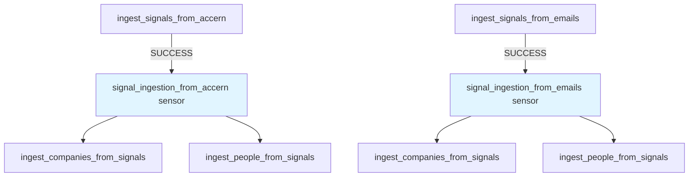
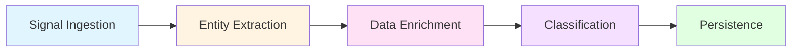
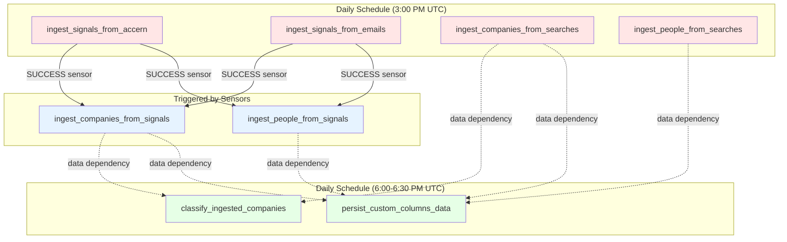

# 3. Data Pipeline & Processing Logic

This section provides a comprehensive explanation of OMVision's data pipeline architecture, describing how raw signals from external sources are transformed into enriched, classified, and persisted company records ready for internal analysis.

## 3.1 Dagster Orchestration

OMVision employs Dagster as its orchestration framework to manage complex, interdependent data workflows. Dagster provides job scheduling, dependency management, resource allocation, and observability across the entire pipeline.

### 3.1.1 Job Configuration

All jobs are centrally defined in `app/main.py` within a `Definitions` object that serves as the entry point for Dagster's code location. This definition includes:

**Core Jobs:**

- `upsert_data_sources`: Initializes or updates source configurations
- `ingest_signals_from_accern`: Fetches signals from Accern API channels
- `ingest_signals_from_emails`: Processes newsletter emails via Gmail
- `ingest_companies_from_searches`: Ingests companies from Harmonic saved searches
- `ingest_companies_from_signals`: Extracts and enriches companies from signals
- `ingest_people_from_searches`: Ingests people from Harmonic saved searches
- `ingest_people_from_signals`: Extracts and enriches people from signals
- `classify_ingested_companies`: Applies ML classification to unclassified companies
- `persist_custom_columns_data`: Syncs custom column metadata from frontend

**Resources:**

Jobs have access to configurable resources defined in the `resources` dictionary:

- `db`: `DatabaseResource` for PostgreSQL interactions
- `accern`: `AccernResource` for Accern API integration
- `openai`: `OpenAIResource` for NER and context extraction
- `gmail`: `GmailResource` for Gmail API integration
- `google`: `WebSearchResource` for URL discovery
- `harmonic`: `HarmonicResource` for Harmonic API enrichment
- `ml`: `MLResource` for machine learning classification
- `s3_io_manager`: S3-based I/O manager for asset materialization

Resources are instantiated once per run and injected into ops as needed, following Dagster's dependency injection pattern.

**Assets:**

The system defines one materialized asset:

- `company_filter_list`: An auto-materializing asset that fetches company names from Harmonic filter search and watchlist, stored in S3

This asset uses an eager auto-materialize policy, ensuring it updates when missing and is available for filtering operations.

### 3.1.2 Sensors & Triggers

OMVision uses **run status sensors** to create chained workflows where downstream jobs trigger automatically upon successful completion of upstream jobs. This pattern decouples signal ingestion from entity extraction while maintaining execution order.

**Signal Ingestion Sensors:**

Defined in `app/sensors/main.py`, two sensors monitor signal ingestion jobs:

1. **`signal_ingestion_from_accern`**

   - Monitors: `ingest_signals_from_accern`
   - Triggers on: `DagsterRunStatus.SUCCESS`
   - Requests: `ingest_companies_from_signals` and `ingest_people_from_signals`
   - Minimum interval: 7200 seconds (2 hours)
   - Configuration: Injects source-specific config via `get_op_config("Accern")`

**Behavior**: When Accern signal ingestion succeeds, the sensor yields two RunRequest objects—one for company extraction configured for the “Accern” source, and one for people extraction. The 2-hour minimum interval prevents rapid re-triggering if multiple Accern jobs complete in succession.

2. **`signal_ingestion_from_emails`**

   - Monitors: `ingest_signals_from_emails`
   - Triggers on: `DagsterRunStatus.SUCCESS`
   - Requests: `ingest_companies_from_signals` and `ingest_people_from_signals`
   - Minimum interval: 7200 seconds (2 hours)
   - Configuration: Injects source-specific config via `get_op_config("Gmail")`

**Behavior**: Mirrors the Accern sensor but configured for the “Gmail” data source. When email signal ingestion completes successfully, it triggers parallel company and people extraction jobs

The minimum interval prevents sensor over-triggering in case of rapid successive runs.

**Sensor Logic Flow:**



**Configuration Injection:**

The `get_op_config` utility (in `app/sensors/op_config.py`) dynamically constructs run configurations based on source name and pipeline type:

```python
def get_op_config(source_name: str, pipeline_type: PipelineType = PipelineType.company):
    op_config = {
        "fetch_source_from_db": {
            "config": {"source_name": source_name},
            "inputs": {"source_name": source_name},
        }
    }
    watchlist_config = {"config": {"source_name": source_name}}
    
    if pipeline_type == PipelineType.company:
        op_config["get_source_watchlist"] = watchlist_config
    else:
        op_config["get_source_people_watchlist"] = watchlist_config
    
    return op_config
```

This ensures that downstream jobs process entities associated with the correct source and watchlist.

### 3.1.3 Workspace Configuration

The Dagster workspace is configured via `workspace.yaml`, which defines code locations accessible to the webserver and daemon.

**Workspace Definition:**

```yaml
load_from:
  - grpc_server:
      host: deal_flow_code
      port: 4000
      location_name: "DealFlow"
```

This configuration tells Dagster to load job definitions from a gRPC server running on the `deal_flow_code` service at port 4000.

**Service Architecture:**

The system deploys three Docker services (defined in `docker-compose.yaml`):

1. **`dagster_webserver`**: Hosts the Dagster UI on port 3000, loads jobs from gRPC server
2. **`dagster_daemon`**: Background service that executes queued runs and manages schedules/sensors
3. **`deal_flow_code`**: gRPC server exposing all user-defined jobs, ops, resources, and assets

**Code Location Server:**

The `deal_flow_code` service runs:
```bash
dagster api grpc -h 0.0.0.0 -p 4000 -f app/main.py
```

This command starts a gRPC server that serializes the `Definitions` object from `app/main.py` and serves it to the webserver and daemon. This architecture separates orchestration infrastructure (webserver/daemon) from business logic (user code), enabling independent scaling and deployment.

See §2.1.1 for detailed Docker service configuration.

### 3.1.4 Run Coordination

OMVision uses the **QueuedRunCoordinator** to manage job execution, defined in `dagster-prod.yaml`:

```yaml
run_coordinator:
  module: dagster.core.run_coordinator
  class: QueuedRunCoordinator
```

**Execution Flow:**

1. When a job is launched (via schedule, sensor, or manual trigger), the webserver creates a run and places it in a queue
2. The `dagster_daemon` service polls the queue and dequeues runs for execution
3. Runs are launched via the **EcsRunLauncher**, which creates ephemeral ECS tasks:

```yaml
run_launcher:
  module: dagster_aws.ecs
  class: EcsRunLauncher
  config:
    include_sidecars: true
    secrets_tag: ""
```

Each job run executes in an isolated ECS task using the same container image (`deal_flow_code`). This provides:

- **Isolation**: Failures in one run don't affect others
- **Scalability**: Multiple runs can execute concurrently across ECS cluster
- **Resource control**: ECS enforces CPU/memory limits per run

**Schedules:**

Jobs are scheduled via cron expressions defined in `app/schedules/main.py`:

| Schedule | Job | Cron | Execution Time |
|----------|-----|------|----------------|
| `accern_ingest` | `ingest_signals_from_accern` | `0 15 * * *` | Daily at 3:00 PM UTC |
| `emails_ingest` | `ingest_signals_from_emails` | `0 15 * * *` | Daily at 3:00 PM UTC |
| `harmonic_ingest` | `ingest_companies_from_searches` | `0 15 * * *` | Daily at 3:00 PM UTC |
| `harmonic_people_ingest` | `ingest_people_from_searches` | `0 15 * * *` | Daily at 3:00 PM UTC |
| `data_persistor` | `persist_custom_columns_data` | `0 18 * * *` | Daily at 6:00 PM UTC |
| `company_classifier` | `classify_ingested_companies` | `30 18 * * *` | Daily at 6:30 PM UTC |

**Execution Sequence:**

The schedule timing ensures proper sequencing:

- Signal ingestion and direct searches execute at 3:00 PM
- Sensors trigger entity extraction jobs upon successful ingestion (3:00-5:00 PM)
- Custom column persistence runs at 6:00 PM (after entity processing)
- Classification runs at 6:30 PM (after new companies are stored)

**Storage Configuration:**

All orchestration metadata (run history, logs, schedules) is stored in PostgreSQL:

```yaml
run_storage:
  module: dagster_postgres.run_storage
  class: PostgresRunStorage

event_log_storage:
  module: dagster_postgres.event_log
  class: PostgresEventLogStorage

schedule_storage:
  module: dagster_postgres.schedule_storage
  class: PostgresScheduleStorage
```

This centralized storage enables the webserver to display run history and logs while the daemon manages execution state.

---

## 3.2 Data Flow Stages

This section documents the five sequential stages through which data flows in OMVision, transforming raw external signals into fully enriched, classified, and stored entities ready for analysis. Each stage builds upon the previous one, progressively refining data quality and adding business intelligence.



The pipeline processes three distinct data sources:

- **Accern**: News articles and funding events with structured entity/event fields
- **Gmail**: Newsletter emails containing company announcements
- **Harmonic Search**: Pre-qualified companies from saved searches

---

### 3.2.1 Signal Ingestion

Signal ingestion is the entry point for all external data. Signals represent raw, unprocessed records from data sources that potentially mention early-stage companies or founders. Each of the three signal types has its own ingestion pathway optimized for its unique data structure and availability.

#### Accern Signal Ingestion

**Datasource Overview**

Accern is a portfolio company of OMVC that uses NLP and ML to identify relevant signals across wide data sets, capturing hidden trends in venture funding, partnerships, and company developments. Accern delivers data through use-case-specific channels, each representing a distinct topical feed (e.g., "real-time venture deal flow" or "co-investor tracking").

OMVision maintains three active Accern channels, each with a dedicated API endpoint and authentication token. Channel configuration is stored in `app/constants/data_sources.py`:

```python
Channel(
    api_key="eyJhbGciOiJSUzI1NiIsInR5cCI6IkpXVCJ9...",
    api_endpoint="feed/real-time-venture-deal-flow-bcc2d312-vectr"
),
Channel(
    api_key="eyJhbGciOiJSUzI1NiIsInR5cCI6IkpXVCJ9...",
    api_endpoint="feed/deal-flow-fund-i-co-investor-tracking-6706ac78-vectr"
),
Channel(
    api_key="eyJhbGciOiJSUzI1NiIsInR5cCI6IkpXVCJ9...",
    api_endpoint="feed/deal-flow-fund-ii-co-investor-tracking-e1c5e74b-vectr"
)
```

**Ingestion Process**

The `ingest_signals_from_accern` job (in `app/jobs/ingest_signals_from_accern.py`) orchestrates the following workflow:

**1. Fetch Source Metadata** (`fetch_source_from_db`)

Retrieves the "Accern" data source record from the database, including all associated channels with their API credentials. The source metadata links ingested signals to their originating source for traceability.

**2. Ingest Data from Channels** (`ingest_data_from_channels`)

For each configured channel, the `AccernResource` (`app/resources/accern_api.py`) fetches the last 24 hours of signals:

```python
def fetch_feed(self, endpoint: str, token: str) -> AccernFeed:
    ny_tz = pytz.timezone("America/New_York")
    end_date = datetime.now(ny_tz).replace(hour=11, minute=0, second=0, microsecond=0)
    start_date = end_date - timedelta(hours=24)
    
    endpoint_with_queries = f"{self.base_url}{endpoint}?token={token}&published_at=[{start_str}..{end_str}]"
    response = requests.get(endpoint_with_queries, headers={"user-agent": "dagster"})
    return AccernFeed.model_validate(response.json())
```

The API returns an `AccernFeed` object containing metadata about the time window and a list of `AccernSignal` objects.

**3. Extract Signals from Feeds** (`get_signals_from_feeds`)

Aggregates signals from all channel feeds into a single list. Accern signals contain structured fields that facilitate downstream NER extraction:

```python
class AccernSignal(BaseModel):
    entity_text: list[str]        # Text snippets describing entities
    event_text: list[str]          # Text snippets describing events
    entity_name: Optional[str]     # Primary entity mentioned
    entity_type: Optional[str]     # Entity classification (Company, Person, etc.)
    doc_title: Optional[str]       # Article/document title
    doc_url: Optional[str]         # Source URL
    doc_sentiment: Optional[float]
    event: Optional[str]           # Event classification (Funding, Acquisition, etc.)
    published_at: Optional[datetime]
    # ... additional metadata fields
```

**4. Deduplicate Signal Context** (`get_unique_context_from_signals`)

Accern may deliver duplicate signals across channels or within the 24-hour window. Deduplication keys on a composite of:
- `entity_text` (tuple)
- `event_text` (tuple)
- `entity_name`
- `entity_type`
- `doc_title`
- `doc_url`

**Implementation** (`app/jobs/ingest_signals_from_accern.py`):

```python
@op(out={"unique_contexts": Out(), "unique_signals": Out()})
def get_unique_context_from_signals(
    context, signals: list[AccernSignal]
) -> tuple[list[dict], list[AccernSignal]]:
    """
    Extracts context from each signal, focusing on entity and event text, as well as 
    additional metadata. Ensures that the list of signal contexts returned is unique 
    and also returns the corresponding unique signals.
    """
    unique_contexts = {}

    for signal in signals:
        # Create composite key from all signal fields
        context_key = (
            (
                tuple(signal.entity_text)
                if isinstance(signal.entity_text, list)
                else signal.entity_text
            ),
            (
                tuple(signal.event_text)
                if isinstance(signal.event_text, list)
                else signal.event_text
            ),
            signal.entity_name,
            signal.entity_type,
            signal.doc_title,
            signal.doc_url,
        )

        # Store only first occurrence of each unique context
        if context_key not in unique_contexts:
            unique_contexts[context_key] = signal

    context.log.info(f"Unique Accern signals retrieved: {len(unique_contexts)}")

    unique_signals = list(unique_contexts.values())
    
    # Convert tuple keys back to dictionary format for downstream processing
    unique_signal_contexts = [
        {
            "entity_text": context_key[0],
            "event_text": context_key[1],
            "entity_name": context_key[2],
            "entity_type": context_key[3],
            "doc_title": context_key[4],
            "doc_url": context_key[5],
        }
        for context_key in unique_contexts.keys()
    ]

    return unique_signal_contexts, unique_signals
```

Only the first occurrence of each unique context is retained, reducing redundant processing downstream. The operation returns both the unique signal contexts (dictionaries containing the deduplicated fields) and the corresponding unique `AccernSignal` objects.

**Why deduplication matters**: Without this step, the pipeline would extract entities from the same article multiple times, inflating storage costs and creating duplicate company records. Deduplication at this stage (before expensive OpenAI calls) minimizes API usage and database writes.

---

**At this point, the pipeline has unique signal contexts ready for entity extraction. The next stage involves OpenAI-based NER.**

---

#### Email Signal Ingestion

**Datasource Overview**

OMVision monitors a dedicated Gmail inbox (`newsletters@omvc.co`) subscribed to venture capital newsletters, founder announcements, and industry publications. These newsletters frequently mention early-stage companies, funding rounds, product launches, and team expansions—all valuable dealflow signals.

**Ingestion Process**

The `ingest_signals_from_emails` job (in `app/jobs/ingest_signals_from_emails.py`) follows a simplified workflow compared to Accern, as emails lack the structured entity/event separation:

**1. Fetch Source Metadata** (`fetch_source_from_db`)

Retrieves the "Gmail" data source record, which does not have channels (unlike Accern) but is linked to a single service account.

**2. Fetch Emails** (`fetch_emails`)

The `GmailResource` (configured with a service account JSON key) retrieves all emails from the past 24 hours using the Gmail API:

```python
def get_emails(self) -> list[MailMessage]:
    # Authenticates with service account
    # Queries messages from last 24 hours
    # Returns list of MailMessage objects with body, subject, sender, date
```

Each `MailMessage` contains the email body (HTML or plaintext) and metadata.

**3. Extract Email Context** (`get_context_from_emails`)

Email bodies are extracted as strings. Unlike Accern signals with pre-separated `entity_text` and `event_text`, email content is unstructured prose. This operation serves as a critical data extraction layer that transforms structured email objects into plain text for NER processing.

**Implementation** (`app/jobs/ingest_signals_from_emails.py`):

```python
@op
def get_context_from_emails(emails: list[MailMessage]) -> list[str]:
    """
    Extracts the body content from each email message.

    Args:
        emails (list[MailMessage]): A list of email messages.

    Returns:
        list[str]: A list of email body content as strings.
    """
    return [f"{email.body}" for email in emails]
```

**Why This Formatting is Needed**:

This seemingly simple operation serves several critical architectural purposes:

**1. Type Transformation**

Converts from structured `MailMessage` objects to simple strings:

*Input type:* `MailMessage` (Pydantic model)
```python
class MailMessage(BaseModel):
    sender: Optional[str]  # "techcrunch@newsletter.com"
    date: Optional[str]    # "2025-11-04"
    body: str              # Full email text content
```

*Output type:* `list[str]` (plain text strings)

**2. Data Abstraction & Pipeline Consistency**

Creates a uniform interface for downstream NER operations:

- **Isolates relevant data**: Extracts body text from metadata (sender, date)
- **Enables source-agnostic processing**: The NER pipeline (`get_entities_from_emails`, `extract_entity_context_from_emails`) works with strings regardless of whether they originated from emails, Accern signals, or other sources
- **Single responsibility**: Each pipeline stage has a clear, bounded function

**3. Format Transformation**

*Before `get_context_from_emails`:*
```python
[
    MailMessage(
        sender="techcrunch@newsletter.com",
        date="2025-11-04",
        body="DeepTech raises $10M for healthcare AI diagnostic imaging. The Series A round..."
    ),
    MailMessage(
        sender="venturehacks@newsletter.com", 
        date="2025-11-04",
        body="Series A spotlight: Five robotics startups to watch including RoboTech..."
    )
]
```

*After `get_context_from_emails`:*
```python
[
    "DeepTech raises $10M for healthcare AI diagnostic imaging. The Series A round...",
    "Series A spotlight: Five robotics startups to watch including RoboTech..."
]
```

**4. Metadata Preservation**

While the body text is extracted for NER, the original `MailMessage` objects are preserved throughout the pipeline and later used in `combine_emails_and_entities`:

```python
processed_signals = combine_emails_and_entities(
    source_data, 
    ingested_emails,      # ← Original MailMessage objects with full metadata
    filtered_entities,    # ← Extracted entities from body text
    raw_entities
)
```

This allows the full email metadata (sender, date) to be stored in the database's `source_data` field for audit and traceability purposes, while the NER pipeline operates only on the relevant text content.

**5. Simplified Downstream Logic**

By converting to strings early, all downstream operations can use the same code paths:

```python
## Email pipeline (after get_context_from_emails)
for email_body in email_body_list:  # Processes simple strings
    preprocessed_text = openai.preprocess_text(email_body)
    extracted_entities = openai.get_all_ner_tags(preprocessed_text, vanilla_prompt=True)
```

Compare to Accern (which also produces strings after combining entity_text + event_text):
```python
## Accern pipeline (after combining fields)
for signal in signals:
    combined_text = entity_text + event_text  # Also produces strings
    preprocessed_text = openai.preprocess_text(combined_text)
    extracted_entities = openai.get_all_ner_tags(preprocessed_text, signal, vanilla_prompt=False)
```

Both pipelines converge on string processing, despite starting with different data structures.

**6. Reusability**

The extracted string list is reused for entity context extraction without re-parsing the email objects:

```python
signal_contexts = extract_entity_context_from_emails(
    email_context,        # ← Same list[str] from get_context_from_emails
    relevant_entities
)
```

**Underlying Data Cleaning**

The actual text cleaning happens earlier in `GmailResource.get_emails()` (`app/resources/mail_client.py`):

```python
def _clean_message(self, message: str) -> str:
    """Cleans an email message by removing CSS and extracting plain text content."""
    try:
        message_no_css = re.sub(r"\*{.*?}}\r\n", "", message, flags=re.DOTALL)
        soup = BeautifulSoup(message_no_css, "html.parser")
        clean_text = soup.get_text(separator=" ").strip()
        return clean_text
    except:
        return message
```

This method:

- Strips CSS styles (regex removes `*{...}` blocks)
- Parses HTML with BeautifulSoup and extracts plain text
- Removes formatting artifacts and normalizes whitespace

By the time `get_context_from_emails` executes, email bodies are already clean plain text—the operation simply extracts them from the `MailMessage` objects.

**What is sent to NER**: The entire email body text as a plain string. Preprocessing (§3.2.2) will filter this unstructured content before entity extraction.

**Architectural Benefits**

This design pattern exemplifies good software engineering:

- **Separation of concerns**: Email fetching, text extraction, and NER are distinct stages
- **Interface segregation**: Downstream operations receive only the data they need (text), not extraneous metadata
- **Reusability**: The same NER code processes emails and Accern signals despite different source structures
- **Auditability**: Original metadata is preserved separately for database storage

**Why no deduplication**: Email ingestion does not deduplicate because each email, even if covering the same company, represents a distinct temporal signal. Multiple newsletters mentioning the same funding round on the same day provide reinforcing evidence of relevance.

---

#### Direct Search Ingestion (Harmonic)

**Datasource Overview**

Harmonic is a B2B company intelligence platform that provides structured company and people data. Unlike Accern and Gmail, which require NER to discover entities, Harmonic searches return fully identified and enriched entities directly.

OMVision leverages Harmonic's saved search functionality: investment team members create searches in Harmonic's UI with specific criteria (e.g., "Series A companies in healthcare AI with 10-50 employees"), and OMVision automatically ingests net-new results daily.

**Company Ingestion**

The `ingest_companies_from_searches` job (`app/jobs/ingest_companies_from_searches.py`) processes companies from saved searches. This pathway bypasses NER entirely because entities are already identified:

**1. Fetch Source Metadata** (`fetch_source_from_db`)

Retrieves the "Harmonic Search" data source, which contains the Harmonic API key in its channel configuration.

**2. Fetch Saved Searches** (`fetch_all_searches`, `get_saved_searches_from_harmonic`)

The `HarmonicResource` calls `harmonic.get_saved_searches(type=SearchType.companies)`, which:

- Makes a GET request to `https://api.harmonic.ai/savedSearches`
- Filters searches where `name` starts with "DealFlow" (excluding "DealFlow - Filter list")
- Returns a list of `SearchList` objects with search name and URN

This naming convention allows team members to designate which searches OMVision should monitor.

**3. Fetch Companies for Each Search** (`fetch_all_companies_by_search`, `get_companies_from_search`)

For each saved search, the system retrieves associated companies:

```python
def get_companies_by_search(self, search_id: str) -> list[CompanyBase]:
    return self._fetch_all_pages(f"savedSearches:results/{search_id}", CompanyBase)
```

The `_fetch_all_pages` method handles pagination, iterating through result pages until `page_info["has_next"]` is False. Each company is returned as a fully populated `CompanyBase` object with:

- Company name, description, website
- Founding date, location, ownership status
- Funding details, stage, headcount
- People (employees), highlights, socials
- All available Harmonic metrics

**4. Parse Company Metadata** (`parse_incoming_data`)

Extracts three parallel structures from the search results:

- **Company URNs**: Unique resource names for Harmonic's internal identification (format: `urn:harmonic:company:...`)
- **`SearchWithCompanyIds`**: Maps each search name to a list of company IDs (Harmonic's integer identifiers)
- **`CompanyBase` objects**: Full company data for storage

**5. Store Search Metadata** (`store_harmonic_search_in_db`)

Creates `Search` records in the database, linking each search to the Harmonic source and storing `source_company_ids` to track which companies originated from which search. This traceability enables analysis of search effectiveness.

**6. Store Companies and Metrics** (`store_harmonic_companies_in_db`, `store_company_metrics_in_db`)

Companies are stored in two related tables:

- **`Company`**: Core attributes (name, description, website, location, tags, etc.)
- **`CompanyMetric`**: Time-series and quantitative data (funding, headcount, traction metrics, employee highlights)

Each `Company` record links to its originating `Search` via `search_id`, and each `CompanyMetric` links to its `Company` via `company_id`.

**7. Add to Watchlist** (`add_to_harmonic_watchlist`)

Company URNs are bulk-added to the source-specific Harmonic watchlist ("DealFlow - Harmonic Search"):

```python
def add_company_to_watchlist(self, watchlist_id: str, company_urns: list[str]):
    payload = {"urns": company_urns}
    response = requests.post(
        f"{self._base_url}watchlists/companies/{watchlist_id}:addCompanies",
        json=payload,
        headers=self._headers
    )
```

This enables ongoing monitoring within Harmonic's platform, ensuring OMVision's tracked companies remain visible to the investment team in Harmonic.

---

**People Ingestion**

The `ingest_people_from_searches` job mirrors the company flow but processes people entities:

- Fetches saved searches with `type=SearchType.people`
- Retrieves people via `get_people_by_search(search_id)`
- Stores `Person` records with LinkedIn URL, experience, education, highlights
- Adds people URNs to the people watchlist via `add_people_to_watchlist`

---

### 3.2.2 Entity Extraction

Entity extraction transforms unstructured signal text into structured lists of companies and people. This stage is critical for Accern and Gmail signals, which contain entity mentions embedded in prose. Harmonic signals skip this stage entirely as entities are pre-identified.

OMVision employs a multi-step NER pipeline powered by OpenAI's GPT models, combining text preprocessing, chunking, structured entity extraction, LLM-based filtering, and context extraction for URL discovery.

#### The NER Extraction Process

**1. Preprocess Text**

Before entity extraction, signal text undergoes LLM-based preprocessing to remove irrelevant content and improve extraction accuracy.

**Accern Preprocessing**

Accern signals have structured `entity_text` and `event_text` fields. The `get_entities_from_signals` op in `app/jobs/ingest_signals_from_accern.py` combines these fields:

```python
for signal in signals:
    entity_text = signal.get("entity_text", [])  # List of strings
    event_text = signal.get("event_text", [])    # List of strings
    
    # Ensure both are lists
    if not isinstance(entity_text, list):
        entity_text = [entity_text]
    if not isinstance(event_text, list):
        event_text = [event_text]
    
    # Combine into single list
    combined_text = entity_text + event_text
    
    # Preprocess with OpenAI
    preprocessed_text = openai.preprocess_text(combined_text)
```

The `preprocess_text` method (`app/resources/open_ai.py`) sends the combined list to `gpt-4o-mini`:

```python
def preprocess_text(self, text) -> str:
    response = self._client.chat.completions.create(
        model="gpt-4o-mini",
        messages=[
            {"role": "system", "content": self._preprocess_text_system_prompt()},
            {"role": "user", "content": f"```\n{text}\n```"}
        ],
        temperature=0
    )
    return response.choices[0].message.content
```

**Preprocessing Prompt**:

```
You are a text filtering AI assistant. Your task is to filter incoming text about companies 
and their details delimited by backticks (```), keeping only the relevant information based 
on a provided list of labels. The filtered text will be passed to an extraction function, 
so it's crucial to remove irrelevant information while preserving the important details.

Here is the list of labels to use for filtering:
person (people, investors, entrepreneurs, etc.), org (organizations, companies, startups, 
agencies, institutions, etc.), gpe (geopolitical entities like countries, cities, states, etc.)

Follow these steps to filter the text:
1. Read the input text carefully.
2. Identify information that relates to the labels provided.
3. Preserve the original wording and order of the relevant information. the filtered text 
   should be a natural language string.
4. Do not add any introductory phrases or summaries to the filtered text.
5. Ensure that the filtered text is coherent and maintains context where necessary.
6. If you are unsure of the usability of the information, you must include it in the 
   filtered text.
7. do not delimit the output filtered text
```

**Example**:

*Input*:
```
["DeepTech, a healthcare AI startup focusing on diagnostic imaging, raised $10M in Series A", 
"The funding round was led by Accel. They compete with Microsoft Azure in the cloud space."]
```

*Output*:
```
DeepTech, a healthcare AI startup focusing on diagnostic imaging, raised $10M in Series A. 
The funding round was led by Accel.
```

**What was filtered**: The sentence about Microsoft Azure competition was removed as tangential—Microsoft is mentioned as a competitor, not as a primary entity of interest.

**Why preprocess**: Preprocessing reduces noise, lowers token costs for subsequent OpenAI calls, and improves NER accuracy by focusing the model on entity-relevant content. The prompt is conservative (instruction #6: "If you are unsure...include it") to avoid over-filtering.

---

**Email Preprocessing**

Email signals follow a similar but simpler flow in `app/jobs/ingest_signals_from_emails.py`:

```python
for email_body in email_body_list:
    # Email body is already a single string
    preprocessed_text = openai.preprocess_text(email_body)
```

No field combination is needed. The entire email body (already a string) is preprocessed with the same prompt.

---

**2. Extract NER Tags**

After preprocessing, the text is passed to OpenAI for structured entity extraction. This is where Accern and Email pipelines diverge in complexity.

**Accern NER Extraction** (`get_all_ner_tags` with `vanilla_prompt=False`)

The `get_entities_from_signals` op passes both the preprocessed text and the original signal metadata to OpenAI:

```python
extracted_entities = openai.get_all_ner_tags(
    preprocessed_text,           # Filtered text from preprocessing
    signal,                      # Original signal dict with metadata
    vanilla_prompt=False         # Use metadata-enriched prompt
)
```

**Why pass signal metadata?** Accern signals contain contextual hints that improve extraction accuracy:

- `doc_title`: Article headline provides topical context
- `doc_url`: Source domain indicates credibility
- `entity_name`: Primary entity mentioned (disambiguation)
- `entity_type`: Entity classification hint (Company, Person, etc.)

Inside `get_all_ner_tags` (`app/resources/open_ai.py`):

**Step 2a: Chunk the Preprocessed Text**

Long texts are split into overlapping chunks to respect OpenAI's context window:

```python
def _get_chunks_from_text(self, text: str, overlap: int = 50) -> list[int]:
    tokens = self._encoding.encode(text, disallowed_special=())
    chunk_size = 1200  # tokens
    token_chunks = []
    
    for i in range(0, len(tokens), chunk_size - overlap):
        chunk = tokens[i : i + chunk_size]
        token_chunks.append(chunk)
    
    return token_chunks
```

**Chunking parameters**:

- **Maximum chunk size**: 1200 tokens
- **Overlap**: 50 tokens between consecutive chunks
- **Purpose**: Prevent entities spanning chunk boundaries from being missed

**Example**:
```
Full text: 1500 tokens
→ Chunk 1: tokens 0-1200 (1200 tokens)
→ Chunk 2: tokens 1150-1500 (350 tokens)
         ↑ 50-token overlap with Chunk 1
```

**Step 2b: Extract Entities from Each Chunk**

For each chunk, three messages are sent to `gpt-4o-2024-08-06`:

**Message 1: System Message** (role definition)
```
You are an expert in Natural Language Processing. Your task is to identify common Named 
Entities (NER) in a given natural language signal text. The possible common Named Entities 
(NER) types are exclusively: (person (people, investors, entrepreneurs, etc.), org 
(organizations, companies, startups, agencies, institutions, etc.), gpe (geopolitical 
entities like countries, cities, states, etc.)).
```

**Message 2: Assistant Example** (one-shot learning)
```
EXAMPLE:
    Text: 'In Germany, in 1440, goldsmith Johannes Gutenberg invented the movable-type 
    printing press. His work led to an information revolution and the unprecedented 
    mass-spread of literature throughout Europe.'
    {
        "person": ["Johannes Gutenberg"],
        "org": [],
        "gpe": ["Germany", "Europe"]
    }
--
```

**Message 3: User Message** (actual request)

When `vanilla_prompt=False` (Accern), the prompt includes signal metadata:

```python
def _user_message(self, text: str, signal: dict, vanilla_prompt: bool) -> str:
    if vanilla_prompt:
        # Email version (no metadata)
        return f"```\n{text}\n```"
    else:
        # Accern version (with metadata)
        entity_name = signal.get("entity_name", "")
        entity_type = signal.get("entity_type", "")
        doc_title = signal.get("doc_title", "")
        doc_url = signal.get("doc_url", "")
        
        return f"""
            Given the source text below, extract named entities.
            
            Context:
            - Primary entity: {entity_name}
            - Entity type: {entity_type}
            - Document title: {doc_title}
            - Source: {doc_url}
            
            Text to analyze:
            ```
            {text}
            ```
        """
```

**Why metadata improves extraction**:

*Without metadata*:
```
Text: "The company raised $10M from Accel."
Entities: ["Accel"]  # Ambiguous which company
```

*With metadata*:
```
Text: "The company raised $10M from Accel."
Context: entity_name: "DeepTech", entity_type: "Company", doc_title: "DeepTech Secures Series A"
Entities: ["DeepTech", "Accel"]  # Clear primary entity + investor
```
Note: This logic was put inplace to take advantage of Accern's metadata. However, this metadata actually does not usually have an entity name like "Accel". The most common entity name would be "Fintech Industry", which wouldnt be helpful for our LLM.


**Step 2c: Structured Output**

OpenAI is forced to return JSON matching the `OpenAiNerTags` schema:

```python
response = self._client.beta.chat.completions.parse(
    model="gpt-4o-2024-08-06",
    messages=messages,
    temperature=0,
    response_format=OpenAiNerTags  # Pydantic schema
)
```

```python
class OpenAiNerTags(BaseModel):
    person: list[str]  # ["Jane Smith", "John Doe"]
    org: list[str]     # ["DeepTech", "Accel", "Index Ventures"]
    gpe: list[str]     # ["San Francisco", "New York"]
```

**Step 2d: Combine Results from All Chunks**

If the text was chunked, results are merged:

```python
combined_ner_tags = OpenAiNerTags(person=[], org=[], gpe=[])

for ner_tags in ner_tags_for_all_chunks:
    combined_ner_tags.person.extend(ner_tags.person)
    combined_ner_tags.org.extend(ner_tags.org)
    combined_ner_tags.gpe.extend(ner_tags.gpe)

return combined_ner_tags
```

Duplicates across chunks are not removed at this stage—that happens during filtering.

---

**Email NER Extraction** (`get_all_ner_tags` with `vanilla_prompt=True`)

The `get_entities_from_emails` op in `app/jobs/ingest_signals_from_emails.py` extracts entities without metadata:

```python
extracted_entities = openai.get_all_ner_tags(
    preprocessed_text,
    vanilla_prompt=True  # Simple prompt, no signal context
)
```

The user message is just the text wrapped in backticks:

```
[preprocessed email text]
```

**Why no metadata for emails**: Email signals lack structured metadata fields like `entity_name` or `entity_type`. The text itself must provide all context.

---

**Summary of NER Labels**

OMVision extracts three entity types:

- **person**: People (founders, investors, entrepreneurs, executives)
- **org**: Organizations (companies, startups, venture firms, institutions)
- **gpe**: Geopolitical entities (countries, cities, states)

These labels are defined in `OpenAIResource.labels` and used consistently across preprocessing, extraction, and filtering.

---

**3. Filter Entities with LLM**

Raw NER extraction often captures large corporations, government institutions, and celebrities—entities irrelevant to early-stage dealflow. The `filter_ner_tags` method (`app/resources/open_ai.py`) applies an LLM-based filter to remove these.

The `get_entities_from_signals` and `get_entities_from_emails` ops call:

```python
filtered_entities = openai.filter_ner_tags(
    preprocessed_text,      # Same text used for extraction
    extracted_entities      # Unfiltered OpenAiNerTags
)
```

**Filter Prompt** (sent to `gpt-4o-2024-08-06`):

```
You are an entity filtering AI assistant. There is a source text from which entities have 
been extracted; your task is to use the filtering criteria given below to remove entities 
from the original list of entities using the source text as context.

If you are unsure about the entity, retain it. Return ONLY the filtered entities that PASS 
the given criteria.

Each entity can be one of many different types. The description for the different entity types:
person (people, investors, entrepreneurs, etc.), org (organizations, companies, startups, 
agencies, institutions, etc.), gpe (geopolitical entities like countries, cities, states, etc.)

Follow these filtering criteria to eliminate entities from the original list:
1) Remove entities that may refer to big companies or major-tech firms like Meta, Google, 
   OpenAI, Disney, JP Morgan etc.
2) Remove entities that refer to public or government-owned institutions (e.g., European 
   Investment Bank)
3) Remove entities that refer to celebrities or public figures

[Examples with input/output pairs demonstrating filtering]
```

**Example**:

*Input*:
```
Source text: DeepTech, a healthcare AI startup, raised $10M in Series A. The funding round 
was led by Accel and Index Ventures. CEO Jane Smith previously worked at Google and Microsoft.

Extracted entities: 
{
    "person": ["Jane Smith"],
    "org": ["DeepTech", "Accel", "Index Ventures", "Google", "Microsoft"],
    "gpe": []
}
```

*Output*:
```
{
    "person": ["Jane Smith"],
    "org": ["DeepTech", "Accel", "Index Ventures"],
    "gpe": []
}
```

**Why filtered**:

- **Google** and **Microsoft** are major tech firms → Removed (criterion #1)
- **Jane Smith** is not a celebrity → Retained
- **DeepTech** is a startup → Retained
- **Accel** and **Index Ventures** are VCs, not major corporations → Retained

**Why this filter matters**: Early removal of large corporations reduces downstream processing costs (URL search, Harmonic enrichment) and prevents these entities from polluting the database. This is an aggressive first pass; more sophisticated filtering happens in §3.2.3.

**Note**: Both `extracted_entities` (raw) and `filtered_entities` are preserved for debugging and quality analysis.

---

**4. Extract Entity Context**

The filtered entities now need contextual descriptors to enable URL discovery via Google Search. The `extract_entity_context_from_signals` and `extract_entity_context_from_emails` ops call:

```python
signal_context = openai.extract_context_from_signal(
    original_text,          # ORIGINAL entity_text + event_text (not preprocessed)
    filtered_entities       # Filtered OpenAiNerTags
)
```

**Why use original (unpreprocessed) text**: Preprocessing removed tangential details, but those details are valuable for creating descriptive search queries. For example:

*Preprocessed*: "DeepTech raised $10M"  
*Original*: "DeepTech, a healthcare AI startup focusing on diagnostic imaging, raised $10M"

The descriptors "healthcare AI" and "diagnostic imaging" are crucial for constructing a Google query like "DeepTech healthcare AI website".

**Context Extraction Prompt** (sent to `gpt-4o-2024-08-06`):

```
You are a content extraction assistant. A source text and corresponding list of entities will 
be given to you. Your task is to extract links and descriptors of entities from the given 
source text.

To aid you in your task, the definition for different entity types is mentioned below:
person (people, investors, entrepreneurs, etc.), org (organizations, companies, startups, 
agencies, institutions, etc.), gpe (geopolitical entities like countries, cities, states, etc.)

Follow the following instructions while performing the task:
1) Extract links for the entities only when it is explicitly mentioned in the source text. 
   Return an empty string otherwise.
2) For each entity, give a list of descriptors (or keywords) related to the entity using the 
   source text as context. Keep in mind that these descriptors will be used downstream for 
   searching the entity on Google, so keep them as generic as possible.
```

**Input to OpenAI**:

```
Source text: ["DeepTech, a healthcare AI startup focusing on diagnostic imaging, raised $10M 
in Series A", "The funding round was led by Accel and Index Ventures"]

Extracted entities: {"person": ["Jane Smith"], "org": ["DeepTech", "Accel", "Index Ventures"], 
"gpe": []}
```

**Output (`OpenAiSignalContext`)**:

```python
OpenAiSignalContext(
    companies=[
        OpenAiEntityContext(
            name="DeepTech",
            descriptors=["healthcare AI startup", "diagnostic imaging", "Series A funding"],
            link=""  # No URL explicitly mentioned in text
        ),
        OpenAiEntityContext(
            name="Accel",
            descriptors=["venture capital", "Series A investor"],
            link=""
        ),
        OpenAiEntityContext(
            name="Index Ventures",
            descriptors=["venture capital", "Series A investor"],
            link=""
        )
    ],
    people=[
        OpenAiEntityContext(
            name="Jane Smith",
            descriptors=["CEO", "DeepTech"],
            link=""
        )
    ]
)
```

**What this achieves**: Each entity now has:

- **Descriptors**: Keywords optimized for Google/LinkedIn search
- **Links**: Extracted only if explicitly mentioned in the text (usually empty)

These descriptors are critical for the next step (URL enrichment).

---

**5. URL Enrichment**

The URL enrichment process has two paths:

1. **Match path**: If the entity already has a link from context extraction, validate it
2. **Fetch path**: If no link exists, search Google and find the best match

**From `app/resources/web_search.py`:**

```python
def match_or_fetch_company_url(self, company: OpenAiEntityContext) -> str:
    """
    Matches or fetches a company URL based on the company's name and descriptors.
    
    Args:
        company: The company entity context.
        
    Returns:
        str: The matched or fetched company URL.
    """
    # Try to match with existing link first
    matched_url = self._match_entity_with_url(company)

    if not matched_url:
        # No match found, search Google
        query = (
            f"{company.name} {company.descriptors[0]}"
            if company.descriptors
            else f"{company.name} website"
        )
        results = self._google_custom_search(query)
        matched_url = self._find_best_match(
            results,
            company.name,
            company.descriptors[0] if company.descriptors else "",
        )

    return matched_url
```

**Path 1: Matching with Existing Link**

If context extraction found a link, validate it using fuzzy matching:

**From `app/resources/web_search.py`:**

```python
def _match_entity_with_url(
    self,
    entity: OpenAiEntityContext,
    entity_type: EntityType = EntityType.org,
    match_threshold: int = 80,
):
    """
    Matches an entity (person or organization) with a URL by performing fuzzy 
    matching on the entity's name and the URL.
    
    Args:
        entity: The entity to match.
        entity_type: The type of the entity (default: EntityType.org).
        match_threshold: The minimum score required for a match (default: 80).
        
    Returns:
        str: The matched URL or an empty string if no match is found.
    """
    entity_link = ""

    if entity_type == EntityType.person:
        if "linkedin.com/in" not in entity.link:
            return entity_link

    if entity.link:
        parsed_entity_link = urlparse(entity.link)
        extracted_name = (
            self._parse_company_name_from_link(parsed_entity_link)
            if entity_type == EntityType.org
            else self._parse_profile_name_from_link(parsed_entity_link)
        )
        match_score, _ = self._get_match_scores(extracted_name, "", entity.name, "")

        if match_score >= match_threshold:
            entity_link = entity.link

    return entity_link
```

**Example matching:**

**Input:**
```python
company = OpenAiEntityContext(
    name="Deepnote",
    link="deepnote.com",
    descriptors=["collaborative data notebook"]
)
```

**Process:**

1. Parse URL: `deepnote.com` → domain name: `deepnote`
2. Fuzzy match: `fuzz.partial_ratio("deepnote", "Deepnote")` → 100
3. Score >= 80, so return `deepnote.com`

**For people:**

**Input:**
```python
person = OpenAiEntityContext(
    name="Jane Smith",
    link="linkedin.com/in/jane-smith-123",
    descriptors=["CEO", "Deepnote"]
)
```

**Process:**

1. Check if link contains `linkedin.com/in` → Yes
2. Parse URL: `jane-smith-123`
3. Fuzzy match: `fuzz.partial_ratio("jane-smith-123", "Jane Smith")` → ~70
4. Score < 80, so return empty string (will trigger Google search)

**Path 2: Fetching with Google Search**

If no valid link exists, search Google and find the best match:

**From `app/resources/web_search.py`:**

```python
def _google_custom_search(self, query, website=None):
    """
    Performs a Google Custom Search query using the provided search query and 
    optionally limits the search to a specific website.
    
    Args:
        query: The search query.
        website: The website to limit the search to (default: None).
        
    Returns:
        list[dict]: A list of search results from Google Custom Search.
    """
    self._rate_limiter.acquire()
    if website is not None:
        res = (
            self._service.cse()
            .list(
                q=query,
                cx=self.cse_id,
                siteSearch=website,
                siteSearchFilter="i",
            )
            .execute()
        )
    else:
        res = self._service.cse().list(q=query, cx=self.cse_id).execute()

    results = res.get("items", [])
    return results
```

**Resource configuration** (from `app/main.py`):

```python
"google": WebSearchResource(
    api_key=os.getenv("GOOGLE_SEARCH_API_KEY"),
    cse_id=os.getenv("GOOGLE_SEARCH_ENGINE_ID"),
),
```

**Rate limiting** is enforced to respect Google's API limits (100 searches per minute):

```python
def setup_for_execution(self, context: InitResourceContext):
    """
    Sets up the Google Custom Search API service and the rate limiter for job execution.
    """
    self._service = build("customsearch", "v1", developerKey=self.api_key)
    self._rate_limiter = RateLimiter(100, 60)  # 100 requests per 60 seconds
```

**Example Google search query for company:**

```
Query: "Deepnote collaborative data notebook platform"
```

**Example Google search query for person:**

```
Query: "Jane Smith CEO Deepnote"
Website filter: "linkedin.com/in"
```

**Finding the Best Match**

After getting Google search results, find the best match using fuzzy matching:

**From `app/resources/web_search.py`:**

```python
def _find_best_match(
    self,
    results,
    entity_name: str,
    entity_descriptor: str,
    entity_type: EntityType = EntityType.org,
):
    """
    Finds the best match for an entity (person or organization) from the search 
    results based on match and similarity scores.
    
    Args:
        results: A list of search results.
        entity_name: The name of the entity to match.
        entity_descriptor: A descriptor for the entity.
        entity_type: The type of the entity (default: EntityType.org).
        
    Returns:
        str: The URL of the best match.
    """
    highest_match_score = 0
    highest_similarity_score = 0
    best_match_url = ""

    for result in results:
        result_title = result.get("title", "")
        result_link = result.get("link", "")

        if result_link:
            parsed_link = urlparse(result_link)
            if entity_type == EntityType.person:
                result_title = result_title.replace(" | LinkedIn", "")
                extracted_name_from_link = self._parse_profile_name_from_link(
                    parsed_link
                )
            else:
                extracted_name_from_link = self._parse_company_name_from_link(
                    parsed_link
                )

            match_score, similarity_score = self._get_match_scores(
                extracted_name_from_link,
                result_title,
                entity_name,
                entity_descriptor,
            )

            if match_score > highest_match_score:
                highest_match_score = match_score

                if similarity_score > highest_similarity_score:
                    highest_similarity_score = similarity_score
                    best_match_url = (
                        parsed_link.scheme
                        + "://"
                        + parsed_link.netloc
                        + parsed_link.path
                    )

    return best_match_url
```

**Fuzzy matching logic** (from `app/resources/web_search.py`):

```python
def _get_match_scores(
    self,
    profile_name: str,
    result_title: str,
    person_name: str,
    person_descriptor: str,
    match_threshold: int = 80,
    similarity_threshold: int = 25,
):
    """
    Calculates the match score and similarity score between a profile name and a 
    result title based on fuzzy string matching.
    
    Args:
        profile_name: The extracted profile name or company name from the result.
        result_title: The title of the search result.
        person_name: The name of the person to match.
        person_descriptor: The descriptor of the person to match.
        match_threshold: The minimum score required for a match (default: 80).
        similarity_threshold: The minimum score required for a similarity match (default: 25).
        
    Returns:
        tuple[int, int]: A tuple containing the match score and similarity score.
    """
    match_score = fuzz.partial_ratio(profile_name.lower(), person_name.lower())
    if match_score >= match_threshold:
        similarity_score = fuzz.partial_ratio(
            person_descriptor.lower(), result_title.lower()
        )
        if similarity_score >= similarity_threshold:
            return match_score, similarity_score
        else:
            return match_score, 0
    return 0, 0
```

**How the matching algorithm works:**

1. **Match score**: Fuzzy match between extracted URL name and entity name
   - Must be >= 80 to be considered
2. **Similarity score**: Fuzzy match between entity descriptor and search result title
   - Must be >= 25 to be considered
   - Used as a tiebreaker when multiple results have high match scores

**Example:**

**Google search results for "Deepnote collaborative data notebook":**

```python
results = [
    {
        "title": "Deepnote - Collaborative Data Notebook Platform",
        "link": "https://deepnote.com"
    },
    {
        "title": "Deepnote | Crunchbase",
        "link": "https://crunchbase.com/organization/deepnote"
    },
    {
        "title": "Deepnote Review - TechCrunch",
        "link": "https://techcrunch.com/deepnote-review"
    }
]
```

**Scoring:**

| Result | Extracted Name | Match Score | Similarity Score | Selected? |
|--------|----------------|-------------|------------------|-----------|
| deepnote.com | deepnote | 100 | 95 (title contains "collaborative data notebook") | **Yes** |
| crunchbase.com | crunchbase | 0 | N/A | No |
| techcrunch.com | techcrunch | 0 | N/A | No |

**Best match:** `https://deepnote.com` with match_score=100, similarity_score=95

The URL is stored in the entity context's `link` field.

---

**6. Company Filter Based on Filter List**

After URL enrichment, a final entity-level filter is applied to remove companies on the manual exclusion list. The `filter_entities` op (`app/ops/__init__.py`) compares enriched entities against the `company_filter_list` asset.

**Filter List Source**:

The list is maintained in Harmonic as a saved search named "DealFlow - Filter list". Companies added to this search are explicitly marked as irrelevant (e.g., large consultancies, media outlets, repeatedly misidentified entities).

The `company_filter_list` asset (`app/assets/company_filters.py`) fetches this list:

```python
@asset
def company_filter_list(harmonic: HarmonicResource) -> list[str]:
    filter_search = harmonic.get_filter_search()  # "DealFlow - Filter list"
    company_ids = harmonic.get_companies_by_search(filter_search.entity_urn)
    return [company.name for company in company_ids]
```

**Filtering Logic**:

```python
def filter_entities(company_names: list[str], entities: list[NerTags]) -> list[NerTags]:
    filtered_entities = []
    
    for entity_tags in entities:
        filtered_org = {
            company_name: url
            for company_name, url in entity_tags.org.items()
            if company_name not in company_names  # Exclude if in filter list
        }
        
        filtered_entities.append(
            NerTags(
                person=entity_tags.person,  # People are not filtered here
                org=filtered_org
            )
        )
    
    return filtered_entities
```

**Why this filter exists**: The LLM filter (step 3) removes well-known large corporations, but cannot anticipate domain-specific noise. The manual filter list captures entities that:

- Repeatedly appear in signals but are irrelevant (e.g., "TechCrunch", "Bloomberg")
- Are misidentified by NER (e.g., "Ventures" as a standalone company)
- Are outside investment scope but pass other filters (e.g., government labs)

This list is continuously maintained by the investment team, improving system accuracy over time.

---

**7. Signal Storage**

The `combine_signals_and_entities` (Accern) or `combine_emails_and_entities` (Gmail) op merges all extracted and processed information back into signal objects for storage.

**Signal Structure**:

```python
SignalCreate(
    source_id=source.id,               # Link to Accern/Gmail source
    source_data=signal.model_dump(),   # Original raw signal JSON (audit trail)
    raw_entity_tags=raw_entities.model_dump(),    # Unfiltered entities (OpenAiNerTags)
    ner_tags=filtered_entities.model_dump()       # Filtered entities with URLs (NerTags)
)
```

Each signal now contains:

- **`source_data`**: Original Accern signal JSON or email metadata (preserved for audit/debugging)
- **`raw_ner_tags`**: Unfiltered entity lists from OpenAI (for quality analysis)
- **`ner_tags`**: Filtered entities with URLs, formatted as:

  ```python
  {
      "person": {"Jane Smith": "https://linkedin.com/in/jane-smith"},
      "org": {"DeepTech": "https://deeptech.ai", "Accel": "https://accel.com"}
  }
  ```

**Database Insertion**:

The `store_in_db` or `store_email_signals_in_db` op bulk inserts signals:

```python
@op
def store_in_db(db: DatabaseResource, all_signals: list[SignalCreate]):
    parsed_signals = [
        Signal(
            source_id=data.source_id,
            source_data=data.source_data,
            raw_ner_tags=data.raw_entity_tags.model_dump(),
            ner_tags=data.entity_tags.model_dump(),
            source_company_ids=None,  # ← Marker for unenriched signals
            source_people_ids=None    # ← Marker for unenriched signals
        )
        for data in all_signals
    ]
    db.bulk_insert_rows(parsed_signals)
```

**Critical detail**: `source_company_ids` and `source_people_ids` are set to `NULL`. This NULL value signals that entity extraction has completed but enrichment has not yet occurred. Downstream enrichment jobs (§3.2.3) query for signals where these fields are NULL to identify work remaining.

---

### 3.2.3 Data Enrichment

Data enrichment transforms extracted entity names and URLs into fully detailed company and people records by querying Harmonic's B2B intelligence platform. This stage retrieves comprehensive firmographic data (funding, headcount, location, team composition) that enables investment thesis filtering and classification.

Enrichment operates on signals created in §3.2.2, processing companies and people separately through parallel jobs. The workflow combines name-based searching, URL-based enrichment, and investment criteria filtering to produce the final set of qualified entities.

#### Company Enrichment Workflow

The `ingest_companies_from_signals` job (`app/jobs/ingest_companies_from_signals.py`) orchestrates an eight-step process detailed in `company_enrichment_flow.md`:

**1. Fetch Signals** (`get_all_signals_from_source`)

Retrieves signals for the specified source (Accern or Gmail) where `source_company_ids` is NULL:

```python
signals = db.fetch_data(Signal.source_company_ids, None)
parsed_signals = []

for signal in signals:
    if data_source.id == signal.source_id:
        parsed_signals.append(SignalWithTags(id=signal.id, ner_tags=signal.ner_tags))
```

These represent signals with extracted entities (from §3.2.2) awaiting enrichment.

**2. Search Companies by Name** (`search_companies_with_harmonic`)

For each unique company name in the signal NER tags, the system performs a name-based search in Harmonic:

```python
unique_company_names = set()
for signal in signals:
    if signal.ner_tags:
        for company_name in signal.ner_tags.org.keys():
            unique_company_names.add(company_name)

company_search_results = {}
for company_name in unique_company_names:
    company_search_results[company_name] = harmonic.search_and_match_company(company_name)
```

**How `search_and_match_company` works** (`app/resources/harmonic_api.py`):

```python
def search_and_match_company(self, company_name: str) -> Optional[CompanyBase]:
    search_results = self.conduct_search(company_name)
    
    if search_results:
        for company in search_results:
            if company.name == company_name:  # Exact match
                return company
    
    return None
```

The `conduct_search` method:

1. Makes a POST request to `https://api.harmonic.ai/search/companies_by_keywords`
2. Sends `{"keywords": company_name}` as the request body
3. Returns a list of matching companies (Harmonic may return multiple results if companies share names)
4. Searches the results for an exact name match
5. Returns the first exact match if found, otherwise `None`

**Important**: Every company goes through this name search, regardless of whether a URL was found in §3.2.2. URLs are used later to override name matches when available.

**3. Parse Matched Companies** (`parse_matched_companies`)

This operation makes the critical decision about which companies need URL-based enrichment:

```python
for signal in signals:
    companies_to_be_enriched = []
    companies_matched = []
    
    if signal.ner_tags:
        for company_name, company_url in signal.ner_tags.org.items():
            matched_company = harmonic_search_results[company_name]
            
            raw_company = CompanyBase(
                website={"url": company_url},
                name=company_name
            )
            
            # Decision logic
            if company_url or matched_company is None:
                companies_to_be_enriched.append(raw_company)
            else:
                companies_matched.append(matched_company)
```

**Decision Tree**:

A company goes to the **"to enrich"** list if:

- **The NER tag has a URL** (`company_url` exists), OR
- **No match was found in the name search** (`matched_company is None`)

A company goes to the **"matched/already enriched"** list if:

- **There is an exact name match from search**, AND
- **The NER tag has NO URL**

**Key Insight**: If a URL exists in the NER tags, the system assumes the name search might not be accurate enough. It prefers to enrich by URL for better precision. If there's no URL and no name match, the system still attempts enrichment by name (with an empty URL string).

**4. Enrich by URL** (`enrich_companies_with_harmonic`)

For companies in the "to enrich" list, the system queries Harmonic by website URL:

```python
for signal in signals_with_companies:
    companies_enriched = []
    unknown_companies = []
    
    for company in signal.companies:
        company_url = company.website["url"]
        
        if company_url != "":
            enriched_company = harmonic.enrich_company("website_url", company_url)
            
            if enriched_company is None:
                unknown_companies.append(company)  # URL not found in Harmonic
            else:
                companies_enriched.append(enriched_company)
        else:
            # No URL - company goes through as "unknown" with just name
            unknown_companies.append(company)
```

**How `enrich_company` works** (`app/resources/harmonic_api.py`):

```python
def enrich_company(self, identifier_type: str, identifier_value: str) -> Optional[CompanyBase]:
    params = {identifier_type: identifier_value}  # {"website_url": "https://deeptech.ai"}
    
    try:
        response = requests.post(
            f"{self._base_url}companies",
            headers=self._headers,
            params=params
        )
        response.raise_for_status()
        data = response.json()
        return CompanyBase(**data)
    except requests.RequestException as e:
        log.info(f"API call failed: {e}")
        return None
```

The `POST /companies` endpoint:

- Accepts `website_url`, `linkedin_url`, or `id` as identifier types
- Returns a fully enriched `CompanyBase` object if found
- Returns HTTP 404 if the URL is not in Harmonic's database

**What "enriched" means**: A `CompanyBase` object contains:

- **Core attributes**: name, legal_name, description, contact, founding_date, website_urls, logo_url, ownership_status, location, tags, socials
- **Metrics**: stage, headcount, traction_metrics (web traffic, social metrics), funding details, investor URNs, funding_rounds
- **People**: employees with roles, LinkedIn profiles, experience, education
- **Highlights**: company highlights (partnerships, products) and employee highlights (former employers, skills)

**What happens if enrichment fails**: Companies that couldn't be enriched (URL not in Harmonic or empty URL) are marked as "unknown companies" and stored with minimal information (name and URL only). They are included in the results but typically filtered out in the next step.

**5. Filter Companies** (`filter_companies`)

The filter applies investment thesis criteria to remove companies outside OMVC's target profile:

```python
filtered_companies = []
updated_signals = []

for signal in searched_companies + enriched_companies:
    signal_company_ids = []
    
    for company in signal.companies:
        # Filter 1: Has investor URN (company is an investor, not a portfolio company)
        if company.investor_urn:
            continue
        
        # Filter 2: Location not in approved list
        if company.location:
            country = company.location.get("country")
            if country is not None and country not in LOCATION_FILTER_LIST:
                continue
        
        # Filter 3: Funding round not in target stages
        if company.stage:
            if company.stage not in FUNDING_ROUND_FILTER_LIST:
                continue
        
        # Filter 4: Total funding exceeds limit
        if company.funding:
            funding_total = company.funding.get("funding_total")
            if funding_total is not None and funding_total >= FUNDING_AMOUNT_LIMIT:
                continue
        
        # Filter 5: Headcount exceeds limit
        if company.headcount:
            if company.headcount > COMPANY_HEADCOUNT_LIMIT:
                continue
        
        # Company passed all filters
        filtered_companies.append(CompanyWithSignalId(signal_id=signal.id, **company.model_dump()))
        signal_company_ids.append(company.id)
    
    updated_signals.append(SignalWithCompanyIds(id=signal.id, source_company_ids=signal_company_ids))
```

**Filter Criteria** (from `app/constants/company_filters.py`):

- **Investor profiles**: Companies with `investor_urn` are classified as investors, not portfolio companies → Excluded
- **Location**: Country must be in `LOCATION_FILTER_LIST`:
  ```python
  LOCATION_FILTER_LIST = [
      "United States", "Singapore", "Thailand", "Australia", "Canada", 
      "United Arab Emirates", "Egypt", "Saudi Arabia", "New Zealand", 
      "Philippines", "Indonesia", "Malaysia", "Hong Kong", "Vietnam", 
      "Japan", "South Korea"
  ]
  ```
- **Funding round**: Stage must be in `FUNDING_ROUND_FILTER_LIST`:
  ```python
  FUNDING_ROUND_FILTER_LIST = [
      "PRE_SEED", "SEED", "SERIES_A", "SERIES_B", "VENTURE_UNKNOWN", "STEALTH"
  ]
  ```
  (Excludes late-stage: Series C+, growth equity, etc.)
- **Total funding**: `funding_total < $15,000,000`
- **Headcount**: `headcount ≤ 50` employees

**Purpose**: These filters enforce OMVC's investment thesis, removing companies that are too mature, too large, geographically misaligned, or are investors themselves rather than operating companies.

The operation logs filter breakdown:

```python
context.log.info(
    f"Filter breakdown - Investors: {investors_filtered}, Location: {location_filtered}, "
    f"Funding round: {round_filtered}, Funding amount: {funding_filtered}, Team size: {team_size_filtered}"
)
```

This transparency allows monitoring of filter effectiveness and adjustment of criteria over time.

**6. Update Signals** (`update_signals_in_db`)

Signals are updated with the IDs of companies that passed filtering:

```python
for updated_signal in updated_signals:
    db.update_signal(updated_signal.id, {"source_company_ids": updated_signal.source_company_ids})
```

The `source_company_ids` field transitions from `NULL` (unenriched) to a list of Harmonic company IDs (enriched and filtered). This:
- Marks the signal as fully processed
- Links the signal to specific companies in the database
- Enables traceability: "Which signals produced this company?"

**7. Store Companies** (`store_companies_from_signals_in_db`, `store_companies_metrics_from_signals_in_db`)

Companies and their metrics are bulk-inserted into the database:

**Company Records**:
```python
companies = [
    Company(
        signal_id=company.signal_id,
        source_company_id=company.id,  # Harmonic's ID
        name=company.name,
        legal_name=company.legal_name,
        description=company.description,
        contact=company.contact,
        founding_date=company.founding_date,
        website_urls=company.website,
        logo_url=company.logo_url,
        ownership_status=company.ownership_status,
        location=company.location,
        tags=company.tags,
        socials=company.socials,
        # ... additional attributes
    )
    for company in filtered_companies
]
db.bulk_insert_rows(companies)
```

**Company Metrics** (stored in separate table for time-series tracking):
```python
company_metrics = [
    CompanyMetric(
        company_id=inserted_company.id,  # Foreign key to Company
        stage=company.stage,
        headcount=company.headcount,
        traction_metrics=company.traction_metrics,
        funding=company.funding,
        employees=company.people,
        highlights=company.highlights,
        employee_highlights=company.employee_highlights,
        investor_urn=company.investor_urn,
        funding_rounds=company.funding_rounds
    )
    for inserted_company, company in zip(inserted_companies, filtered_companies)
]
db.bulk_insert_rows(company_metrics)
```

**Why separate tables**: The `Company` table contains static attributes (name, description, founding date), while `CompanyMetric` contains time-varying metrics (funding, headcount, web traffic). This separation supports historical tracking—future ingestion runs can create new `CompanyMetric` records to track company growth over time.

**8. Add to Watchlist** (`add_to_watchlist`)

Filtered companies are added to the source-specific Harmonic watchlist:

```python
@op
def add_to_watchlist(harmonic: HarmonicResource, watchlist: Watchlist, 
                     filtered_companies: list[CompanyWithSignalId]):
    company_urns = [f"urn:harmonic:company:{company.source_company_id}" 
                    for company in filtered_companies]
    
    harmonic.add_company_to_watchlist_by_urls(
        watchlist_id=watchlist.id,
        company_urns=company_urns
    )
```

This enables ongoing monitoring within Harmonic's platform—companies tracked by OMVision automatically appear in the investment team's Harmonic workspace for deeper research.

---

#### People Enrichment Workflow

The `ingest_people_from_signals` job mirrors the company enrichment flow but processes people entities:

**1. Fetch Signals**: Queries signals where `source_people_ids` is NULL

**2-3. Skip Search/Parse**: People enrichment does not include a name search phase. It proceeds directly to URL enrichment because people are identified by LinkedIn URLs rather than names (to avoid ambiguity).

**4. Enrich by LinkedIn URL** (`enrich_people_with_harmonic`):

```python
for signal in signals:
    enriched_people = []
    
    for person_name, person_url in signal.ner_tags.person.items():
        if person_url and "linkedin.com/in" in person_url:
            enriched_person = harmonic.enrich_people("linkedin_url", person_url)
            
            if enriched_person:
                enriched_people.append(enriched_person)
```

**`enrich_people` method**:
```python
def enrich_people(self, identifier_type: str, identifier_value: str) -> Optional[PeopleBase]:
    params = {identifier_type: identifier_value}  # {"linkedin_url": "https://linkedin.com/in/..."}
    response = requests.post(f"{self._base_url}people", headers=self._headers, params=params)
    return PeopleBase(**response.json())
```

Returns:

- **Core attributes**: first_name, last_name, headline, location, LinkedIn URL
- **Experience**: List of work history with company, title, duration
- **Education**: Degrees, institutions, fields of study
- **Highlights**: Skills, certifications, notable achievements
- **Network**: Mutual connections, if available

**5. Filter People**: People filtering applies location-based criteria:

```python
if person.location:
    country = person.location.get("country")
    if country not in LOCATION_FILTER_LIST:
        continue  # Exclude
```

Unlike companies, people are not filtered by funding stage or headcount (those are company attributes).

**6. Update Signals**: Sets `source_people_ids` on signals

**7. Store People**:

```python
people = [
    Person(
        signal_id=person.signal_id,
        source_person_id=person.id,  # Harmonic's ID
        first_name=person.first_name,
        last_name=person.last_name,
        headline=person.headline,
        location=person.location,
        linkedin_url=person.linkedin_url,
        experience=person.experience,
        education=person.education,
        highlights=person.highlights
    )
    for person in filtered_people
]
db.bulk_insert_rows(people)
```

**8. Add to People Watchlist**:

```python
harmonic.add_people_to_watchlist(
    watchlist_id=watchlist.id,
    people_urns=[f"urn:harmonic:person:{person.source_person_id}" for person in filtered_people]
)
```


---

### 3.2.4 Classification

Classification assigns a relevance rank to each company, enabling prioritization in the user interface. This stage uses a machine learning model trained on historical feedback to predict which companies are most likely to be investment-worthy based on both quantitative metrics (funding, headcount, web traffic) and qualitative features (company description, highlights, tags).

The `classify_ingested_companies` job (`app/jobs/classify_ingested_companies.py`) processes unclassified companies through a seven-step feature engineering and prediction pipeline:

**1. Fetch Unclassified Companies** (`get_all_unclassified_companies`)

Queries the database for companies where the `rank` field is NULL:

```python
companies = db.fetch_unclassified_companies()
```

Each company is split into two feature sets:

**Natural Language Features** (`CompanyNLFeatures`):

- `description`: Company description text
- `tags`: Industry/category tags from Harmonic
- `highlights`: Company highlights (partnerships, products, milestones)
- `employee_highlights`: Notable employee backgrounds (former employers, skills)

**Numerical/Categorical Features** (`CompanyOtherFeatures`):

- `last_funding_type`: Most recent funding round (e.g., "SEED", "SERIES_A")
- `country`: Company location
- `stage`: Funding stage
- `headcount`: Number of employees
- `funding_total`: Total capital raised
- `last_funding_date`: Date of most recent funding
- `founding_date`: Company founding date
- `number_of_funding_rounds`: Total funding events
- `web_traffic_change`: 90-day percent change in website traffic

**2. Format NL Features** (`format_company_nl_features`)

Transforms raw JSON structures into concatenated strings suitable for LLM processing:

**Tags Formatting**:
```python
tags_set = set()
for tag in tags:
    display_value = tag.get("display_value", "").strip()
    tag_type = tag.get("type", "").strip()
    if display_value and tag_type:
        tags_set.add(f"{display_value} ({tag_type})")

tags_str = ", ".join(sorted(tags_set))
# Example output: "Healthcare (industry), B2B (business_model), SaaS (product_type)"
```

**Highlights Formatting**:
```python
company_highlights_list = []
for item in company_highlights:
    category = item.get("category", "").strip()
    text = item.get("text", "").strip()
    if category and text:
        company_highlights_list.append(f"{category}: {text}")

company_highlights_str = "\n".join(company_highlights_list)
# Example output:
# "Partnership: Collaboration with Mayo Clinic for diagnostic trials
# Product: Launched AI-powered imaging platform in Q2 2024"
```

**Employee Highlights Formatting** (with summarization):
```python
category_counts = {}
for item in employee_highlights:
    category = item.get("category", "")
    if category:
        category_counts[category] = category_counts.get(category, 0) + 1

summary_lines = [f"{count} employees with '{category}'" 
                 for category, count in category_counts.items()]
summary_str = "Employee Highlights Summary:\n" + "\n".join(summary_lines)

employee_highlights_str = summary_str + "\n\n" + "\n".join(individual_highlights)
# Example output:
# "Employee Highlights Summary:
# 3 employees with 'Former FAANG'
# 2 employees with 'PhD'
#
# Former FAANG: Worked at Google for 5 years as Senior Engineer
# PhD: Stanford PhD in Computer Vision"
```

**3. Extract Numerical Features from NL** (`extract_numerical_features_from_nl`)

Uses OpenAI `gpt-4o-2024-08-06` to transform natural language features into numerical ratings. For each company, the LLM is prompted to score four dimensions:

**Transformation Prompt** (defined in `app/resources/open_ai.py`):

```
You are a venture capital analyst. Given a company's description, highlights, tags, and employee 
highlights, rate the company on the following dimensions using a scale of 0-10:

1. company_relevance: How relevant is this company to early-stage venture investment? 
   (0 = completely irrelevant, 10 = highly relevant startup)

2. founder_strength: How strong is the founding team based on their backgrounds? 
   (0 = weak/unknown, 10 = exceptional pedigree)

3. investor_relevance: How notable are the company's investors? 
   (0 = no notable investors, 10 = top-tier VCs)

4. team_strength: How strong is the overall team composition? 
   (0 = weak team, 10 = exceptional team)

Company information:
- Description: {description}
- Tags: {tags}
- Highlights: {highlights}
- Employee Highlights: {employee_highlights}

Return your ratings as a JSON object with keys: company_relevance, founder_strength, 
investor_relevance, team_strength
```

**Example Input**:
```
Description: DeepTech develops AI-powered diagnostic imaging tools for early cancer detection. 
Our platform analyzes medical scans 10x faster than traditional methods.

Tags: Healthcare (industry), B2B (business_model), SaaS (product_type)

Highlights:
Partnership: Collaboration with Mayo Clinic for diagnostic trials
Product: Launched AI-powered imaging platform in Q2 2024

Employee Highlights Summary:
3 employees with 'Former FAANG'
2 employees with 'PhD'

Former FAANG: Worked at Google for 5 years as Senior Engineer
PhD: Stanford PhD in Computer Vision
```

**Example Output**:
```json
{
    "company_relevance": 9,
    "founder_strength": 8,
    "investor_relevance": 7,
    "team_strength": 9
}
```

These scores are stored as `CompanyExtractedRatingFeatures` alongside the company ID.

**4. Prepare Input DataFrame** (`prepare_input_dataframe`)

Merges the LLM-generated ratings with the numerical/categorical features into a single pandas DataFrame:

```python
df_transformed = pd.DataFrame(extracted_numerical_features)  # LLM scores
df_other = pd.DataFrame(other_features)                      # Raw metrics

df_all = df_transformed.join(df_other.set_index("id"), on="id")
```

**Resulting DataFrame schema**:
```
| id | company_relevance | founder_strength | investor_relevance | team_strength | 
| last_funding_type | country | stage | headcount | funding_total | last_funding_date | 
| founding_date | number_of_funding_rounds | web_traffic_change |
```

**5. Preprocess Features** (`preprocess_input_features`)

Applies feature engineering and handles missing data:

**Date Transformations**:
```python
# Convert to datetime
df["last_funding_date"] = pd.to_datetime(df["last_funding_date"]).dt.tz_localize(None)
df["founding_date"] = pd.to_datetime(df["founding_date"]).dt.tz_localize(None)

# Derive temporal features
df["days_since_funding"] = (pd.Timestamp("today") - df["last_funding_date"]).dt.days
df["company_age"] = ((pd.Timestamp("today") - df["founding_date"]).dt.days).astype(float)

# Drop original date columns
df.drop(["last_funding_date", "founding_date"], axis=1, inplace=True)
```

**Missing Value Imputation**:
```python
df["headcount"].fillna(0, inplace=True)
df["funding_total"].fillna(0, inplace=True)
df["last_funding_type"].fillna("UNKNOWN", inplace=True)
df["country"].fillna("UNKNOWN", inplace=True)
df["stage"].fillna("UNKNOWN", inplace=True)
df["web_traffic_change"].fillna(0, inplace=True)
df["number_of_funding_rounds"].fillna(0, inplace=True)
```

**Categorical Encoding**:
```python
# Apply predefined mappings
df["last_funding_type"] = df["last_funding_type"].map(FUNDING_TYPE_MAPPING)
df["stage"] = df["stage"].map(STAGE_MAPPING)

# Label encode country
le = LabelEncoder()
df["country"] = le.fit_transform(df["country"])
```

**Normalization** (MinMax scaling):
```python
numerical_columns = df.select_dtypes(include=[np.number]).columns
numerical_columns = numerical_columns.difference(["country", "id"])

scaler = MinMaxScaler()
df[numerical_columns] = scaler.fit_transform(df[numerical_columns])
```

**Handling Companies with Missing Critical Data**:

Companies missing temporal features (founding_date, last_funding_date) are split into a separate DataFrame (`df_dropped`) containing only the four LLM-generated NL features. These will be classified using a secondary model trained exclusively on NL features.

```python
df_cleaned = df.dropna()  # Companies with all features → primary model
df_dropped = df[df.isna().any(axis=1)][["id", "company_relevance", "founder_strength", 
                                         "investor_relevance", "team_strength"]]  # NL-only → secondary model
```

**6. Classify Companies**

Two classification operations run in parallel:

**Primary Classification** (`get_primary_company_classes`):

Uses the full feature set (NL scores + metrics):

```python
@op
def get_primary_company_classes(df_input: pd.DataFrame, ml: MLResource) -> list[CompanyClassification]:
    company_ids = df_input["id"].tolist()
    df_input = df_input.drop("id", axis=1)
    
    predictions = ml.primary_classify_companies(df_input)
    
    return [CompanyClassification(id=cid, rank=pred) 
            for cid, pred in zip(company_ids, predictions)]
```

**Inside `MLResource.primary_classify_companies`** (`app/resources/ml_model.py`):

```python
def primary_classify_companies(self, companies: pd.DataFrame) -> list[float]:
    model = joblib.load("app/constants/lightgbm_model.pkl")
    y_pred_prob = model.predict(companies, num_iteration=model.best_iteration)
    y_pred = np.argmax(y_pred_prob, axis=1)  # Ordinal class: 0, 1, 2, 3, 4
    return y_pred.tolist()
```

**Secondary Classification** (`get_secondary_company_classes`):

Uses only NL features for companies missing metrics:

```python
def secondary_classify_companies(self, companies: pd.DataFrame) -> list[float]:
    model = joblib.load("app/constants/lightgbm_nan_model.pkl")
    y_pred_prob = model.predict(companies, num_iteration=model.best_iteration)
    y_pred = np.argmax(y_pred_prob, axis=1)
    return y_pred.tolist()
```

**Model Architecture**:

OMVision uses an **ordinal classifier** wrapping a LightGBM gradient boosting model. Ordinal classification treats rank as an ordered categorical variable (0 < 1 < 2 < 3 < 4) rather than arbitrary classes, improving prediction accuracy for inherently ranked targets.

**Rank meanings** (inferred from use):

- **0**: Very low relevance (likely filtered out in UI)
- **1**: Low relevance
- **2**: Moderate relevance
- **3**: High relevance (worth investigation)
- **4**: Very high relevance (priority review)

The model was trained on historical company classifications labeled by the investment team, learning patterns that correlate features with investment attractiveness.

**7. Update Database** (`update_company_classes_in_db`)

Predicted ranks are bulk-updated in the database:

```python
for classification in all_classifications:  # primary + secondary
    db.update_company(classification.id, {"rank": classification.rank})
```

Companies now have a `rank` value, enabling the frontend UI to sort and filter by predicted relevance.

---

### 3.2.5 Persistence

The final stage synchronizes frontend custom column data (user-generated metadata) with backend storage. Users interact with OMVision's UI to tag companies and people with custom attributes—comments, relevance stage, visibility flags, and list memberships. These annotations must be persisted to the database to maintain consistency across sessions and team members.

#### Why This Workflow Exists

The OMVision frontend (built with React/Supabase) allows users to:

- **Rank companies manually**: Override ML-predicted ranks with human judgment
- **Tag relevance stage**: "In Review", "Passed", "Declined", "Portfolio"
- **Add comments**: Internal notes about due diligence, call outcomes, thesis fit
- **Hide entities**: Mark companies/people as irrelevant without deleting (preserves audit trail)
- **Assign to lists**: Organize entities into thematic lists ("Q4 Targets", "Healthcare Focus", etc.)

These custom columns are initially stored in Supabase (the frontend database) but must be synchronized to the PostgreSQL backend (the source of truth for Dagster jobs) to ensure:

1. **Data consistency**: Same entity viewed in UI and Dagster has identical metadata
2. **Auditability**: All user interactions are logged in the backend
3. **Cross-functional access**: Investment team annotations are visible to data/engineering teams for model retraining

#### Persistence Workflow

The `persist_custom_columns_data` job (`app/jobs/persist_custom_columns_data.py`) runs daily (scheduled at 6:00 PM UTC) to sync frontend data with the backend.

**Company Custom Columns Workflow**:

**1. Fetch Today's Ingested Companies** (`get_companies_to_harmonise`)

Retrieves companies ingested in the past 24 hours:

```python
companies = db.fetch_ingested_companies_for_today()
ingested_companies = [
    CompanyCustomColumns(
        id=company.id,
        name=company.name,
        source_company_id=company.source_company_id,  # Harmonic ID
        rank=company.rank,
        relevence_stage=company.relevence_stage,
        comments=company.comments,
        is_hidden=company.is_hidden,
        list_ids=None
    )
    for company in companies
]
```

**2. Fetch Custom Column Data from Frontend** (`get_custom_columns_data`)

Queries Supabase (via the backend database) for matching companies by `name` and `source_company_id`:

```python
custom_column_data = db.fetch_custom_columns_by_company_name_and_source_company_id(ingested_companies)

custom_columns = [
    CompanyCustomColumns(
        name=row.name,
        source_company_id=row.source_company_id,
        id=row.id,  # Backend ID
        rank=row.rank,
        relevence_stage=row.relevence_stage,
        comments=row.comments,
        is_hidden=row.is_hidden
    )
    for row in custom_column_data
]
```

**3. Fetch List Memberships**:

```python
lists_data = db.fetch_list_by_company_name_and_source_company_id(ingested_companies)

aggregated_data = defaultdict(list)
for name, source_company_id, list_id in lists_data:
    aggregated_data[(name, source_company_id)].append(list_id)

lists = [
    CompanyCustomColumns(
        name=name,
        source_company_id=source_company_id,
        list_ids=list_ids
    )
    for (name, source_company_id), list_ids in aggregated_data.items()
]
```

**4. Update Custom Columns** (`update_custom_columns`)

For each newly ingested company, checks if it already exists in the frontend database (matched by `name` and `source_company_id`). If so, copies the frontend's custom column values to the backend:

```python
for ingested_company in ingested_companies:
    matching_company = next(
        (data for data in custom_columns
         if data.name == ingested_company.name
         and data.source_company_id == ingested_company.source_company_id),
        None
    )
    
    if matching_company:
        update_fields = {}
        if matching_company.rank is not None and ingested_company.rank is None:
            update_fields["rank"] = matching_company.rank
        if matching_company.relevence_stage is not None:
            update_fields["relevence_stage"] = matching_company.relevence_stage
        if matching_company.comments is not None:
            update_fields["comments"] = matching_company.comments
        if matching_company.is_hidden is not None:
            update_fields["is_hidden"] = matching_company.is_hidden
        
        if update_fields:
            db.update_company(ingested_company.id, update_fields)
```

**Logic**: Only non-NULL frontend values overwrite backend values. This preserves backend defaults (e.g., ML-predicted rank) unless explicitly overridden in the UI.

**5. Update List Memberships** (`update_lists`)

Associates companies with their lists:

```python
for ingested_company in ingested_companies:
    matching_lists = next(
        (data for data in lists
         if data.name == ingested_company.name
         and data.source_company_id == ingested_company.source_company_id),
        None
    )
    
    if matching_lists and matching_lists.list_ids:
        for list_id in matching_lists.list_ids:
            db.add_company_to_list(ingested_company.id, list_id)
```

This creates `ListEntityAssociation` records linking companies to lists.

---

**People Custom Columns Workflow**:

The people workflow (`get_people_to_harmonise`, `get_custom_columns_data_for_people`, `update_custom_columns_for_people`, `update_lists_for_people`) mirrors the company flow but operates on `Person` records. The logic is identical: match by `first_name`, `last_name`, and `source_person_id`, then copy custom columns and list memberships from frontend to backend.

---

#### Data Flow Summary

```
Frontend (Supabase)                    Backend (PostgreSQL)
    │                                       │
    │  User tags company                    │
    │  - Rank: 4                            │
    │  - Stage: "In Review"                 │
    │  - Comment: "Strong founder"          │
    │  - Lists: ["Q4 Targets"]              │
    │                                       │
    └──────────── 6:00 PM UTC ─────────────▶│
                                            │
                persist_custom_columns_data │
                                            │
                1. Fetch today's companies  │
                2. Query frontend for       │
                   matching entities        │
                3. Copy custom columns      │
                4. Associate with lists     │
                                            │
                Backend now has frontend    │
                annotations                 │
                                            │
        ┌───────────────────────────────────┘
        │
        ▼
    Dagster jobs see
    updated metadata
    (for model retraining,
    reporting, etc.)
```

**Why Daily Sync**: The job runs after the classification job (6:30 PM) to ensure newly classified companies immediately receive any pre-existing annotations from the frontend. This prevents data loss if a company is re-ingested or if team members tagged the company in Harmonic's UI before it reached OMVision.


---

## 3.3 Job Dependencies

OMVision's jobs form a directed acyclic graph (DAG) where downstream jobs depend on upstream outputs. Understanding these dependencies is critical for debugging, optimizing schedules, and extending the pipeline.



**Legend:**

- **Red nodes**: Signal ingestion (scheduled)
- **Blue nodes**: Entity extraction (sensor-triggered)
- **Green nodes**: Post-processing (scheduled)
- **Solid arrows**: Direct triggers (sensors)
- **Dashed arrows**: Data dependencies (no direct trigger)

**Dependency Chains:**

1. **Accern → Entity Extraction → Classification**:
   - `ingest_signals_from_accern` stores signals with extracted entities
   - Sensor triggers `ingest_companies_from_signals`, which enriches and stores companies
   - `classify_ingested_companies` (scheduled later) classifies those companies

2. **Harmonic Searches → Classification**:
   - `ingest_companies_from_searches` directly stores enriched companies
   - `classify_ingested_companies` classifies them

3. **All Ingestion → Persistence**:
   - `persist_custom_columns_data` syncs metadata for all companies/people ingested today
   - Depends implicitly on all ingestion jobs completing first

**Scheduling Rationale:**

- **3:00 PM**: All ingestion jobs run concurrently (independent of each other)
- **3:00-5:00 PM**: Entity extraction completes (sensor-triggered)
- **6:00 PM**: Persistence runs (assumes extraction complete)
- **6:30 PM**: Classification runs (assumes new companies stored)

This staggered timing provides buffer for upstream jobs to complete while avoiding race conditions.

---

## 3.4 Signal Processing Jobs

This section details the operational logic of jobs responsible for ingesting and storing raw signals.

### 3.4.1 ingest_signals_from_accern

**Purpose:** Fetch signals from Accern API, extract entities, enrich with URLs, filter, and store.

**Op Sequence:**

1. `accern_source()` → Returns asset `source_name="Accern"`
2. `fetch_source_from_db(source_name="Accern")` → Returns `DataSourceReturn`
3. `ingest_data_from_channels(source)` → Returns `list[AccernFeed]`
   - Iterates source channels, calls `accern.fetch_feed(endpoint, token)`
4. `get_signals_from_feeds(feeds)` → Returns `list[AccernSignal]`
   - Flattens feeds into signals
5. `get_unique_context_from_signals(signals)` → Returns `(list[dict], list[AccernSignal])`
   - Deduplicates by context tuple
6. `get_entities_from_signals(contexts)` → Returns `(list[OpenAiNerTags], list[OpenAiNerTags])`
   - Calls `openai.preprocess_text`, `openai.get_all_ner_tags`, `openai.filter_ner_tags` for each context
7. `extract_entity_context_from_signals(contexts, entities)` → Returns `list[OpenAiSignalContext]`
   - Calls `openai.extract_context_from_signal` for each
8. `company_filter_list()` → Returns `list[str]` (asset)
9. `enrich_companies_and_people(signal_contexts)` → Returns `list[NerTags]`
   - Calls `google.match_or_fetch_company_url` and `google.match_or_fetch_linkedin_profile` for each entity
10. `filter_entities(filter_list, entities)` → Returns `list[NerTags]`
11. `combine_signals_and_entities(source, signals, entities, raw_entities)` → Returns `list[SignalCreate]`
12. `store_in_db(signals)` → Inserts `Signal` records

**Key Logic:**

- **Deduplication**: Multiple signals may reference the same article/event; deduplication avoids redundant NER processing
- **Raw vs. filtered entities**: Both are stored to enable comparison and debugging
- **URL enrichment happens here**: Unlike direct searches, signals don't have URLs upfront

**Sensor Trigger:**

Upon success, the `signal_ingestion_from_accern` sensor triggers:
- `ingest_companies_from_signals` (with `source_name="Accern"`)
- `ingest_people_from_signals` (with `source_name="Accern"`)

**Important Note**: Even though we have a step called `enrich_companies_and_people(signal_contexts)`, we are not enriching companies with Harmonic data at this step. Enrichment in this job means finding the URL for the company. 

### 3.4.2 ingest_signals_from_emails

**Purpose:** Fetch emails, extract entities, enrich, filter, and store.

**Op Sequence:**

1. `gmail_source()` → Returns asset `source_name="Gmail"`
2. `fetch_source_from_db(source_name="Gmail")` → Returns `DataSourceReturn`
3. `fetch_emails()` → Returns `list[MailMessage]`
   - Calls `gmail.get_emails()`
4. `get_context_from_emails(emails)` → Returns `list[str]`
   - Extracts email body text
5. `get_entities_from_emails(email_bodies)` → Returns `(list[OpenAiNerTags], list[OpenAiNerTags])`
   - Same NER flow as Accern but with `vanilla_prompt=True`
6. `extract_entity_context_from_emails(bodies, entities)` → Returns `list[OpenAiSignalContext]`
7. `company_filter_list()` → Returns `list[str]`
8. `enrich_companies_and_people(signal_contexts)` → Returns `list[NerTags]`
9. `filter_entities(filter_list, entities)` → Returns `list[NerTags]`
10. `combine_emails_and_entities(source, emails, entities, raw_entities)` → Returns `list[SignalCreate]`
11. `store_email_signals_in_db(signals)` → Inserts `Signal` records

**Difference from Accern:**

- No feed structure; each email is a single signal
- No deduplication step
- Uses vanilla OpenAI prompt (no Accern metadata)

**Sensor Trigger:**

Upon success, the `signal_ingestion_from_emails` sensor triggers:

- `ingest_companies_from_signals` (with `source_name="Gmail"`)
- `ingest_people_from_signals` (with `source_name="Gmail"`)

### 3.4.3 Signal Sensors

**Architecture:**

Run status sensors monitor specific jobs and trigger downstream jobs upon successful completion. They implement the **observer pattern** in distributed orchestration.

**`signal_ingestion_from_accern` Sensor:**

```python
@run_status_sensor(
    run_status=DagsterRunStatus.SUCCESS,
    monitored_jobs=[ingest_signals_from_accern],
    request_jobs=[ingest_companies_from_signals, ingest_people_from_signals],
    minimum_interval_seconds=7200,
)
def signal_ingestion_from_accern(context):
    company_op = get_op_config("Accern")
    people_op = get_op_config("Accern", PipelineType.people)
    
    yield RunRequest(
        job_name="ingest_companies_from_signals",
        run_key=None,
        run_config=RunConfig(company_op),
    )
    yield RunRequest(
        job_name="ingest_people_from_signals",
        run_key=None,
        run_config=RunConfig(people_op),
    )
```

**Behavior:**

- **Trigger condition**: `ingest_signals_from_accern` completes with SUCCESS status
- **Actions**: Issues two `RunRequest` objects to launch downstream jobs
- **Configuration injection**: Passes `source_name="Accern"` and appropriate watchlist config to each job
- **Minimum interval**: Won't re-trigger within 2 hours (prevents accidental cascades)

**Why Sensors Instead of Dependencies?**

Sensors provide loose coupling:

- Signal ingestion jobs can run independently (easier testing, manual re-runs)
- Entity extraction can process signals from multiple sources (Accern, Gmail) using the same job definition
- Failure in one source doesn't block another

**Monitoring:**

Sensors appear in the Dagster UI's "Sensors" tab, showing:

- Last tick time
- Trigger count
- Requested runs

---

## 3.5 Entity Extraction Jobs

These jobs process signals to extract, enrich, and store companies and people.

### 3.5.1 ingest_companies_from_signals

**Purpose:** Extract companies from signals, enrich via Harmonic, filter, and store.

**Op Sequence:**

1. `fetch_source_from_db(source_name)` → Returns `DataSourceReturn`
2. `get_source_watchlist(source_name)` → Returns `Watchlist`
   - Fetches "DealFlow - {source_name}" watchlist from Harmonic
3. `get_all_signals_from_source(source)` → Returns `list[SignalWithTags]`
   - Queries signals where `source_id` matches and `source_company_ids IS NULL`
4. `search_companies_with_harmonic(signals)` → Returns `dict[str, Optional[CompanyBase]]`
   - Extracts unique company names from `SignalWithTags.ner_tags.org`
   - Calls `harmonic.search_and_match_company(name)` for each
5. `parse_matched_companies(signals, search_results)` → Returns `(list[SignalWithCompanies], list[SignalWithCompanies])`
   - **companies_to_insert**: Exact name match found from search, AND the NER tag has no URL
   - **companies_to_enrich**: Have URLs, OR not found by name search
6. `enrich_companies_with_harmonic(companies_to_enrich)` → Returns `list[SignalWithCompanies]`
   - Calls `harmonic.enrich_company("website_url", url)` for each
   - Marks as "unknown" if enrichment fails
7. `filter_companies(searched, enriched)` → Returns `(list[CompanyWithSignalId], list[SignalWithCompanyIds])`
   - Applies location, stage, funding, headcount, investor filters
8. `update_signals_in_db(updated_signals)` → Updates `Signal.source_company_ids`
9. `store_companies_from_signals_in_db(filtered)` → Inserts `Company` records
10. `store_companies_metrics_from_signals_in_db(filtered, inserted)` → Inserts `CompanyMetric` records
11. `add_to_watchlist(watchlist, filtered)` → Adds companies to Harmonic watchlist

**Critical Logic:**

- **Two-phase enrichment**: Name search (fallback) → URL enrichment (main)
- **Filtering**:
  - Location: `company.location.country IN LOCATION_FILTER_LIST`
  - Stage: `company.stage IN FUNDING_ROUND_FILTER_LIST`
  - Funding: `company.funding.funding_total < 15_000_000`
  - Headcount: `company.headcount <= 75`
  - Investor: `company.investor_urn IS NULL`
- **Signal update**: Links signals to final company IDs for traceability

**ECS Configuration:**

This job has custom resource limits:
```python
@job(tags={"ecs/cpu": "1024", "ecs/memory": "6144"})
```
Allocates 1 vCPU and 6 GB RAM (higher than default) due to:
- Large Harmonic API response payloads
- Concurrent enrichment of multiple companies
- In-memory deduplication of entities

### 3.5.2 ingest_people_from_signals

**Purpose:** Extract people from signals, enrich via Harmonic, and store.

**Op Sequence:**

Mirrors `ingest_companies_from_signals` with people-specific logic:

1. `fetch_source_from_db(source_name)`
2. `get_source_people_watchlist(source_name)` → Returns `PeopleWatchlist`
3. `get_empty_signals_from_source(source)` → Returns `list[SignalWithTags]`
   - Queries signals where `source_people_ids IS NULL`
4. `enrich_people_with_harmonic(signals)` → Returns `list[SignalWithPeople]`
   - Calls `harmonic.enrich_people("linkedin_url", url)` for each person
5. `filter_people(enriched)` → Returns `(list[SignalWithFilteredPeople], list[SignalWithPeopleIds])`
   - Currently no filtering logic (placeholder for future criteria)
6. `update_signals_with_people_ids(updated_signals)`
7. `add_to_source_people_watchlist(watchlist, signals)`
8. `store_people_from_signals_in_db(filtered)` → Inserts `Person` records

**Differences from Companies:**

- No URL discovery (LinkedIn URLs come from entity context extraction)
- No filtering criteria (all enriched people are stored)
- Simpler flow due to fewer data quality issues

### 3.5.3 ingest_companies_from_searches

**Purpose:** Ingest companies from Harmonic saved searches, store, and add to watchlist.

**Op Sequence:**

1. `fetch_source_from_db(source_name="Harmonic Search")`
2. `get_source_watchlist(source_name)` → Returns `Watchlist`
3. `get_saved_searches_from_harmonic()` → Returns `list[SearchList]`
   - Fetches searches prefixed with "DealFlow" (excluding filter list)
4. `get_companies_from_search(searches)` → Returns `list[SearchWithCompanies]`
   - Calls `harmonic.get_companies_by_search(search_id)` for each
5. `parse_searches_for_watchlist(searches)` → Returns `(list[str], list[SearchWithCompanyIds], list[CompanyBase])`
   - Extracts company URNs, IDs, and full objects
6. `add_to_harmonic_watchlist(watchlist, urns)`
7. `store_harmonic_search_in_db(source, searches)` → Inserts `Search` records
8. `store_harmonic_companies_in_db(searches, inserted_searches)` → Inserts `Company` records
9. `store_company_metrics_in_db(inserted, all)` → Inserts `CompanyMetric` records

**Key Logic:**

- **Net new results**: Harmonic searches are configured to return only new companies since last fetch
- **No filtering**: Companies from searches bypass OMVision's filters (assumed pre-filtered by search criteria)
- **Direct enrichment**: Companies arrive with full Harmonic data; no URL discovery or enrichment needed

### 3.5.4 ingest_people_from_searches

**Purpose:** Ingest people from Harmonic saved searches and store.

**Op Sequence:**

Mirrors `ingest_companies_from_searches` for people:

1. `fetch_source_from_db(source_name="Harmonic Search")`
2. `get_source_people_watchlist(source_name)` → Returns `PeopleWatchlist`
3. `get_saved_people_searches_from_harmonic()` → Returns `list[SearchList]`
4. `get_people_from_search(searches)` → Returns `list[SearchWithPeople]`
5. `parse_searches_for_people_watchlist(searches)` → Returns `(list[str], list[SearchWithPeopleIds], list[PeopleBase])`
6. `add_to_harmonic_people_watchlist(watchlist, urns)`
7. `store_people_search_in_db(source, searches)` → Inserts `Search` records
8. `store_harmonic_people_in_db(searches, inserted_searches)` → Inserts `Person` records

---

## 3.6 Classification Job

**Job:** `classify_ingested_companies`

**Purpose:** Apply machine learning models to assign relevance ranks (0-4) to unclassified companies.

**Op Sequence:**

1. `get_all_unclassified_companies()` → Returns `(pd.DataFrame, pd.DataFrame)`
   - **nl_features**: Description, highlights, employee_highlights, traction_metrics
   - **other_features**: Headcount, funding, stage, location, founding_date, etc.

2. `format_company_nl_features(nl_features)` → Returns `list[CompanyNLFeaturesFormatted]`
   - Structures NL fields into consistent schema

3. `extract_numerical_features_from_nl(formatted)` → Returns `list[CompanyExtractedRatingFeatures]`
   - Calls OpenAI API with:
     - **System message**: Defines input features and output ratings (0.0-1.0)
     - **User message**: Provides company NL features
   - Returns ratings: product_maturity, market_opportunity, founder_strength, technology_moat, traction_growth

4. `prepare_input_dataframe(extracted, other_features)` → Returns `pd.DataFrame`
   - Merges NL ratings with other features
   - Creates unified feature set

5. `preprocess_input_features(df)` → Returns `(pd.DataFrame, pd.DataFrame)`
   - **Date conversions**: Converts dates to timestamps, calculates age/recency
   - **Categorical encoding**: Maps funding type, stage to integers; label-encodes country
   - **Feature scaling**: Applies MinMaxScaler to numerical columns
   - **Splits**:
     - **primary_df**: Complete data (no NaN)
     - **secondary_df**: Incomplete data (has NaN)

6. `get_primary_company_classes(primary_df)` → Returns `list[CompanyClassification]`
   - Loads `lightgbm_model.pkl`
   - Predicts ranks using all features

7. `update_company_classes_in_db(primary_classifications)`
   - Bulk updates `Company.rank`

8. `get_secondary_company_classes(secondary_df)` → Returns `list[CompanyClassification]`
   - Loads `lightgbm_nan_model.pkl`
   - Predicts ranks using NL features only

9. `update_company_classes_in_db(secondary_classifications)`

**Model Details:**

- **Algorithm**: LightGBM with ordinal classification wrapper
- **Ordinal classes**: 0 (lowest relevance) to 4 (highest relevance)
- **Training data**: Historical companies with manual rank assignments from users
- **Features**:
  - **Numerical**: Headcount, funding amount, company age, time since funding
  - **Categorical**: Stage, funding type, location
  - **NL-derived**: Product maturity, market opportunity, founder strength, tech moat, traction
- **Evaluation metric**: Accuracy (correct rank prediction)

**Why OpenAI for Feature Extraction?**

Traditional feature engineering struggles to quantify qualitative descriptions. OpenAI's language models excel at semantic understanding and can reliably score companies based on textual descriptions, providing features unavailable from structured data alone.

**Why Two Models?**

- **Primary**: Maximizes accuracy when all data available
- **Secondary**: Ensures no company is left unclassified due to missing data

---

## 3.7 Data Persistence Jobs

### 3.7.1 persist_custom_columns_data

**Purpose:** Sync user-generated metadata from frontend to backend.

**Op Sequence:**

**For Companies:**

1. `get_companies_to_harmonise()` → Returns `list[CompanyCustomColumns]`
   - Fetches companies created today

2. `get_custom_columns_data(ingested)` → Returns `(list[CompanyCustomColumns], list[CompanyCustomColumns])`
   - Queries frontend DB by `(name, source_company_id)`
   - Returns:
     - **custom_columns**: Scalar metadata (relevence_stage, comments, is_hidden)
     - **lists**: List associations (list_ids)

3. `update_custom_columns(ingested, custom_columns)`
   - Matches ingested companies to frontend data
   - Bulk updates backend `Company` records

4. `update_lists(ingested, lists)`
   - Updates `ListEntityAssociation` mappings

**For People:**

5. `get_people_to_harmonise()` → Returns `list[PersonCustomColumns]`
6. `get_custom_columns_data_for_people(ingested)`
7. `update_custom_columns_for_people(ingested, custom_columns)`
8. `update_lists_for_people(ingested, lists)`

**Data Sync Direction:**

Frontend → Backend (unidirectional)

**Rationale:**

The frontend serves as the "source of truth" for user interactions. The backend must reflect these interactions to:

- Enable accurate ML training (user feedback as labels)
- Maintain data consistency across systems
- Support analytics on user behavior

### 3.7.2 upsert_data_sources

**Purpose:** Initialize or update data source configurations.

**Op Sequence:**

1. `get_default_sources()` → Returns `list[DataSourceBase]`
   - Loads default sources from `app/constants/data_sources.py`

2. `upsert_sources_in_db(default_sources)` → Inserts/updates `Source` records
   - Uses `db.bulk_insert_rows` with upsert semantics
   - Updates `name`, `description`, `base_url`, `channels`

**Usage:**

This job typically runs once during initial setup or after modifying source configurations. It ensures the database has the latest source metadata, which other jobs reference via `fetch_source_from_db`.

**Default Sources:**

- **Accern**: Three channels (venture deal flow, Fund I tracking, Fund II tracking)
- **Gmail**: Newsletter monitoring account
- **Harmonic Search**: API for saved searches

---

## Summary

OMVision's data pipeline orchestrates a complex workflow transforming raw signals into actionable investment opportunities. The pipeline's design emphasizes:

- **Modularity**: Each job has a single responsibility, enabling independent testing and maintenance
- **Scalability**: Dagster's ECS integration allows horizontal scaling; resource-intensive jobs (entity extraction, enrichment) allocate additional CPU/memory
- **Observability**: Centralized logging, run history, and sensor monitoring provide visibility into pipeline health
- **Extensibility**: Adding new data sources requires defining new jobs and sensors, but doesn't necessitate modifying existing logic

The combination of Dagster orchestration, OpenAI-powered NER, Harmonic enrichment, and ML classification creates a robust, automated deal sourcing engine that processes thousands of signals daily while surfacing only the most relevant early-stage companies for manual review.
