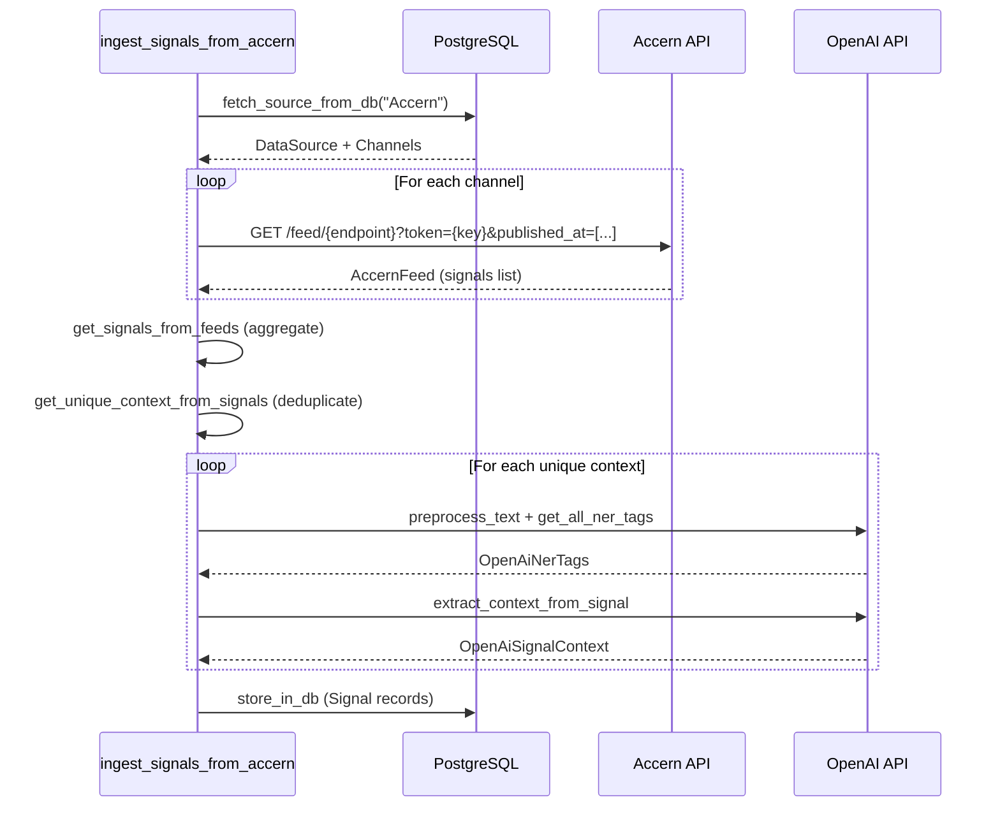
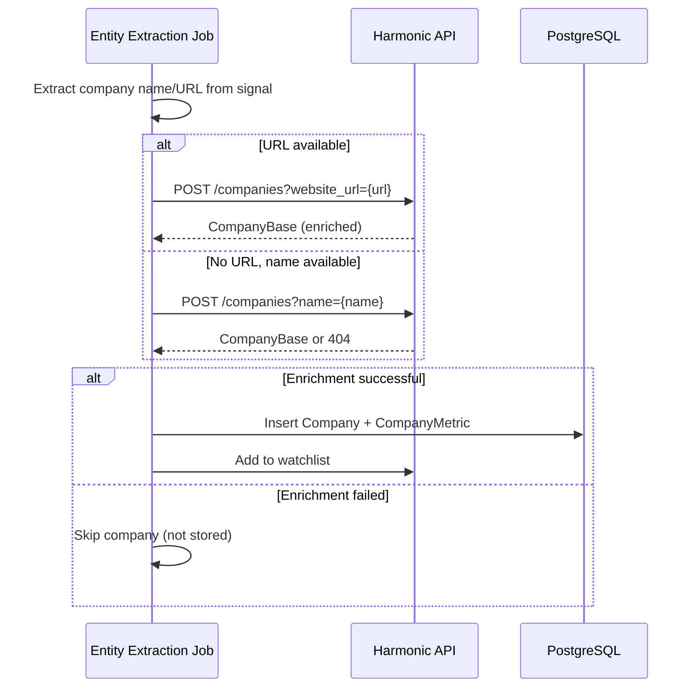
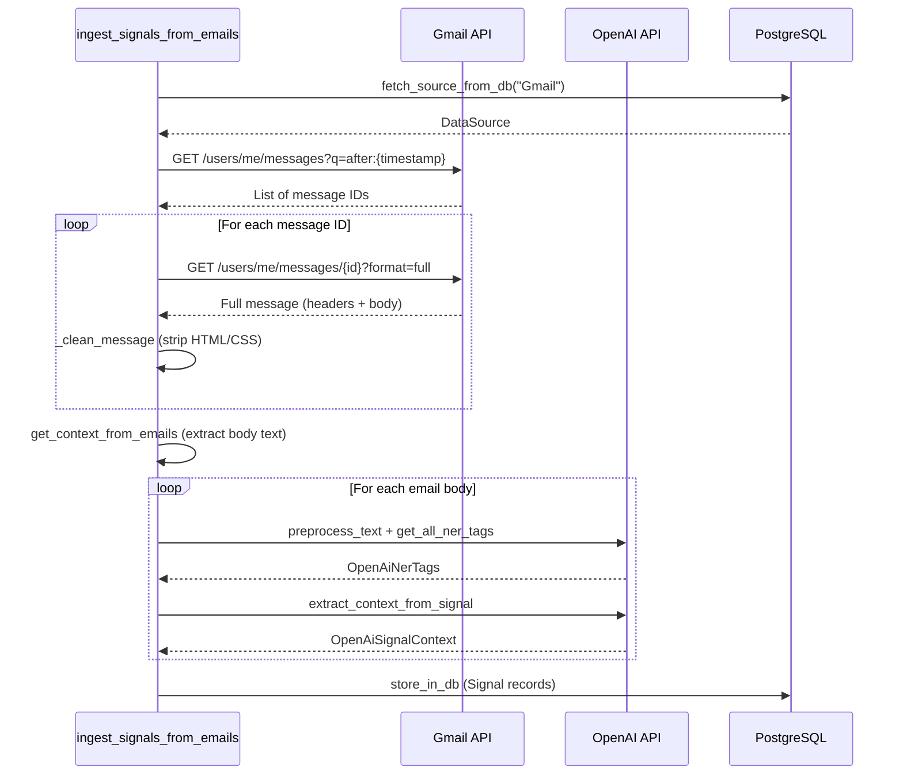
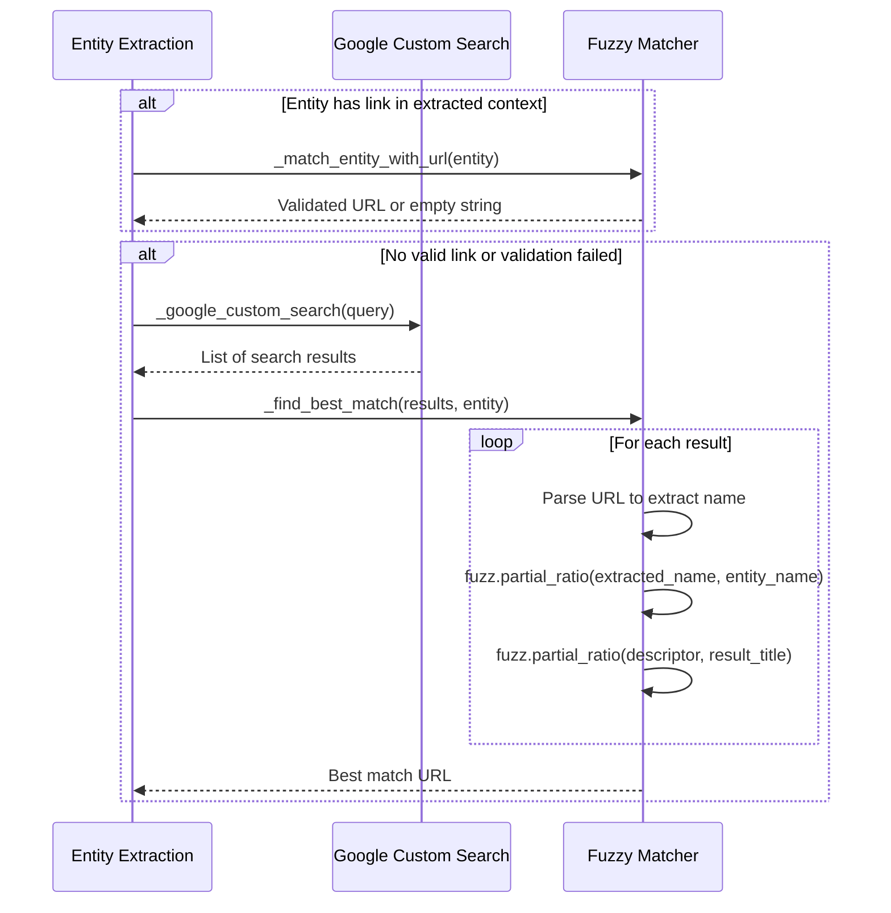
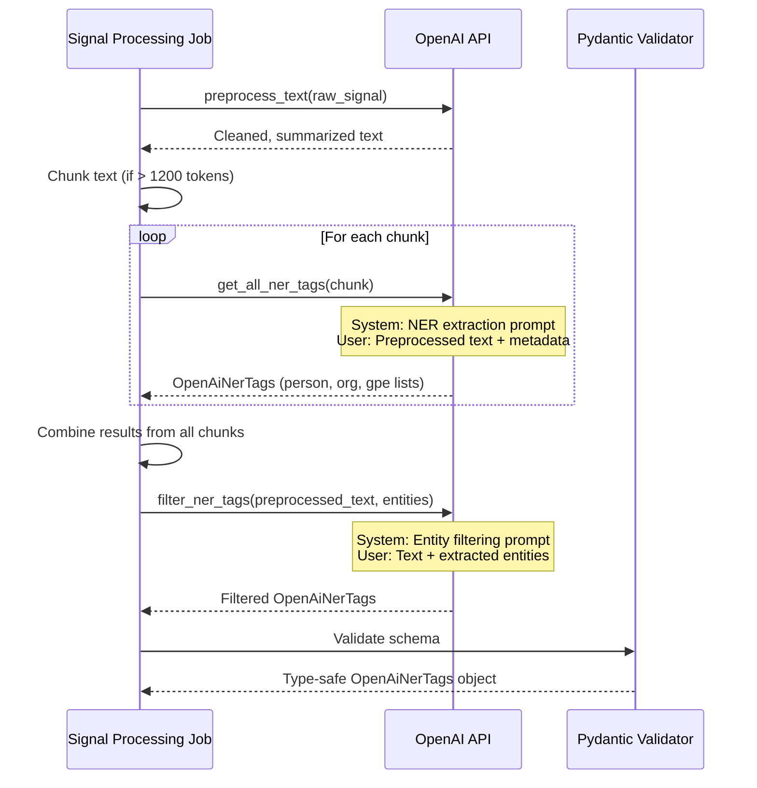
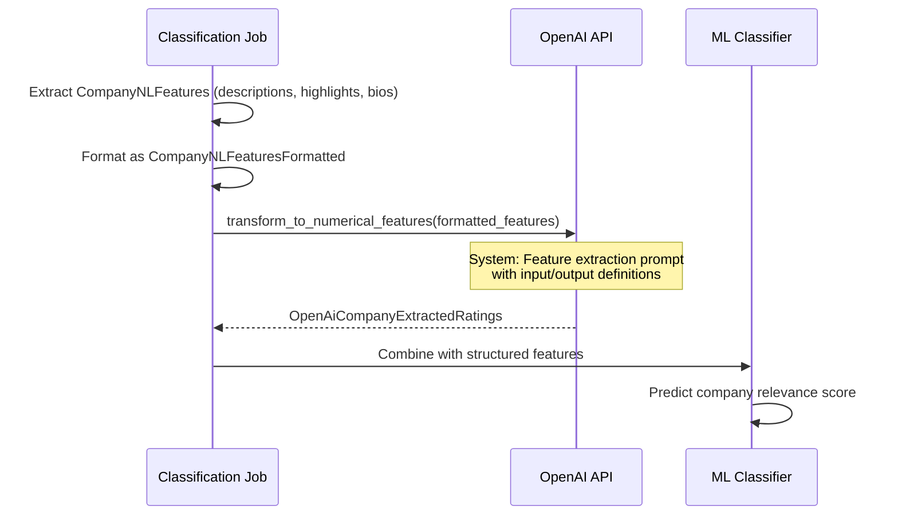

# 6. External Integrations

OMVision interfaces with five external APIs and data providers to collect, enrich, and analyze startup information. Each integration serves a distinct role in the data pipeline: Accern and Gmail provide signal sources, Harmonic enriches entity data, Google Custom Search discovers URLs, and OpenAI extracts structured information from unstructured text.

This section documents how OMVision authenticates with, consumes data from, and handles errors across all external systems. Integration logic is implemented as Dagster resources (`app/resources/`), which are instantiated once per job run and injected into operations as needed.

---

## 6.1 Accern API

Accern is a portfolio company of OMVC that provides NLP-driven intelligence feeds for identifying venture funding events, partnerships, and market signals. Accern delivers data through topically-focused channels, each representing a distinct use case such as "real-time venture deal flow" or "co-investor tracking."

OMVision maintains three active Accern channels, configured in `app/constants/data_sources.py`. Each channel has a dedicated API endpoint and JWT authentication token.

### 6.1.1 Authentication & Setup

**Resource Configuration**

The `AccernResource` (`app/resources/accern_api.py`) manages all interactions with the Accern API:

```python
class AccernResource(ConfigurableResource):
    """
    A resource class for interacting with the Accern API.

    Attributes:
        base_url (str): The base URL for the Accern API. Default is "https://app.accern.com/".
    """
    base_url: str = "https://app.accern.com/"
```

The resource is instantiated in `app/main.py` with configuration from environment variables:

```python
"accern": AccernResource()
```

**Channel Configuration**

Channels are defined in `app/constants/data_sources.py` with the following structure:

```python
DataSourceBase(
    name="Accern",
    description="Accern API for incoming data feeds",
    base_url="https://app.accern.com/",
    channels=[
        Channel(
            api_key="eyJhbGciOiJSUzI1NiIsInR5cCI6IkpXVCJ9...",
            api_endpoint="feed/real-time-venture-deal-flow-bcc2d312-vectr"
        ),
        Channel(
            api_key="eyJhbGciOiJSUzI1NiIsInR5cCI6IkpXVCJ9...",
            api_endpoint="feed/deal-flow-fund-i-co-investor-tracking-6706ac78-vectr"
        ),
        Channel(
            api_key="eyJhbGciOiJSUzI1NiIsInR5cCI6IkpXVCJ9...",
            api_endpoint="feed/deal-flow-fund-ii-co-investor-tracking-e1c5e74b-vectr"
        ),
    ],
)
```

**Authentication Method**

Accern uses JWT bearer tokens for authentication. Each channel's `api_key` is a signed JWT that grants access to a specific feed endpoint. Tokens are passed as query parameters in API requests:

```
GET https://app.accern.com/feed/{endpoint}?token={api_key}&published_at=[{start}..{end}]
```

**Required Environment Variables**

None. Channel credentials are hardcoded in `data_sources.py` and persisted to the database during system initialization via the `upsert_data_sources` job.

### 6.1.2 Data Ingestion Process

The `ingest_signals_from_accern` job (`app/jobs/ingest_signals_from_accern.py`) orchestrates the following workflow:



**Step-by-Step Breakdown**

1. **Fetch Source Metadata** (`fetch_source_from_db`)
   - Retrieves the "Accern" data source record from the database, including all associated channels with their API credentials

2. **Ingest Data from Channels** (`ingest_data_from_channels`)
   - For each configured channel, calls `AccernResource.fetch_feed()` to retrieve signals from the past 24 hours
   - Time window: 11:00 AM previous day to 11:00 AM current day (America/New_York timezone)

3. **Extract Signals from Feeds** (`get_signals_from_feeds`)
   - Flattens the list of `AccernFeed` objects into a single list of `AccernSignal` objects

4. **Deduplicate Signal Context** (`get_unique_context_from_signals`)
   - Removes duplicate signals using a composite key of:
     - `entity_text` (tuple)
     - `event_text` (tuple)
     - `entity_name`
     - `entity_type`
     - `doc_title`
     - `doc_url`
   - Returns both unique contexts and corresponding unique signals

5. **Entity Extraction** (See §6.5 OpenAI Integration)
   - Preprocesses text and extracts named entities
   - Filters irrelevant entities (e.g., large organizations, government agencies)
   - Extracts additional context for each entity

6. **URL Enrichment** (See §6.4 Google Custom Search)
   - Discovers company websites and LinkedIn profiles for extracted entities

7. **Entity Filtering** (`filter_entities`)
   - Removes entities that match the company filter list (manually curated exclusion list)

8. **Store in Database** (`store_in_db`)
   - Persists `Signal` records with both raw and filtered entity tags

**Fetch Feed Implementation**

```python
def fetch_feed(self, endpoint: str, token: str) -> AccernFeed:
    """
    Fetches feed data from the Accern API for the past 24 hours using the given endpoint and token.
    """
    ny_tz = pytz.timezone("America/New_York")
    end_date = datetime.now(ny_tz).replace(hour=11, minute=0, second=0, microsecond=0)
    start_date = end_date - timedelta(hours=24)

    start_str = start_date.strftime("%Y-%m-%dT%H:%M")
    end_str = end_date.strftime("%Y-%m-%dT%H:%M")
    endpoint_with_queries = f"{self.base_url}{endpoint}?token={token}&published_at=[{start_str}..{end_str}]"

    response = requests.get(
        endpoint_with_queries,
        headers={"user-agent": "dagster"},
    ).json()

    return AccernFeed.model_validate(response)
```

**Error Handling**

- HTTP errors from `requests.get()` propagate as unhandled exceptions, failing the Dagster job
- Failed jobs are retried according to Dagster's run status sensor logic
- No explicit rate limiting (Accern API does not impose rate limits on authenticated channels)

**Integration with Data Pipeline**

The `ingest_signals_from_accern` job is scheduled to run hourly at `:00` (see §3.3 Scheduling & Sensors). Upon successful completion, the `signal_ingestion_from_accern` sensor triggers downstream jobs:

- `ingest_companies_from_signals` (extracts and enriches companies)
- `ingest_people_from_signals` (extracts and enriches people)

### 6.1.3 Data Schema

**AccernFeed**

The top-level response object returned by the Accern API:

```python
class AccernFeed(BaseModel):
    start_harvested_at: str       # Start of harvest time window
    end_harvested_at: str         # End of harvest time window
    start_published_at: str       # Start of publication time window
    end_published_at: str         # End of publication time window
    total: int                    # Number of signals in this feed
    overall_total: int            # Total signals available (may exceed returned count)
    signals: Optional[list[AccernSignal]]  # List of signal objects
```

**AccernSignal**

Individual signal records containing entity and event information:

| Field | Type | Description |
|-------|------|-------------|
| `entity_text` | `list[str]` | Text snippets describing entities (companies, people) |
| `event_text` | `list[str]` | Text snippets describing events (funding, acquisitions) |
| `entity_name` | `Optional[str]` | Primary entity mentioned in the signal |
| `entity_type` | `Optional[str]` | Entity classification (Company, Person, etc.) |
| `entity_accern_id` | `Optional[str]` | Accern's internal entity identifier |
| `entity_sentiment` | `Optional[float]` | Sentiment score for entity mention |
| `entity_relevance` | `Optional[float]` | Relevance score (0-1) |
| `event` | `Optional[str]` | Event classification (Funding, Acquisition, etc.) |
| `event_group` | `Optional[str]` | High-level event category |
| `event_sentiment` | `Optional[float]` | Sentiment score for event |
| `event_relevance` | `Optional[float]` | Event relevance score (0-1) |
| `doc_title` | `Optional[str]` | Title of source document/article |
| `doc_url` | `Optional[str]` | URL of source document |
| `doc_source` | `Optional[str]` | Publication name (e.g., "TechCrunch") |
| `doc_sentiment` | `Optional[float]` | Overall document sentiment |
| `published_at` | `Optional[datetime]` | Publication timestamp |
| `crawled_at` | `Optional[datetime]` | Time Accern discovered the document |
| `harvested_at` | `Optional[datetime]` | Time Accern processed the document |
| `signal_id` | `Optional[str]` | Unique signal identifier |
| `signal_relevance` | `Optional[float]` | Overall signal relevance score |
| `signal_sentiment` | `Optional[float]` | Overall signal sentiment |
| `signal_tag` | `Optional[str]` | Signal classification tag |
| `primary_signal` | `Optional[bool]` | Whether this is the primary signal for the entity |
| `doc_cluster_id` | `Optional[str]` | Cluster ID for related documents |
| `doc_id` | `Optional[str]` | Unique document identifier |
| `doc_type` | `Optional[str]` | Document type (article, blog, press release) |
| `entity_ticker` | `Optional[str]` | Stock ticker symbol (if applicable) |
| `entity_hits` | `Optional[list[str]]` | Entity mention locations in text |
| `event_hits` | `Optional[list[str]]` | Event mention locations in text |
| `event_accern_id` | `Optional[str]` | Accern's internal event identifier |
| `provider_id` | `Optional[float]` | Content provider identifier |

**Example Signal**

```json
{
  "entity_text": ["DeepTech, an AI infrastructure startup"],
  "event_text": ["raised $50M in Series A funding"],
  "entity_name": "DeepTech",
  "entity_type": "Company",
  "entity_sentiment": 0.85,
  "entity_relevance": 0.92,
  "event": "Funding",
  "event_group": "Investment",
  "event_sentiment": 0.78,
  "event_relevance": 0.95,
  "doc_title": "DeepTech Raises $50M to Scale AI Infrastructure Platform",
  "doc_url": "https://techcrunch.com/2025/11/04/deeptech-raises-50m",
  "doc_source": "TechCrunch",
  "published_at": "2025-11-04T09:30:00Z",
  "signal_id": "sig_abc123",
  "signal_relevance": 0.93,
  "primary_signal": true
}
```

---

## 6.2 Harmonic API

Harmonic is a B2B company intelligence platform that provides structured data on companies and people. Unlike Accern and Gmail (which require entity extraction from unstructured text), Harmonic returns fully identified and enriched entities with comprehensive metadata.

OMVision leverages Harmonic for three purposes:

1. **Saved Search Ingestion**: Automatically retrieves companies and people from user-defined searches
2. **Entity Enrichment**: Enriches companies and people extracted from signals with structured metadata
3. **Watchlist Management**: Adds discovered entities to Harmonic watchlists for tracking

### 6.2.1 Resource Configuration

**Resource Definition**

The `HarmonicResource` (`app/resources/harmonic_api.py`) manages all Harmonic API interactions:

```python
class HarmonicResource(ConfigurableResource):
    """
    A resource class for interacting with the Harmonic API.

    Attributes:
        api_key (str): The API key used to authenticate requests to the Harmonic API.
        _base_url (str): The base URL for the Harmonic API.
        _headers (dict[str, str]): Headers used for the API requests.
    """
    api_key: str
    _base_url: str = PrivateAttr()
    _headers: dict[str, str] = PrivateAttr()

    def setup_for_execution(self, context: InitResourceContext):
        """Sets up the base URL and headers for making API requests to Harmonic."""
        self._base_url = "https://api.harmonic.ai/"
        self._headers = {
            "apikey": self.api_key,
            "Content-Type": "application/json",
        }
```

**Instantiation**

Configured in `app/main.py`:

```python
"harmonic": HarmonicResource(
    api_key=os.getenv("HARMONIC_API_KEY")
)
```

**Authentication Method**

Harmonic uses API key authentication passed in request headers:

```
GET https://api.harmonic.ai/{endpoint}
Headers:
  apikey: {HARMONIC_API_KEY}
  Content-Type: application/json
```

**Required Environment Variables**

| Variable | Description |
|----------|-------------|
| `HARMONIC_API_KEY` | API key for Harmonic platform access |

**Configuration in Data Sources**

Harmonic is also configured in `app/constants/data_sources.py` for database persistence:

```python
DataSourceBase(
    name="Harmonic Search",
    description="Harmonic API for company data",
    base_url="https://api.harmonic.ai",
    channels=[
        Channel(
            api_key="bvudcyYYlP6g0kQPEe097iA5ERcYfiuX",
            api_endpoint="",
        ),
    ],
)
```

### 6.2.2 Search Operations

Harmonic provides search functionality for both companies and people. OMVision uses saved searches (user-defined queries in Harmonic's UI) to automatically ingest entities matching specific criteria.

**Fetching Saved Searches**

```python
def fetch_searches(self, search_type: SearchType) -> list[SearchList]:
    """
    Fetches all saved searches of the specified type from the Harmonic API.
    
    Args:
        search_type: Either SearchType.companies or SearchType.people
    
    Returns:
        list[SearchList]: List of saved search objects
    """
    endpoint = "searches"
    params = {"search_type": search_type.value}
    return self._fetch_all_pages(endpoint, SearchList, params)
```

**Pagination**

Harmonic API results are paginated. The `_fetch_all_pages` method automatically iterates through all pages:

```python
def _fetch_all_pages(
    self,
    endpoint: str,
    model: Type[T],
    params: Optional[dict[str, any]] = {"size": 50},
) -> list[T]:
    """
    Fetches all paginated results from the Harmonic API for the given endpoint.
    """
    all_items = []
    cursor = None

    while True:
        if cursor:
            params["cursor"] = cursor
        response = requests.get(
            f"{self._base_url}{endpoint}", headers=self._headers, params=params
        )
        response.raise_for_status()
        data = response.json()
        
        all_items.extend([model(**item) for item in data["results"]])

        if not data["page_info"]["has_next"]:
            break
        cursor = data["page_info"]["next"]

    return all_items
```

**Search Filtering**

OMVision only ingests searches whose names start with "DealFlow":

```python
def get_saved_searches_from_harmonic() -> list[SearchList]:
    """Fetches all saved company searches prefixed with 'DealFlow'."""
    searches = harmonic.fetch_searches(SearchType.companies)
    return [s for s in searches if s.name.startswith("DealFlow") and "Filter" not in s.name]
```

This naming convention allows investment team members to create personal searches without triggering automatic ingestion.

**Fetching Search Results**

Once a search is identified, its results are retrieved:

```python
def fetch_companies_from_search(self, search_id: str) -> list[CompanyBase]:
    """
    Fetches all companies from a specific saved search.
    
    Args:
        search_id: Unique identifier for the saved search
    
    Returns:
        list[CompanyBase]: Fully enriched company objects
    """
    endpoint = f"searches/{search_id}/companies"
    return self._fetch_all_pages(endpoint, CompanyBase)
```

**Watchlist Operations**

Harmonic watchlists track entities of interest:

```python
def fetch_watchlists(self) -> list[Watchlist]:
    """Fetches all company watchlists from the Harmonic API."""
    endpoint = "watchlists/companies"
    watchlists = self._fetch_all_pages(endpoint, Watchlist)
    return [w for w in watchlists if w.name.startswith("DealFlow")]

def add_to_watchlist(self, watchlist_id: str, company_urns: list[str]) -> None:
    """
    Adds companies to a Harmonic watchlist.
    
    Args:
        watchlist_id: Unique identifier for the watchlist
        company_urns: List of Harmonic URNs for companies to add
    """
    endpoint = f"watchlists/companies/{watchlist_id}/add"
    payload = {"company_urns": company_urns}
    response = requests.post(
        f"{self._base_url}{endpoint}",
        headers=self._headers,
        json=payload
    )
    response.raise_for_status()
```

### 6.2.3 Data Enrichment

Harmonic enrichment transforms entity names or URLs into fully structured company and people records.

**Company Enrichment Flow**



**Enrichment by URL**

The primary enrichment method uses company website URLs:

```python
def enrich_company(self, identifier_type: str, identifier_value: str) -> Optional[CompanyBase]:
    """
    Enriches a company using the Harmonic API.
    
    Args:
        identifier_type: "website_url", "linkedin_url", or "id"
        identifier_value: The identifier value (e.g., "https://deeptech.ai")
    
    Returns:
        CompanyBase: Fully enriched company object, or None if not found
    """
    params = {identifier_type: identifier_value}
    
    try:
        response = requests.post(
            f"{self._base_url}companies",
            headers=self._headers,
            params=params
        )
        response.raise_for_status()
        data = response.json()
        return CompanyBase(**data)
    except requests.RequestException as e:
        log.info(f"API call failed: {e}")
        return None
```

**Enrichment by Name**

When no URL is available, OMVision attempts enrichment by company name:

```python
enriched_company = harmonic.enrich_company("name", "DeepTech")
```

Name-based enrichment is less precise and may return incorrect matches. Failed enrichments return `None` and the company is not stored.

**People Enrichment**

People enrichment follows an identical pattern using LinkedIn URLs:

```python
def enrich_people(self, identifier_type: str, identifier_value: str) -> Optional[PeopleBase]:
    """
    Enriches a person using the Harmonic API.
    
    Args:
        identifier_type: "linkedin_url" or "id"
        identifier_value: The identifier value (e.g., "https://linkedin.com/in/jane-smith")
    
    Returns:
        PeopleBase: Fully enriched person object, or None if not found
    """
    params = {identifier_type: identifier_value}
    
    try:
        response = requests.post(
            f"{self._base_url}people",
            headers=self._headers,
            params=params
        )
        response.raise_for_status()
        data = response.json()
        return PeopleBase(**data)
    except requests.RequestException as e:
        log.info(f"API call failed: {e}")
        return None
```

**Enriched Data Structure**

A fully enriched `CompanyBase` object contains:

- **Core Attributes**: name, legal_name, description, contact, founding_date, website_urls, logo_url, ownership_status, location, tags, socials
- **Metrics**: stage, headcount, traction_metrics (web traffic, social metrics), funding details, investor URNs, funding_rounds
- **People**: employees with roles, LinkedIn profiles, experience, education
- **Highlights**: company highlights (partnerships, products) and employee highlights (former employers, skills)

**Error Handling**

- HTTP 404: Company/person not found in Harmonic's database → Returns `None`
- HTTP 4xx/5xx: API errors propagate as unhandled exceptions, failing the Dagster job
- Network errors: Caught by `requests.RequestException`, logged, and return `None`

**Rate Limiting**

Harmonic does not publicly document rate limits. OMVision does not implement explicit rate limiting for Harmonic API calls. If rate limiting becomes necessary, the `RateLimiter` utility class (§6.4.2) can be applied.

**Integration with Data Pipeline**

Harmonic enrichment occurs in:

1. **`ingest_companies_from_signals`**: Enriches companies extracted from Accern/Gmail signals
2. **`ingest_companies_from_searches`**: Retrieves pre-enriched companies from saved searches
3. **`ingest_people_from_signals`**: Enriches people extracted from signals
4. **`ingest_people_from_searches`**: Retrieves pre-enriched people from saved searches

---

## 6.3 Gmail Integration

OMVision monitors a dedicated Gmail inbox (`newsletters@omvc.co`) that receives venture capital newsletters, startup announcement emails, and industry alerts. These emails frequently mention early-stage companies, funding rounds, and product launches—all valuable deal flow signals.

Unlike Accern signals with structured entity/event fields, email bodies require full text extraction and NER processing to discover entities.

### 6.3.1 Service Account Setup

Gmail integration uses a Google service account with domain-wide delegation, allowing OMVision to access the `newsletters@omvc.co` inbox without requiring user-specific OAuth tokens.

**Resource Configuration**

The `GmailResource` (`app/resources/mail_client.py`) manages Gmail API access:

```python
class GmailResource(ConfigurableResource):
    """
    A resource class for interacting with Gmail via a service account.

    Attributes:
        email_address (str): The email address used to impersonate when accessing Gmail.
        service_account_info (str): Base64-encoded service account information.
        _service (PrivateAttr): The Gmail API service object.
    """
    email_address: str = "newsletters@omvc.co"
    service_account_info: str
    _service = PrivateAttr()

    def setup_for_execution(self, context: InitResourceContext):
        """Sets up the Gmail API service for execution."""
        self._service = self._get_service()
```

**Instantiation**

Configured in `app/main.py`:

```python
"gmail": GmailResource(
    service_account_info=os.getenv("GMAIL_SERVICE_ACCOUNT_KEY")
)
```

**Authentication Method**

Gmail uses OAuth 2.0 with service account credentials:

```python
def _authenticate_gmail(self):
    """
    Authenticates with Gmail using the provided service account information.
    
    Returns:
        Credentials: Google API credentials with delegated access to the specified email.
    """
    if not self.service_account_info:
        raise ValueError("Service account info not found in environment variables")

    service_account_info = base64.b64decode(self.service_account_info).decode("utf-8")
    creds = Credentials.from_service_account_info(
        json.loads(service_account_info),
        scopes=["https://www.googleapis.com/auth/gmail.readonly"],
    )
    delegated_creds = creds.with_subject(self.email_address)
    return delegated_creds
```

**Service Account Setup Steps**

(These steps are performed once during initial system setup, not at runtime):

1. Create a service account in Google Cloud Console
2. Enable Gmail API for the project
3. Configure domain-wide delegation in Google Workspace Admin Console
4. Grant the service account `gmail.readonly` scope for the domain
5. Download service account JSON key
6. Base64-encode the JSON key and store in `GMAIL_SERVICE_ACCOUNT_KEY` environment variable

**Required Environment Variables**

| Variable | Description |
|----------|-------------|
| `GMAIL_SERVICE_ACCOUNT_KEY` | Base64-encoded Google service account JSON key with domain-wide delegation |

**Scopes**

```python
SCOPES = ["https://www.googleapis.com/auth/gmail.readonly"]
```

OMVision only requires read access to Gmail. No write or send permissions are granted.

### 6.3.2 Email Processing

The `ingest_signals_from_emails` job (`app/jobs/ingest_signals_from_emails.py`) processes emails through the following sequence:



**Fetching Emails**

```python
def get_emails(self) -> list[MailMessage]:
    """
    Fetches email messages from the Gmail API for the past 24 hours.
    
    Returns:
        list[MailMessage]: A list of email messages, cleaned and with full content.
    """
    try:
        ny_tz = pytz.timezone("America/New_York")
        end_date = datetime.now(ny_tz).replace(hour=11, minute=0, second=0, microsecond=0)
        start_date = end_date - timedelta(hours=24)
        query = f"after:{int(start_date.timestamp())}"

        # Fetch messages from the past day
        results = (
            self._service.users().messages().list(userId="me", q=query).execute()
        )
        messages = results.get("messages", [])
        messages_with_data = []

        for message in messages:
            message_id = message.get("id")
            full_message = self._get_full_message(message_id)
            if full_message.body:
                full_message.body = self._clean_message(full_message.body)
            messages_with_data.append(full_message)

        return messages_with_data
    except Exception as e:
        raise Exception(f"Failed to retrieve emails: {e}")
```

**Message Retrieval**

```python
def _get_full_message(self, message_id: str) -> MailMessage:
    """
    Retrieves the full content of an email message by ID.
    
    Args:
        message_id: The ID of the email message.
    
    Returns:
        MailMessage: The full email message, including sender, date, and body.
    """
    message = (
        self._service.users()
        .messages()
        .get(userId="me", id=message_id, format="full")
        .execute()
    )
    headers = message.get("payload", {}).get("headers", [])
    sender = self._extract_header(headers, "From")
    date = self._extract_header(headers, "Date")
    body = self._extract_body(message.get("payload", {}))

    return MailMessage(sender=sender, date=date, body=body)
```

**HTML Cleaning**

Email bodies often contain HTML markup, CSS styles, and formatting artifacts. The `_clean_message` method strips these:

```python
def _clean_message(self, message: str) -> str:
    """
    Cleans an email message by removing CSS and extracting plain text content.
    
    Args:
        message: The raw email message content.
    
    Returns:
        str: The cleaned message content, with unnecessary elements removed.
    """
    try:
        message_no_css = re.sub(r"\*{.*?}}\r\n", "", message, flags=re.DOTALL)
        soup = BeautifulSoup(message_no_css, "html.parser")
        clean_text = soup.get_text(separator=" ").strip()
        return clean_text
    except:
        return message
```

**Text Extraction Process**

1. Remove CSS blocks using regex: `\*{.*?}}`
2. Parse HTML with BeautifulSoup
3. Extract plain text with spaces as separators
4. Strip leading/trailing whitespace
5. Fallback to original message if parsing fails

**MailMessage Schema**

```python
class MailMessage(BaseModel):
    sender: Optional[str]  # Email address of sender
    date: Optional[str]    # Date string from email headers
    body: str              # Cleaned plain text body
```

### 6.3.3 Signal Extraction

Once emails are fetched and cleaned, their bodies are processed as unstructured text:

```python
@op
def get_context_from_emails(emails: list[MailMessage]) -> list[str]:
    """
    Extracts the body content from each email message.
    
    Args:
        emails: A list of email messages.
    
    Returns:
        list[str]: A list of email body content as strings.
    """
    return [f"{email.body}" for email in emails]
```

This operation extracts email bodies as plain strings, which are then processed by OpenAI NER (§6.5) to identify companies and people.

**Differences from Accern Signals**

- **No structured entity/event fields**: Email bodies are raw text without pre-identified entities
- **No deduplication**: Each email represents a distinct temporal signal, even if multiple emails mention the same company
- **Higher NER complexity**: Emails contain more noise (greetings, signatures, advertisements) requiring more robust filtering

**Error Handling**

- Gmail API errors: Propagate as unhandled exceptions, failing the Dagster job
- HTML parsing errors: Caught by try/except in `_clean_message`, falls back to raw message
- Empty emails: Stored as signals with empty body text (filtered out during NER)

**Integration with Data Pipeline**

The `ingest_signals_from_emails` job is scheduled to run daily at 3:00 PM (see §3.3 Scheduling & Sensors). Upon successful completion, the `signal_ingestion_from_gmail` sensor triggers:

- `ingest_companies_from_signals` (with `source_name="Gmail"`)
- `ingest_people_from_signals` (with `source_name="Gmail"`)

---

## 6.4 Google Custom Search

Google Custom Search API enables OMVision to discover company websites and LinkedIn profiles for entities extracted from unstructured signals. When Accern or Gmail signals mention a company without providing a URL, OMVision constructs a search query and uses fuzzy matching to identify the most relevant result.

This integration is critical for URL-based enrichment with Harmonic, which requires website URLs rather than company names.

### 6.4.1 API Configuration

**Resource Definition**

The `WebSearchResource` (`app/resources/web_search.py`) manages Google Custom Search operations:

```python
class WebSearchResource(ConfigurableResource):
    """
    A resource class for performing web searches using Google's Custom Search API.

    Attributes:
        api_key (str): The API key for authenticating requests to Google Custom Search API.
        cse_id (str): The custom search engine ID used for querying Google Custom Search.
        _service (PrivateAttr): The Google Custom Search API service object.
        _rate_limiter (PrivateAttr): A rate limiter to control API requests.
    """
    api_key: str
    cse_id: str
    _service = PrivateAttr()
    _rate_limiter = PrivateAttr()

    def setup_for_execution(self, context: InitResourceContext):
        """Sets up the Google Custom Search API service and rate limiter."""
        self._service = build("customsearch", "v1", developerKey=self.api_key)
        self._rate_limiter = RateLimiter(100, 60)  # 100 requests per 60 seconds
```

**Instantiation**

Configured in `app/main.py`:

```python
"google": WebSearchResource(
    api_key=os.getenv("GOOGLE_SEARCH_API_KEY"),
    cse_id=os.getenv("GOOGLE_SEARCH_ENGINE_ID"),
)
```

**Authentication Method**

Google Custom Search uses API key authentication passed as a request parameter:

```
GET https://www.googleapis.com/customsearch/v1?key={API_KEY}&cx={CSE_ID}&q={query}
```

**Required Environment Variables**

| Variable | Description |
|----------|-------------|
| `GOOGLE_SEARCH_API_KEY` | API key for Google Custom Search |
| `GOOGLE_SEARCH_ENGINE_ID` | Custom Search Engine ID (created in Google Programmable Search Engine console) |

**Custom Search Engine Setup**

(Performed once during initial configuration):

1. Create a Programmable Search Engine at https://programmablesearchengine.google.com
2. Configure to search the entire web (not restricted to specific sites)
3. Enable image search and safe search as needed
4. Copy the Search Engine ID (CSE ID)
5. Enable Custom Search API in Google Cloud Console
6. Generate API key with Custom Search API permissions

### 6.4.2 Rate Limiting

Google Custom Search API enforces strict rate limits:

- **Free tier**: 100 queries per day
- **Paid tier**: 10,000 queries per day (with billing enabled)
- **Per-second limit**: ~100 queries per minute

OMVision implements a token bucket rate limiter to respect these limits and prevent throttling.

**RateLimiter Implementation**

```python
class RateLimiter:
    def __init__(self, max_calls, period, threshold=0.90):
        """
        :param max_calls: The maximum number of calls allowed within the period.
        :param period: The time period in seconds in which max_calls is allowed.
        :param threshold: The percentage (as a float) of max_calls allowed (default 90%).
        """
        self.max_calls = max_calls
        self.period = period
        self.threshold = threshold
        self.threshold_limit = int(max_calls * threshold)
        self._lock = Lock()
        self._request_counter = 0
        self._first_request_time = None

    def acquire(self):
        with self._lock:
            current_time = time.time()
            if self._first_request_time is None:
                self._first_request_time = current_time

            elapsed_time = current_time - self._first_request_time

            if elapsed_time > self.period:
                self._request_counter = 0
                self._first_request_time = current_time

            if self._request_counter >= self.threshold_limit:
                time_to_wait = ceil(self.period - elapsed_time)
                print(f"Rate limit hit. Sleeping for {time_to_wait} seconds.")
                time.sleep(time_to_wait)
                self._first_request_time = time.time()
                self._request_counter = 0

            self._request_counter += 1
```

**Configuration for Google Search**

```python
self._rate_limiter = RateLimiter(100, 60)  # 100 requests per 60 seconds
```

This configuration enforces 90% of the maximum rate (90 requests per minute) to provide a safety buffer.

**Usage Pattern**

Before each API call, the rate limiter's `acquire()` method is invoked:

```python
def _google_custom_search(self, query, website=None):
    """Performs a Google Custom Search query."""
    self._rate_limiter.acquire()  # Blocks if rate limit exceeded
    
    if website is not None:
        res = (
            self._service.cse()
            .list(q=query, cx=self.cse_id, siteSearch=website, siteSearchFilter="i")
            .execute()
        )
    else:
        res = self._service.cse().list(q=query, cx=self.cse_id).execute()

    results = res.get("items", [])
    return results
```

If the rate limit is exceeded, `acquire()` blocks the thread and sleeps until the rate window resets.

**Rate Limit Behavior**

| Scenario | Behavior |
|----------|----------|
| Under threshold | Request proceeds immediately |
| At threshold | Thread sleeps until rate window resets |
| Multiple threads | Lock ensures thread-safe counter updates |

### 6.4.3 Entity Matching

Google Custom Search returns a list of search results, each containing a title, URL, and snippet. OMVision uses fuzzy matching to identify the best result for a given entity.

**URL Discovery Flow**



**Match or Fetch Pattern**

```python
def match_or_fetch_company_url(self, company: OpenAiEntityContext) -> str:
    """
    Matches or fetches a company URL based on the company's name and descriptors.
    
    Args:
        company: The company entity context.
    
    Returns:
        str: The matched or fetched company URL.
    """
    # Try to match with existing link first
    matched_url = self._match_entity_with_url(company)

    if not matched_url:
        # No match found, search Google
        query = (
            f"{company.name} {company.descriptors[0]}"
            if company.descriptors
            else f"{company.name} website"
        )
        results = self._google_custom_search(query)
        matched_url = self._find_best_match(
            results,
            company.name,
            company.descriptors[0] if company.descriptors else "",
        )

    return matched_url
```

**URL Validation**

If the entity context already contains a link, it is validated using fuzzy matching:

```python
def _match_entity_with_url(
    self,
    entity: OpenAiEntityContext,
    entity_type: EntityType = EntityType.org,
    match_threshold: int = 80,
):
    """
    Matches an entity with a URL by performing fuzzy matching on the entity's name and URL.
    
    Args:
        entity: The entity to match.
        entity_type: The type of entity (default: EntityType.org).
        match_threshold: Minimum score required for a match (default: 80).
    
    Returns:
        str: The matched URL or an empty string if no match is found.
    """
    entity_link = ""

    if entity_type == EntityType.person:
        if "linkedin.com/in" not in entity.link:
            return entity_link

    if entity.link:
        parsed_entity_link = urlparse(entity.link)
        extracted_name = (
            self._parse_company_name_from_link(parsed_entity_link)
            if entity_type == EntityType.org
            else self._parse_profile_name_from_link(parsed_entity_link)
        )
        match_score, _ = self._get_match_scores(extracted_name, "", entity.name, "")

        if match_score >= match_threshold:
            entity_link = entity.link

    return entity_link
```

**Fuzzy Matching Algorithm**

```python
def _get_match_scores(
    self,
    profile_name: str,
    result_title: str,
    person_name: str,
    person_descriptor: str,
    match_threshold: int = 80,
    similarity_threshold: int = 25,
):
    """
    Calculates match score and similarity score between a profile name and result title.
    
    Args:
        profile_name: Extracted profile/company name from the result.
        result_title: The title of the search result.
        person_name: The name of the entity to match.
        person_descriptor: The descriptor of the entity to match.
        match_threshold: Minimum score required for a match (default: 80).
        similarity_threshold: Minimum score for similarity (default: 25).
    
    Returns:
        tuple[int, int]: A tuple containing the match score and similarity score.
    """
    match_score = fuzz.partial_ratio(profile_name.lower(), person_name.lower())
    if match_score >= match_threshold:
        similarity_score = fuzz.partial_ratio(
            person_descriptor.lower(), result_title.lower()
        )
        if similarity_score >= similarity_threshold:
            return match_score, similarity_score
        else:
            return match_score, 0
    return 0, 0
```

**Scoring Logic**

1. **Match Score**: Fuzzy match between extracted URL name and entity name
   - Must be ≥ 80 to be considered
2. **Similarity Score**: Fuzzy match between entity descriptor and search result title
   - Must be ≥ 25 to be considered
   - Used as a tiebreaker when multiple results have high match scores

**Best Match Selection**

```python
def _find_best_match(
    self,
    results,
    entity_name: str,
    entity_descriptor: str,
    entity_type: EntityType = EntityType.org,
):
    """
    Finds the best match for an entity from search results based on match and similarity scores.
    
    Returns:
        str: The URL of the best match.
    """
    highest_match_score = 0
    highest_similarity_score = 0
    best_match_url = ""

    for result in results:
        result_title = result.get("title", "")
        result_link = result.get("link", "")

        if result_link:
            parsed_link = urlparse(result_link)
            if entity_type == EntityType.person:
                result_title = result_title.replace(" | LinkedIn", "")
                extracted_name_from_link = self._parse_profile_name_from_link(parsed_link)
            else:
                extracted_name_from_link = self._parse_company_name_from_link(parsed_link)

            match_score, similarity_score = self._get_match_scores(
                extracted_name_from_link,
                result_title,
                entity_name,
                entity_descriptor,
            )

            if match_score > highest_match_score:
                highest_match_score = match_score

                if similarity_score > highest_similarity_score:
                    highest_similarity_score = similarity_score
                    best_match_url = (
                        parsed_link.scheme + "://" + parsed_link.netloc + parsed_link.path
                    )

    return best_match_url
```

**Example Matching**

**Input:**

- Entity name: "DeepTech"
- Entity descriptor: "AI infrastructure startup"

**Google Search Query:**
```
"DeepTech AI infrastructure startup"
```

**Search Results:**

| Result | Title | Link | Match Score | Similarity Score | Selected? |
|--------|-------|------|-------------|------------------|-----------|
| 1 | DeepTech - AI Infrastructure Platform | https://deeptech.ai | 100 | 95 | **Yes** |
| 2 | DeepTech \| Crunchbase | https://crunchbase.com/organization/deeptech | 0 | N/A | No |
| 3 | DeepTech Review - TechCrunch | https://techcrunch.com/deeptech-review | 0 | N/A | No |

**Best Match**: `https://deeptech.ai` with match_score=100, similarity_score=95

**Error Handling**

- No search results: Returns empty string (company not stored)
- Low match scores: Returns empty string (ambiguous match)
- API errors: Propagate as unhandled exceptions, failing the Dagster job

**Integration with Data Pipeline**

Google Custom Search is invoked by:

- `ingest_signals_from_accern`: Discovers URLs for companies mentioned in signals
- `ingest_signals_from_emails`: Discovers URLs for companies mentioned in emails
- `ingest_companies_from_signals`: Enriches extracted companies with URLs before Harmonic enrichment

---

## 6.5 OpenAI Integration

OpenAI's GPT models power OMVision's entity extraction, context analysis, and feature rating capabilities. The integration uses structured outputs (JSON mode) to ensure reliable, type-safe responses.

OMVision leverages OpenAI for three primary tasks:

1. **Named Entity Recognition (NER)**: Extract companies, people, and locations from unstructured text
2. **Entity Filtering**: Remove irrelevant entities (large corporations, government agencies)
3. **Company Rating Extraction**: Transform natural language features into numerical ratings for ML classification

### 6.5.1 API Setup

**Resource Configuration**

The `OpenAIResource` (`app/resources/open_ai.py`) manages all OpenAI API interactions:

```python
class OpenAIResource(ConfigurableResource):
    """
    A resource class for interacting with OpenAI's models to perform various tasks.

    Attributes:
        preprocess_model (str): Model for preprocessing text (default: "gpt-4o-mini").
        max_preprocess_context (int): Max context length for preprocessing (default: 128000).
        extraction_model (str): Model for entity extraction (default: "gpt-4o-2024-08-06").
        chunk_size (int): Maximum chunk size for tokenizing input (default: 1200).
        api_key (str): API key for authenticating requests to OpenAI's API.
        labels (list[str]): List of NER labels used during entity extraction.
        _client (OpenAI): OpenAI client for API interactions.
        _encoding (Encoding): Token encoding for handling model input/output.
    """
    preprocess_model: str = "gpt-4o-mini"
    max_preprocess_context: int = 128000
    extraction_model: str = "gpt-4o-2024-08-06"
    chunk_size: int = 1200
    api_key: str
    labels: list[str] = [
        "person (people, investors, entrepreneurs, etc.)",
        "org (organizations, companies, startups, agencies, institutions, etc.)",
        "gpe (geopolitical entities like countries, cities, states, etc.)",
    ]

    _client: OpenAI = PrivateAttr()
    _encoding: Encoding = PrivateAttr()

    def setup_for_execution(self, context: InitResourceContext):
        """Initializes the OpenAI client and token encoding before job execution."""
        self._client = OpenAI(api_key=self.api_key)
        self._encoding = encoding_for_model(self.extraction_model)
```

**Instantiation**

Configured in `app/main.py`:

```python
"openai": OpenAIResource(
    api_key=os.getenv("OPENAI_API_KEY")
)
```

**Authentication Method**

OpenAI uses API key authentication passed in request headers:

```
POST https://api.openai.com/v1/chat/completions
Headers:
  Authorization: Bearer {OPENAI_API_KEY}
  Content-Type: application/json
```

**Required Environment Variables**

| Variable | Description |
|----------|-------------|
| `OPENAI_API_KEY` | API key for OpenAI platform access (organization-scoped) |

**Model Selection**

- **Preprocessing**: `gpt-4o-mini` (fast, cost-effective for text cleaning)
- **Extraction**: `gpt-4o-2024-08-06` (high accuracy for structured outputs)

### 6.5.2 NER Tag Extraction

OMVision uses OpenAI to extract named entities from unstructured text, identifying companies, people, and geographic locations.

**NER Pipeline Flow**



**Text Preprocessing**

Before entity extraction, raw signal text is cleaned and summarized:

```python
def preprocess_text(self, source_text: str) -> str:
    """
    Preprocesses signal text by removing irrelevant information and summarizing.
    
    Args:
        source_text: The raw signal text to preprocess.
    
    Returns:
        str: Cleaned and summarized text suitable for NER.
    """
    messages = [
        {"role": "system", "content": self._preprocessing_system_prompt()},
        {"role": "user", "content": source_text},
    ]

    response = self._client.chat.completions.create(
        model=self.preprocess_model,
        messages=messages,
        temperature=0,
    )

    return response.choices[0].message.content
```

The preprocessing prompt removes:

- HTML artifacts and formatting
- Advertisements and boilerplate text
- Irrelevant metadata
- Duplicate information

**Text Chunking**

Long texts exceeding 1200 tokens are split into chunks:

```python
def _chunk_text(self, text: str) -> list[str]:
    """
    Splits text into chunks of approximately chunk_size tokens.
    
    Args:
        text: The text to chunk.
    
    Returns:
        list[str]: List of text chunks.
    """
    tokens = self._encoding.encode(text)
    chunks = []
    
    for i in range(0, len(tokens), self.chunk_size):
        chunk_tokens = tokens[i:i + self.chunk_size]
        chunk_text = self._encoding.decode(chunk_tokens)
        chunks.append(chunk_text)
    
    return chunks
```

**NER Extraction**

```python
def get_all_ner_tags(
    self,
    preprocessed_text: str,
    additional_context: Optional[dict] = None
) -> OpenAiNerTags:
    """
    Extracts named entities from preprocessed text.
    
    Args:
        preprocessed_text: Cleaned and summarized text.
        additional_context: Optional metadata (entity_name, doc_title, etc.).
    
    Returns:
        OpenAiNerTags: Structured entity lists (person, org, gpe).
    """
    chunks = self._chunk_text(preprocessed_text)
    ner_tags_for_all_chunks = []

    for chunk in chunks:
        user_message_content = chunk
        if additional_context:
            user_message_content += f"\n\nAdditional Context:\n{json.dumps(additional_context)}"

        messages = [
            {"role": "system", "content": self._system_message(self.labels)},
            {"role": "user", "content": user_message_content},
        ]

        response = self._client.beta.chat.completions.parse(
            model=self.extraction_model,
            messages=messages,
            temperature=0,
            response_format=OpenAiNerTags,
        )

        message = response.choices[0].message
        if message.parsed:
            ner_tags_for_all_chunks.append(message.parsed)

    # Combine results from all chunks
    combined_ner_tags = OpenAiNerTags(person=[], org=[], gpe=[])
    for ner_tags in ner_tags_for_all_chunks:
        combined_ner_tags.person.extend(ner_tags.person)
        combined_ner_tags.org.extend(ner_tags.org)
        combined_ner_tags.gpe.extend(ner_tags.gpe)

    return combined_ner_tags
```

**System Prompt**

```python
def _system_message(self, labels):
    """Generates a system message for NER extraction, defining entity types."""
    return f"""
    You are an expert in Natural Language Processing. Your task is to identify common Named Entities (NER) in a given natural language signal text.
    The possible common Named Entities (NER) types are exclusively: ({", ".join(labels)}).
    """
```

**Additional Context**

For Accern signals, additional metadata is provided to improve extraction accuracy:

```python
additional_context = {
    "entity_name": signal.entity_name,
    "entity_type": signal.entity_type,
    "doc_title": signal.doc_title,
    "doc_url": signal.doc_url
}
```

This context helps the model disambiguate entities and prioritize relevant mentions.

**Structured Output Schema**

```python
class OpenAiNerTags(BaseModel):
    person: list[str]  # List of person names
    org: list[str]     # List of organization names
    gpe: list[str]     # List of geopolitical entity names
```

Using `response_format=OpenAiNerTags` ensures OpenAI returns JSON matching this exact schema, eliminating parsing errors.

**Entity Filtering**

After initial extraction, irrelevant entities are filtered out:

```python
def filter_ner_tags(
    self,
    preprocessed_text: str,
    entities: OpenAiNerTags
) -> OpenAiNerTags:
    """
    Filters extracted entities to remove large organizations, government agencies, etc.
    
    Args:
        preprocessed_text: The preprocessed text.
        entities: The NER tags to filter.
    
    Returns:
        OpenAiNerTags: Filtered NER tags.
    """
    entities_str = json.dumps(entities.model_dump())
    messages = [
        {"role": "system", "content": self._filter_text_system_prompt()},
        {
            "role": "user",
            "content": f"""Source text: {preprocessed_text} \n\n\n Extracted entities: {entities_str}\n""",
        },
    ]

    response = self._client.beta.chat.completions.parse(
        model=self.extraction_model,
        messages=messages,
        temperature=0,
        response_format=OpenAiNerTags,
    )

    message = response.choices[0].message
    if message.parsed:
        return message.parsed
    else:
        print(f"Unable to filter NER tags - {message.refusal}")
        return entities
```

**Filtering Criteria**

The filtering prompt instructs the model to remove:

- Large public corporations (e.g., Google, Microsoft)
- Government agencies and institutions
- Universities and research institutions (unless they are the primary entity)
- Generic organization references (e.g., "the company", "the startup")

**Context Extraction**

After filtering, additional context is extracted for each entity:

```python
def extract_context_from_signal(
    self,
    original_source: str,
    entities: dict
) -> OpenAiSignalContext:
    """
    Extracts context from a given signal and corresponding entities.
    
    Args:
        original_source: The original source text for the signal.
        entities: The extracted entities associated with the signal.
    
    Returns:
        OpenAiSignalContext: The extracted context for the signal and its entities.
    """
    entities_str = json.dumps(entities)
    messages = [
        {"role": "system", "content": self._context_extraction_prompt()},
        {
            "role": "user",
            "content": f"""Source text: {original_source} \n\n\n Extracted entities: {entities_str}\n""",
        },
    ]

    response = self._client.beta.chat.completions.parse(
        model=self.extraction_model,
        messages=messages,
        temperature=0,
        response_format=OpenAiSignalContext,
    )

    message = response.choices[0].message
    if message.parsed:
        return message.parsed
    else:
        print(f"Unable to extract data - {message.refusal}")
        return entities
```

**OpenAiSignalContext Schema**

```python
class OpenAiEntityContext(BaseModel):
    name: str                     # Entity name
    link: str                     # Entity URL (if mentioned)
    descriptors: list[str]        # Descriptive phrases about the entity

class OpenAiSignalContext(BaseModel):
    companies: list[OpenAiEntityContext]
    people: list[OpenAiEntityContext]
```

This structured output provides:

- **name**: The entity's name as mentioned in the text
- **link**: Any URL mentioned in association with the entity
- **descriptors**: Phrases describing what the entity does or is known for

**Error Handling**

- **Parsing failures**: If OpenAI returns malformed JSON, `message.parsed` is `None` and the operation logs the error
- **Refusals**: If OpenAI refuses to process content (e.g., policy violations), `message.refusal` contains the reason
- **Network errors**: Propagate as unhandled exceptions, failing the Dagster job
- **Token limits**: Text exceeding context limits is chunked; chunks exceeding limits are skipped

**Rate Limiting**

OpenAI does not require explicit rate limiting in OMVision's usage patterns. The API enforces per-organization rate limits (RPM and TPM), which are monitored via OpenAI's dashboard. If rate limit errors occur, the `tenacity` library (used elsewhere in the codebase) can be applied for exponential backoff retries.

### 6.5.3 Company Rating Extraction

In addition to NER, OpenAI transforms natural language company features into numerical ratings for ML classification (see §5 Machine Learning Components).

**Feature Rating Flow**



**Transformation Method**

```python
def transform_to_numerical_features(
    self,
    formatted_nl_features: CompanyNLFeaturesFormatted
) -> OpenAiCompanyExtractedRatings:
    """
    Transforms natural language features into numerical ratings.
    
    Args:
        formatted_nl_features: Structured NL features with descriptions, highlights, etc.
    
    Returns:
        OpenAiCompanyExtractedRatings: Numerical ratings (0.0-1.0) for each feature.
    """
    messages = [
        {
            "role": "system",
            "content": self._system_message_for_feature_extraction(
                INPUT_FEATURE_DEFINTIIONS, OUTPUT_RATING_DEFINITIONS
            ),
        },
        {
            "role": "user",
            "content": self._user_message_for_feature_extraction(
                formatted_nl_features.model_dump()
            ),
        },
    ]

    response = self._client.beta.chat.completions.parse(
        model=self.extraction_model,
        messages=messages,
        temperature=0,
        response_format=OpenAiCompanyExtractedRatings,
    )

    message = response.choices[0].message
    if message.parsed:
        return message.parsed
    else:
        print(f"Unable to extract features - {message.refusal}")
        return OpenAiCompanyExtractedRatings(
            company_relevance=0.0,
            founder_strength=0.0,
            investor_relevance=0.0,
            team_strength=0.0,
        )
```

**Input Features**

The system prompt defines input features and their meanings:

```python
INPUT_FEATURE_DEFINTIIONS = {
    "company_description": "Description of what the company does",
    "company_highlights": "Notable achievements, partnerships, or products",
    "founder_bios": "Background and experience of founders",
    "investor_names": "Names of investors who have funded the company",
    # ... additional features
}
```

**Output Ratings**

```python
OUTPUT_RATING_DEFINITIONS = {
    "company_relevance": "How relevant the company is to OMVC's investment thesis (0.0-1.0)",
    "founder_strength": "Quality and experience of the founding team (0.0-1.0)",
    "investor_relevance": "Quality and relevance of existing investors (0.0-1.0)",
    "team_strength": "Overall team quality and composition (0.0-1.0)",
}
```

**Output Schema**

```python
class OpenAiCompanyExtractedRatings(BaseModel):
    company_relevance: float  # 0.0 - 1.0
    founder_strength: float   # 0.0 - 1.0
    investor_relevance: float # 0.0 - 1.0
    team_strength: float      # 0.0 - 1.0
```

**System Prompt Construction**

```python
def _system_message_for_feature_extraction(
    self,
    input_features_definitions: dict,
    output_ratings_definitions: dict,
    examples: Optional[list] = [],
) -> str:
    """
    Generates a system message for feature extraction, defining input and output features.
    """
    prompt = f"""You are an AI assistant to our investment firm that extracts numerical ratings (granular values between 0.00 and 1.00) from a set of natural language features for companies.

Input Features:
"""
    for feature, description in input_features_definitions.items():
        prompt += f"- {feature}: {description}\n"

    prompt += "\nOutput Ratings:\n"
    for rating, description in output_ratings_definitions.items():
        prompt += f"- {rating}: {description}\n"

    if examples:
        prompt += "\nExamples:\n"
        for i, example in enumerate(examples):
            prompt += f"Example {i+1}:\n"
            prompt += "Input Features:\n"
            for feature in input_features_definitions.keys():
                prompt += f"{feature}: {example['input'][feature]}\n"
            prompt += "Output Ratings:\n"
            for rating in output_ratings_definitions.keys():
                prompt += f"{rating}: {example['output'][rating]}\n"
            prompt += "\n"

    return prompt
```

**Integration with ML Pipeline**

These extracted ratings are combined with structured features (funding stage, headcount, investor quality) and fed into the LightGBM ordinal classifier (see §5.1 Classification Pipeline).

**Error Handling**

- **Parsing failures**: Return default ratings of 0.0 for all features
- **Missing features**: Handled gracefully; the model infers ratings based on available data
- **Inconsistent data**: The prompt instructs the model to handle missing or conflicting information

---

## Summary

OMVision's external integrations form a cohesive data acquisition and enrichment pipeline:

1. **Accern** provides structured signals with entity/event separation
2. **Gmail** delivers unstructured newsletter content requiring full NER processing
3. **OpenAI** extracts entities, filters noise, and enriches context from both sources
4. **Google Custom Search** discovers URLs when entities lack web addresses
5. **Harmonic** enriches entities with comprehensive structured metadata

Each integration is implemented as a Dagster resource with authentication, error handling, and rate limiting tailored to the specific API's requirements. All integrations flow into the unified data pipeline (§3), where signals are deduplicated, entities are enriched, and companies are classified for investment evaluation.

**Key Architectural Patterns**:

- **Resource-based dependency injection**: All API clients are instantiated once per job and injected into operations
- **Structured outputs**: OpenAI and all Pydantic schemas ensure type-safe data exchange
- **Rate limiting**: Token bucket pattern prevents API quota exhaustion
- **Error propagation**: Most errors fail the job and trigger Dagster retries; graceful degradation only for non-critical operations
- **Idempotent operations**: All database writes use upsert patterns, allowing safe job re-runs

**Configuration Summary**:

| Integration | Authentication | Rate Limits | Retry Strategy |
|-------------|----------------|-------------|----------------|
| Accern | JWT (query param) | None | Dagster job retry |
| Harmonic | API key (header) | Not enforced | Dagster job retry |
| Gmail | Service account OAuth | 250 quota units/user/second | Dagster job retry |
| Google Custom Search | API key (param) | 100/minute (enforced by RateLimiter) | Exponential backoff via RateLimiter |
| OpenAI | API key (header) | Org-level RPM/TPM | Dagster job retry |

**Environment Variables Reference**:

```bash
# OpenAI
OPENAI_API_KEY=sk-...

# Google Services
GOOGLE_SEARCH_API_KEY=AIza...
GOOGLE_SEARCH_ENGINE_ID=c0f...
GMAIL_SERVICE_ACCOUNT_KEY=eyJhbG...  # Base64-encoded JSON

# Harmonic
HARMONIC_API_KEY=bvudc...
```

All credentials are stored in environment variables (locally in `.env.prod`, in production via AWS Secrets Manager) and never committed to version control.