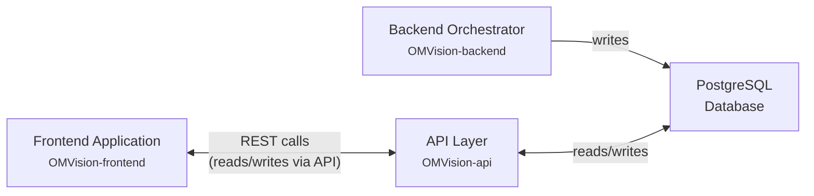
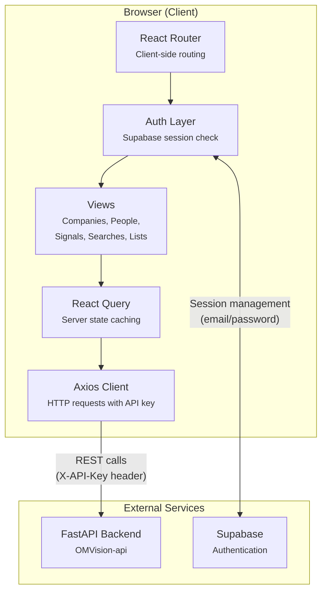
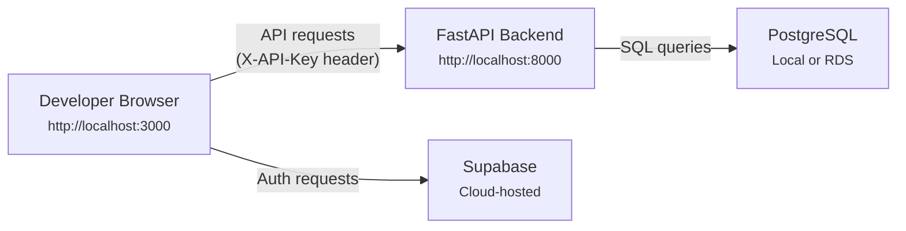
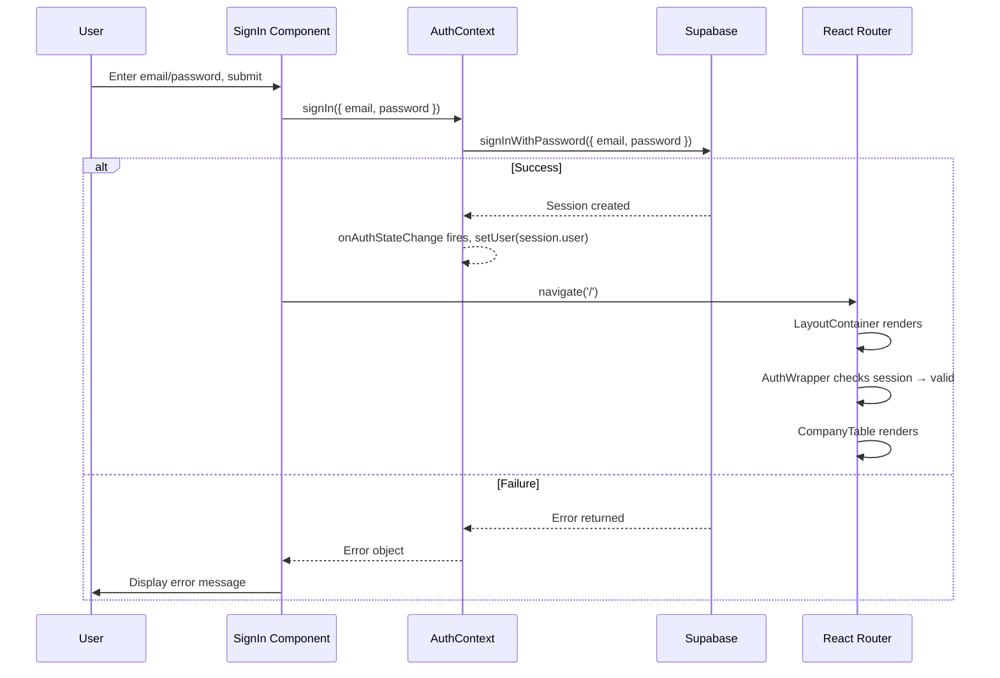

# OMVision Frontend Developer Documentation

## 1. System Overview

The OMVision frontend is a single-page application that provides the investment team with a web-based interface for reviewing, evaluating, and managing deal flow entities produced by the OMVision data pipeline. It is the primary surface through which OMVC team members interact with the data that the backend orchestrator ingests, enriches, and classifies.

This documentation provides technical context for engineers maintaining and extending the frontend application. The following sections introduce the application's role within the broader OMVision ecosystem, its high-level architecture, the features it exposes, and the technologies it uses. Implementation details are covered in subsequent sections (§2–§8).

---

### 1.1 Purpose & Role in OMVision Ecosystem

OMVision consists of three separate codebases that work together as a system:

1. **Backend Orchestrator** (`OMVision-backend`): A Dagster-based data pipeline that ingests signals from external sources (Accern, Gmail, Harmonic), extracts and enriches company and people entities, applies ML classification, and persists results to a PostgreSQL database. Documented separately in the Backend Developer Documentation (§1–§8).

2. **API Layer** (`OMVision-api`): A FastAPI application that exposes the PostgreSQL database to the frontend via RESTful endpoints. It provides read access to companies, people, signals, and searches, as well as write endpoints for user actions like editing comments, changing relevance stages, hiding entities, and managing lists.

3. **Frontend Application** (`OMVision-frontend`): This application. A React single-page application that queries the API layer and renders the data for the investment team.

**Data Flow Between Components**

The frontend does not interact with the backend orchestrator or the database directly. All data access flows through the API layer:



The backend orchestrator writes enriched entities to the database on automated schedules. The API layer reads from (and writes user actions to) the same database. The frontend calls the API layer over HTTP.

**The Frontend's Specific Responsibilities**

The frontend is responsible for:

- **Presenting entity data**: Rendering companies, people, signals, and searches in sortable, filterable table views with relevant columns for quick evaluation
- **Supporting drill-down**: Providing detailed views for individual companies, people, and signals so users can assess entities beyond the summary columns
- **Enabling user actions**: Allowing team members to edit comments, change deal flow stages, hide irrelevant entities, and organize entities into custom lists
- **Managing authentication**: Gating access behind Supabase-based email/password authentication so only authorized team members can view and interact with the data

The frontend does **not** handle any data ingestion, entity extraction, enrichment, or ML classification. Those responsibilities belong entirely to the backend orchestrator.

---

### 1.2 High-Level Architecture

The frontend follows a standard React single-page application architecture. The application is bootstrapped by Vite, uses client-side routing via React Router, fetches data from the API layer using Axios and React Query, and manages authentication state through Supabase.



**Request Lifecycle**

When a user navigates to a view (for example, the Companies table at `/`), the following sequence occurs:

1. **React Router** matches the URL path to a route defined in `src/App.jsx` and renders the corresponding component (`CompanyTable`)
2. **AuthWrapper** (`src/middleware/auth-wrapper.jsx`) checks for an active Supabase session. If no session exists, the user is redirected to `/signin`
3. The **view component** mounts and triggers data fetching via React Query hooks
4. **React Query** checks its cache. On a cache miss, it delegates to the **Axios client** (`src/lib/axios-helper.js`), which makes an HTTP GET request to the API layer with the `X-API-Key` header
5. The **API layer** queries the PostgreSQL database and returns JSON
6. **React Query** caches the response and provides the data to the view component for rendering

**Key Architectural Characteristics**

- **Separation of concerns between auth and data**: Authentication is handled entirely by Supabase (session management, login/logout). Data access is handled entirely by the API layer with a static API key. These are two independent external services—the Supabase session does not directly authorize API requests.
- **Client-side routing with a shared layout**: All authenticated routes share a common layout (`LayoutContainer` in `src/App.jsx`) consisting of a fixed sidebar and a scrollable content area. The sidebar navigation and layout persist across route changes.
- **Server-state management via React Query**: The application uses `@tanstack/react-query` for all data fetching. React Query handles caching, retry logic (configured with 3 retries), and background refetching. The `QueryClient` is configured with `refetchOnWindowFocus: false` to avoid unnecessary API calls when users switch tabs.

---

### 1.3 Key Features Summary

The frontend provides five primary views, each accessible from the sidebar navigation. Each view is designed to support a specific part of the investment team's daily deal review workflow.

**Companies View** (`/`, `CompanyTable` component)

The default landing page. Displays a table of companies ingested by the backend pipeline, with columns for company name, URL, description, saved lists, deal flow stage, investors, comments, location, founding employees, source name, most recent funding round, round size, predictive relevance (ML classification), and creation date. Clicking a company name navigates to a detailed company profile (`/companies/:id`).

**People View** (`/peoples`, `PersonTable` component)

Displays a table of people entities extracted from signals and Harmonic searches. Includes columns for highlights, education, social links, experience, current positions, and awards. Clicking a person navigates to their detailed profile (`/peoples/:id`).

**Signals View** (`/signals`, `SignalTable` component)

Lists all raw signals ingested from data sources (Accern feeds, Gmail newsletters, Harmonic). Each row shows the signal source, a preview of the signal text, and the entities extracted from it. Clicking a signal navigates to a detailed view (`/signals/:id`) with full signal text, metadata, source URL, and linked entities.

**Searches View** (`/searches`, `SearchTable` component)

Displays saved Harmonic searches that feed the ingestion pipeline. Shows the search parameters and the companies/people associated with each search.

**Lists Management** (`/lists`, `SaveList` component)

Allows users to create, view, and manage custom entity lists for organizing companies and people into deal flow stages, watchlists, or thematic groupings. Lists provide a way for the team to track entities through their evaluation process.

**Cross-Cutting Features**

- **Inline editing**: Users can edit comments and change deal flow relevance stages directly from table views without navigating away
- **Entity hiding**: Users can hide companies or people they have determined are irrelevant, removing them from default views
- **Sorting and filtering**: Table columns support sorting (via column header clicks) to reorder entities by any visible attribute
- **Detail views with signal context**: Company and people detail pages include a list of all signals where the entity was mentioned, providing the original context for how the entity was discovered

---

### 1.4 Technology Stack

The frontend is built with the following technologies, each verified from `package.json`, configuration files, and source code in the repository.

**Core Framework & Build**

| Technology | Version | Purpose | Source Reference |
|---|---|---|---|
| React | ^18.2.0 | UI component framework | `package.json` dependencies |
| Vite | ^5.1.4 | Build tool and dev server | `package.json` devDependencies, `vite.config.js` |
| React Router DOM | ^6.23.1 | Client-side routing | `package.json` dependencies, `src/App.jsx` |

Vite is configured in `vite.config.js` to run the dev server on port 3000 with host `::` (all interfaces). Path aliasing maps `@/` to `./src/` via both the Vite config and `jsconfig.json`.

**Styling**

| Technology | Version | Purpose | Source Reference |
|---|---|---|---|
| Tailwind CSS | ^3.4.4 | Utility-first CSS framework | `package.json` devDependencies, `tailwind.config.js` |
| tailwindcss-animate | ^1.0.7 | Animation utilities for Tailwind | `package.json` dependencies, `tailwind.config.js` plugins |
| PostCSS | ^8.4.38 | CSS processing pipeline | `package.json` devDependencies, `postcss.config.js` |

Tailwind is configured in `tailwind.config.js` with the shadcn/ui theme system using CSS variables (HSL-based color tokens for `primary`, `secondary`, `destructive`, `muted`, `accent`, `popover`, and `card`). Dark mode is configured via the `class` strategy. The base color palette is `slate`, as specified in `components.json`.

**UI Component Library**

| Technology | Purpose | Source Reference |
|---|---|---|
| shadcn/ui | Pre-built accessible component library | `components.json`, `src/components/ui/` directory |
| Radix UI primitives | Unstyled accessible component primitives underlying shadcn/ui | Multiple `@radix-ui/*` packages in `package.json` |
| Lucide React | ^0.417.0 | Icon library | `package.json` dependencies, sidebar and table components |

The shadcn/ui configuration (`components.json`) specifies: `rsc: false` (no React Server Components), `tsx: false` (JSX, not TypeScript), base color `slate`, and CSS variables enabled. The component library provides the buttons, cards, dialogs, dropdowns, tooltips, tables, toasts, and other UI primitives used throughout the application.

**Data Fetching & State Management**

| Technology | Version | Purpose | Source Reference |
|---|---|---|---|
| @tanstack/react-query | ^5.48.0 | Server state management and caching | `package.json` dependencies, `src/App.jsx` |
| @tanstack/react-table | ^8.20.1 | Headless table utilities for sorting, filtering, pagination | `package.json` dependencies, table components |
| Axios | ^1.7.7 | HTTP client for API calls | `package.json` dependencies, `src/lib/axios-helper.js` |

The Axios client is configured as a singleton in `src/lib/axios-helper.js` with a base URL from `VITE_API_BASE_URL` and a static API key from `VITE_API_KEY` passed in the `X-API-Key` header on every request.

**Authentication**

| Technology | Version | Purpose | Source Reference |
|---|---|---|---|
| @supabase/supabase-js | ^2.45.1 | Authentication client | `package.json` dependencies, `src/services/supabaseClient.js` |

Supabase is initialized in `src/services/supabaseClient.js` using two environment variables: `VITE_SUPABASE_URL` and `VITE_SUPABASE_ANON_KEY`. Authentication is email/password-based (`signInWithPassword`), managed through a React context (`src/contexts/auth.jsx`) and enforced by a route wrapper (`src/middleware/auth-wrapper.jsx`).

**Additional Libraries**

The following libraries are listed as dependencies in `package.json`. Where source-level imports have been confirmed, the specific file is noted in the Source Reference column. Libraries without a specific source file reference are dependencies of shadcn/ui components or are available in the project but their specific usage locations were not individually traced.

| Technology | Version | Purpose | Source Reference |
|---|---|---|---|
| @dnd-kit | core ^6.1.0, sortable ^8.0.0 | Draggable table column reordering | `package.json` dependencies, `src/components/company-table/data-table.jsx`, `src/components/person-table/data-table.jsx` |
| react-hook-form | ^7.52.0 | Form state management | `package.json` dependencies, `src/components/ui/form.jsx` |
| zod | ^3.23.8 | Schema validation (used with react-hook-form via `@hookform/resolvers`) | `package.json` dependencies |
| date-fns | ^3.6.0 | Date formatting and manipulation | `package.json` dependencies |
| recharts | ^2.12.7 | Charting library | `package.json` dependencies, `src/components/ui/chart.jsx` |
| react-infinite-scroll-component | ^6.1.0 | Infinite scroll for large entity lists | `package.json` dependencies |
| framer-motion | ^11.3.9 | Animation library | `package.json` dependencies |
| react-resizable-panels | ^2.0.19 | Resizable panel layouts | `package.json` dependencies |
| sonner | ^1.5.0 | Toast notification library | `package.json` dependencies, `src/App.jsx` |
| react-markdown | ^9.0.1 | Markdown rendering | `package.json` dependencies |
| cmdk | ^1.0.0 | Command palette component | `package.json` dependencies |

**Development Tools**

| Technology | Version | Purpose | Source Reference |
|---|---|---|---|
| ESLint | ^8.56.0 | JavaScript linting | `package.json` devDependencies, `scripts.lint` |
| Prettier | ^3.3.3 | Code formatting | `package.json` dependencies, `scripts.format` |
| prettier-plugin-organize-imports | ^4.0.0 | Auto-sort import statements | `package.json` dependencies |

**Environment Variables**

The frontend requires four environment variables, all prefixed with `VITE_` for Vite's client-side exposure:

| Variable | Purpose | Source Reference |
|---|---|---|
| `VITE_SUPABASE_URL` | Supabase project URL for authentication | `src/services/supabaseClient.js` |
| `VITE_SUPABASE_ANON_KEY` | Supabase anonymous/public key for client-side auth | `src/services/supabaseClient.js` |
| `VITE_API_BASE_URL` | Base URL of the FastAPI backend (OMVision-api) | `src/lib/axios-helper.js` |
| `VITE_API_KEY` | Static API key for authenticating requests to the FastAPI backend | `src/lib/axios-helper.js` |

---


## 2. Development Setup & Configuration

The OMVision frontend uses a standard Node.js development workflow built around Vite as the build tool and development server. This section covers the prerequisites for running the application, how environment variables are configured, how to start the local development server, and the available build and deployment commands. Engineers should be able to go from a fresh clone to a running local instance by following the steps in this section.

---

### 2.1 Prerequisites & Environment Setup

#### System Requirements

The frontend requires Node.js installed on the developer's machine. The `package.json` specifies the project as `"type": "module"` (ES modules), and the Vite version (^5.1.4) requires Node.js 18.0.0 or higher (per Vite's `engines` field in its own package metadata).

**Required Software:**

- **Node.js**: Version 18.0.0 or higher
- **npm**: Included with Node.js (used for dependency installation and script execution)
- **Git**: For cloning the repository

**No additional global tools are required.** Unlike the backend orchestrator (which requires Poetry, Docker, and PostgreSQL), the frontend has no system-level dependencies beyond Node.js.

#### Repository Setup

The frontend lives in its own repository, separate from the backend orchestrator and API layer. The repository README (`README.md`) documents the setup steps:

```bash
git clone <repository-url>
cd <repository-directory>
npm i
```

The `npm i` (shorthand for `npm install`) command reads `package.json` and installs all dependencies into the `node_modules/` directory. Dependency versions are locked via `package-lock.json` (lockfile version 3), ensuring all developers install identical dependency trees.

#### Project File Structure (Root Level)

The following configuration files exist at the repository root and control various aspects of the build and development toolchain:

| File | Purpose | Source Reference |
|---|---|---|
| `package.json` | Project metadata, dependency declarations, and npm scripts | Repository root |
| `package-lock.json` | Locked dependency tree for reproducible installs | Repository root |
| `vite.config.js` | Vite build tool and dev server configuration | Repository root |
| `tailwind.config.js` | Tailwind CSS theme, content paths, and plugin configuration | Repository root |
| `postcss.config.js` | PostCSS plugin pipeline (Tailwind CSS and Autoprefixer) | Repository root |
| `components.json` | shadcn/ui component library configuration | Repository root |
| `jsconfig.json` | Path alias configuration for IDE support (`@/` → `./src/`) | Repository root |
| `index.html` | Single HTML entry point (Vite's root document) | Repository root |

---

### 2.2 Environment Variables

The frontend requires four environment variables to connect to its external services (Supabase for authentication and the FastAPI backend for data). All variables use the `VITE_` prefix, which is Vite's mechanism for exposing environment variables to client-side code via `import.meta.env`.

#### Required Variables

| Variable | Purpose | Used In |
|---|---|---|
| `VITE_SUPABASE_URL` | The URL of the Supabase project instance | `src/services/supabaseClient.js` |
| `VITE_SUPABASE_ANON_KEY` | The Supabase anonymous (public) API key for client-side authentication | `src/services/supabaseClient.js` |
| `VITE_API_BASE_URL` | The base URL of the FastAPI backend (OMVision-api), e.g., `http://localhost:8000` | `src/lib/axios-helper.js` |
| `VITE_API_KEY` | A static API key sent in the `X-API-Key` header on every request to the FastAPI backend | `src/lib/axios-helper.js` |

#### How Variables Are Loaded

Vite loads environment variables from `.env` files in the project root at dev server startup and at build time. Variables must be prefixed with `VITE_` to be included in the client-side bundle; any variable without this prefix is not exposed to the browser.

A `.env` file for local development would look like:

```bash
VITE_SUPABASE_URL=https://<project-id>.supabase.co
VITE_SUPABASE_ANON_KEY=eyJ...
VITE_API_BASE_URL=http://localhost:8000
VITE_API_KEY=<api-key-value>
```

**Note:** The repository does not include a `.env` file or a `.env.example` template in the codebase. Engineers will need to obtain the correct values for these variables from the team. The Supabase URL and anonymous key are available from the Supabase project dashboard, and the API key must match the value expected by the FastAPI backend's authentication middleware.

#### Validation

The Supabase client (`src/services/supabaseClient.js`) includes a runtime check that throws an error if either `VITE_SUPABASE_URL` or `VITE_SUPABASE_ANON_KEY` is missing:

```javascript
if (!supabaseUrl || !supabaseAnonKey) {
  throw new Error('Missing Supabase environment variables')
}
```

The Axios client (`src/lib/axios-helper.js`) does not include a similar validation check. If `VITE_API_BASE_URL` or `VITE_API_KEY` is missing, API requests will silently fail or be sent to an undefined base URL.

---

### 2.3 Local Development

#### Starting the Development Server

After installing dependencies and configuring environment variables, the development server is started with:

```bash
npm run dev
```

This executes the `vite` command (defined in `package.json` under `scripts.dev`), which:

1. Reads `vite.config.js` for server and build configuration
2. Loads environment variables from `.env` files in the project root
3. Starts an HTTP development server with hot module replacement (HMR)

The development server is configured in `vite.config.js` to listen on:

- **Host**: `::` (all network interfaces, including IPv6 — this makes the dev server accessible from other devices on the local network)
- **Port**: `3000`

Once running, the application is accessible at `http://localhost:3000`.

#### Vite Configuration Details

The `vite.config.js` file configures three aspects of the development environment:

**Server Settings:**

```javascript
server: {
  host: '::',
  port: '3000',
},
```

**React Plugin:**

The `@vitejs/plugin-react` plugin enables React Fast Refresh (hot module replacement for React components) and JSX transformation during development.

**Path Aliases:**

```javascript
resolve: {
  alias: [
    {
      find: '@',
      replacement: fileURLToPath(new URL('./src', import.meta.url)),
    },
    {
      find: 'lib',
      replacement: resolve(__dirname, 'lib'),
    },
  ],
},
```

Two path aliases are configured:
- `@/` resolves to `./src/`, allowing imports like `import { Button } from '@/components/ui/button'` instead of relative paths. This alias is mirrored in `jsconfig.json` for IDE autocompletion support.
- `lib` resolves to the root-level `lib/` directory.

#### Development Workflow

During local development, the frontend requires the FastAPI backend (OMVision-api) to be running and accessible at the URL specified by `VITE_API_BASE_URL`. Without a running API server, the application will load and authenticate via Supabase, but all data views will fail to fetch and display entity data.

A typical local development setup involves:

1. The FastAPI backend running locally (usually on `http://localhost:8000`)
2. The frontend dev server running on `http://localhost:3000`
3. Both pointing to the same PostgreSQL database (via the backend's database connection)



#### Code Quality Tools

The project includes two code quality tools, both configured in `package.json` scripts:

**ESLint** (linting):

```bash
npm run lint
```

This runs `eslint . --ext js,jsx --report-unused-disable-directives --max-warnings 0`, which lints all `.js` and `.jsx` files in the project. The `--max-warnings 0` flag treats any warning as a failure, enforcing strict lint compliance. ESLint is configured with three plugins (all in `package.json` devDependencies): `eslint-plugin-react` for React-specific rules, `eslint-plugin-react-hooks` for hooks rules, and `eslint-plugin-react-refresh` for Fast Refresh compatibility.

**Prettier** (formatting):

```bash
npm run format
```

This runs `prettier --write .`, which auto-formats all files in the project. The `prettier-plugin-organize-imports` plugin (listed in `package.json` dependencies) automatically sorts and organizes import statements when Prettier runs.

---

### 2.4 Build & Deployment

#### Build Commands

The project defines two build commands in `package.json`:

**Production Build:**

```bash
npm run build
```

This runs `vite build`, which:

1. Compiles all JSX/JavaScript source files
2. Processes Tailwind CSS via PostCSS (as configured in `postcss.config.js`, which chains `tailwindcss` and `autoprefixer`)
3. Tree-shakes unused code and minifies the output
4. Generates static assets in the `dist/` directory (Vite's default output directory)
5. Inlines all `VITE_`-prefixed environment variables into the bundled JavaScript

The resulting `dist/` directory contains a fully static site (HTML, CSS, and JavaScript files) that can be served by any static file hosting service.

**Development Build:**

```bash
npm run build:dev
```

This runs `vite build --mode development`, which produces a build with development-mode settings (unminified code, development React warnings enabled). This is useful for debugging production build issues without the obfuscation of minification.

**Preview:**

```bash
npm run preview
```

This runs `vite preview`, which starts a local static file server that serves the contents of the `dist/` directory. This allows engineers to test the production build locally before deploying, verifying that the built assets load and function correctly.

#### Deployment

The repository does not contain deployment configuration files (such as CI/CD pipeline definitions, Dockerfiles, or platform-specific configuration). Based on the system architecture diagrams in the project documentation, the frontend is hosted on AWS Amplify, but the specific Amplify configuration (build settings, environment variable injection, branch-based deployments) is managed outside the repository and is not present in the codebase.

For deployment, the general process is:

1. Run `npm run build` to produce the `dist/` directory
2. Deploy the contents of `dist/` to the hosting platform

Since the frontend is a static site after building (no server-side rendering), it can be served by any static hosting service, including AWS Amplify, S3 + CloudFront, Vercel, Netlify, or a simple Nginx server.

**Environment Variable Handling in Builds:**

Environment variables are baked into the JavaScript bundle at build time, not read at runtime. This means different deployment environments (staging, production) require separate builds with the appropriate `.env` values, or the hosting platform must inject the variables during the build step.

---


## 3. Application Architecture

The OMVision frontend is organized around a small number of architectural patterns: a flat component directory structure, client-side routing with a shared layout shell, React Query for server state management, and Supabase-based authentication enforced at the route level. This section describes how the source code is structured, how routing and navigation work, how the application manages data from the API, and how the authentication flow operates. Understanding these patterns is necessary for navigating the codebase and making changes to existing views or adding new ones.

---

### 3.1 Project Structure

The application source code lives under the `src/` directory. The structure is organized primarily by feature area, with each major view (companies, people, signals, searches, lists) having its own component directory. Shared UI primitives live in `src/components/ui/`, and cross-cutting concerns (authentication, API client) are separated into `contexts/`, `middleware/`, `services/`, and `lib/` directories.

**Source Directory Layout:**

```
src/
├── App.jsx                          # Root component: router, providers, layout
├── main.jsx                         # Application entry point: renders App into DOM
├── index.css                        # Global styles: Tailwind directives, CSS variables, font import
│
├── components/
│   ├── auth/
│   │   └── signin.jsx               # Sign-in page component
│   ├── company-table/
│   │   ├── page.jsx                 # Companies list view (data fetching, pagination, filtering)
│   │   ├── columns.jsx              # Column definitions for the companies table
│   │   ├── data-table.jsx           # Table rendering with DnD column reordering
│   │   └── column-resizer.jsx       # Column resize handle component
│   ├── company-detailed-view/
│   │   └── index.jsx                # Individual company profile page
│   ├── person-table/
│   │   ├── page.jsx                 # People list view (data fetching, pagination, filtering)
│   │   ├── columns.jsx              # Column definitions for the people table
│   │   ├── data-table.jsx           # Table rendering with DnD column reordering
│   │   └── column-resizer.jsx       # Column resize handle component
│   ├── peoples-detailed-view/
│   │   └── index.jsx                # Individual person profile page
│   ├── signal-table/
│   │   ├── page.jsx                 # Signals list view (data fetching, infinite scroll)
│   │   ├── columns.jsx              # Column definitions for the signals table
│   │   └── data-table.jsx           # Table rendering component
│   ├── signal-detailed-view/
│   │   └── index.jsx                # Individual signal detail page
│   ├── search-table/
│   │   ├── page.jsx                 # Searches list view (data fetching, infinite scroll)
│   │   ├── columns.jsx              # Column definitions for the searches table
│   │   └── data-table.jsx           # Table rendering component
│   ├── save-list/
│   │   └── index.jsx                # Lists management view (create, delete, view lists)
│   ├── sidebar/
│   │   └── index.jsx                # Navigation sidebar component
│   ├── filter-data/
│   │   └── ...                      # Shared filtering controls (date picker, source filter)
│   ├── loading.jsx                  # Shared loading spinner component
│   └── ui/                          # shadcn/ui component library
│       ├── button.jsx
│       ├── card.jsx
│       ├── chart.jsx
│       ├── dialog.jsx
│       ├── form.jsx
│       ├── select.jsx
│       ├── sonner.jsx
│       ├── table.jsx
│       ├── tabs.jsx
│       ├── toast.jsx
│       ├── toaster.jsx
│       ├── tooltip.jsx
│       ├── use-toast.js
│       └── ...                      # Additional shadcn/ui primitives
│
├── contexts/
│   └── auth.jsx                     # AuthContext provider (Supabase session, signIn/signOut)
│
├── middleware/
│   ├── auth-wrapper.jsx             # Route-level session check, redirects to /signin if unauthenticated
│   └── useAuth.js                   # Standalone useAuth hook (alternative to context-based auth)
│
├── services/
│   └── supabaseClient.js            # Supabase client initialization
│
├── lib/
│   ├── axios-helper.js              # Axios instance with API base URL and API key header
│   └── utils.js                     # cn() utility function (clsx + tailwind-merge)
│
└── pages/
    └── Index.jsx                    # Unused page component (not referenced in router)
```

**Organizational Patterns:**

Each entity view follows a consistent internal structure. The `page.jsx` file is the top-level component that handles data fetching, pagination state, and filtering logic. It passes data into a `data-table.jsx` component that handles table rendering, column reordering, row selection, and bulk actions. The `columns.jsx` file defines the column configuration array used by `@tanstack/react-table`. This pattern is used by the company table (`src/components/company-table/`), person table (`src/components/person-table/`), signal table (`src/components/signal-table/`), and search table (`src/components/search-table/`).

The `src/components/ui/` directory contains shadcn/ui components. These are copied into the project (not imported from a package) per the shadcn/ui design pattern, and are configured via `components.json` at the repository root. The `components.json` file specifies that components use JSX (not TypeScript), do not use React Server Components, and use the `@/components` and `@/lib/utils` path aliases.

---

### 3.2 Routing & Navigation

The application uses React Router v6 (`react-router-dom` ^6.23.1) with the `createBrowserRouter` API. All routes are defined in a single location: `src/App.jsx`.

#### Route Definitions

The router defines two top-level routes: one for the sign-in page (unauthenticated) and one for the main application shell (authenticated). All entity views are nested children of the main application route.

```
/signin              → SignIn               (no layout, no auth check)
/                    → LayoutContainer
  /  (index)         → CompanyTable         (default landing page)
  /companies/:id     → CompanyDetailedView
  /searches          → SearchTable
  /signals           → SignalTable
  /signals/:id       → SignalDetailedView
  /peoples           → PersonTable
  /peoples/:id       → PeoplesDetailedView
  /lists             → SaveList
```

The `/signin` route renders the `SignIn` component directly, without the sidebar layout or authentication wrapper. All other routes are children of the root `/` path, which renders `LayoutContainer`.

#### Layout Structure

The `LayoutContainer` component in `src/App.jsx` defines the shared layout for all authenticated routes:

```javascript
const LayoutContainer = () => {
  const location = useLocation()

  return (
    <AuthWrapper>
      <div className='flex h-screen bg-white'>
        <Sidebar />
        <div className='flex-1 overflow-auto'>
          <Outlet key={location.pathname} />
        </div>
      </div>
    </AuthWrapper>
  )
}
```

This creates a two-column layout: a fixed-width sidebar on the left (`w-64` per the Sidebar component's CSS class in `src/components/sidebar/index.jsx`) and a flexible content area on the right. The `<Outlet />` is React Router's mechanism for rendering whichever child route matches the current URL. The `key={location.pathname}` attribute forces the content area to remount when the route changes, ensuring component state resets between navigation.

The `AuthWrapper` component wraps the entire layout, meaning every route inside `LayoutContainer` requires an active Supabase session. If no session exists, the user is redirected to `/signin` (see §3.4 for details).

#### Sidebar Navigation

The sidebar (`src/components/sidebar/index.jsx`) renders five navigation links, each corresponding to a top-level route:

| Label | Route | Icon | Component |
|---|---|---|---|
| Companies | `/` | `Home` | `CompanyTable` |
| People | `/peoples` | `Users` | `PersonTable` |
| Signals | `/signals` | `Signal` | `SignalTable` |
| Searches | `/searches` | `Search` | `SearchTable` |
| Lists | `/lists` | `List` | `SaveList` |

Navigation links are rendered using React Router's `<Link>` component. The sidebar highlights the active route by comparing `location.pathname` (from React Router's `useLocation` hook) against each menu item's `to` prop. The sidebar also displays the authenticated user's information and provides a sign-out option via a dropdown menu that calls `signOut()` from the `useAuth` context and navigates to `/signin`.

#### URL-Based State

Several views use URL query parameters to persist state across navigation. The company table (`src/components/company-table/page.jsx`) and person table (`src/components/person-table/page.jsx`) both read `list_id` and `page` parameters from the URL using `useLocation()` and `URLSearchParams`:

- `?list_id=<id>` filters the table to show only entities belonging to a specific list
- `?page=<number>` controls which page of results is displayed

When pagination changes, the components update the URL using React Router's `navigate()` function, which updates the browser's address bar without a full page reload. This means pagination state survives browser refreshes and can be shared via URL.

---

### 3.3 State Management

The application does not use a global client-side state management library (such as Redux or Zustand). State is managed through three mechanisms: React Query for server data, React's built-in `useState`/`useEffect` for local component state, and React Context for authentication.

#### Server State: React Query

All data fetched from the FastAPI backend is managed by `@tanstack/react-query`. A `QueryClient` is instantiated in `src/App.jsx` and provided to the component tree via `QueryClientProvider`:

```javascript
const queryClient = new QueryClient({
  defaultOptions: {
    queries: {
      refetchOnWindowFocus: false,
      retry: 3,
    },
  },
})
```

This configuration applies to all queries in the application: queries do not automatically refetch when the browser window regains focus, and failed queries are retried up to 3 times before reporting an error.

**Two Data Fetching Patterns**

The application uses two distinct React Query hooks depending on the view:

`useQuery` is used by the **company table** (`src/components/company-table/page.jsx`) and **person table** (`src/components/person-table/page.jsx`) for paginated data. These views manage pagination via URL query parameters and pass `skip` and `limit` to the API. Each page of results is a separate query keyed by the current page number, list ID, search name, and date filter. Example from the company table:

```javascript
const { data, error, isLoading, isError, isFetching, refetch } = useQuery({
  queryKey: ['companies', listId, debouncedName, currentPage, date, sourceNameValue],
  queryFn: fetchCompanies,
})
```

`useInfiniteQuery` is used by the **signal table** (`src/components/signal-table/page.jsx`) and **search table** (`src/components/search-table/page.jsx`) for infinite-scroll data. These views fetch data in pages of 25 and append new pages as the user scrolls or requests more. The `getNextPageParam` callback determines whether more data is available:

```javascript
const { data, fetchNextPage, hasNextPage, isFetchingNextPage, isLoading } =
  useInfiniteQuery({
    queryKey: ['signals', debouncedName],
    queryFn: fetchSignals,
    getNextPageParam: (lastPage, allPages) => {
      if (lastPage.length === 25) {
        return allPages.length * 25
      } else {
        return undefined
      }
    },
  })
```

The signal table implements scroll-based loading by attaching a scroll event listener to the table container (via `useRef` and `useEffect`), which triggers `fetchNextPage()` when the user scrolls near the bottom of the list.

**Detail views** (company, person, signal) use `useQuery` with a single entity ID as the query key. For example, from `src/components/company-detailed-view/index.jsx`:

```javascript
const { data: company, isLoading, isError } = useQuery({
  queryKey: ['company', id],
  queryFn: () => fetchCompanyDetails(id),
})
```

**Cache Invalidation**

When users perform write operations (hiding entities, adding to lists, editing comments), the affected views call `queryClient.invalidateQueries()` to mark cached data as stale and trigger a refetch. For example, in the company data table (`src/components/company-table/data-table.jsx`), after hiding companies:

```javascript
const refetchAllData = async () => {
  await queryClient.invalidateQueries(['companies'])
  refetch()
}
```

#### Local Component State

Each view manages its own UI state (search input, selected filters, row selection, dialog open/close) using React's `useState` hook. This state is local to the component and is not shared across views. Examples include:

- **Search input with debouncing**: The company and person table views store the raw input value in one state variable and a debounced version in another, using a `setTimeout` in a `useEffect` to delay API calls by 1000ms after the user stops typing (verified in both `src/components/company-table/page.jsx` and `src/components/person-table/page.jsx`)
- **Row selection**: The data table components track selected rows via a `rowSelection` state object managed by `@tanstack/react-table`'s `onRowSelectionChange` callback
- **Column order**: The data table components in the company and person views track column ordering via a `columnOrder` state array that is updated when users drag columns using `@dnd-kit`

#### Authentication State: React Context

Authentication state is the only piece of state shared globally via React Context. The `AuthProvider` in `src/contexts/auth.jsx` exposes the current user object and authentication functions (`signIn`, `signUp`, `signOut`) to any component that calls the `useAuth()` hook. See §3.4 for full details.

---

### 3.4 Authentication Flow

Authentication is handled by Supabase using email/password credentials. The authentication flow involves three source files that work together: the Supabase client (`src/services/supabaseClient.js`), the auth context provider (`src/contexts/auth.jsx`), and the auth wrapper middleware (`src/middleware/auth-wrapper.jsx`).

#### Supabase Client Initialization

The Supabase client is created in `src/services/supabaseClient.js` as a singleton exported for use across the application:

```javascript
import { createClient } from '@supabase/supabase-js'

const supabaseUrl = import.meta.env.VITE_SUPABASE_URL
const supabaseAnonKey = import.meta.env.VITE_SUPABASE_ANON_KEY

if (!supabaseUrl || !supabaseAnonKey) {
  throw new Error('Missing Supabase environment variables')
}

export const supabase = createClient(supabaseUrl, supabaseAnonKey)
```

This client is imported by both the auth context and the auth wrapper.

#### Auth Context Provider

The `AuthProvider` component (`src/contexts/auth.jsx`) wraps the entire application in `src/App.jsx` and manages the user's authentication state:

```javascript
export const AuthProvider = ({ children }) => {
  const [user, setUser] = useState(null)
  const [loading, setLoading] = useState(true)

  useEffect(() => {
    const session = supabase.auth.getSession()
    setUser(session?.user ?? null)
    setLoading(false)

    const { data: authListener } = supabase.auth.onAuthStateChange(
      async (event, session) => {
        setUser(session?.user ?? null)
        setLoading(false)
      }
    )

    return () => {
      authListener.subscription.unsubscribe()
    }
  }, [])

  const value = {
    signUp: (data) => supabase.auth.signUp(data),
    signIn: (data) => supabase.auth.signInWithPassword(data),
    signOut: () => supabase.auth.signOut(),
    user,
  }

  return (
    <AuthContext.Provider value={value}>
      {!loading && children}
    </AuthContext.Provider>
  )
}
```

On mount, the provider checks for an existing Supabase session and subscribes to auth state changes. The `{!loading && children}` pattern prevents the application from rendering until the initial session check completes, avoiding a flash of unauthenticated content.

Components access the auth state via the `useAuth()` hook, which returns the `user` object and the `signIn`, `signUp`, and `signOut` functions. The sidebar (`src/components/sidebar/index.jsx`) uses `useAuth()` to display user information and handle sign-out.

#### Auth Wrapper (Route-Level Protection)

The `AuthWrapper` component (`src/middleware/auth-wrapper.jsx`) is used inside `LayoutContainer` to protect all authenticated routes:

```javascript
export function AuthWrapper({ children }) {
  const [session, setSession] = useState(null)
  const [loading, setLoading] = useState(true)
  const navigate = useNavigate()

  useEffect(() => {
    const checkSession = async () => {
      const { data: { session } } = await supabase.auth.getSession()
      setSession(session)
      setLoading(false)
      if (!session) {
        navigate('/signin')
      }
    }

    checkSession()

    const { data: { subscription } } = supabase.auth.onAuthStateChange(
      (_event, session) => {
        setSession(session)
        if (!session) {
          navigate('/signin')
        }
      }
    )

    return () => subscription.unsubscribe()
  }, [navigate])

  if (loading) {
    return <div>Loading...</div>
  }

  return session ? children : null
}
```

This component performs its own session check independently from the `AuthProvider`. On mount, it calls `supabase.auth.getSession()` and redirects to `/signin` if no session exists. It also subscribes to auth state changes, so if the session expires or the user signs out in another tab, the redirect happens immediately. While the session is being checked, a "Loading..." indicator is displayed. Once verified, the component renders its children (the sidebar and route content) only if a valid session exists.

#### Sign-In Flow

The `SignIn` component (`src/components/auth/signin.jsx`) renders a centered card with email and password inputs. On form submission, it calls `signIn({ email, password })` from the `useAuth()` context, which delegates to `supabase.auth.signInWithPassword()`. On success, it navigates to `/` (the company table). On failure, the error message from Supabase is displayed below the form fields.



#### Duplicate Auth Implementations

The codebase contains two separate implementations of auth hooks: the context-based `useAuth()` exported from `src/contexts/auth.jsx`, and a standalone `useAuth()` hook in `src/middleware/useAuth.js`. The application's router and components use the context-based version from `src/contexts/auth.jsx` (verified by the import paths in `src/App.jsx`, `src/components/auth/signin.jsx`, and `src/components/sidebar/index.jsx`). The `src/middleware/useAuth.js` file provides a similar hook with `signIn` and `signOut` functions but is not imported by any component that was found in the codebase search.

---


## 4. Core Views & Features

The OMVision frontend provides five primary views for interacting with deal flow data: Companies, People, Signals, Searches, and Lists. Each view is accessible from the sidebar navigation and maps to a route defined in `src/App.jsx` (see §3.2). This section documents each view's table columns, data fetching approach, filtering capabilities, detail pages, and user actions as implemented in the codebase.

---

### 4.1 Companies View

**Route:** `/` (default landing page)
**Component:** `src/components/company-table/page.jsx`
**API Endpoint:** `GET /companies`

The Companies view is the primary interface for reviewing deal flow entities. It displays a paginated table of companies ingested by the backend pipeline.

#### Table Columns

The column definitions are in `src/components/company-table/columns.jsx`. Columns are listed here in the order they appear in the source file:

| Column ID | Header Label | `accessorKey` | Sortable | Description |
|---|---|---|---|---|
| `select` | (checkbox) | — | No | Row selection checkbox for bulk actions |
| `name` | Name | `name` | Yes | Company name, rendered as a link to `/companies/:id` (opens in new tab) |
| `website_urls` | Website | `website_urls` | No | Company website URL, rendered as an external link |
| `rank` | Predicted relevance | `rank` | No | ML classification label mapped via `RankMapper` from `constants.ts`: 0 = "Irrelevant", 1 = "Somewhat relevant", 2 = "Relevant", 3 = "Highly relevant". Displays "Unclassified" if the rank value is not in the map |
| `lists` | Saved Lists | `lists` | No | Badges linking to filtered company views (`/?list_id=<id>`) |
| `relevence_stage` | DealFlow Stage | `relevence_stage` | No | Editable inline dropdown (`RelevenceStageCell` component) |
| `investors` | Investors | `investors` | Yes | Investor names rendered as badges linking to Harmonic dashboard profiles |
| `comments` | Comments | `comments` | No | Editable inline text field (`CommentCell` component) |
| `description` | Description | `description` | No | Company description (`DescriptionCell` component) |
| `location` | Location | `location` | Yes | Company location string |
| `source_name` | Source Name | `source_name` | Yes | Name of the data source that produced this entity |
| `key_employees` | Founding Employees | `key_employees` | No | Employee names rendered as badges linking to Harmonic dashboard profiles |
| `most_recent_round` | Most Recent Round | `most_recent_round` | Yes | Date of most recent funding round, formatted as a localized date string |
| `most_recent_round_size` | Most Recent Round Size | `most_recent_round_size` | Yes | Round size formatted as USD currency |
| `created_at` | Created At | `created_at` | Yes | Record creation timestamp, formatted as a localized date/time string |

The `name` and `select` columns have `stickyColumn: true` and `disableDragging: true` set in their column definitions, which pins them to the left side of the table and prevents them from being reordered via drag-and-drop.

#### DealFlow Stage Options

The `RelevenceStageCell` component renders a `<Select>` dropdown with the following options (defined inline in `src/components/company-table/columns.jsx` and identically in `src/components/person-table/columns.jsx`): "Pass - without outreach", "Pass", "Passive track", "Pass - but solid company", "Active Track, Meeting", "Jason/Mark Call", "Team Call", "DD", "IC Memo", "Invested".

When a user selects a new value, the component calls the API to update the relevance stage for that company.

#### Data Fetching & Pagination

The `CompanyTable` component (`src/components/company-table/page.jsx`) uses `useQuery` from React Query with a page size of 25 (`ITEMS_PER_PAGE = 25`). Pagination is URL-driven via the `page` query parameter (see §3.2). The API request passes `skip` and `limit` parameters:

```javascript
const { data } = await api.get('/companies', {
  params: {
    skip: (currentPage - 1) * ITEMS_PER_PAGE,
    limit: ITEMS_PER_PAGE,
    list_id: listId,
    name: debouncedName,
    source_name: sourceNameValue,
    created_at: date ? /* formatted date */ : undefined,
  },
})
```

The query key includes `listId`, `debouncedName`, `currentPage`, `date`, and `sourceNameValue`, so React Query automatically refetches when any of these change.

#### Filtering

The Companies view supports three filters, implemented in `src/components/company-table/page.jsx`:

- **Name search**: A text input with 1000ms debounce (via `setTimeout` in a `useEffect`). The raw input is stored in `name` state and the debounced value in `debouncedName`
- **Source name filter**: A filter control (via the `FilterData` component) that sets the `source_name` API parameter
- **Date filter**: A date picker (via the `FilterData` component) that filters companies created on or after the selected date

When a `list_id` query parameter is present in the URL, the view filters to show only companies belonging to that list and displays the list name as the page heading instead of "All Companies".

#### Bulk Actions

The data table component (`src/components/company-table/data-table.jsx`) supports row selection via checkboxes and provides bulk actions in a floating action bar that appears when rows are selected:

- **Hide companies**: Sends a `POST /companies/hide` request with an array of selected company IDs. Hidden companies are removed from the default view.
- **Add to list**: Sends a `POST /lists/:listId/modify` request with `operation: 'add'` and the selected company IDs
- **Remove from list** (when viewing a specific list): Sends a `POST /lists/:listId/modify` request with `operation: 'remove'` and the selected company IDs

After each action, the component calls `queryClient.invalidateQueries(['companies'])` to refresh the table data.

#### Company Detail View

**Route:** `/companies/:id`
**Component:** `src/components/company-detailed-view/index.jsx`
**API Endpoint:** `GET /companies/:id`

Clicking a company name in the table navigates to the detail view (opens in a new tab per the `target='_blank'` attribute on the link). The detail view fetches the full company record using `useQuery` with the query key `['company', id]`.

The detail page displays: the company logo (via `Avatar` component with the company's `logo_url`), company name, legal name, description, website URL, and location. The page uses a `Tabs` component to organize additional content, including an `EmployeesTab` component (`src/components/company-detailed-view/employees.jsx`) for viewing the company's team members.

A "Back to companies" link at the top navigates back to `/`.

---

### 4.2 People View

**Route:** `/peoples`
**Component:** `src/components/person-table/page.jsx`
**API Endpoint:** `GET /people`

The People view displays a paginated table of person entities extracted from signals and Harmonic searches. Its structure closely mirrors the Companies view.

#### Table Columns

The column definitions are in `src/components/person-table/columns.jsx`:

| Column ID | Header Label | `accessorKey` | Sortable | Description |
|---|---|---|---|---|
| `select` | (checkbox) | — | No | Row selection checkbox for bulk actions |
| `first_name` | Full Name | `first_name` | Yes | Combines `first_name` and `last_name` from the row data, rendered as a link to `/peoples/:id` |
| `lists` | Saved Lists | `lists` | No | Badges linking to filtered people views (`/peoples/?list_id=<id>`) |
| `relevence_stage` | DealFlow Stage | `relevence_stage` | No | Editable inline dropdown (same `RelevenceStageCell` pattern and options as the Companies view) |
| `comments` | Comments | `comments` | No | Editable inline text field (`CommentCell` component) |
| `location` | Location | `location` | Yes | Person's location string, accessed via `location.location` property |
| `highlights` | Highlights | `highlights` | No | Array of highlight objects, each rendered as a badge showing `highlight.text` |
| `education` | Education | `education` | Yes | Array of education objects, each rendered as a badge showing `education.school.name` |
| `socials` | Socials | `socials` | No | Social profile URLs rendered as clickable badges |
| `experience` | Experience | `experience` | No | Array of experience objects, each rendered as a badge showing the job title |
| `source_name` | Source Name | `source_name` | Yes | Name of the data source |
| `current_position` | Current Position | — | No | Derived from the `experience` array by finding the entry where `is_current_position` is true. Displays title, department, and company name |
| `awards` | Awards | `awards` | No | Array of award strings rendered as badges |
| `created_at` | Created At | `created_at` | Yes | Record creation timestamp |

#### Data Fetching & Filtering

The `PersonTable` component uses the same patterns as `CompanyTable`: `useQuery` with a page size of 25, URL-driven pagination via the `page` query parameter, a 1000ms debounced name search input, a source name filter, and a date filter. The query key is `['peoples', listId, debouncedName, currentPage, date, sourceNameValue]`.

#### People Detail View

**Route:** `/peoples/:id`
**Component:** `src/components/peoples-detailed-view/index.jsx`
**API Endpoint:** `GET /peoples/:id`

The detail page fetches the full person record using `useQuery` with the query key `['person', id]`. It displays: profile picture (via `Avatar` with initials fallback), full name, LinkedIn headline, and location. Additional content is organized in a `Tabs` component with sections for contact information, education, experience, socials, awards, recommendations, and highlights.

A "Back to People" link navigates back to `/peoples`.

---

### 4.3 Signals View

**Route:** `/signals`
**Component:** `src/components/signal-table/page.jsx`
**API Endpoint:** `GET /signals`

The Signals view displays raw signals ingested from data sources. Unlike the Companies and People views, the Signals view uses infinite scrolling instead of URL-based pagination.

#### Table Columns

The column definitions are in `src/components/signal-table/columns.jsx`:

| Column ID | Header Label | `accessorKey` | Sortable | Description |
|---|---|---|---|---|
| — | Name | `name` | Yes | Signal name, rendered as a link to `/signals/:id` |
| — | Source Company Ids | `source_company_ids` | Yes | Array of Harmonic company IDs rendered as badges linking to `https://console.harmonic.ai/dashboard/company/:id` |
| — | Source People Ids | `source_people_ids` | Yes | Array of Harmonic person IDs rendered as badges linking to `https://console.harmonic.ai/dashboard/person/:id` |
| — | Source name | `source_id` | Yes | Source ID mapped to a display name: 1 = "Accern", 2 = "Gmail". Other values display the raw ID |
| — | Person Tags | `ner_tags` | No | Extracted person entities from the `ner_tags.person` object, rendered as badges |
| — | Organization Tags | `ner_tags` | No | Extracted organization entities from the `ner_tags.org` object, rendered as badges |
| — | Created At | `created_at` | Yes | Record creation timestamp |

#### Data Fetching & Infinite Scroll

The `SignalTable` component uses `useInfiniteQuery` from React Query with a page size of 25. The component implements scroll-based loading by attaching a scroll event listener to the table container via `useRef`:

```javascript
const handleScroll = () => {
  if (tableRef.current) {
    const { scrollTop, scrollHeight, clientHeight } = tableRef.current
    if (scrollHeight - scrollTop <= clientHeight * 1.5) {
      if (hasNextPage && !isFetchingNextPage) {
        fetchNextPage()
      }
    }
  }
}
```

When the user scrolls within 1.5x the viewport height of the bottom, the next page is automatically fetched and appended.

#### Filtering

The Signals view provides a date range picker (`DatePickerWithRange` component) for filtering signals by creation date.

#### Signal Detail View

**Route:** `/signals/:id`
**Component:** `src/components/signal-detailed-view/index.jsx`
**API Endpoint:** `GET /signals/:id`

The detail page fetches the full signal record using `useQuery` with the query key `['signal_id', id]`. It displays: signal name, signal ID, source company IDs (as clickable badges linking to Harmonic), source people IDs (as clickable badges), and the full source data. The `source_data` content is rendered using `react-markdown`'s `ReactMarkdown` component (confirmed by the import `import ReactMarkdown from 'react-markdown'` in `src/components/signal-detailed-view/index.jsx`).

The page uses a `Tabs` component to organize the signal metadata and NER tags.

A "Back to Signals" link navigates back to `/signals`.

---

### 4.4 Searches View

**Route:** `/searches`
**Component:** `src/components/search-table/page.jsx`
**API Endpoint:** `GET /searches`

The Searches view displays saved Harmonic searches that feed the ingestion pipeline. Like the Signals view, it uses infinite scrolling rather than URL-based pagination.

#### Table Columns

The column definitions are in `src/components/search-table/columns.jsx`:

| Column ID | Header Label | `accessorKey` | Sortable | Description |
|---|---|---|---|---|
| — | Name | `name` | Yes | Search name |
| — | Source People Ids | `source_people_ids` | Yes | Array of Harmonic person IDs rendered as badges linking to Harmonic dashboard profiles |
| — | Source Company Ids | `source_company_ids` | Yes | Array of Harmonic company IDs rendered as badges linking to Harmonic dashboard profiles |
| — | Created At | `created_at` | Yes | Record creation timestamp |
| — | Updated At | `updated_at` | Yes | Last update timestamp |

#### Data Fetching

The `SearchTable` component uses `useInfiniteQuery` with a page size of 25. The `getNextPageParam` callback checks if the last page returned exactly 25 results; if so, it returns the next offset (`allPages.length * 25`), otherwise it returns `undefined` to signal no more data.

The Searches view does not provide additional filtering controls beyond the infinite scroll.

---

### 4.5 Lists Management

**Route:** `/lists`
**Component:** `src/components/save-list/index.jsx`
**API Endpoint:** `GET /lists`, `POST /lists`, `DELETE /lists/:id`

The Lists view provides an interface for creating, viewing, and deleting custom entity lists. Lists are used throughout the Companies and People views to organize entities into categories for deal flow tracking.

#### List Display

On mount, the component fetches all lists via `GET /lists` (using a direct `api.get()` call inside a `useEffect`, not React Query). Lists are divided into two categories based on their `type` field: `company` lists and `person` lists. The view provides a tabbed interface (using the `Tabs` component) with three tabs: "All" (both types combined), "Companies" (company lists only), and "People" (person lists only).

Each tab displays a searchable table (`ListTable` subcomponent) with columns for list name, list type, and a delete action. Clicking a list row navigates to the corresponding entity view filtered by that list: company lists navigate to `/?list_id=<id>` and person lists navigate to `/peoples?list_id=<id>`.

#### Creating Lists

A "New List" button opens a dialog where users specify a list name and select a type ("companies" or "people"). The component validates that no duplicate list name exists within the selected type before sending a `POST /lists` request with the name and type. On success, the new list is appended to the local state.

#### Deleting Lists

Clicking the trash icon on a list row opens a confirmation dialog. On confirmation, the component sends a `DELETE /lists/:id` request and removes the list from local state.

---


## 5. Data Layer & Backend Integration

The OMVision frontend communicates with a FastAPI backend (`OMVision-api`) to read and write deal flow data. All data access is mediated through a single Axios HTTP client instance, authenticated via a static API key. This section documents how the API client is configured, how React Query manages server state, the complete set of backend API endpoints called by the frontend, and the response data models returned by the API.

---

### 5.1 API Client Configuration

All HTTP requests to the FastAPI backend are made through a shared Axios instance defined in `src/lib/axios-helper.js`:

```javascript
import axios from 'axios'

export const api = axios.create({
  baseURL: import.meta.env.VITE_API_BASE_URL,
  headers: {
    'X-API-Key': import.meta.env.VITE_API_KEY,
    'Content-Type': 'application/json',
  },
})
```

This configuration establishes three properties for every request made through the `api` instance:

- **Base URL**: All request paths (e.g., `/companies`, `/signals/:id`) are appended to the `VITE_API_BASE_URL` environment variable. In local development, this is typically `http://localhost:8000`.
- **Authentication**: Every request includes the `X-API-Key` header with the value from `VITE_API_KEY`. On the backend, the `auth.py` module (`get_current_user` function) validates this key by comparing it against `settings.api_key` (loaded from the backend's `.env` file via `config.py`). If the key does not match, the backend returns a 403 Forbidden response.
- **Content-Type**: All requests are sent as JSON.

The `api` instance is imported by components throughout the application. There is no request interceptor, response interceptor, or error handling middleware configured on the Axios instance itself. Error handling is performed at the component level, typically via `try/catch` blocks around individual API calls or through React Query's built-in error state.

---

### 5.2 Data Fetching with React Query

The application uses `@tanstack/react-query` (v5) for managing server state. React Query provides caching, automatic retry, and refetch capabilities on top of the Axios client. The `QueryClient` configuration and the two data fetching patterns used across the application are documented in §3.3. This section focuses on how queries are structured and how cache invalidation works across the application.

#### Query Key Conventions

Each React Query hook uses a query key array that determines when cached data is reused versus when a fresh request is made. The following query keys are used in the application:

| Query Key | Component | Description |
|---|---|---|
| `['companies', listId, debouncedName, currentPage, date, sourceNameValue]` | `CompanyTable` (`src/components/company-table/page.jsx`) | Paginated company list, re-fetches when any filter or page changes |
| `['company', id]` | `CompanyDetailedView` (`src/components/company-detailed-view/index.jsx`) | Single company detail |
| `['peoples', listId, debouncedName, currentPage, date, sourceNameValue]` | `PersonTable` (`src/components/person-table/page.jsx`) | Paginated people list, re-fetches when any filter or page changes |
| `['person', id]` | `PeoplesDetailedView` (`src/components/peoples-detailed-view/index.jsx`) | Single person detail |
| `['signals', debouncedName]` | `SignalTable` (`src/components/signal-table/page.jsx`) | Infinite-scroll signal list |
| `['signal_id', id]` | `SignalDetailedView` (`src/components/signal-detailed-view/index.jsx`) | Single signal detail |
| `['searches']` | `SearchTable` (`src/components/search-table/page.jsx`) | Infinite-scroll search list |

#### Cache Invalidation

After write operations (hiding entities, editing comments, changing relevance stages, modifying list memberships), components invalidate the relevant query cache to trigger a refetch of fresh data. This is done via `queryClient.invalidateQueries()`:

- The company table's `refetchAllData` function calls `queryClient.invalidateQueries(['companies'])` (in `src/components/company-table/page.jsx` and `data-table.jsx`)
- The person table's `refetchAllData` function calls `queryClient.invalidateQueries(['peoples'])` (in `src/components/person-table/page.jsx` and `data-table.jsx`)

Inline edit operations (comments and relevance stage changes) in the column cell components do not invalidate the query cache. Instead, they update local component state directly after a successful API response, so the updated value is reflected in the UI without refetching the entire table.

#### Non-React-Query Data Fetching

Two components fetch data using direct `api.get()` calls inside `useEffect` hooks rather than React Query:

- **SaveList** (`src/components/save-list/index.jsx`): Fetches all lists via `api.get('/lists')` on mount and manages the list data in local `useState`. Create and delete operations also use direct `api.post()` calls and update local state manually.
- **CompanyTable list name resolution** (`src/components/company-table/page.jsx`): When a `list_id` query parameter is present, the component fetches all lists via `api.get('/lists')` inside a `useEffect` to resolve the list name for the page heading.

---

### 5.3 Backend API Endpoints

The following table documents every API endpoint called by the frontend, mapped to the frontend component that calls it and the backend route file that handles it. Endpoints are grouped by entity type.

#### Company Endpoints

| Method | Frontend Path | Backend Route File | Called From | Purpose |
|---|---|---|---|---|
| `GET` | `/companies` | `routes/company/all_company.py` | `CompanyTable` (`page.jsx`) | Fetch paginated list of companies. Accepts query params: `skip`, `limit`, `list_id`, `name`, `source_name`, `created_at` |
| `GET` | `/companies/:id` | `routes/company/company_by_id.py` | `CompanyDetailedView` (`index.jsx`) | Fetch a single company by ID |
| `POST` | `/companies/hide` | `routes/company/hide_companies.py` | `CompanyTable` (`data-table.jsx`) | Hide selected companies. Request body: `{ ids: [int] }` |
| `POST` | `/edit_company_relevence` | `routes/company/edit_company_relevance.py` | `RelevenceStageCell` (`columns.jsx`) | Update a company's deal flow stage. Request body: `{ id: int, relevence_stage: string }` |
| `POST` | `/edit_company_comments` | `routes/company/edit_company_comment.py` | `CommentCell` (`columns.jsx`) | Update a company's comment. Request body: `{ id: int, comment: string }` |

#### People Endpoints

| Method | Frontend Path | Backend Route File | Called From | Purpose |
|---|---|---|---|---|
| `GET` | `/people` | `routes/people/all_people.py` | `PersonTable` (`page.jsx`) | Fetch paginated list of people. Accepts query params: `skip`, `limit`, `list_id`, `name`, `source_name`, `created_at` |
| `GET` | `/peoples/:id` | `routes/people/people_by_id.py` | `PeoplesDetailedView` (`index.jsx`) | Fetch a single person by ID |
| `POST` | `/peoples/hide` | `routes/people/hide_people.py` | `PersonTable` (`data-table.jsx`) | Hide selected people. Request body: `{ ids: [int] }` |
| `POST` | `/edit_person_relevence` | `routes/people/edit_person_relevance.py` | `RelevenceStageCell` (`columns.jsx`) | Update a person's deal flow stage. Request body: `{ id: int, relevence_stage: string }` |
| `POST` | `/edit_person_comments` | `routes/people/edit_person_comment.py` | `CommentCell` (`columns.jsx`) | Update a person's comment. Request body: `{ id: int, comment: string }` |

#### Signal Endpoints

| Method | Frontend Path | Backend Route File | Called From | Purpose |
|---|---|---|---|---|
| `GET` | `/signals` | `routes/signals/all_signals.py` | `SignalTable` (`page.jsx`) | Fetch paginated list of signals. Accepts query params: `skip`, `limit`, `name`, `created_at` |
| `GET` | `/signals/:id` | `routes/signals/signal_by_id.py` | `SignalDetailedView` (`index.jsx`) | Fetch a single signal by ID |

#### Search Endpoints

| Method | Frontend Path | Backend Route File | Called From | Purpose |
|---|---|---|---|---|
| `GET` | `/searches` | `routes/search/all_search.py` | `SearchTable` (`page.jsx`) | Fetch paginated list of searches. Accepts query params: `skip`, `limit` |
| `GET` | `/searches/:id` | `routes/search/search_by_id.py` | Not directly called by a frontend component (endpoint exists in backend but no corresponding frontend call was found in the codebase) | Fetch a single search by ID |

#### List Endpoints

| Method | Frontend Path | Backend Route File | Called From | Purpose |
|---|---|---|---|---|
| `GET` | `/lists` | `routes/list/get_all_lists.py` | `SaveList` (`index.jsx`), `CompanyTable` (`page.jsx`) | Fetch all lists. Returns array of `{ id, name, type }` |
| `POST` | `/lists` | `routes/list/create_list.py` | `SaveList` (`index.jsx`) | Create a new list. Request body: `{ name: string, type: string }` |
| `POST` | `/delete_lists/:id` | `routes/list/delete_list.py` | `SaveList` (`index.jsx`) | Delete a list by ID |
| `POST` | `/lists/:listId/modify` | `routes/list/modify_entities_in_list.py` | `CompanyTable` (`data-table.jsx`), `PersonTable` (`data-table.jsx`) | Add or remove entities from a list. Request body: `{ operation: "add" | "remove", item_ids: [int] }`. Returns `{ message: string, already_exists: int }` |

#### Backend Authentication

All backend endpoints are protected by the `get_current_user` dependency (defined in `auth.py` in the API repository). This function extracts the `X-API-Key` header from the incoming request and compares it against `settings.api_key` (loaded from the backend's environment variables via `config.py` using `pydantic-settings`). If the key matches, the request proceeds. If not, the backend returns a `403 Forbidden` response.

The frontend's Axios instance sends this key automatically on every request (see §5.1). There is no per-user authentication at the API layer; the API key is a shared credential that grants full access to all endpoints.

---

### 5.4 Data Models & Types

The frontend does not define TypeScript interfaces or explicit type definitions for API responses (the application uses JSX, not TypeScript, per the `components.json` configuration). Response data is consumed as plain JavaScript objects. The structure of these objects is defined by the backend's Pydantic response models and the OpenAPI specification (`openapi.json` in the API repository).

#### Company Response Schema

As defined by `CompanySummaryResponse` in `openapi.json` and the `AllCompanyResponse` Pydantic model in `routes/company/all_company.py`:

| Field | Type | Description |
|---|---|---|
| `id` | `integer` | Company primary key |
| `name` | `string` | Company name |
| `website_urls` | `object | null` | Website URL object |
| `description` | `string | null` | Company description |
| `location` | `object | null` | Location data |
| `source_name` | `string | null` | Name of the ingestion source |
| `investors` | `object | null` | Array of investor objects with `name` and `entity_urn` |
| `most_recent_round` | `string | null` | Date of most recent funding round |
| `most_recent_round_size` | `number | null` | Amount of most recent funding round |
| `key_employees` | `array | null` | Array of employee objects with `person`, `title`, `entityUrn` |
| `comments` | `string | null` | User-edited comment text |
| `relevence_stage` | `string | null` | User-selected deal flow stage |
| `is_hidden` | `boolean | null` | Whether the company is hidden from default views |
| `lists` | `array | null` | Array of list objects with `id` and `name` |
| `rank` | `integer | null` | ML classification rank (0–3) |
| `created_at` | `string` | Record creation timestamp |

#### Signal Response Schema

As defined by `SignalResponse` in `openapi.json`:

| Field | Type | Description |
|---|---|---|
| `id` | `integer` | Signal primary key |
| `source_id` | `integer | null` | ID of the data source (1 = Accern, 2 = Gmail) |
| `source_data` | `object | null` | Raw signal content/metadata |
| `name` | `string | null` | Signal name |
| `ner_tags` | `object | null` | Extracted NER entities with `person`, `org`, and `gpe` sub-objects |
| `source_company_ids` | `array[string] | null` | Harmonic company IDs found in this signal |
| `source_people_ids` | `array[string] | null` | Harmonic person IDs found in this signal |
| `created_at` | `string | null` | Record creation timestamp |
| `updated_at` | `string | null` | Last update timestamp |

#### Search Response Schema

As defined by `SearchResponse` in `openapi.json`:

| Field | Type | Description |
|---|---|---|
| `id` | `integer` | Search primary key |
| `source_id` | `integer | null` | ID of the data source |
| `name` | `string` | Search name |
| `source_company_ids` | `array[string] | null` | Harmonic company IDs from this search |
| `source_people_ids` | `array[string] | null` | Harmonic person IDs from this search |
| `created_at` | `string | null` | Record creation timestamp |
| `updated_at` | `string | null` | Last update timestamp |

#### Person Response Schema

As defined by `PersonBase` in `openapi.json` (note: the person list endpoint returns a richer object with additional fields computed by the backend route handler, but the base schema defines the core fields):

| Field | Type | Description |
|---|---|---|
| `id` | `integer` | Person primary key |
| `name` | `string` | Person name |
| `email` | `string | null` | Email address |
| `title` | `string | null` | Job title |
| `company_id` | `integer | null` | Associated company ID |
| `social_profiles` | `object | null` | Social media profile links |
| `created_at` | `string | null` | Record creation timestamp |
| `updated_at` | `string | null` | Last update timestamp |

#### List Response Schema

As defined by `ListDetailResponse` in `routes/list/get_all_lists.py`:

| Field | Type | Description |
|---|---|---|
| `id` | `integer` | List primary key |
| `name` | `string` | List name |
| `type` | `string` | List entity type: `"company"` or `"person"` |

---


## 6. UI Components & Patterns

The OMVision frontend's user interface is built from shadcn/ui components (pre-built, accessible React components backed by Radix UI primitives), styled with Tailwind CSS, and organized into reusable patterns for tables, detail views, inline editing, and notifications. This section documents the component library configuration, the table component architecture, the detail view component patterns, and the shared utilities used across the application.

---

### 6.1 shadcn/ui Component Library

The application uses shadcn/ui as its primary component library. Unlike traditional npm packages, shadcn/ui components are copied directly into the project source code (in `src/components/ui/`) and can be modified as needed. The library is configured via `components.json` at the repository root.

#### Configuration

From `components.json`:

```json
{
  "$schema": "https://ui.shadcn.com/schema.json",
  "style": "default",
  "rsc": false,
  "tsx": false,
  "tailwind": {
    "config": "tailwind.config.js",
    "css": "src/index.css",
    "baseColor": "slate",
    "cssVariables": true,
    "prefix": ""
  },
  "aliases": {
    "components": "@/components",
    "utils": "@/lib/utils"
  }
}
```

Key settings: components use the `default` style variant, are written in JSX (not TypeScript), do not use React Server Components, and use CSS variables for theming with the `slate` base color palette.

#### Theming

The design system's colors are defined as CSS custom properties in `src/index.css` using HSL values. These variables are referenced by Tailwind CSS classes through the color mappings in `tailwind.config.js`. The application defines both light and dark mode color schemes (dark mode activated via the `class` strategy on the `<html>` element), though the application's layout (`LayoutContainer` in `src/App.jsx`) uses a hardcoded `bg-white` class on the main container.

The light mode theme variables defined in `src/index.css` include: `--background`, `--foreground`, `--card`, `--popover`, `--primary`, `--secondary`, `--muted`, `--accent`, `--destructive`, `--border`, `--input`, `--ring`, and `--radius`. Each has a corresponding `-foreground` variant for text colors. The `--chart-1` through `--chart-5` variables provide colors for the recharts charting integration.

The Inter font family is loaded via a Google Fonts import in `src/index.css` and applied to the `body` element:

```css
@import url('https://fonts.googleapis.com/css2?family=Inter:...');
body {
  font-family: 'Inter', sans-serif;
}
```

#### Utility Function

The `cn()` utility function (`src/lib/utils.js`) is used throughout the application to merge CSS class names:

```javascript
import { clsx } from 'clsx'
import { twMerge } from 'tailwind-merge'

export function cn(...inputs) {
  return twMerge(clsx(inputs))
}
```

This function combines `clsx` (conditional class name joining) with `tailwind-merge` (intelligent deduplication of Tailwind CSS classes where later classes override earlier ones). It is imported and used in every shadcn/ui component and in most custom components.

#### Components in Use

The following shadcn/ui components are present in `src/components/ui/` and are imported by the application's feature components. This list is based on the import statements found across the codebase:

| Component | File | Used In |
|---|---|---|
| `Avatar`, `AvatarFallback`, `AvatarImage` | `avatar.jsx` | Company detail view, person detail view, signal detail view, sidebar |
| `Badge` | `badge.jsx` | Table columns (investors, employees, lists, tags, awards, highlights, experience, education, socials, predicted relevance) |
| `Button` | `button.jsx` | Table headers (sorting), bulk actions, forms, navigation, dialogs |
| `Card`, `CardContent`, `CardDescription`, `CardHeader`, `CardTitle` | `card.jsx` | Sign-in page |
| `Checkbox` | `checkbox.jsx` | Table row selection columns |
| `Command`, `CommandDialog`, `CommandEmpty`, `CommandGroup`, `CommandInput`, `CommandItem`, `CommandList` | `command.jsx` | Command palette component (built on `cmdk`) |
| `Dialog`, `DialogContent`, `DialogFooter`, `DialogHeader`, `DialogTitle`, `DialogTrigger` | `dialog.jsx` | Comment editing, list creation, list deletion confirmation |
| `DropdownMenu`, `DropdownMenuContent`, `DropdownMenuItem`, `DropdownMenuLabel`, `DropdownMenuSeparator`, `DropdownMenuTrigger` | `dropdown-menu.jsx` | Sidebar user menu (sign-out option) |
| `HoverCard`, `HoverCardContent`, `HoverCardTrigger` | `hover-card.jsx` | Company description cell (truncated text with hover expansion) |
| `Input` | `input.jsx` | Search filters, comment editing, list creation, sign-in form |
| `Pagination`, `PaginationContent`, `PaginationEllipsis`, `PaginationItem`, `PaginationLink`, `PaginationNext`, `PaginationPrevious` | `pagination.jsx` | Company table, person table |
| `Select`, `SelectContent`, `SelectItem`, `SelectTrigger`, `SelectValue` | `select.jsx` | DealFlow stage dropdown, list selection for bulk add, page size selection |
| `Sonner` (`Toaster`) | `sonner.jsx` | Global toast provider in `App.jsx` |
| `Table`, `TableBody`, `TableCell`, `TableHead`, `TableHeader`, `TableRow` | `table.jsx` | All table views, list management |
| `Tabs`, `TabsContent`, `TabsList`, `TabsTrigger` | `tabs.jsx` | Company detail view, person detail view, signal detail view, list management |
| `Toast`, `ToastAction`, `ToastClose`, `ToastDescription`, `ToastProvider`, `ToastTitle`, `ToastViewport` | `toast.jsx` | Toast notification system (via `use-toast.js` hook) |
| `Toaster` | `toaster.jsx` | Mounted in `main.jsx` to render toast notifications |
| `Tooltip`, `TooltipContent`, `TooltipProvider`, `TooltipTrigger` | `tooltip.jsx` | Global tooltip provider in `App.jsx` |

The `use-toast.js` file in `src/components/ui/` provides the `useToast()` hook used by data table components and column cell components to show success/error notifications after API operations.

---

### 6.2 Table Components

Tables are the primary UI pattern in the application. The company and people views use a full-featured table with drag-and-drop column reordering, column resizing, row selection, sticky columns, and bulk actions. The signal and search views use a simpler table without these features. All tables are built on `@tanstack/react-table`.

#### Full-Featured Table Pattern (Company and People Views)

The company and person data tables (`src/components/company-table/data-table.jsx` and `src/components/person-table/data-table.jsx`) share a common architecture:

**Table Instance Configuration**

The `useReactTable` hook is configured with the following features (verified from both `data-table.jsx` files):

```javascript
const table = useReactTable({
  data: dataTable,
  columns: modifiedColumns,
  getCoreRowModel: getCoreRowModel(),
  getSortedRowModel: getSortedRowModel(),
  getFilteredRowModel: getFilteredRowModel(),
  onSortingChange: setSorting,
  onColumnFiltersChange: setColumnFilters,
  onColumnSizingChange: handleColumnSizingChange,
  onRowSelectionChange: setRowSelection,
  columnResizeMode: 'onChange',
  state: {
    sorting,
    columnFilters,
    columnSizing: colSizing,
    rowSelection,
    columnOrder,
  },
  onColumnOrderChange: setColumnOrder,
})
```

**Drag-and-Drop Column Reordering**

The table wraps headers and cells in `@dnd-kit` contexts. Each header is a `DraggableTableHeader` component that uses `useSortable` from `@dnd-kit/sortable`, and each cell is a `DragAlongCell` that follows the same column ordering. Column reordering is restricted to the horizontal axis via the `restrictToHorizontalAxis` modifier from `@dnd-kit/modifiers`. Columns with `disableDragging: true` (the `select` checkbox and `name` columns) cannot be dragged.

When a drag ends, the `handleDragEnd` callback uses `arrayMove` from `@dnd-kit/sortable` to reorder the `columnOrder` state array.

**Column Resizing**

Each column header includes a `ColumnResizer` component (`src/components/company-table/column-resizer.jsx` and the equivalent in the person table directory). Column sizes are persisted to `localStorage` under the key `'columnSizingCompany'`, so user-customized column widths survive browser refreshes. On mount, the component reads saved sizing from `localStorage` and applies it.

**Sticky Columns**

The `select` (checkbox) and `name`/`first_name` columns have `stickyColumn: true` in their column definitions. The `DraggableTableHeader` and `DragAlongCell` components check this property and apply `position: 'sticky'` with elevated `z-index` values so these columns remain visible when the user scrolls horizontally.

**Row Selection and Bulk Actions**

Row selection is managed by `@tanstack/react-table`'s built-in selection model via the `onRowSelectionChange` callback. When one or more rows are selected, a floating action bar appears at the bottom of the screen (positioned via `fixed bottom-4 right-0`). The action bar provides: a list selector dropdown for adding entities to a list, a "Hide" button for hiding entities, and (when viewing a filtered list) a "Delete from list" button for removing entities from the current list.

**Dynamic Column Header (Created At / Added At)**

Both data table components modify the `created_at` column header and cell renderer when a `list_id` is present in the URL query parameters. When viewing a specific list, the column header changes from "Created At" to "Added At", and the cell displays the `added_at` timestamp instead of `created_at`. This logic is implemented in the `modifiedColumns` mapping in each `data-table.jsx` file.

#### Simple Table Pattern (Signal and Search Views)

The signal and search data tables (`src/components/signal-table/data-table.jsx` and `src/components/search-table/data-table.jsx`) use a simpler pattern without drag-and-drop, column resizing, row selection, or bulk actions. They render a `Table` component with `flexRender` for cells and headers, using only `getCoreRowModel` and `getSortedRowModel` from `@tanstack/react-table`.

---

### 6.3 Detail View Components

The company, person, and signal detail views follow a common layout pattern: a back-navigation link at the top, a header section with avatar/name/metadata, and a tabbed content area for additional details.

#### Common Elements

All three detail views use:

- **`Avatar` + `AvatarFallback`**: Displays the entity's image (logo or profile picture) with a fallback showing the first character(s) of the name
- **`Tabs` / `TabsContent` / `TabsList` / `TabsTrigger`**: Organizes supplementary information into tabbed sections
- **`Link` (React Router)**: A "Back to [entity list]" link at the top of the page, using the `ArrowLeft` icon from Lucide React

#### Company Detail View

Source: `src/components/company-detailed-view/index.jsx`

Header displays: company logo (`logo_url`), company name, legal name, description, website URL (clickable), and location. The `Tabs` component includes an `EmployeesTab` (imported from `src/components/company-detailed-view/employees.jsx`) for displaying the company's team members.

#### Person Detail View

Source: `src/components/peoples-detailed-view/index.jsx`

Header displays: profile picture (`profile_picture_url`) with initials fallback, full name, LinkedIn headline, and location. Social profile links (LinkedIn, Twitter) are rendered as styled pill buttons when the URLs are present in the `socials` object.

The `Tabs` component provides five tabs: "Highlights" (list of highlight texts), "Work Experience" (list of positions with title, company name, dates, and current-position indicator), "Education" (list of schools with degree information), "Recommendations" (recommendation texts), and "Awards" (list of award strings).

#### Signal Detail View

Source: `src/components/signal-detailed-view/index.jsx`

Header displays: signal name, signal ID. Below the header, the source company IDs and source people IDs are displayed as clickable badges linking to the Harmonic dashboard. The `source_data` content is rendered using `ReactMarkdown` (from the `react-markdown` package). The `Tabs` component organizes the signal metadata and NER tag details.

---

### 6.4 Shared Utilities

#### Toast Notification System

The application uses two toast systems in parallel:

1. **Radix UI Toast** (`src/components/ui/toast.jsx`, `src/components/ui/toaster.jsx`, `src/components/ui/use-toast.js`): The `Toaster` component from `toaster.jsx` is mounted in `src/main.jsx`. The `useToast()` hook is used in data table components and column cell components to display success/error messages after API operations. Toast variants include `default` (neutral) and `destructive` (error styling).

2. **Sonner** (`src/components/ui/sonner.jsx`): A `Toaster` component from the `sonner` package is mounted in `src/App.jsx` via the import `import { Toaster } from '@/components/ui/sonner'`.

Both toast systems are active simultaneously — the Radix UI toaster is rendered in `main.jsx` and the Sonner toaster is rendered in `App.jsx`.

#### Loading Indicator

The `Loading` component (`src/components/loading.jsx`) renders an animated SVG spinner. It is used as the loading state indicator in the company detail view, person detail view, signal detail view, signal table, and search table while data is being fetched.

#### Pagination

The company and person table views render pagination controls using the shadcn/ui `Pagination` component family (`src/components/ui/pagination.jsx`). The pagination UI displays: a previous-page button, page number links (with ellipsis for gaps), the current page (highlighted), the next page, and a next-page button. Page navigation is handled by updating the `page` URL query parameter via React Router's `navigate()` function (see §3.2).

#### Filter Controls

The company and person table views use a shared `FilterData` component (imported from `src/components/filter-data/`) that provides date and source name filtering. The signal table view uses a `DatePickerWithRange` component (imported from `src/components/ui/date-range-picker`) for date range filtering.

---


## 7. User Workflows

This section describes the end-to-end workflows that users perform in the OMVision frontend, tracing each interaction from the user's action through the UI behavior to the underlying API call and data update. These workflows are documented from the user's perspective, with references to the source files that implement each step.

---

### 7.1 Viewing & Filtering Entities

#### Viewing Companies

When a user navigates to `/` (the default route), the `CompanyTable` component (`src/components/company-table/page.jsx`) mounts and fetches the first page of companies via `GET /companies?skip=0&limit=25`. While the request is in flight, the view displays "Loading...". Once data arrives, the table renders with all columns defined in `src/components/company-table/columns.jsx`.

The page heading displays "All Companies" by default. If a `list_id` query parameter is present in the URL (e.g., `/?list_id=3`), the component fetches all lists via `GET /lists`, finds the matching list name, and displays that name as the heading instead.

#### Filtering by Name

The company and person table views provide a text input labeled "Search by name" in the top-right area of the page. When the user types into this field, the raw input value is stored immediately in local state (`name`), but the API request is not triggered until 1000ms after the user stops typing. This debounce is implemented via a `setTimeout` in a `useEffect` that updates a separate `debouncedName` state variable. When `debouncedName` changes, React Query detects the change in the query key and fetches a new result set from the API with the `name` parameter.

Source: `src/components/company-table/page.jsx` and `src/components/person-table/page.jsx` (both implement identical debounce logic).

#### Filtering by Source Name and Date

The company and person table views include a `FilterData` component (imported from `src/components/filter-data/`) that provides additional filtering controls. The component accepts `date`, `setDate`, `value` (source name), and `setValue` props. When the user selects a source name or date, the corresponding state values update, React Query detects the query key change, and a new API request is made with the `source_name` and/or `created_at` parameters.

The signal table view provides a `DatePickerWithRange` component (imported from `src/components/ui/date-range-picker`) for date filtering instead of the `FilterData` component.

#### Sorting Columns

In all table views, columns with sorting enabled display a button in the column header. Clicking the header button cycles through three sort states: unsorted (displays an up-down arrow icon), ascending (displays an up arrow), and descending (displays a down arrow). A third click clears the sort and returns to the unsorted state. This three-state cycle is implemented in each sortable column's `header` function via the following pattern (from `src/components/company-table/columns.jsx`):

```javascript
onClick={() => {
  const currentSort = column.getIsSorted()
  if (currentSort === false) {
    column.toggleSorting(false)   // → ascending
  } else if (currentSort === 'asc') {
    column.toggleSorting(true)    // → descending
  } else {
    column.clearSorting()         // → unsorted
  }
}
```

Sorting is performed client-side by `@tanstack/react-table`'s `getSortedRowModel()` on the currently loaded page of data. It does not trigger a new API request.

#### Paginating Results (Company and People Views)

The company and person table views display pagination controls below the table. The pagination UI shows: a previous-page button, numbered page links (with ellipsis for gaps when the current page is more than 3), the current page (highlighted), the next page, and a next-page button.

When the user clicks a page number or a previous/next button, the `updatePage` function is called, which updates the `page` query parameter in the URL via `navigate()`:

```javascript
const updatePage = (newPage) => {
  queryParams.set('page', newPage.toString())
  navigate(`?${queryParams.toString()}`)
}
```

The URL change causes the component to re-read the `page` parameter from `useLocation()`, which updates the `currentPage` variable, which changes the React Query key, which triggers a new API request with the updated `skip` value.

The previous button is disabled when `currentPage === 1`. The pagination does not have a concept of a "last page" — the user can always navigate forward, and an empty results page indicates they have passed the end of the data.

Source: `src/components/company-table/page.jsx` and `src/components/person-table/page.jsx`.

#### Scrolling Through Results (Signal and Search Views)

The signal and search table views do not use pagination controls. Instead, they load data incrementally as the user scrolls. The signal table (`src/components/signal-table/page.jsx`) attaches a scroll event listener to the table container that triggers `fetchNextPage()` when the user scrolls within 1.5x the viewport height of the bottom. The search table (`src/components/search-table/page.jsx`) displays a "No more results" message when all data has been loaded.

---

### 7.2 Detail View Navigation

#### Opening a Company Detail Page

In the company table, each company name is rendered as a `<Link>` with `target='_blank'`, meaning clicking a company name opens the detail view (`/companies/:id`) in a new browser tab. The detail view (`src/components/company-detailed-view/index.jsx`) fetches the full company record via `GET /companies/:id` and displays the company profile with tabbed content (see §4.1 and §6.3).

The user returns to the company list by clicking the "Back to companies" link at the top of the detail page, which navigates to `/`, or by switching back to the original browser tab.

#### Opening a Person Detail Page

Person names in the people table are rendered as `<Link>` elements pointing to `/peoples/:id`. Unlike company names, the person name links do not include `target='_blank'` (verified in `src/components/person-table/columns.jsx`), so clicking a person name navigates within the same tab. The detail view (`src/components/peoples-detailed-view/index.jsx`) fetches the full person record via `GET /peoples/:id`.

The user returns to the people list via the "Back to People" link, which navigates to `/peoples`.

#### Opening a Signal Detail Page

Signal names in the signal table are rendered as `<Link>` elements pointing to `/signals/:id`. The detail view (`src/components/signal-detailed-view/index.jsx`) fetches the full signal record via `GET /signals/:id` and displays the signal content rendered via `ReactMarkdown`, along with NER tags and source entity IDs.

The user returns to the signal list via the "Back to Signals" link, which navigates to `/signals`.

---

### 7.3 List Management Operations

#### Creating a List

From the Lists view (`/lists`, `src/components/save-list/index.jsx`):

1. The user clicks the "New List" button in the top-right corner
2. A dialog opens with a text input for the list name and two type selectors: "Companies" and "People"
3. The user enters a name and selects a type
4. The user clicks "Create"
5. The component checks for duplicate list names within the selected type by comparing against the existing lists in local state
6. If no duplicate exists, the component sends `POST /lists` with `{ name: "<name>", type: "company" }` or `{ name: "<name>", type: "person" }`
7. On success, the new list is added to local state and appears in the table. The dialog closes.

#### Viewing a List's Entities

From the Lists view, clicking a list row navigates to the corresponding entity view filtered by that list:

- Company lists navigate to `/?list_id=<id>`, which loads the company table filtered to that list
- Person lists navigate to `/peoples?list_id=<id>`, which loads the person table filtered to that list

This navigation is handled by the `handleRowClick` function in the `ListTable` subcomponent (in `src/components/save-list/index.jsx`), which checks the list's `type` field to determine the correct path.

#### Deleting a List

From the Lists view:

1. The user clicks the trash icon on a list row
2. A confirmation dialog opens asking "Are you sure you want to delete this list?"
3. If the user clicks "Yes", the component sends `POST /delete_lists/:id`
4. On success, the list is removed from local state and disappears from the table. A success toast is displayed.
5. If the user clicks "No", the dialog closes without action.

#### Adding Entities to a List

From the company or person table view (both `data-table.jsx` files):

1. The user selects one or more rows using the checkboxes in the first column
2. A floating action bar appears at the bottom of the screen
3. The user selects a target list from the dropdown in the action bar (the dropdown is populated by fetching all lists via `GET /lists` on component mount)
4. The user clicks the "Add" button
5. The component sends `POST /lists/:listId/modify` with `{ operation: "add", item_ids: [<selected entity IDs>] }`
6. The API returns `{ message: "...", already_exists: <count> }`. The component displays a success toast if items were added, or a warning toast if all items already existed in the list
7. The table data is refetched via `queryClient.invalidateQueries()`

#### Removing Entities from a List

When viewing a filtered list (URL contains `list_id`), the floating action bar includes a "Delete from list" button instead of (or in addition to) the "Add to list" controls:

1. The user selects one or more rows
2. The user clicks the "Delete from list" button
3. The component sends `POST /lists/:listId/modify` with `{ operation: "remove", item_ids: [<selected entity IDs>] }`
4. On success, a success toast is displayed and the table data is refetched

Source: `handleDeleteToList` function in `src/components/company-table/data-table.jsx` and `src/components/person-table/data-table.jsx`.

---

### 7.4 Inline Data Editing

#### Editing a DealFlow Stage

In the company and people table views, the "DealFlow Stage" column renders an inline `<Select>` dropdown (`RelevenceStageCell` component in `columns.jsx` for both entity types):

1. The user clicks the dropdown in a row's DealFlow Stage cell
2. A dropdown menu appears with the available stage options (see §4.1 for the complete list)
3. The user selects a new value
4. The component immediately sends an API request: `POST /edit_company_relevence` (for companies) or `POST /edit_person_relevence` (for people) with `{ id: <entity ID>, relevence_stage: "<selected value>" }`
5. On success, the local component state is updated to reflect the new value and a success toast is displayed
6. On failure, a destructive toast is displayed with the message "Please try again"

The dropdown does not wait for the API response before visually updating — the local state update happens after the API confirms success. The table's React Query cache is not invalidated after this operation; only the cell's local state is updated.

Source: `updateRelevenceStage` function and `RelevenceStageCell` component in `src/components/company-table/columns.jsx` and `src/components/person-table/columns.jsx`.

#### Editing a Comment

In the company and people table views, the "Comments" column renders a button showing the current comment text (or "-" if empty). The `CommentCell` component (in `columns.jsx` for both entity types) implements the edit flow:

1. The user clicks the comment text in a row's Comments cell
2. A `Dialog` opens with a text `Input` pre-populated with the current comment value
3. The user edits the text
4. The user clicks "Save" (or "Cancel" to discard changes and close)
5. On "Save", the component sends `POST /edit_company_comments` (for companies) or `POST /edit_person_comments` (for people) with `{ id: <entity ID>, comment: "<new text>" }`
6. On success, the local component state is updated and a success toast is displayed. The dialog closes.
7. On failure, a destructive toast is displayed

As with the DealFlow stage, the table's React Query cache is not invalidated; only the cell's local state reflects the change.

Source: `updateComment` function and `CommentCell` component in `src/components/company-table/columns.jsx` and `src/components/person-table/columns.jsx`.

#### Hiding Entities

In the company and people table views, users can hide entities to remove them from the default view:

1. The user selects one or more rows using the checkboxes
2. The floating action bar appears at the bottom of the screen
3. The user clicks the "Hide" button
4. The component sends `POST /companies/hide` (for companies) or `POST /peoples/hide` (for people) with `{ ids: [<selected entity IDs>] }`
5. On success, the row selection is cleared, a success toast is displayed, and the table data is refetched via `queryClient.invalidateQueries()`. The hidden entities no longer appear in the table.
6. On failure, an error toast is displayed

Source: `handleHideCompanies` function in `src/components/company-table/data-table.jsx` and the equivalent `handleHidePeoples` function in `src/components/person-table/data-table.jsx`.

---

