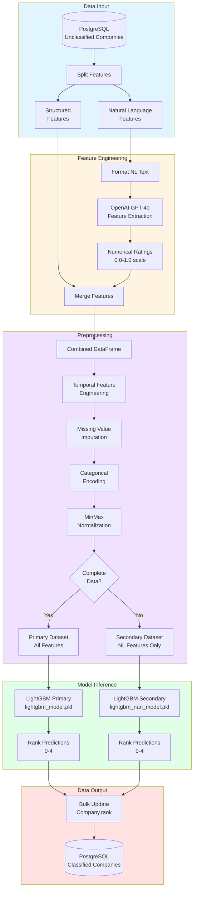

# 5. Machine Learning Components

This section documents the machine learning subsystem of OMVision, which classifies ingested companies based on their relevance to OMVC's investment thesis. The ML pipeline transforms enriched company data into structured features, applies an ordinal regression model, and produces ranked outputs that enable prioritized deal evaluation.

The classification system operates as part of the `classify_ingested_companies` Dagster job (`app/jobs/classify_ingested_companies.py`), which runs after companies have been ingested and enriched from various data sources. The model outputs a discrete relevance score (ordinal rank) for each company, stored in the `Company.rank` field and used by the frontend for sorting and filtering.



**Key Design Principles:**

- **Dual-Model Architecture**: A primary model uses all available features for maximum accuracy, while a secondary model handles companies with missing structured data using only NL-derived features
- **LLM-Powered Feature Engineering**: OpenAI's GPT-4o extracts numerical ratings from qualitative company descriptions, enabling the model to leverage textual signals that traditional feature engineering cannot capture
- **Ordinal Classification**: The model treats relevance as an ordered scale rather than independent classes, improving prediction quality for inherently ranked targets
- **Reproducible Preprocessing**: Deterministic feature transformations ensure consistent model behavior across runs and enable offline model training

---

## 5.1 Classification Pipeline

The classification pipeline executes as a Dagster job with nine sequential operations that transform unclassified companies into ranked predictions. The job is scheduled to run daily after ingestion jobs complete, processing all companies where `Company.rank IS NULL`.

**Job Definition** (`app/jobs/classify_ingested_companies.py`):

```python
@job
def classify_ingested_companies():
    nl_features, other_features = get_all_unclassified_companies()
    formatted_features = format_company_nl_features(nl_features)
    extracted_ratings = extract_numerical_features_from_nl(formatted_features)
    input_df = prepare_input_dataframe(extracted_ratings, other_features)
    primary_df, secondary_df = preprocess_input_features(input_df)
    
    primary_classifications = get_primary_company_classes(primary_df)
    secondary_classifications = get_secondary_company_classes(secondary_df)
    
    update_company_classes_in_db(primary_classifications)
    update_company_classes_in_db(secondary_classifications)
```

### 5.1.1 Feature Engineering

Feature engineering transforms raw company data into model-ready inputs through three distinct stages: natural language feature extraction, structured feature preparation, and LLM-based feature transformation.

#### Natural Language Features

Natural language features capture qualitative information about companies that cannot be represented by metrics alone. These features are extracted from the `Company` and `CompanyMetric` tables and include:

**NL Feature Set** (`CompanyNLFeatures` schema in `app/schemas/companies.py`):

| Feature | Type | Source | Description |
|---------|------|--------|-------------|
| `description` | `Text` | `Company.description` | Company description text from Harmonic |
| `tags` | `JSON Array` | `Company.tags` | Industry/category tags with type labels |
| `highlights` | `JSON Array` | `CompanyMetric.highlights` | Key milestones, partnerships, products |
| `employee_highlights` | `JSON Array` | `CompanyMetric.employee_highlights` | Notable employee backgrounds and skills |

**Feature Extraction** (`get_all_unclassified_companies` op):

```python
@op(out={"nl_features": Out(), "other_features": Out()})
def get_all_unclassified_companies(
    db: DatabaseResource
) -> tuple[list[CompanyNLFeatures], list[CompanyOtherFeatures]]:
    companies = db.fetch_unclassified_companies()  # WHERE rank IS NULL
    
    company_nl_features = [
        CompanyNLFeatures(
            id=company.id,
            tags=company.tags,
            description=company.description,
            employee_highlights=company.employee_highlights,
            highlights=company.highlights
        )
        for company in companies
    ]
    
    return company_nl_features, company_other_features
```

**NL Feature Formatting** (`format_company_nl_features` op):

Raw JSON structures are converted into concatenated text strings suitable for LLM processing:

**Tags Formatting**:
```python
tags_set = set()
for tag in tags:
    display_value = tag.get("display_value", "").strip()
    tag_type = tag.get("type", "").strip()
    if display_value and tag_type:
        tags_set.add(f"{display_value} ({tag_type})")

tags_str = ", ".join(sorted(tags_set))
# Example: "Healthcare (industry), B2B (business_model), SaaS (product_type)"
```

**Highlights Formatting**:
```python
company_highlights_list = []
for item in company_highlights:
    category = item.get("category", "").strip()
    text = item.get("text", "").strip()
    if category and text:
        company_highlights_list.append(f"{category}: {text}")

company_highlights_str = "\n".join(company_highlights_list)
# Example:
# Partnership: Collaboration with Mayo Clinic for diagnostic trials
# Product: Launched AI-powered imaging platform in Q2 2024
```

**Employee Highlights Formatting** (with summarization):
```python
category_counts = {}
for item in employee_highlights:
    category = item.get("category", "")
    if category:
        category_counts[category] = category_counts.get(category, 0) + 1

summary_lines = [f"{count} employees with '{category}'" 
                 for category, count in category_counts.items()]
summary_str = "Employee Highlights Summary:\n" + "\n".join(summary_lines)

employee_highlights_str = summary_str + "\n\n" + "\n".join(individual_highlights)
# Example:
# Employee Highlights Summary:
# 3 employees with 'Former FAANG'
# 2 employees with 'PhD'
#
# Former FAANG: Worked at Google for 5 years as Senior Engineer
# PhD: Stanford PhD in Computer Vision
```

#### Structured Features

Structured features include quantitative metrics and categorical attributes extracted from the `Company` and `CompanyMetric` tables. These features represent firmographic data and funding information.

**Structured Feature Set** (`CompanyOtherFeatures` schema):

| Feature | Type | Source | Description |
|---------|------|--------|-------------|
| `headcount` | `Integer` | `CompanyMetric.headcount` | Number of employees |
| `funding_total` | `Float` | `CompanyMetric.funding.funding_total` | Total capital raised (USD) |
| `last_funding_type` | `String` | `CompanyMetric.funding.funding_stage` | Most recent funding round type |
| `last_funding_date` | `DateTime` | `CompanyMetric.funding.last_funding_at` | Date of most recent funding |
| `stage` | `String` | `CompanyMetric.stage` | Current funding stage |
| `country` | `String` | `Company.location.country` | Company headquarters country |
| `founding_date` | `DateTime` | `Company.founding_date.date` | Company founding date |
| `number_of_funding_rounds` | `Integer` | `CompanyMetric.funding.num_funding_rounds` | Total funding events |
| `web_traffic_change` | `Float` | `CompanyMetric.traction_metrics.web_traffic.90d_ago.percent_change` | 90-day web traffic % change |

**Feature Extraction**:

```python
funding = company.funding if company.funding else {}
location = company.location if company.location else {}
traction_metrics = company.traction_metrics if company.traction_metrics else {}
founding_date = company.founding_date if company.founding_date else {}

web_traffic = traction_metrics.get("web_traffic", {})
web_traffic_90d_ago = web_traffic.get("90d_ago", {})

company_other_features.append(
    CompanyOtherFeatures(
        id=company.id,
        last_funding_type=funding.get("funding_stage", "UNKNOWN"),
        country=location.get("country", "UNKNOWN"),
        stage=company.stage,
        headcount=int(company.headcount or 0),
        funding_total=funding.get("funding_total", 0) or 0,
        last_funding_date=funding.get("last_funding_at"),
        founding_date=founding_date.get("date"),
        number_of_funding_rounds=funding.get("num_funding_rounds", 0) or 0,
        web_traffic_change=web_traffic_90d_ago.get("percent_change", 0)
    )
)
```

#### LLM-Based Feature Transformation

The `extract_numerical_features_from_nl` operation uses OpenAI's `gpt-4o-2024-08-06` model to transform formatted natural language features into numerical ratings. This approach enables the model to quantify qualitative signals that traditional feature engineering cannot capture.

**Transformation Prompt** (defined in `app/resources/open_ai.py`):

```
You are a venture capital analyst. Given a company's description, highlights, tags, 
and employee highlights, rate the company on the following dimensions using a scale of 0-1:

1. company_relevance: How relevant is this company to early-stage venture investment?
   (0 = completely irrelevant, 1 = highly relevant startup)

2. founder_strength: How strong is the founding team based on their backgrounds?
   (0 = weak/unknown, 1 = exceptional pedigree)

3. investor_relevance: How notable are the company's investors?
   (0 = no notable investors, 1 = top-tier VCs)

4. team_strength: How strong is the overall team composition?
   (0 = weak/unknown, 1 = exceptional team)

Return ratings as a JSON object with keys: company_relevance, founder_strength, 
investor_relevance, team_strength. Each value must be a float between 0 and 1.
```

**LLM Feature Extraction** (`extract_numerical_features_from_nl` op):

```python
@op
def extract_numerical_features_from_nl(
    formatted_features: list[CompanyNLFeaturesFormatted],
    openai: OpenAIResource
) -> list[CompanyExtractedRatingFeatures]:
    
    extracted_ratings = []
    
    for company in formatted_features:
        # Construct user message with formatted features
        user_message = f"""
        Company: {company.description}
        
        Tags: {company.tags}
        
        Highlights:
        {company.highlights}
        
        Employee Highlights:
        {company.employee_highlights}
        """
        
        # Call OpenAI with structured output parsing
        response = openai.extract_company_ratings(user_message)
        
        extracted_ratings.append(
            CompanyExtractedRatingFeatures(
                id=company.id,
                company_relevance=response.company_relevance,
                founder_strength=response.founder_strength,
                investor_relevance=response.investor_relevance,
                team_strength=response.team_strength
            )
        )
    
    return extracted_ratings
```

**Output Schema** (`CompanyExtractedRatingFeatures`):

| Feature | Type | Range | Description |
|---------|------|-------|-------------|
| `company_relevance` | `Float` | [0, 1] | Investment relevance score |
| `founder_strength` | `Float` | [0, 1] | Founding team quality score |
| `investor_relevance` | `Float` | [0, 1] | Investor pedigree score |
| `team_strength` | `Float` | [0, 1] | Overall team composition score |

**Rationale for LLM-Based Features:**

Traditional feature engineering struggles to quantify qualitative company descriptions. OpenAI's language models excel at semantic understanding and can reliably score companies based on textual descriptions, providing signals unavailable from structured data alone. The LLM acts as a feature extractor, not a classifier, ensuring reproducible numerical features that the downstream LightGBM model can learn from.

#### Feature Merging

The `prepare_input_dataframe` operation combines LLM-extracted ratings with structured features into a unified pandas DataFrame suitable for preprocessing.

```python
@op
def prepare_input_dataframe(
    extracted_ratings: list[CompanyExtractedRatingFeatures],
    other_features: list[CompanyOtherFeatures]
) -> pd.DataFrame:
    
    # Convert to DataFrames
    ratings_df = pd.DataFrame([r.dict() for r in extracted_ratings])
    other_df = pd.DataFrame([f.dict() for f in other_features])
    
    # Merge on company ID
    merged_df = pd.merge(ratings_df, other_df, on="id", how="inner")
    
    return merged_df
```

**Final Feature Set** (before preprocessing):

| Feature | Type | Source |
|---------|------|--------|
| `id` | `Integer` | Primary key |
| `company_relevance` | `Float` | LLM-extracted |
| `founder_strength` | `Float` | LLM-extracted |
| `investor_relevance` | `Float` | LLM-extracted |
| `team_strength` | `Float` | LLM-extracted |
| `headcount` | `Integer` | Structured |
| `funding_total` | `Float` | Structured |
| `last_funding_type` | `String` | Structured |
| `last_funding_date` | `DateTime` | Structured |
| `stage` | `String` | Structured |
| `country` | `String` | Structured |
| `founding_date` | `DateTime` | Structured |
| `number_of_funding_rounds` | `Integer` | Structured |
| `web_traffic_change` | `Float` | Structured |

### 5.1.2 Model Architecture

OMVision uses an **ordinal classification** approach to predict company relevance. Ordinal classification treats the target variable (rank) as an ordered categorical variable rather than arbitrary classes, improving prediction accuracy for inherently ranked outcomes.

#### Ordinal Classifier Implementation

The ordinal classifier (`app/utils/ordinal_classifier.py`) wraps a base estimator (LightGBM) and decomposes the ordinal regression problem into multiple binary classification sub-problems.

**Algorithm Overview:**

For K ordinal classes, the ordinal classifier trains K-1 binary classifiers. Each binary classifier predicts whether a company belongs to a rank greater than threshold i. 

**Example with 4 ordinal classes (0, 1, 2, 3):**
- Classifier 1: P(y > 0)
- Classifier 2: P(y > 1)
- Classifier 3: P(y > 2)

The exact number of classes depends on the unique rank values present in the training data labels provided by the investment team.

**Class Definition** (`app/utils/ordinal_classifier.py`):

```python
import numpy as np
from sklearn.base import BaseEstimator, clone

class OrdinalClassifier(BaseEstimator):
    def __init__(self, clf):
        self.clf = clf
        self.clfs = {}
    
    def fit(self, X, y):
        self.unique_class = np.sort(np.unique(y))
        
        if self.unique_class.shape[0] > 2:
            for i in range(self.unique_class.shape[0] - 1):
                # For each k-1 ordinal value, fit a binary classification problem
                binary_y = (y > self.unique_class[i]).astype(np.uint8)
                clf = clone(self.clf)
                clf.fit(X, binary_y)
                self.clfs[i] = clf
    
    def predict_proba(self, X):
        clfs_predict = {k: self.clfs[k].predict_proba(X) for k in self.clfs}
        predicted = []
        
        for i, y in enumerate(self.unique_class):
            if i == 0:
                # V1 = 1 - Pr(y > V1)
                predicted.append(1 - clfs_predict[i][:, 1])
            elif i in clfs_predict:
                # Vi = Pr(y > Vi-1) - Pr(y > Vi)
                predicted.append(clfs_predict[i - 1][:, 1] - clfs_predict[i][:, 1])
            else:
                # Vk = Pr(y > Vk-1)
                predicted.append(clfs_predict[i - 1][:, 1])
        
        return np.vstack(predicted).T
    
    def predict(self, X):
        return np.argmax(self.predict_proba(X), axis=1)
    
    def score(self, X, y, sample_weight=None):
        from sklearn.metrics import accuracy_score
        _, indexed_y = np.unique(y, return_inverse=True)
        return accuracy_score(indexed_y, self.predict(X), sample_weight=sample_weight)
```

**Key Methods:**

- `fit(X, y)`: Trains K-1 binary classifiers, each predicting whether y exceeds threshold i
- `predict_proba(X)`: Computes probability distribution across all K classes using the cumulative probability differences from binary classifiers
- `predict(X)`: Returns the class with maximum probability (argmax of probability distribution)

#### Base Estimator: LightGBM

The base estimator wrapped by the ordinal classifier is **LightGBM** (Light Gradient Boosting Machine), a gradient boosting framework optimized for efficiency and accuracy.

**LightGBM Configuration:**

The model is trained offline (outside the OMVision codebase) with the following characteristics:

- **Algorithm**: Gradient Boosting Decision Trees (GBDT)
- **Objective**: Binary classification (for each sub-problem in ordinal regression)
- **Training Data**: Historical companies with manual rank assignments (0-4) provided by the OMVC investment team
- **Evaluation Metric**: Accuracy (correct rank prediction)
- **Hyperparameters**: Tuned via cross-validation (specific values in trained model artifacts)

**Model Artifacts:**

Two trained models are serialized using `joblib` and stored in `app/constants/`:

| Model File | Description | Features Used |
|------------|-------------|---------------|
| `lightgbm_model.pkl` | Primary model | All features (LLM ratings + structured features) |
| `lightgbm_nan_model.pkl` | Secondary model | LLM ratings only (4 features) |

Both models use the `OrdinalClassifier` wrapper to handle ordinal regression.

#### Rank Meanings

The model outputs a discrete rank representing investment relevance. Based on the system design, the typical rank scale is:

| Rank | Interpretation | Frontend Behavior |
|------|----------------|-------------------|
| 0 | Irrelevant | Likely filtered out or deprioritized |
| 1 | Somewhat relevant | Shown in lower priority tier |
| 2 | Relevant | Standard evaluation queue |
| 3 | Highly relevant | Priority review |

These ranks enable the frontend to sort companies by predicted quality, focusing the investment team's attention on the most promising opportunities. The exact rank values and interpretations were defined during model training based on historical labels provided by the OMVC investment team.

### 5.1.3 Prediction Process

The prediction process applies trained models to preprocessed features and persists rank predictions to the database. Two parallel classification operations handle companies with complete versus incomplete feature sets.

#### Primary Classification

The primary classification path uses the full feature set (LLM ratings + structured features) for companies with complete data.

**Primary Classification Op** (`get_primary_company_classes`):

```python
@op
def get_primary_company_classes(
    context,
    df_input: pd.DataFrame,
    ml: MLResource
) -> list[CompanyClassification]:
    # Extract company IDs before dropping
    company_ids = df_input["id"].tolist()
    df_input = df_input.drop("id", axis=1)
    
    # Predict using primary model
    predictions = ml.primary_classify_companies(df_input)
    
    # Map predictions back to company IDs
    classifications = [
        CompanyClassification(id=cid, rank=pred)
        for cid, pred in zip(company_ids, predictions)
    ]
    
    context.log.info(
        f"Predicted classes for {len(classifications)} companies using all features."
    )
    return classifications
```

**MLResource Primary Classification** (`app/resources/ml_model.py`):

```python
def primary_classify_companies(self, companies: pd.DataFrame) -> list[float]:
    model = joblib.load("app/constants/lightgbm_model.pkl")
    y_pred_prob = model.predict(companies, num_iteration=model.best_iteration)
    y_pred = np.argmax(y_pred_prob, axis=1)  # Ordinal classes (typically 0, 1, 2, 3)
    return y_pred.tolist()
```

**Process:**

1. Load serialized model from disk using `joblib.load()`
2. Call `model.predict()` to generate probability distributions for each company
   - Returns shape `(n_samples, K)` array with probabilities for each rank class
3. Apply `argmax` to select the rank with highest probability
4. Return predictions as a list of integers

#### Secondary Classification

The secondary classification path handles companies missing critical structured features (e.g., founding_date, last_funding_date). These companies are classified using only LLM-derived features.

**Secondary Classification Op** (`get_secondary_company_classes`):

```python
@op
def get_secondary_company_classes(
    context,
    df_input: pd.DataFrame,
    ml: MLResource
) -> list[CompanyClassification]:
    company_ids = df_input["id"].tolist()
    df_input = df_input.drop("id", axis=1)
    
    # Predict using secondary model (NL features only)
    predictions = ml.secondary_classify_companies(df_input)
    
    classifications = [
        CompanyClassification(id=cid, rank=pred)
        for cid, pred in zip(company_ids, predictions)
    ]
    
    context.log.info(
        f"Predicted classes for {len(classifications)} companies using NLP features."
    )
    return classifications
```

**MLResource Secondary Classification**:

```python
def secondary_classify_companies(self, companies: pd.DataFrame) -> list[float]:
    model = joblib.load("app/constants/lightgbm_nan_model.pkl")
    y_pred_prob = model.predict(companies, num_iteration=model.best_iteration)
    y_pred = np.argmax(y_pred_prob, axis=1)
    return y_pred.tolist()
```

**Secondary Model Features:**

The secondary model uses only the four LLM-extracted features:

- `company_relevance`
- `founder_strength`
- `investor_relevance`
- `team_strength`

This ensures no company is left unclassified due to missing structured data, though predictions may be less accurate than the primary model.

#### Database Persistence

Predicted ranks are bulk-updated in the `Company` table using the `update_company_classes_in_db` operation.

**Database Update Op**:

```python
@op
def update_company_classes_in_db(
    context,
    classifications: list[CompanyClassification],
    db: DatabaseResource
):
    for classification in classifications:
        db.update_company(classification.id, {"rank": classification.rank})
    
    context.log.info(f"Updated {len(classifications)} company ranks in database.")
```

**Database Implementation** (`app/db/db_manager.py`):

```python
def update_company(self, company_id: int, update_data: dict):
    with self.get_session() as session:
        session.query(Company).filter(Company.id == company_id).update(update_data)
        session.commit()
```

After classification completes, all companies have a `rank` value (0-4), enabling the frontend to sort by predicted relevance.

---

## 5.2 Data Preprocessing

Data preprocessing transforms raw features into normalized, encoded representations suitable for machine learning. The preprocessing pipeline handles missing values, temporal feature engineering, categorical encoding, and numerical scaling to ensure consistent model inputs.

### 5.2.1 Feature Formatting

The `preprocess_input_features` operation (`app/jobs/classify_ingested_companies.py`) applies a deterministic sequence of transformations to the merged feature DataFrame.

#### Temporal Feature Engineering

Date columns are converted to derived temporal features that capture recency and company age:

**Date Parsing:**

```python
df["last_funding_date"] = pd.to_datetime(df["last_funding_date"]).dt.tz_localize(None)
df["founding_date"] = pd.to_datetime(df["founding_date"]).dt.tz_localize(None)
```

**Derived Features:**

```python
# Days since last funding (recency signal)
df["days_since_funding"] = (pd.Timestamp("today") - df["last_funding_date"]).dt.days

# Company age in days
df["company_age"] = (pd.Timestamp("today") - df["founding_date"]).dt.days.astype(float)

# Drop original date columns
df.drop(["last_funding_date", "founding_date"], axis=1, inplace=True)
```

**Rationale:**

- Models cannot directly process datetime objects; temporal features must be numerical
- `days_since_funding` captures funding recency (more recent funding may indicate traction)
- `company_age` captures maturity (early-stage companies align with OMVC's thesis)
- Using "days" rather than "years" provides finer granularity for recent companies

#### Missing Value Imputation

Missing values are imputed using domain-appropriate defaults:

**Numerical Imputation (zero-fill):**

```python
df["headcount"].fillna(0, inplace=True)
df["funding_total"].fillna(0, inplace=True)
df["web_traffic_change"].fillna(0, inplace=True)
df["number_of_funding_rounds"].fillna(0, inplace=True)
```

**Categorical Imputation (unknown category):**

```python
df["last_funding_type"].fillna("UNKNOWN", inplace=True)
df["country"].fillna("UNKNOWN", inplace=True)
df["stage"].fillna("UNKNOWN", inplace=True)
```

**Rationale:**

- Zero-filling for numerical features (headcount, funding) assumes missing data indicates no funding or very small team
- "UNKNOWN" category for categorical features preserves information about missingness without dropping rows
- LLM-extracted features (`company_relevance`, etc.) are never missing because they are always generated

#### Categorical Encoding

Categorical variables are encoded into numerical representations using predefined mappings and label encoding.

**Funding Type Encoding:**

Funding types are mapped to ordinal categories based on investment stage:

```python
df["last_funding_type"] = df["last_funding_type"].map(FUNDING_TYPE_MAPPING)
```

See §5.2.2 for the complete `FUNDING_TYPE_MAPPING` definition.

**Stage Encoding:**

Company stages are mapped to risk-based ordinal categories:

```python
df["stage"] = df["stage"].map(STAGE_MAPPING)
```

See §5.2.2 for the complete `STAGE_MAPPING` definition.

**Country Label Encoding:**

Country names are label-encoded into integers using scikit-learn's `LabelEncoder`:

```python
from sklearn.preprocessing import LabelEncoder

le = LabelEncoder()
df["country"] = le.fit_transform(df["country"])
```

**Rationale:**

- Label encoding assigns arbitrary integers to countries (e.g., "USA" → 0, "UK" → 1)
- LightGBM treats these as categorical features, learning splits based on country groupings
- No ordinality is implied (unlike `FUNDING_TYPE_MAPPING` and `STAGE_MAPPING`)

#### Numerical Scaling

All numerical features are normalized to the [0, 1] range using MinMax scaling:

```python
from sklearn.preprocessing import MinMaxScaler

numerical_columns = df.select_dtypes(include=[np.number]).columns
numerical_columns = numerical_columns.difference(["country", "id"])

scaler = MinMaxScaler()
df[numerical_columns] = scaler.fit_transform(df[numerical_columns])
```

**Scaled Features:**

- `company_relevance` (already 0-1 from LLM)
- `founder_strength` (already 0-1 from LLM)
- `investor_relevance` (already 0-1 from LLM)
- `team_strength` (already 0-1 from LLM)
- `headcount` (scaled from 0 to max observed headcount)
- `funding_total` (scaled from 0 to max observed funding)
- `days_since_funding` (scaled from 0 to max observed days)
- `company_age` (scaled from 0 to max observed age)
- `number_of_funding_rounds` (scaled from 0 to max observed rounds)
- `web_traffic_change` (scaled from min to max observed % change)

**Rationale:**

- MinMax scaling prevents features with large ranges (e.g., `funding_total`) from dominating gradient-based learning
- Scaling to [0, 1] aligns with LLM-extracted features, which are already in this range
- LightGBM is relatively robust to feature scaling due to its tree-based nature, but normalization improves convergence and model stability

#### Dataset Splitting

After preprocessing, companies are split into two datasets based on data completeness:

**Primary Dataset (Complete Data):**

```python
df_cleaned = df.dropna()  # All features available
```

Companies in `df_cleaned` have no missing values after imputation and are classified using the primary model.

**Secondary Dataset (Incomplete Data):**

```python
df_dropped = df[df.isna().any(axis=1)][
    ["id", "company_relevance", "founder_strength", "investor_relevance", "team_strength"]
]
```

Companies in `df_dropped` have missing temporal features (founding_date or last_funding_date resulted in NaN values during temporal feature engineering) and are classified using only LLM-extracted features.

**Rationale:**

- Companies founded very recently may not have `founding_date` recorded yet
- Companies without funding history have NULL `last_funding_date`, causing `days_since_funding` to be NaN
- Rather than dropping these companies, the secondary model ensures all ingested companies receive a rank

### 5.2.2 Data Mappings

Categorical feature mappings encode domain knowledge about funding types and company stages into ordinal categories. These mappings are defined in `app/constants/company_mappings.py` and applied during preprocessing.

#### FUNDING_TYPE_MAPPING

Maps funding round types to ordinal categories representing investment stage progression. Lower values indicate earlier stages; higher values indicate non-traditional or unsuitable funding.

**Mapping Definition:**

```python
FUNDING_TYPE_MAPPING = {
    # Non-Equity Funding (0)
    "GRANT": 0,
    "NON_EQUITY_ASSISTANCE": 0,
    "M_AND_A": 0,
    "CORPORATE_ROUND": 0,
    
    # Early Stage Funding (1)
    "ANGEL_INDIVIDUAL": 1,
    "ANGEL": 1,
    "ACCELERATOR_INCUBATOR": 1,
    "PRE_SEED": 1,
    "PRE__SEED": 1,
    "SEED": 1,
    
    # Venture Capital Funding (2)
    "SERIES_A": 2,
    "SERIES_B": 2,
    "SERIES_A1": 2,
    "EARLY_STAGE_VC": 2,
    "LATER_STAGE_VC": 2,
    "EARLY_STAGE_SERIES_A": 2,
    "LATER_STAGE_SERIES_A": 2,
    "EARLY_STAGE_SERIES_A1": 2,
    "SERIES_1": 2,
    "SERIES_UNKNOWN": 2,
    
    # Debt Financing (3)
    "DEBT_GENERAL": 3,
    "DEBT_FINANCING": 3,
    "DEBT": 3,
    "CONVERTIBLE_NOTE": 3,
    
    # Uncertain or Unknown (4)
    "CROWDFUNDING": 4,
    "EQUITY_CROWDFUNDING": 4,
    "INITIAL_COIN_OFFERING": 4,
    "UNDISCLOSED": 4,
    "UNKNOWN": 4,
    "STRATEGIC": 4,
    
    # Out of Business (5)
    "OUT_OF_BUSINESS": 5,
}
```

**Category Interpretations:**

| Category | Funding Types | Investment Thesis Alignment |
|----------|--------------|----------------------------|
| 0 | Non-equity (grants, M&A) | Low relevance (non-traditional funding) |
| 1 | Angel, Pre-Seed, Seed | High relevance (target stage for OMVC) |
| 2 | Series A, Series B, VC | Moderate relevance (potentially too late) |
| 3 | Debt, Convertible Notes | Low relevance (non-equity or distressed) |
| 4 | Crowdfunding, ICO, Unknown | Low relevance (high risk or unclear) |
| 5 | Out of Business | No relevance |

**Usage:**

Applied during preprocessing to convert string funding types to ordinal integers:

```python
df["last_funding_type"] = df["last_funding_type"].map(FUNDING_TYPE_MAPPING)
```

#### STAGE_MAPPING

Maps company stages to ordinal categories representing risk levels. Lower values indicate lower risk (successful exits); higher values indicate higher risk (early stage or failed companies).

**Mapping Definition:**

```python
STAGE_MAPPING = {
    "EXITED": 0,            # Lowest risk, successful exit
    "SERIES_C": 1,          # Slight risk, later stage with growth
    "SERIES_B": 1,          # Slight risk, established product-market fit
    "SERIES_A": 1,          # Slight risk, initial institutional funding
    "PRE_SEED": 2,          # Higher risk, very early stage
    "SEED": 2,              # Higher risk, gaining traction but still risky
    "STEALTH": 3,           # Too high risk, early stage in stealth mode
    "VENTURE_UNKNOWN": 3,   # Too high risk, unclear venture stage
    "UNKNOWN": 3,           # Too high risk, uncertain about stage
    "OUT_OF_BUSINESS": 3,   # Too high risk, worst-case scenario
}
```

**Category Interpretations:**

| Category | Stages | Investment Thesis Alignment |
|----------|--------|----------------------------|
| 0 | Exited | No relevance (already acquired/IPO'd) |
| 1 | Series A-C | Moderate relevance (established but possibly late) |
| 2 | Pre-Seed, Seed | High relevance (target stage for OMVC) |
| 3 | Stealth, Unknown, Out of Business | Low relevance (too risky or no information) |

**Usage:**

Applied during preprocessing to convert string stages to ordinal integers:

```python
df["stage"] = df["stage"].map(STAGE_MAPPING)
```

#### Rationale for Ordinal Mappings

Both `FUNDING_TYPE_MAPPING` and `STAGE_MAPPING` encode domain knowledge about which funding types and stages align with OMVC's investment thesis:

- **Target Stage**: Pre-Seed and Seed (early traction, institutional funding rounds)
- **Too Early**: Grants, non-equity assistance (pre-commercial)
- **Too Late**: Series B+ (already scaled beyond target stage)
- **Unsuitable**: Debt financing, crowdfunding, ICOs (non-traditional equity)

Ordinal mappings enable the model to learn monotonic relationships (e.g., companies at Seed stage may be more relevant than those at Series C), improving prediction quality compared to arbitrary integer encoding.

---

## 5.3 Model Resource

The `MLResource` class (`app/resources/ml_model.py`) encapsulates model loading and inference logic, exposing a simple API for Dagster operations to consume predictions.

### MLResource Class Definition

**Implementation** (`app/resources/ml_model.py`):

```python
from dagster import ConfigurableResource
import pandas as pd
import joblib
import numpy as np


class MLResource(ConfigurableResource):
    """
    Resource for loading and executing LightGBM classification models.
    
    Provides methods for primary classification (all features) and secondary 
    classification (NL features only).
    """
    
    def primary_classify_companies(self, companies: pd.DataFrame) -> list[float]:
        """
        Classify companies using the primary model with all features.
        
        Args:
            companies: DataFrame with all preprocessed features (no 'id' column)
        
        Returns:
            List of predicted ranks (0-4) as floats
        """
        model = joblib.load("app/constants/lightgbm_model.pkl")
        y_pred_prob = model.predict(companies, num_iteration=model.best_iteration)
        y_pred = np.argmax(y_pred_prob, axis=1)
        return y_pred.tolist()
    
    def secondary_classify_companies(self, companies: pd.DataFrame) -> list[float]:
        """
        Classify companies using the secondary model with NL features only.
        
        Args:
            companies: DataFrame with NL-derived features only (no 'id' column)
        
        Returns:
            List of predicted ranks (0-4) as floats
        """
        model = joblib.load("app/constants/lightgbm_nan_model.pkl")
        y_pred_prob = model.predict(companies, num_iteration=model.best_iteration)
        y_pred = np.argmax(y_pred_prob, axis=1)
        return y_pred.tolist()
```

### Model Loading Pattern

**On-Demand Loading:**

Models are loaded from disk on each method call using `joblib.load()`.

**File Paths:**

Model artifacts are stored in `app/constants/` and loaded using relative paths:

- `app/constants/lightgbm_model.pkl`: Primary model
- `app/constants/lightgbm_nan_model.pkl`: Secondary model

**Joblib Serialization:**

- Models are serialized using `joblib.dump()` during offline training
- `joblib` is preferred over `pickle` for large numpy arrays (used internally by LightGBM)
- Deserialization is fast (~100ms for typical model sizes)

### Resource Configuration

The `MLResource` is defined as a Dagster `ConfigurableResource`, enabling dependency injection into ops:

**Dagster Definitions** (`app/__init__.py` or similar):

```python
from dagster import Definitions
from app.resources import MLResource

defs = Definitions(
    jobs=[classify_ingested_companies],
    resources={
        "ml": MLResource(),
        # ... other resources
    }
)
```

**Op Usage:**

```python
@op
def get_primary_company_classes(
    df_input: pd.DataFrame,
    ml: MLResource  # Injected by Dagster
) -> list[CompanyClassification]:
    predictions = ml.primary_classify_companies(df_input)
    # ...
```

### Best Iteration Usage

The model loading pattern uses `model.best_iteration` when calling `predict()`:

```python
y_pred_prob = model.predict(companies, num_iteration=model.best_iteration)
```

**Rationale:**

- LightGBM supports early stopping during training to prevent overfitting
- `best_iteration` stores the iteration number where validation performance was optimal
- Using `num_iteration=model.best_iteration` ensures predictions use the same number of trees as validation, preventing overfitting at inference time

