# 1. System Overview

OMVision is OMVC's internal deal sourcing engine that automates the discovery and qualification of early-stage investment opportunities. By continuously monitoring multiple data sources and applying machine learning to filter and rank companies, OMVision enables the investment team to identify promising startups before they become widely known—a critical advantage in competitive venture capital markets.

This documentation provides technical context for engineers maintaining and extending the system. The following sections introduce the system's purpose, architecture, components, and technology stack at a conceptual level. Implementation details are covered in subsequent sections (§2-§8).

---

## 1.1 Purpose & Business Context

OMVC differentiates its deal sourcing strategy through proactive outbound research rather than relying solely on network referrals and inbound applications. However, manually reviewing thousands of signals from newsletters, news feeds, and databases is time-prohibitive for a four-person investment team. OMVision solves this bottleneck by automating signal ingestion, entity extraction, and relevance classification.

**The Pre-OMVision Workflow**

Before automation, OMVC's deal sourcing process required 1-4 hours daily per team member and covered only a fraction of available data sources:

1. Manually review signals from Accern dashboards, newsletters, and LinkedIn Sales Navigator
2. Identify company names mentioned in each signal and visit their websites
3. Search CBI/Harmonic to check for prior relationships
4. Add promising companies to deal flow collections with appropriate labels

This manual process left most data sources unused and caused the team to miss high-quality opportunities.

**OMVision's Solution**

OMVision automates the entire workflow, reducing daily deal review time to approximately 30 minutes while processing all available data sources. The system:

- **Ingests signals automatically** from Accern (news/event feeds), Gmail (VC newsletters), and Harmonic (saved company searches)
- **Extracts and enriches entities** using NER, web search for URLs, and the Harmonic API for company/founder data
- **Filters irrelevant companies** based on geography, funding stage, team size, and other investment thesis criteria
- **Classifies relevance** using a machine learning model trained on OMVC's historical deal flow decisions
- **Surfaces actionable opportunities** through a frontend application with custom tracking columns and deal flow management features

**Key Business Objectives**

- **Comprehensive Coverage**: Process 100% of available deal flow sources daily (currently ~100-200 relevant companies per day) rather than cherry-picking high-yield sources
- **Earlier Discovery**: Identify companies at founding, product launch, or initial fundraising stages before they appear in mainstream VC channels
- **Scalable Filtering**: Use ML classification to surface the top 10-20 companies daily, enabling the team to evaluate more opportunities without increasing time investment
- **Historical Context**: Maintain a searchable database of all signals and entities to understand why companies appeared and track them over time
- **Reduced Manual Work**: Eliminate repetitive research tasks (finding URLs, checking for duplicates, enriching company data) so the team focuses on evaluation and outreach

---

## 1.2 High-Level Architecture

OMVision follows a **multi-stage pipeline architecture** orchestrated by Dagster. Data flows through distinct stages—ingestion, extraction, enrichment, classification, and persistence—with each stage designed to be modular and independently testable.

**[Diagram Placeholder: End-to-End Data Flow]**

*Suggested diagram: Data Sources (Accern, Gmail, Harmonic) → Signal Ingestion → Entity Extraction (NER + URL Enrichment) → Data Enrichment (Harmonic API) → Classification (ML Model) → Database Storage → Frontend Application*

```mermaid
flowchart TD
    %% Data Sources
    subgraph DS[Data Sources]
        DS1[Accern<br/><small>News & event feeds</small>]
        DS2[Gmail<br/><small>VC newsletters</small>]
        DS3[Harmonic<br/><small>Saved searches</small>]
    end
    
    %% Signal Ingestion
    subgraph SI[Signal Ingestion]
        SI1[Dagster Jobs<br/><small>Scheduled hourly/daily</small>]
    end
    
    %% Entity Extraction
    subgraph EE[Entity Extraction]
        EE1[NER OpenAI GPT-4o<br/><small>Extract companies & people</small>]
        EE2[LLM Filtering<br/><small>Remove Fortune 500, etc.</small>]
        EE3[Context Extraction<br/><small>Entity descriptors</small>]
    end
    
    %% URL Enrichment
    subgraph UE[URL Enrichment]
        UE1[Google Search API<br/><small>Find company websites</small>]
        UE2[Fuzzy Matching<br/><small>Score & select best match</small>]
        UE3[LinkedIn Profiles<br/><small>Match people to profiles</small>]
    end
    
    %% Data Enrichment
    subgraph DE[Data Enrichment]
        DE1[Harmonic API<br/><small>Company metadata, funding, team, investors</small>]
    end
    
    %% Filtering & Validation
    subgraph FV[Filtering & Validation]
        FV1[Investment Criteria<br/><small>Geography, stage, size, exclusion lists</small>]
    end
    
    %% ML Classification
    subgraph MC[ML Classification]
        MC1[Feature Engineering<br/><small>NL + structured features</small>]
        MC2[LightGBM Model<br/><small>Ordinal relevance scoring</small>]
    end
    
    %% Persistence
    subgraph P[Persistence]
        P1[PostgreSQL Database<br/><small>Signals, companies, people, classifications</small>]
    end
    
    %% Frontend Application
    subgraph FA[Frontend Application]
        FA1[Web Interface<br/><small>Investment team reviews & tracks deals</small>]
    end
    
    %% Connections
    DS --> SI
    SI --> EE
    EE --> UE
    UE --> DE
    DE --> FV
    FV --> MC
    MC --> P
    P --> FA
    
    %% Styling
    classDef sourceStyle fill:#e3f2fd,stroke:#2196F3,stroke-width:2px
    classDef ingestionStyle fill:#f3e5f5,stroke:#9C27B0,stroke-width:2px
    classDef extractionStyle fill:#fce4ec,stroke:#E91E63,stroke-width:2px
    classDef enrichmentStyle fill:#fff3e0,stroke:#FF9800,stroke-width:2px
    classDef filterStyle fill:#e0f2f1,stroke:#009688,stroke-width:2px
    classDef mlStyle fill:#e8f5e9,stroke:#4CAF50,stroke-width:2px
    classDef storageStyle fill:#ffebee,stroke:#F44336,stroke-width:2px
    classDef frontendStyle fill:#fffde7,stroke:#FBC02D,stroke-width:2px
    
    class DS sourceStyle
    class SI ingestionStyle
    class EE extractionStyle
    class UE,DE enrichmentStyle
    class FV filterStyle
    class MC mlStyle
    class P storageStyle
    class FA frontendStyle
```

### Data Flow Overview

1. **Signal Ingestion**: Scheduled Dagster jobs fetch raw data from external sources on daily or hourly schedules:
    - **Accern**: API calls retrieve news articles and event-based signals matching pre-configured use cases (fundraising announcements, product launches, executive changes, etc.)
    - **Gmail**: IMAP client reads emails sent to a dedicated [newsletters@omvc.co](mailto:newsletters@omvc.co) inbox over the past 24 hours
    - **Harmonic Searches**: API queries return net-new companies from saved searches (e.g., "Seed-stage AI companies in North America founded in 2024")
2. **Entity Extraction**: For signal-based sources (Accern and Gmail), the system identifies companies and people mentioned in unstructured text:
    - **Named Entity Recognition (NER)**: OpenAI GPT-4o extracts organization and person entities from signal text using structured output formatting
    - **LLM Filtering**: A second OpenAI call removes obviously irrelevant entities (Fortune 500 companies, celebrities, government agencies, etc.) to reduce noise early in the pipeline
    - **Context Extraction**: OpenAI provides descriptive context for each entity (e.g., "AI-powered accounting software" for a company, "co-founder and CEO" for a person) to improve downstream URL matching accuracy
3. **URL Enrichment**: Since Harmonic's enrichment API requires URLs rather than company names, the system must find web addresses for extracted entities:
    - **Web Search**: Google Custom Search API queries are constructed using entity names and descriptive context
    - **Fuzzy Matching**: A custom algorithm scores search results based on name similarity and context relevance, selecting the best match
    - **People Profiles**: LinkedIn profile URLs are matched similarly, limiting search scope to `linkedin.com/in` domain
4. **Data Enrichment**: Once URLs are obtained, the Harmonic API enriches entities with structured metadata:
    - **Company Data**: Description, founding date, location, funding history, investors, headcount, traction metrics, team members, and highlights
    - **People Data**: LinkedIn profiles, work history, education, current positions, and network connections to OMVC team members
    - For Harmonic-sourced searches, entities come pre-enriched and skip the URL matching step
5. **Filtering & Validation**: Enriched entities are filtered against OMVC's investment criteria before database insertion:
    - **Geography**: Exclude companies outside target markets (primarily North America, Western Europe)
    - **Stage**: Filter out companies beyond target funding stages (typically pre-Seed through Series A)
    - **Team Size**: Exclude companies above headcount thresholds (e.g., >75 employees indicates post-PMF scaling stage)
    - **Funding**: Remove companies that have raised beyond target amounts (e.g., >$15M total funding)
    - **Manual Exclusion Lists**: Check against user-maintained blacklists of irrelevant companies
6. **ML Classification**: A machine learning model scores remaining companies on relevance to OMVC's investment thesis:
    - **Feature Engineering**: Extract natural language features (company description, highlights, employee bios) and structured features (funding stage, investor quality, team strength)
    - **Ordinal Regression**: LightGBM model outputs probability distribution across discrete relevance tiers
    - **Score Storage**: Classification results are persisted to enable ranking and filtering in the frontend
7. **Persistence**: All entities, signals, and metadata are stored in PostgreSQL with full relational integrity:
    - **Signals** linked to their originating data sources
    - **Companies and People** linked to the signals where they were discovered
    - **Metrics and Classifications** stored separately to support historical tracking and model retraining
    - **Custom Columns**: User-defined fields (watchlists, deal flow stage, comments) persisted to support workflow tracking
8. **Frontend Consumption**: A separate web application (outside the scope of this documentation) queries the database to present companies, people, and signals to the investment team with filtering, sorting, and custom field management capabilities.

### Key Architectural Characteristics

- **Event-Driven Scheduling**: Each data source runs on its own Dagster schedule (e.g., Accern hourly, Gmail daily, Harmonic searches daily), triggering downstream jobs via sensors
- **Idempotent Operations**: Ingestion jobs use upsert patterns and unique constraints to safely re-run without creating duplicate records
- **Decoupled Stages**: Extraction, enrichment, and classification operate independently, allowing failures in one stage to be retried without reprocessing earlier stages
- **Stateful Processing**: The PostgreSQL database serves as the system's persistent state, enabling incremental updates, historical queries, and audit trails
- **Rate-Limited External Calls**: All API integrations implement rate limiting to respect third-party quotas and avoid throttling

---

## 1.3 Key Components Summary

OMVision's codebase is organized into logical modules corresponding to pipeline stages. Below is a brief overview of each major component. Detailed explanations appear in later sections (see §2-§7).

### Core Orchestration

- **Dagster Jobs & Ops** (`main.py`, `workspace.yaml`, `dagster.yaml`): Defines ETL workflows, schedules, and sensors. Each data source has dedicated jobs (e.g., `ingest_signals_from_accern`, `ingest_companies_from_searches`) that chain together via run status sensors.
- **Operation Configuration** (`op_config.py`): Provides reusable configuration patterns for common operations like source lookups and watchlist management.

### Data Ingestion Modules

- **Accern Ingestion** (`ingest_signals_from_accern.py`, `accern_api.py`, `accern.py`): Fetches news and event signals from Accern's NLP platform, filters by relevance, and stores raw signals with extracted entity tags.
- **Email Ingestion** (`ingest_signals_from_emails.py`, `mail_client.py`, `mail.py`): Connects to Gmail via IMAP, parses newsletter emails, and extracts signals from message bodies.
- **Harmonic Search Ingestion** (`ingest_companies_from_searches.py`, `ingest_people_from_searches.py`): Retrieves companies and people from Harmonic's saved search API, which returns entities matching pre-defined criteria (e.g., "recently founded AI companies").

### Entity Extraction & Enrichment

- **Entity Extraction from Signals** (`ingest_companies_from_signals.py`, `ingest_people_from_signals.py`): Processes stored signals to extract company and person entities, using Harmonic's search API to match entities and enrich them with structured data.
- **URL Enrichment** (`web_search.py`): Custom resource that uses Google Custom Search API with fuzzy matching logic to find company websites and LinkedIn profiles for entities extracted from unstructured text.
- **Harmonic API Client** (`harmonic.py`, `harmonic_api.py`): Wrapper for Harmonic's company and people data endpoints, including search, enrichment, and watchlist management operations.
- **OpenAI Integration** (`open_ai.py`, `prompt_definitions.py`): Structured prompts for NER, entity filtering, context extraction, and feature rating (used in ML classification).

### Machine Learning & Classification

- **Ordinal Classifier** (`ordinal_classifier.py`, `ml_model.py`): Multi-class ordinal regression model that scores companies on a discrete relevance scale. The model is trained offline and loaded at runtime.
- **Classification Job** (`classify_ingested_companies.py`): Dagster job that applies the classifier to newly ingested companies, extracts NL and structured features, and persists predictions.
- **Feature Engineering** (`dataframes.py`, `company_mappings.py`): Helper functions for transforming company data into model-ready features, including label encoding and normalization.

### Data Layer & Persistence

- **Database Models** (`models.py`, `base.py`): SQLAlchemy ORM definitions for all entities (Company, Person, Signal, DataSource, List, CompanyMetric, etc.). Defines relationships, constraints, and indexes.
- **Database Manager** (`db_manager.py`): Provides session management, connection pooling, and utility functions (bulk inserts, upserts, queries) for database access.
- **Alembic Migrations** (`alembic.ini`, `env.py`, migration scripts): Version-controlled schema changes ensuring consistent database structure across development, staging, and production environments.

### Supporting Utilities

- **Rate Limiting** (`rate_limiter.py`): Token bucket implementation to enforce API rate limits and prevent quota exhaustion.
- **Company Filtering** (`company_filters.py`, `company_filter_list.py`): Logic for excluding irrelevant companies based on blacklists, hardcoded rules, and user-maintained exclusion lists.
- **Data Sources Management** (`data_sources.py`, `upsert_data_sources.py`): Configuration and persistence of data source metadata (API endpoints, credentials, channels).
- **Custom Columns** (`persist_custom_columns_data.py`): Manages user-defined fields that track deal flow stage, watchlists, comments, and other workflow-specific data.

---

## 1.4 Technology Stack

OMVision is built on a modern Python-based data engineering stack optimized for flexibility, developer productivity, and integration with OMVC's infrastructure.

### Core Technologies

| **Component** | **Technology** | **Rationale** |
| --- | --- | --- |
| Orchestration | [Dagster](https://dagster.io/) | Pipeline orchestration with built-in scheduling, monitoring, logging, and retry logic. Dagit UI provides observability into job runs and data lineage. |
| Language | Python 3.11+ | Standard for data engineering and ML; rich ecosystem for API integrations, NLP, and data processing. |
| Database | PostgreSQL 14+ | Reliable relational database with strong JSONB support for semi-structured data, full-text search capabilities, and transactional integrity. |
| ORM | [SQLAlchemy 2.x](https://www.sqlalchemy.org/) | Declarative ORM for type-safe database interactions with relationship management and migration support. |
| Migrations | [Alembic](https://alembic.sqlalchemy.org/) | Version control for database schema changes, integrated with SQLAlchemy for autogeneration of migration scripts. |
| Containerization | Docker & Docker Compose | Local development environment matches production; ensures reproducibility across team members' machines. |
| Deployment | AWS ECS (Fargate) | Managed container orchestration for running Dagster daemon and scheduled jobs in production. |
| Configuration | YAML (`dagster.yaml`, `dagster-prod.yaml`, `workspace.yaml`) | Environment-specific settings for Dagster jobs, database connections, and resource configurations. |

### Key Libraries & Dependencies

*See `requirements.txt` and `pyproject.toml` for the complete dependency list. Notable includes:*

- **Data Processing**: `pandas`, `numpy` for tabular data manipulation and feature engineering
- **HTTP Clients**: `requests` for API communication with Accern and Harmonic
- **ML & NLP**: `lightgbm` for ordinal classification, `openai` SDK for GPT API access, `fuzzywuzzy` for string matching in URL enrichment
- **Email Parsing**: `imaplib` (stdlib), `email` (stdlib) for IMAP integration and MIME parsing
- **API Integrations**: `googleapiclient` for Google Custom Search API
- **Validation**: `pydantic` for data schema validation and type checking
- **Utilities**: `python-dotenv` for environment variable management

### Infrastructure & Deployment

- **Local Development**: `docker-compose.yaml` defines PostgreSQL container and Dagster daemon for testing pipelines locally. Developers can run full workflows on their machines.
- **Production Environment**:
    - **Dagster**: Runs as a long-lived ECS service with the Dagster daemon executing scheduled jobs and processing sensor ticks
    - **Database**: PostgreSQL instance hosted on AWS RDS with automated backups and read replicas for frontend queries
    - **Networking**: Internal services communicate via VPC; frontend application accesses database read replicas
- **Secrets Management**: Sensitive credentials (API keys, database passwords, OAuth tokens) stored in environment variables or AWS Secrets Manager, never committed to version control.
- **Monitoring**: Dagster's built-in run logging and Dagit UI provide visibility into job execution. Additional alerting via AWS CloudWatch for infrastructure failures.

### External Integrations

| **Service** | **Purpose** | **Authentication** |
| --- | --- | --- |
| Accern | News intelligence and event-based signals | API key per channel endpoint |
| Harmonic | Company/people search and enrichment | API Key |
| Gmail API | Newsletter Ingestion | Service account with domain-wide delegation |
| Google Custom Search | URL discovery for entity enrichment | API key + Custom Search Engine ID |
| OpenAI API | NER, entity filtering, context extraction, feature rating | API key (Organization scoped) |

---

**Next Section**: §2 Data Models & Database Schema (see `omvision_doc_structure.txt` for full outline)