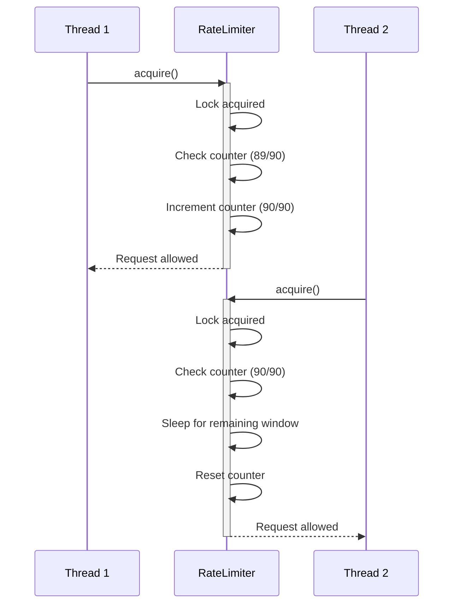
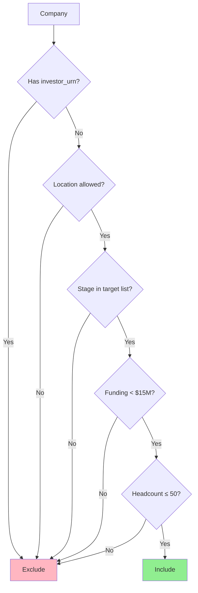
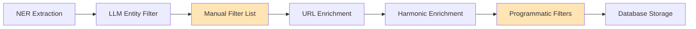
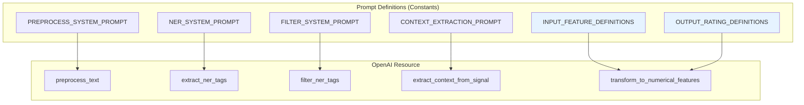
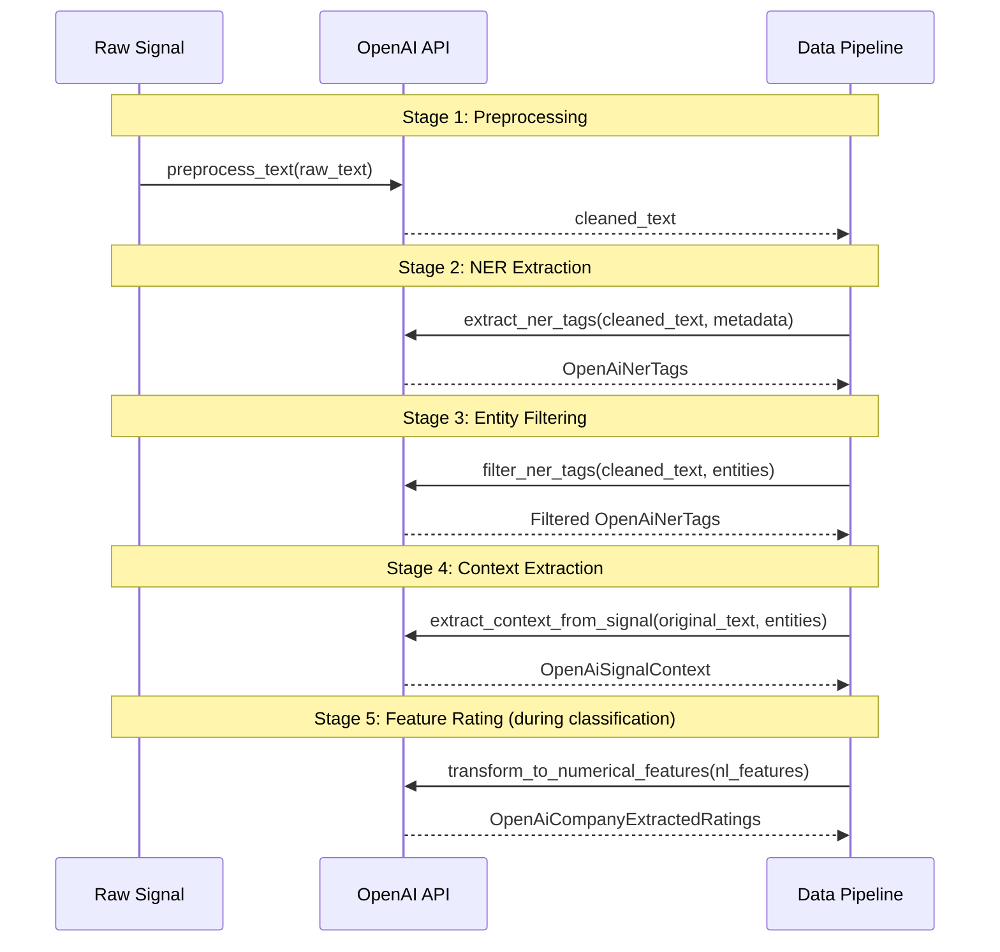
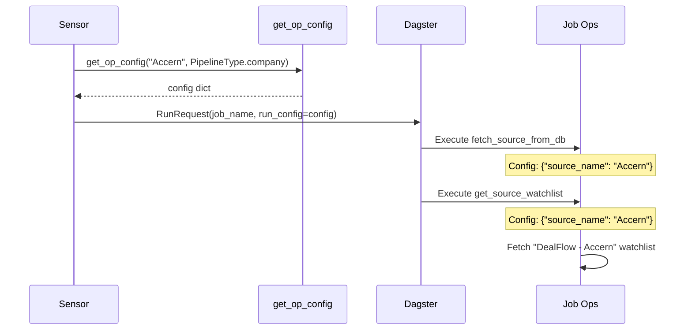

# 7. Utility Modules

OMVision's utility modules provide essential reusable logic that supports the core data pipeline, ML components, and external integrations. These modules encapsulate cross-cutting concerns including rate limiting, entity filtering, prompt engineering, data validation, and operation configuration.

This section documents each utility module, explaining its purpose, implementation, and integration points across the system.

---

## 7.1 Rate Limiting

### Overview

The `RateLimiter` class (`app/utils/rate_limiter.py`) implements a token bucket algorithm to enforce API rate limits and prevent quota exhaustion when interacting with external services. This utility is critical for maintaining compliance with third-party API rate restrictions, particularly for Google Custom Search, which has strict per-minute request limits.

### Implementation

**Class Definition**

```python
class RateLimiter:
    def __init__(self, max_calls, period, threshold=0.90):
        """
        Initialize rate limiter with configurable parameters.
        
        Args:
            max_calls (int): Maximum number of calls allowed within the period.
            period (int): Time window in seconds for max_calls.
            threshold (float): Percentage of max_calls to enforce (default 90%).
        """
        self.max_calls = max_calls
        self.period = period
        self.threshold = threshold
        self.threshold_limit = int(max_calls * threshold)
        self._lock = Lock()
        self._request_counter = 0
        self._first_request_time = None
```

**Core Algorithm**

The rate limiter uses a sliding window approach with the following logic:

1. **Initialization**: On first request, record timestamp
2. **Counter increment**: Each request increments internal counter
3. **Threshold check**: Block if counter reaches threshold limit
4. **Window reset**: Reset counter after time period expires
5. **Safety margin**: Default 90% threshold provides buffer against edge cases

**Key Method: `acquire()`**

```python
def acquire(self):
    """
    Acquire permission to make a request. Blocks if rate limit exceeded.
    """
    with self._lock:
        current_time = time.time()
        
        # Initialize on first request
        if self._first_request_time is None:
            self._first_request_time = current_time
        
        elapsed_time = current_time - self._first_request_time
        
        # Reset counter if period elapsed
        if elapsed_time > self.period:
            self._request_counter = 0
            self._first_request_time = current_time
        
        # Block if threshold reached
        if self._request_counter >= self.threshold_limit:
            time_to_wait = ceil(self.period - elapsed_time)
            print(f"Rate limit hit. Sleeping for {time_to_wait} seconds.")
            time.sleep(time_to_wait)
            self._first_request_time = time.time()
            self._request_counter = 0
        
        self._request_counter += 1
```

### Usage Patterns

**Google Custom Search Integration**

The most common usage is in the `WebSearchResource` for Google Custom Search API:

```python
class WebSearchResource(ConfigurableResource):
    def setup_for_execution(self, context: InitResourceContext):
        self._service = build("customsearch", "v1", developerKey=self.api_key)
        self._rate_limiter = RateLimiter(100, 60)  # 100 requests per 60 seconds
    
    def _google_custom_search(self, query, website=None):
        self._rate_limiter.acquire()  # Blocks if rate limit exceeded
        
        res = self._service.cse().list(q=query, cx=self.cse_id).execute()
        return res.get("items", [])
```

**Configuration Examples**

| Use Case | max_calls | period | threshold | Effective Limit |
|----------|-----------|--------|-----------|-----------------|
| Google Search (free tier) | 100 | 60 | 0.90 | 90 requests/min |
| Conservative API | 1000 | 3600 | 0.80 | 800 requests/hour |
| High-throughput | 5000 | 60 | 0.95 | 4750 requests/min |

### Behavior Characteristics

**Thread Safety**

The rate limiter uses a `threading.Lock` to ensure thread-safe counter updates, making it suitable for multi-threaded Dagster operations:



**Rate Limit Scenarios**

| Scenario | Behavior |
|----------|----------|
| Under threshold | Request proceeds immediately |
| At threshold | Thread sleeps until rate window resets |
| Multiple threads | Lock ensures sequential counter access |
| Period expired | Counter resets automatically |

### Integration Points

The `RateLimiter` is used throughout OMVision's external integrations:

- **§6.4 Google Custom Search**: Primary use case for URL discovery
- **Future API integrations**: Template for additional rate-limited resources

### Design Rationale

**Why 90% Threshold?**

The default 90% threshold provides a safety buffer to account for:

- Clock drift between client and server
- Network latency causing request bunching
- Concurrent requests in multi-threaded environments
- API provider's internal rate calculation variations


---

## 7.2 Company Filters

### Overview

Company filtering enforces OMVC's investment thesis by excluding entities that fall outside target parameters. OMVision implements two complementary filtering mechanisms:

1. **Programmatic filters**: Hard-coded criteria based on company attributes (location, funding stage, headcount)
2. **Manual filter list**: User-maintained exclusion list for domain-specific noise

Both filtering approaches work together to ensure only relevant companies progress through the pipeline.

### Programmatic Filter Criteria

**Filter Constants** (`app/constants/company_filters.py`)

```python
# Geographic scope
LOCATION_FILTER_LIST = [
    "United States", "Singapore", "Thailand", "Australia", "Canada",
    "United Arab Emirates", "Egypt", "Saudi Arabia", "New Zealand",
    "Philippines", "Indonesia", "Malaysia", "Hong Kong", "Vietnam",
    "Japan", "South Korea"
]

# Target funding stages
FUNDING_ROUND_FILTER_LIST = [
    "PRE_SEED", "SEED", "SERIES_A", "SERIES_B", 
    "VENTURE_UNKNOWN", "STEALTH"
]

# Financial and size constraints
FUNDING_AMOUNT_LIMIT = 15_000_000  # $15M
COMPANY_HEADCOUNT_LIMIT = 50       # employees
```

### Filter Implementation

**Location in Pipeline**

The `filter_companies` op (`app/jobs/ingest_companies_from_signals.py`) applies filters after Harmonic enrichment:

```python
@op
def filter_companies(
    context,
    searched_companies: list[SignalWithCompanies],
    enriched_companies: list[SignalWithCompanies]
) -> tuple[list[CompanyWithSignalId], list[SignalWithCompanyIds]]:
    """
    Apply investment thesis filters to enriched companies.
    
    Filters:
        1. Investor profiles (exclude companies that ARE investors)
        2. Geographic location
        3. Funding stage
        4. Total funding amount
        5. Company headcount
    
    Returns:
        Filtered companies and updated signal associations.
    """
    filtered_companies = []
    updated_signals = []
    
    for signal in searched_companies + enriched_companies:
        signal_company_ids = []
        
        for company in signal.companies:
            # Filter 1: Exclude investor entities
            if company.investor_urn:
                continue
            
            # Filter 2: Location restriction
            if company.location:
                country = company.location.get("country")
                if country and country not in LOCATION_FILTER_LIST:
                    continue
            
            # Filter 3: Funding stage restriction
            if company.stage and company.stage not in FUNDING_ROUND_FILTER_LIST:
                continue
            
            # Filter 4: Total funding limit
            if company.funding:
                funding_total = company.funding.get("funding_total")
                if funding_total and funding_total >= FUNDING_AMOUNT_LIMIT:
                    continue
            
            # Filter 5: Headcount limit
            if company.headcount and company.headcount > COMPANY_HEADCOUNT_LIMIT:
                continue
            
            # Company passed all filters
            filtered_companies.append(
                CompanyWithSignalId(signal_id=signal.id, **company.model_dump())
            )
            signal_company_ids.append(company.id)
        
        updated_signals.append(
            SignalWithCompanyIds(id=signal.id, source_company_ids=signal_company_ids)
        )
    
    return filtered_companies, updated_signals
```

### Filter Rationale

**Investment Thesis Alignment**

| Filter | Rationale | Example Exclusions |
|--------|-----------|-------------------|
| Investor URN | OMVision targets portfolio companies, not investors | Venture capital firms, accelerators |
| Location | Geographic focus on key markets | European startups, African companies |
| Funding Stage | Early-stage focus (Pre-Seed through Series B) | Series C+, growth equity, public companies |
| Funding Amount | Companies below $15M remain in growth stage | Over-capitalized late-stage companies |
| Headcount | Small teams indicate early stage | Mature companies with 100+ employees |

**Filter Interaction**

Filters are applied sequentially using short-circuit logic. If a company fails any filter, remaining filters are skipped for efficiency.



### Manual Filter List

**Purpose**

The manual filter list (`company_filter_list` asset in `app/assets/company_filters.py`) captures domain-specific noise that programmatic filters cannot anticipate:

- Repeatedly misidentified entities (e.g., "Ventures" as standalone company)
- Media outlets frequently mentioned in signals (e.g., "TechCrunch", "Bloomberg")
- Government agencies and academic institutions
- Large consulting firms

**Implementation**

```python
@asset
def company_filter_list(harmonic: HarmonicResource) -> list[str]:
    """
    Fetch manual exclusion list from Harmonic saved search.
    
    Returns:
        List of company names to exclude from pipeline.
    """
    filter_search = harmonic.get_filter_search()  # "DealFlow - Filter list"
    company_ids = harmonic.get_companies_by_search(filter_search.entity_urn)
    return [company.name for company in company_ids]
```

**Harmonic Configuration**

The filter list is maintained as a Harmonic saved search named "DealFlow - Filter list". Investment team members add companies to this search through Harmonic's UI, and the asset automatically syncs the list during pipeline execution.

**Usage in Pipeline**

The `filter_entities` op (`app/ops/__init__.py`) applies the manual filter to NER-extracted entities before URL enrichment:

```python
@op
def filter_entities(
    context,
    company_names: list[str],
    entities: list[NerTags]
) -> list[NerTags]:
    """
    Remove entities matching names in the manual filter list.
    
    Args:
        company_names: Manual exclusion list from company_filter_list asset.
        entities: Extracted entities with org/person/gpe tags.
    
    Returns:
        Entities with filtered organizations removed.
    """
    filter_count = 0
    
    for entity_tags in entities:
        keys_to_remove = [
            entity_name
            for entity_name in entity_tags.org.keys()
            if entity_name in company_names
        ]
        
        for entity_name in keys_to_remove:
            entity_tags.org.pop(entity_name)
            filter_count += 1
    
    context.log.info(f"Total entities removed: {filter_count}")
    return entities
```

### Filter Pipeline Position



**Why Two Filter Stages?**

- **Early filtering (manual list)**: Prevents wasted URL discovery and enrichment API calls
- **Late filtering (programmatic)**: Requires structured data only available after Harmonic enrichment

### Maintenance Workflow

**Adding to Filter List**

1. Investment team identifies irrelevant entity in Harmonic UI
2. Add entity to "DealFlow - Filter list" saved search
3. Next pipeline run automatically excludes entity

---

## 7.3 Prompt Definitions

### Overview

OMVision uses structured OpenAI prompts for four critical operations: text preprocessing, entity extraction (NER), entity filtering, and feature rating extraction. Prompts are centralized in `app/constants/prompt_definitions.py` and consumed by the `OpenAIResource` (`app/resources/open_ai.py`).

This centralization ensures prompt consistency, facilitates A/B testing, and enables version control of prompt engineering decisions.

### Prompt Architecture



### Preprocessing Prompts

**Purpose**: Remove noise from raw signal text before NER extraction.

**System Prompt** (in `OpenAIResource._preprocess_text_system_prompt()`)

```python
def _preprocess_text_system_prompt(self) -> str:
    return f"""
    You are an advanced text preprocessing AI. Your task is to filter and retain 
    only relevant content from unstructured text signals.
    
    Keep ONLY text that mentions or describes:
    - {", ".join(self.labels)}  # person, org, gpe
    
    Remove:
    - Greetings, signatures, boilerplate
    - Advertisements and promotional content
    - Navigation elements and metadata
    - Irrelevant conversational text
    
    Return cleaned text preserving entity context and relationships.
    """
```

**Usage Example**

```python
# Input (from Accern signal)
raw_text = """
Hi team, hope you're well!

TechCorp, a Series A fintech startup, raised $5M from Sequoia Capital. 
The company was founded by Jane Smith, former VP at Google.

Click here to unsubscribe | Privacy Policy
"""

# Output (after preprocessing)
preprocessed = """
TechCorp, a Series A fintech startup, raised $5M from Sequoia Capital. 
The company was founded by Jane Smith, former VP at Google.
"""
```

### NER Extraction Prompts

**Purpose**: Extract person, organization, and geopolitical entity mentions from preprocessed text.

**System Prompt** (in `OpenAIResource._system_message()`)

```python
def _system_message(self, labels: list[str]) -> str:
    return f"""
    You are an expert in Natural Language Processing. Your task is to identify 
    common Named Entities (NER) in a given natural language signal text.
    
    The possible common Named Entities (NER) types are exclusively: 
    ({", ".join(labels)}).
    """
```

**User Prompt with Metadata** (for Accern signals)

```python
def _user_message(self, text: str, signal: dict, vanilla_prompt: bool = False) -> str:
    if vanilla_prompt:
        return f"Extract named entities from: {text}"
    
    # Accern signals include additional context
    return f"""
    Extract named entities from the following text.
    
    Context:
    - Primary Entity: {signal.get('entity_name')}
    - Entity Type: {signal.get('entity_type')}
    - Document Title: {signal.get('doc_title')}
    - Document URL: {signal.get('doc_url')}
    
    Text:
    {text}
    """
```

**Structured Output Schema**

```python
class OpenAiNerTags(BaseModel):
    person: list[str]  # ["Jane Smith", "John Doe"]
    org: list[str]     # ["TechCorp", "Sequoia Capital"]
    gpe: list[str]     # ["San Francisco", "United States"]
```

### Entity Filtering Prompts

**Purpose**: Remove large corporations, government institutions, and celebrities from extracted entities.

**System Prompt** (in `OpenAIResource._filter_text_system_prompt()`)

```python
def _filter_text_system_prompt(self) -> str:
    example_1_input = {
        "person": [],
        "org": ["European Investment Bank", "European Investment Bank Group", 
                "European Investment Fund"],
        "gpe": ["Europe"]
    }
    example_1_output = {"person": [], "org": [], "gpe": []}
    
    example_2_input = {
        "person": [],
        "org": ["Deepnote", "Index Ventures", "Accel", "Y Combinator", 
                "Hyperquery", "Credo Ventures", "Ramp", "Motive", 
                "SoundCloud", "Gusto", "Webflow"],
        "gpe": []
    }
    example_2_output = {
        "person": [],
        "org": ["Deepnote", "Hyperquery", "Ramp", "Motive", "Gusto"],
        "gpe": []
    }
    
    return f"""
    You are an entity filtering AI assistant. There is a source text from which 
    entities have been extracted; your task is to use the filtering criteria given 
    below to remove entities from the original list of entities using the source 
    text as context.
    
    If you are unsure about the entity, retain it. Return ONLY the filtered entities 
    that PASS the given criteria.
    
    Each entity can be one of many different types. The description for the different 
    entity types is mentioned below:
    {", ".join(self.labels)}
    
    Follow these filtering criteria to eliminate entities from the original list:
    1) Remove entities that may refer to big companies or major-tech firms like 
       Meta, Google, OpenAI, Disney, JP Morgan etc.
    2) Remove entities that refer to public or government-owned institutions 
       (e.g., European Investment Bank)
    3) Remove entities that refer to celebrities or public figures
    
    Example 1:
    Input: {json.dumps(example_1_input)}
    Output: {json.dumps(example_1_output)}
    
    Example 2:
    Input: {json.dumps(example_2_input)}
    Output: {json.dumps(example_2_output)}
    """
```

**Filter Logic**

- **Retain startups**: Deepnote, Hyperquery, Ramp (early-stage companies)
- **Remove VC firms**: Index Ventures, Accel (investors, not portfolio companies)
- **Remove large tech**: SoundCloud, Webflow (mature companies)
- **Remove government**: European Investment Bank

### Context Extraction Prompts

**Purpose**: Extract entity descriptors and URLs for subsequent enrichment.

**System Prompt** (in `OpenAIResource._context_extraction_prompt()`)

```python
def _context_extraction_prompt(self) -> str:
    return """
    You are an information extraction AI. Given source text and a list of extracted 
    entities, identify additional context for each entity.
    
    For each entity, extract:
    1. Descriptors: Short phrases describing the entity's role, title, or function
       (e.g., "CEO", "Series A startup", "former Google executive")
    2. Link: Any URL associated with the entity (website, LinkedIn profile)
    
    Return structured data matching the OpenAiSignalContext schema.
    """
```

**Output Schema**

```python
class OpenAiEntityContext(BaseModel):
    name: str                # "Jane Smith"
    descriptors: list[str]   # ["CEO", "former VP at Google"]
    link: str                # "https://linkedin.com/in/janesmith"

class OpenAiSignalContext(BaseModel):
    people: list[OpenAiEntityContext]
    companies: list[OpenAiEntityContext]
```

**Usage Example**

```python
# Input
text = "TechCorp, a fintech startup, raised $5M. CEO Jane Smith, former Google VP."
entities = {"org": ["TechCorp"], "person": ["Jane Smith"]}

# Output
context = OpenAiSignalContext(
    companies=[
        OpenAiEntityContext(
            name="TechCorp",
            descriptors=["fintech startup", "raised $5M"],
            link=""
        )
    ],
    people=[
        OpenAiEntityContext(
            name="Jane Smith",
            descriptors=["CEO", "former Google VP"],
            link=""
        )
    ]
)
```

### Feature Rating Prompts

**Purpose**: Transform natural language company features into numerical ratings for ML classification.

**Input Feature Definitions** (`app/constants/prompt_definitions.py`)

```python
INPUT_FEATURE_DEFINTIIONS = {
    "Description": "A concise overview of the company that outlines its core business, "
                  "products or services, unique value propositions, and any proprietary "
                  "technologies or methodologies.",
    
    "CompanyHighlights": "Notable aspects of the company itself, including significant "
                        "achievements, venture backing, partnerships, awards, and other "
                        "distinguishing factors related to the company as an entity.",
    
    "EmployeeHighlights": "Notable aspects related to the company's employees, such as "
                         "experienced leadership, notable backgrounds, prior accomplishments, "
                         "and other distinguishing factors related to team members.",
    
    "Tags": "Unique keywords or phrases that categorize the company across various "
           "dimensions such as industry, technology, product type, customer type, "
           "market vertical, and technology type.",
}
```

**Output Rating Definitions** (`app/constants/prompt_definitions.py`)

```python
OUTPUT_RATING_DEFINITIONS = {
    "Company Relevance": "This variable will measure how well a company fits into our "
                        "investment thesis based on the information provided. We invest in "
                        "Pre-Seed, Seed, and Series A B2B and B2B2C fintech opportunities "
                        "that fall into three main buckets: Innovations in capital markets, "
                        "innovations in infrastructure, and deep-tech (AI, ML, Quantum, "
                        "Blockchain, etc). Also included in our fintech definition are "
                        "industries like Property Tech (PropTech), Insurance Tech (InsurTech), "
                        "ClimateTech (Software only).",
    
    "Founder Strength": "This variable will measure the overall quality of the founder. "
                       "There are multiple things that can determine the quality of a founder, "
                       "some of the things are: Founder-Market Fit (does the founder have "
                       "previous work experience in the market/industry their startup is in?), "
                       "Multi-time founder (Have they founded a company in the past?), relevant "
                       "educational experience (Did they go to a top university? Do they have "
                       "an advanced degree that is relevant for the product they are selling/"
                       "company they are running?), ability to hire high quality talent (what "
                       "is the overall strength of their team? Have they attracted top talent?).",
    
    "Investor Relevance": "This variable will measure the quality and relevance of investors "
                         "that have invested into the company so far. We want to understand "
                         "the reputation of the investor on their cap table and thesis alignment "
                         "for these investors. For example, we would rank a16z seed fund / "
                         "experimental check higher than AVG Partners in HK.",
    
    "Team Strength": "This variable is experimental. It would measure the overall strength "
                    "of the management team as a whole (rather than just the founder) and see "
                    "if the skillsets of the people on the management team compliment each other.",
}
```

**System Prompt Construction** (in `OpenAIResource._system_message_for_feature_extraction()`)

```python
def _system_message_for_feature_extraction(
    self,
    input_features_definitions: dict,
    output_ratings_definitions: dict,
    examples: Optional[list] = []
) -> str:
    prompt = """You are an AI assistant to our investment firm that extracts numerical 
    ratings (granular values between 0.00 and 1.00) from a set of natural language 
    features for companies.
    
    Input Features:
    """
    
    for feature, description in input_features_definitions.items():
        prompt += f"- {feature}: {description}\n"
    
    prompt += "\nOutput Ratings:\n"
    for rating, description in output_ratings_definitions.items():
        prompt += f"- {rating}: {description}\n"
    
    if examples:
        prompt += "\nExamples:\n"
        for i, example in enumerate(examples):
            prompt += f"Example {i+1}:\n"
            prompt += "Input Features:\n"
            for feature in input_features_definitions.keys():
                prompt += f"{feature}: {example['input'][feature]}\n"
            prompt += "Output Ratings:\n"
            for rating in output_ratings_definitions.keys():
                prompt += f"{rating}: {example['output'][rating]}\n"
            prompt += "\n"
    
    return prompt
```

**Output Schema**

```python
class OpenAiCompanyExtractedRatings(BaseModel):
    company_relevance: Optional[float]   # 0.0 - 1.0
    founder_strength: Optional[float]    # 0.0 - 1.0
    investor_relevance: Optional[float]  # 0.0 - 1.0
    team_strength: Optional[float]       # 0.0 - 1.0
```

### Prompt Usage Flow



### Temperature Settings

All prompts use `temperature=0` to ensure deterministic, reproducible outputs:

```python
response = self._client.beta.chat.completions.parse(
    model=self.extraction_model,  # "gpt-4o-2024-08-06"
    messages=messages,
    temperature=0,  # Deterministic output
    response_format=OutputSchema,
)
```

---

## 7.4 Data Schemas

### Overview

OMVision uses Pydantic models extensively for data validation, serialization, and API contract enforcement. All schemas are defined in the `app/schemas/` module and provide type-safe interfaces between pipeline components.

Pydantic's runtime validation catches data quality issues early, preventing corrupt data from propagating through the system.

### Schema Architecture

```
app/schemas/
├── __init__.py                 # Public exports
├── accern.py                   # Accern API response schemas
├── companies.py                # Company data schemas
├── data_source.py              # Data source configuration schemas
├── harmonic.py                 # Harmonic API response schemas
├── mail.py                     # Gmail message schemas
├── open_ai.py                  # OpenAI request/response schemas
└── signal.py                   # Signal processing schemas
```

### Core Schema Categories

#### Entity Extraction Schemas (`open_ai.py`)

**OpenAI NER Output**

```python
class OpenAiNerTags(BaseModel):
    """Raw NER extraction output from OpenAI."""
    person: list[str]  # Person names
    org: list[str]     # Organization names
    gpe: list[str]     # Geopolitical entities

class NerTags(BaseModel):
    """NER tags with associated URLs after enrichment."""
    person: Optional[dict[str, str]] = {}  # {"Jane Smith": "linkedin.com/in/..."}
    org: Optional[dict[str, str]] = {}     # {"TechCorp": "techcorp.com"}
    gpe: Optional[dict[str, str]] = {}     # {"San Francisco": ""}
```

**Entity Context**

```python
class OpenAiEntityContext(BaseModel):
    """Additional context for a single entity."""
    name: str                # Entity name
    descriptors: list[str]   # Descriptive phrases
    link: str                # Associated URL

class OpenAiSignalContext(BaseModel):
    """Full context for all entities in a signal."""
    people: list[OpenAiEntityContext]
    companies: list[OpenAiEntityContext]
```

#### Signal Schemas (`signal.py`)

**Signal Creation**

```python
class SignalCreate(BaseModel):
    """Schema for creating new signals in database."""
    raw_entity_tags: OpenAiNerTags      # Unfiltered NER output
    entity_tags: NerTags                 # Filtered tags with URLs
    source_id: int                       # Foreign key to Source table
    source_data: dict                    # Original signal payload
    
    class Config:
        from_attributes = True  # Enable ORM compatibility
```

**Signal Processing Schemas**

```python
class SignalBase(BaseModel):
    """Minimal signal representation."""
    id: int
    
    class Config:
        from_attributes = True

class SignalWithTags(SignalBase):
    """Signal with extracted entity tags."""
    ner_tags: Optional[NerTags]

class SignalWithCompanies(SignalBase):
    """Signal with enriched company data."""
    companies: list[CompanyBase]

class SignalWithCompanyIds(SignalBase):
    """Signal with company ID references."""
    source_company_ids: list[int]
```

**Pattern**: Schemas follow composition pattern where specialized schemas extend `SignalBase` with additional fields relevant to specific pipeline stages.

#### Company Schemas (`companies.py`)

**Natural Language Features**

```python
class CompanyNLFeatures(BaseModel):
    """Raw NL features from Harmonic enrichment."""
    id: int
    tags: Optional[list]                    # Industry/tech tags
    employee_highlights: Optional[list]     # Team backgrounds
    highlights: Optional[list]              # Company achievements
    description: Optional[str]              # Business description

class CompanyNLFeaturesFormatted(BaseModel):
    """Formatted NL features for LLM consumption."""
    id: int
    tags: str                    # Comma-separated
    employee_highlights: str     # Newline-separated
    highlights: str              # Newline-separated
    description: str             # Plain text
```

**Structured Features**

```python
class CompanyOtherFeatures(BaseModel):
    """Structured company attributes for ML models."""
    id: int
    last_funding_type: Optional[str] = "UNKNOWN"
    country: Optional[str] = "UNKNOWN"
    stage: Optional[str] = "UNKNOWN"
    headcount: Optional[int] = 0
    last_funding_date: Optional[str] = None
    funding_total: Optional[float] = 0
    founding_date: Optional[str] = None
    number_of_funding_rounds: Optional[int] = 0
    web_traffic_change: Optional[float] = 0.0
```

**Extracted Ratings**

```python
class CompanyExtractedRatingFeatures(BaseModel):
    """LLM-derived numerical ratings."""
    id: int
    features: OpenAiCompanyExtractedRatings

class OpenAiCompanyExtractedRatings(BaseModel):
    """Individual rating dimensions."""
    company_relevance: Optional[float]   # Investment thesis fit
    founder_strength: Optional[float]    # Founder quality
    investor_relevance: Optional[float]  # Investor quality
    team_strength: Optional[float]       # Team composition
```

**Custom Columns**

```python
class CompanyCustomColumns(BaseModel):
    """User-generated metadata from frontend."""
    name: Optional[str]
    source_company_id: int
    list_ids: Optional[list[int]]       # List associations
    id: Optional[int]
    rank: Optional[float]               # ML prediction
    comments: Optional[str]             # User notes
    relevence_stage: Optional[str]      # Deal flow stage
    is_hidden: Optional[bool]           # Visibility flag
```

#### Harmonic Schemas (`harmonic.py`)

**Company Response**

```python
class CompanyBase(BaseModel):
    """Harmonic company enrichment response."""
    entity_urn: str = Field(default="")
    id: int = Field(default=0)
    initialized_date: Optional[str] = None
    website: Dict[str, Any] = Field(default_factory=dict)
    customer_type: Optional[str] = None
    logo_url: Optional[str] = None
    name: Optional[str] = None
    legal_name: Optional[str] = None
    description: Optional[str] = None
    external_description: Optional[str] = None
    founding_date: Optional[Dict[str, Any]] = None
    headcount: Optional[int] = None
    ownership_status: Optional[str] = None
    company_type: str = Field(default="")
    stage: Optional[str] = None
    location: Optional[Dict[str, Any]] = None
    contact: Optional[Dict[str, Any]] = None
    socials: Optional[Dict[str, Any]] = None
    funding: Optional[Dict[str, Any]] = None
    people: List[Dict[str, Any]] = Field(default_factory=list)
    tags: List = Field(default_factory=list)
    tags_v2: List = Field(default_factory=list)
    funding_attribute_null_status: Optional[str] = None
    highlights: Optional[List[Dict[str, Any]]] = Field(default_factory=list)
    snapshots: List[Dict[str, Any]] = Field(default_factory=list)
    traction_metrics: Optional[Dict[str, Any]] = None
    website_domain_aliases: List[str] = Field(default_factory=list)
    name_aliases: List[str] = Field(default_factory=list)
    employee_highlights: List[Dict[str, Any]] = Field(default_factory=list)
    funding_rounds: List[Dict[str, Any]] = Field(default_factory=list)
    investor_urn: Optional[str] = None
    related_companies: Optional[Dict[str, Any]] = None
```

**Watchlist Management**

```python
class WatchlistBase(BaseModel):
    """Base watchlist attributes."""
    id: str
    name: str
    description: Optional[str] = None
    entity_urn: str
    shared_with_team: bool
    creator: Optional[str] = None

class Watchlist(WatchlistBase):
    """Company watchlist."""
    companies: Optional[List[str]] = []

class PeopleWatchlist(WatchlistBase):
    """People watchlist."""
    people: Optional[List[str]] = []
```

**Saved Searches**

```python
class SearchList(BaseModel):
    """Harmonic saved search configuration."""
    query: Dict[str, Any]
    type: str              # "companies" | "people"
    name: str
    creator: str
    is_private: bool
    entity_urn: str
```

#### Data Source Schemas (`data_source.py`)

```python
class DataSourceBase(BaseModel):
    """Data source configuration."""
    name: str
    description: Optional[str] = None
    base_url: Optional[str] = None
    channels: Optional[list[str]] = None

class DataSourceReturn(DataSourceBase):
    """Data source with database ID."""
    id: int
    
    class Config:
        from_attributes = True

class DataSourceFetch(BaseModel):
    """Configuration for fetching from a specific source."""
    source_name: str
```

### Schema Validation Features

**Field Validation**

Pydantic validates field types and constraints at runtime:

```python
# Type checking
company = CompanyBase(
    entity_urn="urn:harmonic:123",
    id=456,
    headcount="invalid"  # ❌ ValidationError: Input should be a valid integer
)

# Optional fields with defaults
features = CompanyOtherFeatures(
    id=789,
    # All other fields default to UNKNOWN/0/None
)
```

**Nested Model Validation**

```python
context = OpenAiSignalContext(
    people=[
        OpenAiEntityContext(
            name="Jane Smith",
            descriptors=["CEO", "Founder"],
            link="https://linkedin.com/in/janesmith"
        )
    ],
    companies=[]  # Valid - empty list
)
```

**ORM Integration**

Models with `Config.from_attributes = True` can be instantiated from SQLAlchemy ORM objects:

```python
# ORM query
db_signal = session.query(Signal).first()

# Pydantic conversion
signal_schema = SignalBase.from_orm(db_signal)
```

### Schema Usage Patterns

**Pipeline Data Flow**

```mermaid
graph LR
    A[AccernSignal] --> B[OpenAiNerTags]
    B --> C[NerTags]
    C --> D[SignalCreate]
    D --> E[Database]
    E --> F[SignalWithCompanies]
    F --> G[CompanyBase]
    G --> H[CompanyNLFeatures]
    H --> I[CompanyExtractedRatingFeatures]
    
    style B fill:#FFE4B5
    style C fill:#FFE4B5
    style D fill:#90EE90
    style G fill:#E6F3FF
    style H fill:#FFE4B5
    style I fill:#FFE4B5
```



**Type-Safe Op Signatures**

```python
@op
def filter_entities(
    context,
    company_names: list[str],
    entities: list[NerTags]  # Type-checked input
) -> list[NerTags]:            # Type-checked output
    # Implementation
    return filtered_entities
```

---

## 7.5 Operation Configurations

### Overview

The `op_config.py` module (`app/sensors/op_config.py`) provides dynamic configuration generation for Dagster operations, enabling parameterized job execution based on data source and pipeline type. This utility is critical for sensor-triggered jobs that must process entities from different sources (Accern, Gmail) using the same operation graph.

### Module Structure

```python
from enum import Enum

class PipelineType(str, Enum):
    """Pipeline execution mode."""
    people = "people"
    company = "company"

def get_op_config(
    source_name: str,
    pipeline_type: PipelineType = PipelineType.company
) -> dict:
    """
    Generate operation configuration for source-specific entity processing.
    
    Args:
        source_name: Name of data source ("Accern", "Gmail", "Harmonic Search")
        pipeline_type: Type of entities to process (company or people)
    
    Returns:
        Dictionary of op names to config overrides
    """
    op_config = {
        "fetch_source_from_db": {
            "config": {"source_name": source_name},
            "inputs": {"source_name": source_name},
        }
    }
    
    watchlist_config = {"config": {"source_name": source_name}}
    
    if pipeline_type == PipelineType.company:
        op_config["get_source_watchlist"] = watchlist_config
    else:
        op_config["get_source_people_watchlist"] = watchlist_config
    
    return op_config
```

### Configuration Mechanism

**Op Config Structure**

The configuration dictionary maps operation names to their configuration overrides:

```python
{
    "op_name": {
        "config": {...},   # Config parameters passed to op's config schema
        "inputs": {...},   # Input values provided directly (bypassing upstream ops)
    }
}
```

**Example Configuration**

```python
# Company pipeline for Accern
config = get_op_config("Accern", PipelineType.company)
# Output:
{
    "fetch_source_from_db": {
        "config": {"source_name": "Accern"},
        "inputs": {"source_name": "Accern"}
    },
    "get_source_watchlist": {
        "config": {"source_name": "Accern"}
    }
}

# People pipeline for Gmail
config = get_op_config("Gmail", PipelineType.people)
# Output:
{
    "fetch_source_from_db": {
        "config": {"source_name": "Gmail"},
        "inputs": {"source_name": "Gmail"}
    },
    "get_source_people_watchlist": {
        "config": {"source_name": "Gmail"}
    }
}
```

### Integration with Sensors

**Sensor Usage Pattern**

Sensors use `get_op_config` to inject source-specific configuration when triggering downstream jobs:

```python
from dagster import RunRequest, RunConfig, run_status_sensor, DagsterRunStatus
from app.sensors.op_config import get_op_config, PipelineType

@run_status_sensor(
    run_status=DagsterRunStatus.SUCCESS,
    monitored_jobs=[ingest_signals_from_accern],
    request_jobs=[ingest_companies_from_signals, ingest_people_from_signals],
    minimum_interval_seconds=7200,
)
def signal_ingestion_from_accern(context):
    """
    Trigger entity extraction jobs after successful signal ingestion.
    """
    # Generate config for company pipeline
    company_op = get_op_config("Accern", PipelineType.company)
    
    # Generate config for people pipeline
    people_op = get_op_config("Accern", PipelineType.people)
    
    # Yield run requests with injected configs
    yield RunRequest(
        job_name="ingest_companies_from_signals",
        run_key=None,
        run_config=RunConfig(company_op),
    )
    
    yield RunRequest(
        job_name="ingest_people_from_signals",
        run_key=None,
        run_config=RunConfig(people_op),
    )
```

### Pipeline Type Differentiation

**Company vs. People Pipelines**

The `PipelineType` enum controls which watchlist operation receives configuration:

```python
if pipeline_type == PipelineType.company:
    op_config["get_source_watchlist"] = watchlist_config
else:
    op_config["get_source_people_watchlist"] = watchlist_config
```

This enables the same job graph to process different entity types by swapping the watchlist retrieval operation.

**Watchlist Operation Signatures**

```python
@op
def get_source_watchlist(
    context,
    config: DataSourceFetch,      # Receives source_name config
    harmonic: HarmonicResource
) -> Watchlist:
    """Fetch company watchlist."""
    all_watchlists = harmonic.fetch_watchlists()
    return next(w for w in all_watchlists if w.name == f"DealFlow - {config.source_name}")

@op
def get_source_people_watchlist(
    context,
    config: DataSourceFetch,      # Receives source_name config
    harmonic: HarmonicResource
) -> PeopleWatchlist:
    """Fetch people watchlist."""
    all_watchlists = harmonic.fetch_people_watchlists()
    return next(w for w in all_watchlists if w.name == f"DealFlow - {config.source_name}")
```

### Configuration Flow



### Use Cases

**1. Multi-Source Pipeline**

```python
# Process signals from different sources using same job
for source in ["Accern", "Gmail"]:
    config = get_op_config(source)
    context.instance.submit_run(
        job_name="ingest_companies_from_signals",
        run_config=RunConfig(config)
    )
```

**2. Parallel Entity Processing**

```python
# Process companies and people in parallel for same source
company_config = get_op_config("Harmonic Search", PipelineType.company)
people_config = get_op_config("Harmonic Search", PipelineType.people)

yield RunRequest(job_name="ingest_companies_from_searches", run_config=RunConfig(company_config))
yield RunRequest(job_name="ingest_people_from_searches", run_config=RunConfig(people_config))
```

**3. Manual Job Execution**

```python
# Manually trigger entity extraction for specific source
config = get_op_config("Gmail", PipelineType.people)
dagster_client.submit_pipeline_execution(
    pipeline_name="ingest_people_from_signals",
    run_config=config
)
```

### Configuration Validation

**Type Safety**

Dagster validates config against op config schemas at runtime:

```python
@op(config_schema={"source_name": str})
def fetch_source_from_db(context, db: DatabaseResource) -> DataSourceReturn:
    source_name = context.op_config["source_name"]  # Type-safe access
    return db.fetch_source_by_name(source_name)
```

**Invalid Config Example**

```python
# ❌ Missing required config
config = {
    "fetch_source_from_db": {
        "config": {}  # source_name is required
    }
}
# Result: DagsterInvalidConfigError

# ✓ Valid config
config = get_op_config("Accern")
# Result: Successful execution
```

